# 會議待辦事項

---
description: Meeting Action Items
---

# 會議待辦事項

會議待辦事項頁面自動彙整並顯示專案內所&#x6709;**『已歸檔』**&#x6703;議紀錄之待辦事項清單。透過此集中管理介面，您可以跨場次追蹤各項決議的執行進度，確保所有已定案的任務皆能落實指派並如期完結。

!!! warning
    #### 請特別注意
    
    系統規定「待辦事項」必須在會議紀錄正式完成「歸檔封存」後，方可進行指派操作。此機制旨在確保所有派工任務皆是基於已定案、不可竄改的會議決議，以維持專案執行與責任釐清的嚴謹性。

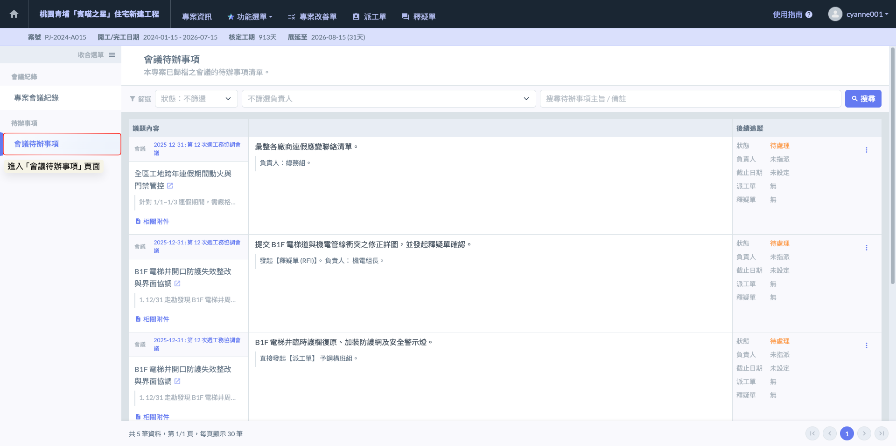

***



#### 前往會議紀錄

進入『會議待辦事項』頁面後，若需查閱該任務的原始討論細節，可直接點選各議題對應之『會議主旨』。系統將跳轉至該場會議紀錄內部，方便您回溯決議背景、查看相關附件或確認與會人員。

!!! tip
    #### 快速切換，效率翻倍
    
    在管理大量待辦事項時，善用「會議主旨」的超連結功能，能省去您回到列表重新搜尋會議的時間。建議在確認「釋疑單 (RFI)」內容前，先點回會議內部，確認是否有其他關聯議題會受此圖說更動影響。

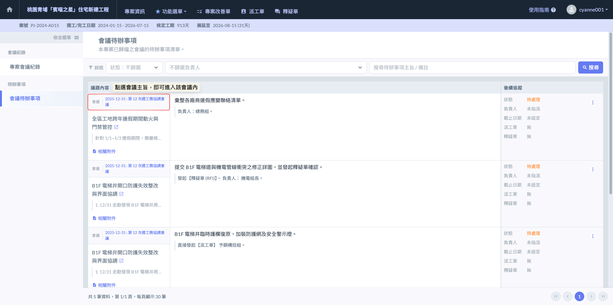

會議畫面如下：

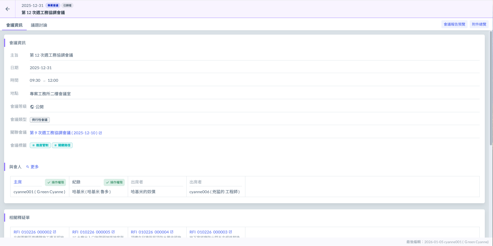

如圖三，進入『會議待辦事項』頁面後，若欲查看特定任務的詳細討論內容，直接點選『議題主旨』，系統將自動跳轉至該場會議內部的『議題討論』分頁，並精確定位至該議題位置。此設計讓您無需手動翻找，即可立即調閱與該待辦任務相關的原始決議、技術說明與附件照片。

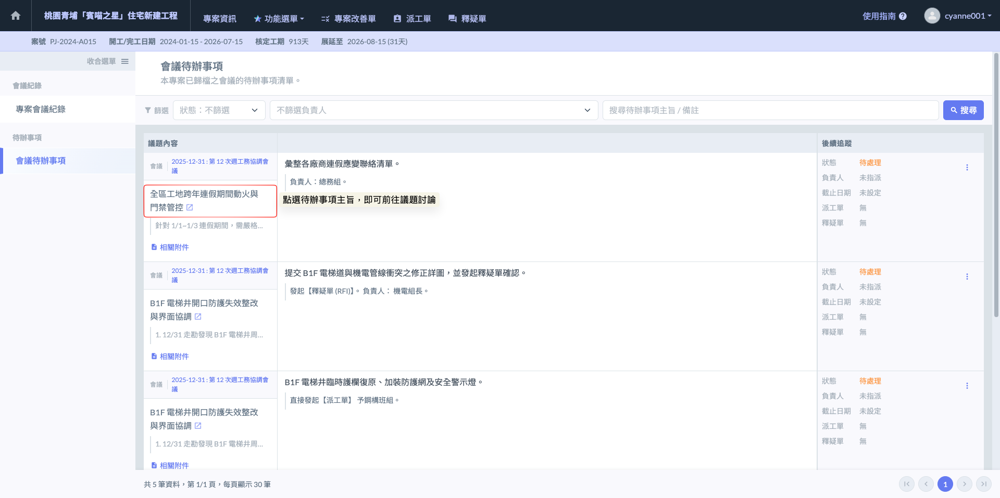

議題討論頁面如下：

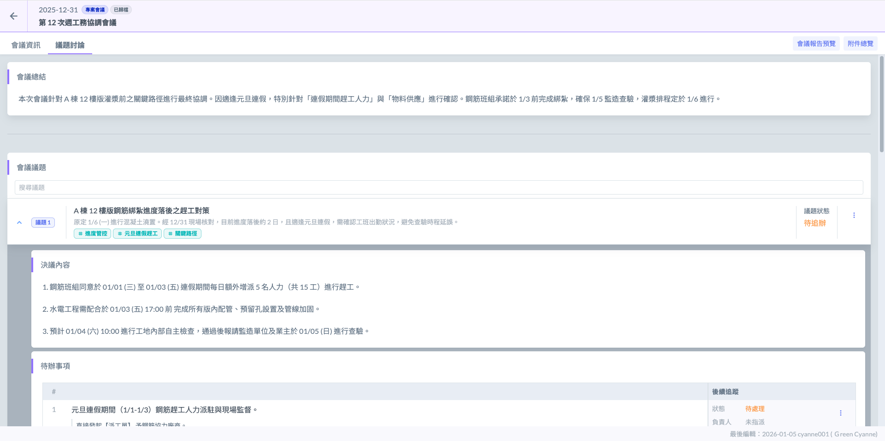



#### 發起派工單 / 釋疑單

系統針對每一項待辦事項皆提供靈活的連動機制：您可以同時發起「派工單」以指揮下包商執行，並發起「釋疑單 (RFI)」以向設計單位尋求技術確認。在任務執行期間，建議管理者應根據派工執行狀況與釋疑單回覆進度，同步更新「管理後續追蹤訊息」，確保行政紀錄與現場實況高度一致。

!!! info
    #### 💡 操作小提示
    
    假設議題是「B1F 電梯道衝突」，您可以先點選『+發起釋疑單』確認圖說，隨即再次點選『+發起派工單』給機電廠商要求暫緩施工。同一個議題右側將會顯示兩組連結，讓您同時控管技術與執行進度。

#### 發起派工單

於議題右側的『後續追蹤』欄位，點選『⋮』圖示開啟功能選單，並選取<kbd>**+發起派工單**</kbd>。系統將自動連結此會議議題，並開啟派工單編輯介面；透過自動帶入的議題資訊，您可以快速指派負責廠商、設定完成期限並要求現場整改，確保會議決議能精準傳達至執行端。

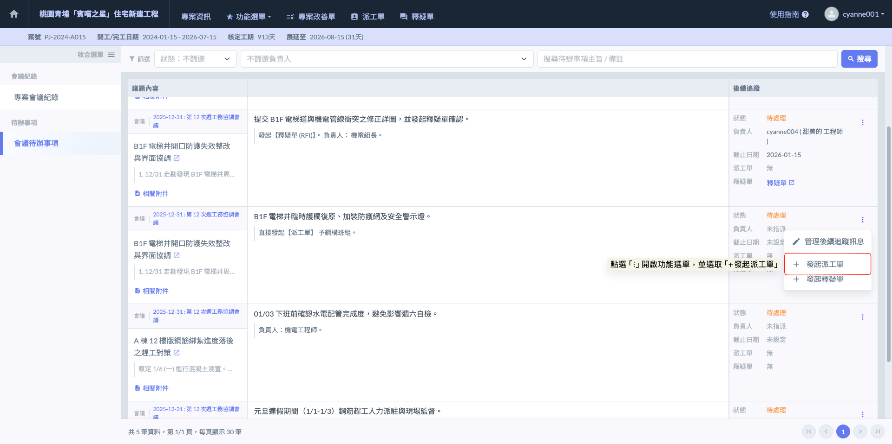

開啟派工單發起頁面後，系統將自動擷取該待辦事項之原始內容，並預先帶入派工單的『主旨』與『工作內容描述』欄位中。您亦可針對特定的施作細節、安全注意事項或對特定廠商的具體要求，進一步編修內容，確保現場執行人員能精確掌握任務重點。

!!! tip
    在派工單頁面所做的任何補充說明，都會保留在該張派工單的正式紀錄中。這讓您在「會議紀錄」保持決議的簡潔性，同時在「派工單」中保有詳盡的施工指示，達成資訊的層次管理。

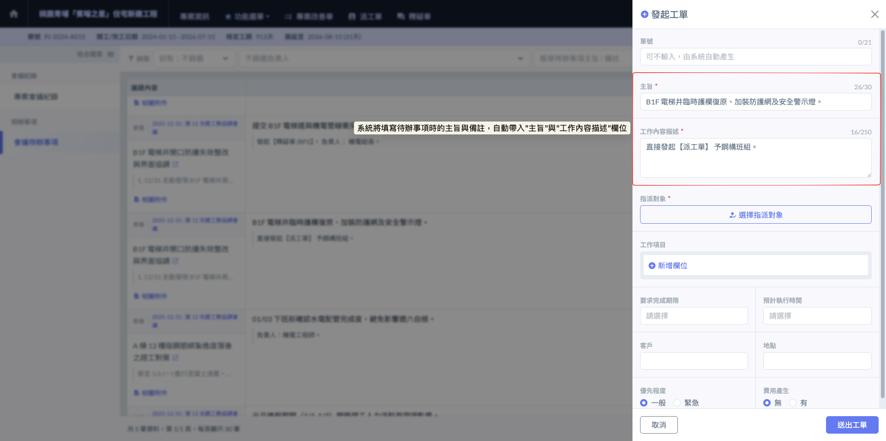

為加速流程並減少認知差異，發起派工單時應遵循以下結構：



簡述該項任務的核心名稱，方便在清單頁面中快速辨識。

* _填寫範例：_ 【機電】B1F 泵浦異常檢修、2F 辦公室清潔派工。



詳細描述需執行的具體事項、行政要求或技術細節。

此欄位為執行人的操作依據，應盡可能清晰地載明「做什麼」以及「如何做」，以避免溝通落差。



由管理人員從人員選單中，選擇具體的執行負責人（個人或團隊）。

一旦選定，系統將立即發送通知給該對象，確保該項工作明確「責任到人」。



設定該任務必須結案的最後期限。



本欄位用於標示任務的輕重緩急，協助執行人合理安排工作順序：

* 一般 (Normal)： 適用於例行性工作、計畫內任務或無即時安全性影響之事項。
* 緊急 (Urgent)： 適用於突發性故障、具安全隱患或直接影響後續大項工進之任務。標記為緊急的單據將在執行人的待辦清單中以特殊醒目標示，要求負責人立即介入處理。



!!! info
    針對<kbd>**單號**</kbd>部份，若您有自訂的編號規則，可填；若空白，則該單號將由系統自動生成。

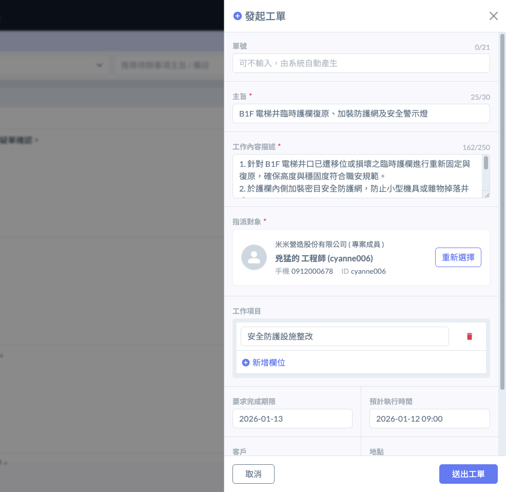 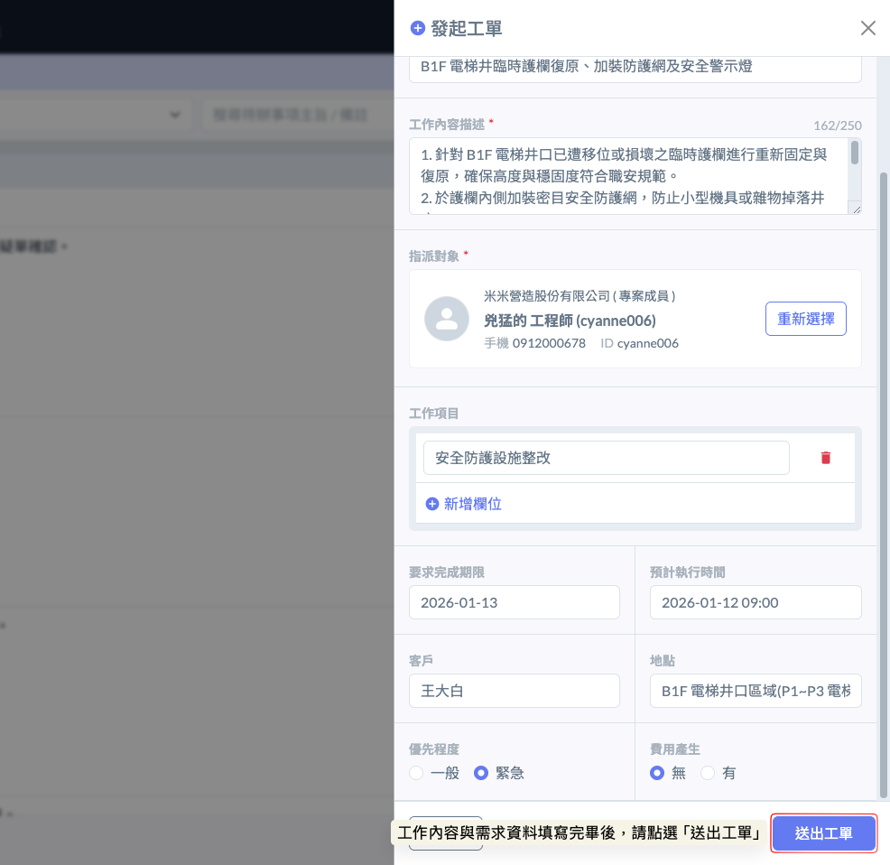

發起成功後，該會議議題的『後續追蹤』欄位將顯示關聯之派工單資訊。您可直接點選該筆派工單編號之超連結，系統將即時跳轉至派工單模組內部，供您查看最新執行回報、廠商施作照片或簽核進度等。

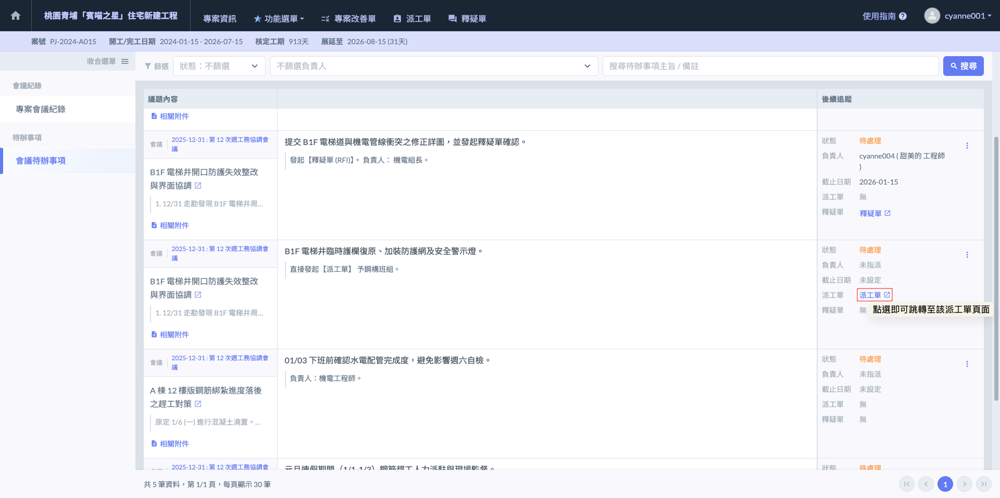

派工單內部畫面如下：

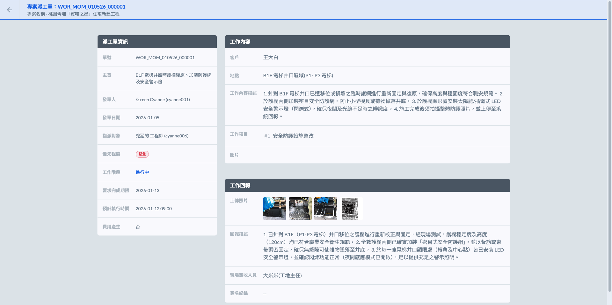

***

#### 發起釋疑單

於議題右側的『後續追蹤』欄位，點選『⋮』圖示開啟功能選單，並選取<kbd>**+發起釋疑單**</kbd>。系統將自動連結此會議議題，並開啟釋疑單編輯介面，讓您可以針對如『B1F 電梯道與機電管線衝突』等技術問題，正式向設計或監造單位提出詢問。

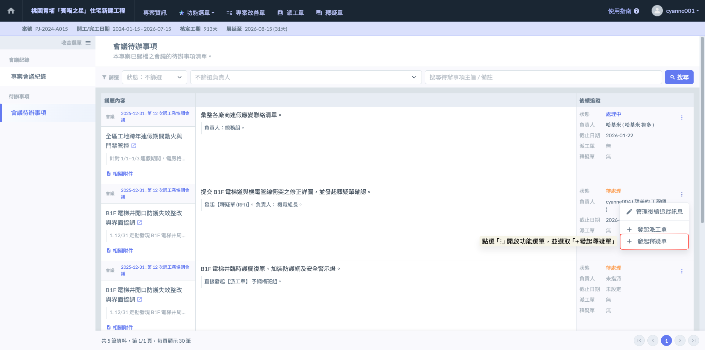

開啟釋疑單發起頁面後，系統將自動擷取該待辦事項之原始內容，並預先帶入至釋疑單的『主旨』與『問題說明』欄位中。您亦可針對 RFI 之對外正式需求，進一步修正或補充更具體的技術說明（如：受影響之管線編號或具體工進時程），以確保審查單位能精確掌握問題核心。

!!! info
    在 RFI 頁面修改主旨或說明，並不會影響原始會議紀錄中的文字。您可以放心針對「對外詢問」的需求進行最專業的修訂，這有助於維持對內紀錄的真實性，同時確保對外溝通的嚴謹度。

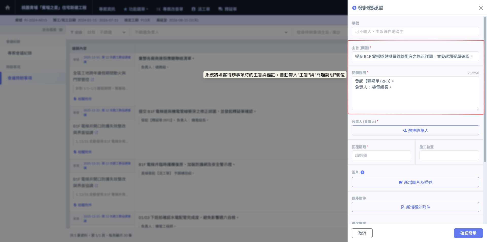

為加速審核流程並減少認知差異，發起釋疑單時應遵循以下結構：



應包含位置與問題類別（例：3F 梁柱接頭鋼筋配置疑義）。



清晰說明現場遇到的物理限制或圖說矛盾點。



為防止溝通延宕影響施工進度，發起人應根據問題的「緊急程度」自行設定回覆期限。



需針對您所發起之釋疑進行回報與說明之人員。

(選擇要發問的對象，可能是上包負責人、業主、設計、監造等，您認為有權限回答該議題之人員)



可上傳關聯之施工照片、標註後之設計圖說或相關規範截圖。



!!! info
    1. 針對<kbd>**單號**</kbd>部份，若您有自訂的編號規則，可填；若空白，則該單號將由系統自動生成。
    2. 若需未來方便管理與歸納，針對不同事項、緣由之釋疑單，您可自定義各釋疑單之<kbd>**標籤**</kbd>。

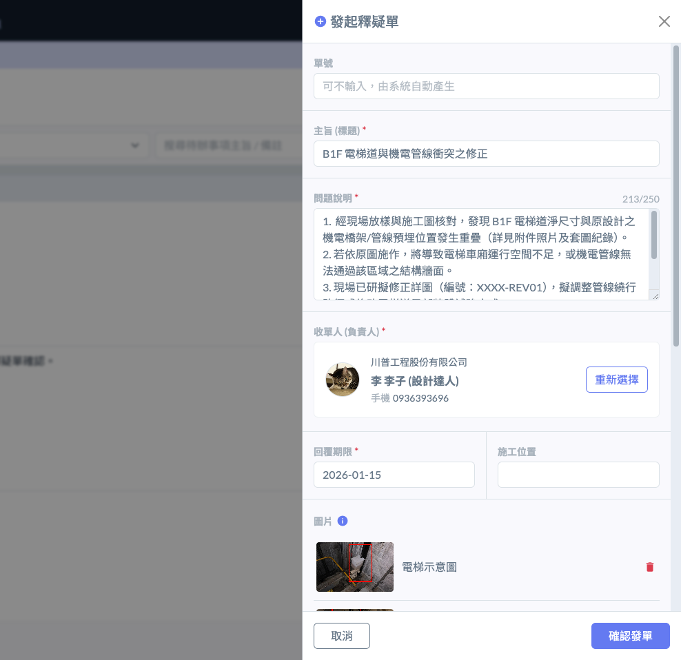 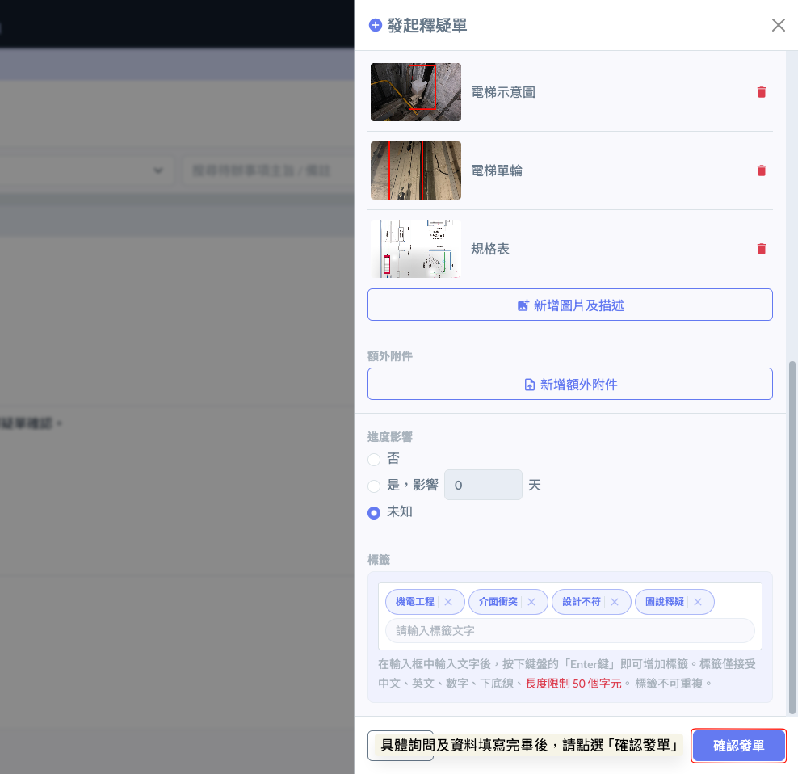

發起成功後，該會議議題的後續追蹤欄位將顯示關聯的釋疑單資訊。您可直接點選該筆釋疑單編號之超連結，系統將即時跳轉至釋疑單模組內部，供您查看最新的審查狀態、回覆意見等。

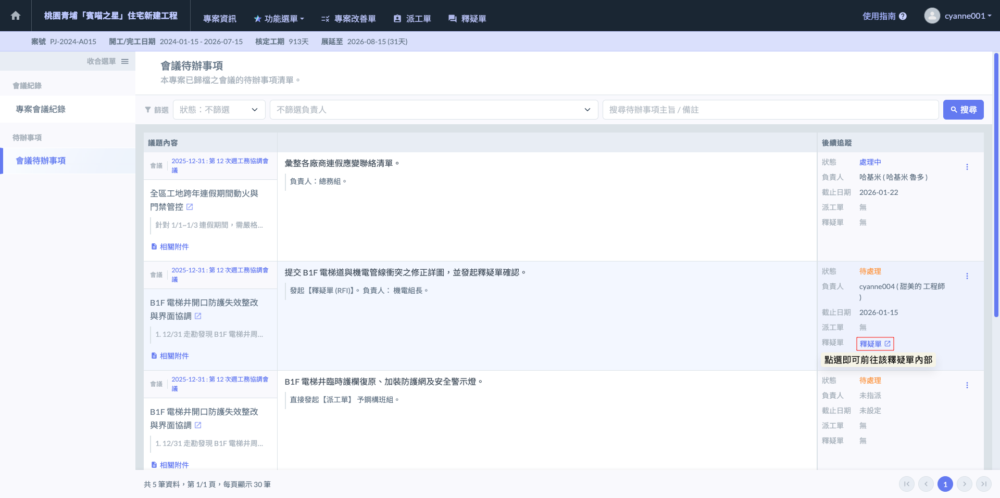

釋疑單內部畫面如下：

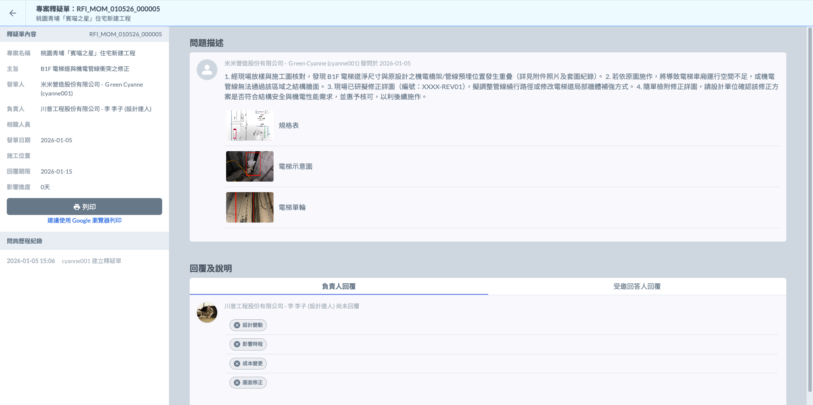



#### 管理後續追蹤紀錄

在「會議待辦事項」管理頁面，您可以透過狀態標籤掌握各項任務的最新進展：

<table><thead><tr><th width="130.5970458984375">待辦事項狀態</th><th>建議之實務應用與管理定義</th></tr></thead><tbody><tr><td><mark style="color:orange;"><strong>待處理</strong></mark></td><td>(初始狀態) 任務已從會議紀錄中產生並指派，但負責人尚未開始動作或尚未回報進度。</td></tr><tr><td><mark style="color:blue;"><strong>處理中</strong></mark></td><td>(執行階段) 負責人已接收任務並回報進度（例如：已進場施作、已發給分包商等）。此狀態代表任務「正在進行」，需透過「管理後續追蹤訊息」持續監控。</td></tr><tr><td><mark style="color:green;"><strong>已完成</strong></mark></td><td>(驗收結案) 任務內容已確實執行完畢，經確認無誤。此狀態將對應至會議紀錄中的「已完結」，標示該行政及施工責任已履行完畢。</td></tr><tr><td><mark style="color:$primary;"><strong>已撤回</strong></mark></td><td>(取消指派) 因設計變更、現場狀況改變或決議取消，該項任務不再需要執行。撤回後系統會保留紀錄但不列入後續追蹤。</td></tr></tbody></table>

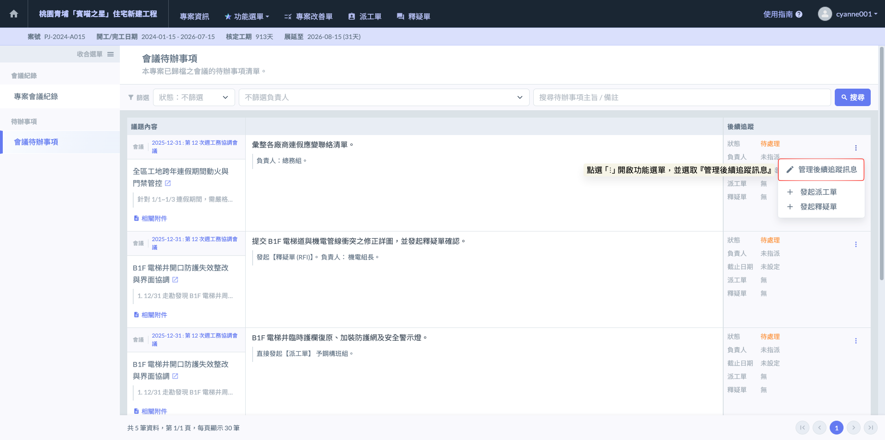

填寫後續追蹤管理訊息：在此介面中，您可以動態更新該事項的『狀態』（如：待處理、處理中、已完成及已撤回）、指定『負責人』並設定明確的『截止日期』。透過這些欄位的詳實紀錄，能確保每項會議決議皆有專人負責、時程受控，並能隨時盤點最新執行進度。

!!! info
    #### 💡 操作小提示
    
    追蹤訊息不應只填寫一次。當任務遇到困難需延期時，應同步更新『截止日期』；當任務從『釋疑階段』轉入『施工階段』時，亦可同步變更『負責人』，以確保追蹤紀錄與現場脈絡完全一致。

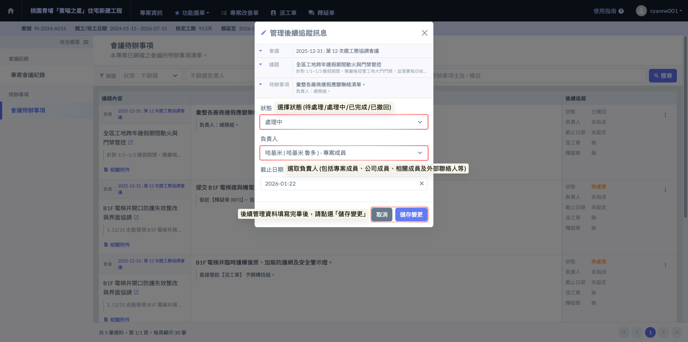

完成畫面如下：

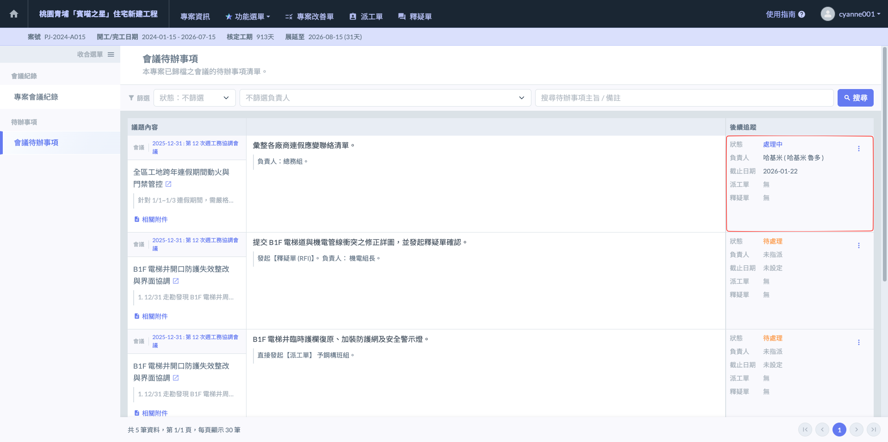


