# 材料進出管制紀錄

Jobdone 系統全新推出「材料進出管制」模組，與****每日施工日誌****深度整合。本功能核心在於建立數位化的進貨單紀錄系統，讓現場工程師能針對各類建材進行詳盡的品檢與數量控管，確保工程用料符合設計規範與合約要求。

系統針對營建工程中的核心材料，設計了專屬的欄位與進貨證明上傳機制，以達到分門別類：



適用於各類消耗品或零星資材，紀錄基礎進出廠數量與規格。



除了基本數量，系統依據混凝土特性與檢測規範，額外強化品管數據填寫，包含：抗壓強度、坍度(Slump)、水灰比(W/C)、氯離子含量檢測，以及關鍵的出場、交貨時間等。



系統針對鋼筋的特性，設計了嚴謹的數位進場表單。除基本交貨資訊外，更強化了現場品檢與存放管裡的紀錄欄位，確保鋼筋從進場到綁紮前皆符合設計規範。

* 號數與規格：詳實記錄進場鋼筋之直徑編號（如：#3、#4、#10 等）及強度等級（如：SD280、SD420）。
* 材料標示：確認每批鋼筋是否掛有合格標籤（含製造廠名、熔煉號、規格等）。
* 堆置與保護狀況：紀錄現場存放環境，例如：是否墊高隔離地面 以及 是否覆蓋防塵布 或 防雨帆布（防止生鏽氧化）。



針對加工與組裝品質進行紀錄，涵蓋：表面狀況、切割面平整度、焊接點外觀、螺栓孔尺寸等。同時支援上傳「無輻射證明」、「出場檢驗證明 (Mill Report)」及「非破壞性檢測 (NDT) 報告」。



***

### 01｜網頁端

請由**施工日誌**入口進入管理介面：

欲於網頁版管理材料進出，****請先進入施工日誌功能****，並於更多紀錄事項分類中點選『材料進出管制紀錄』，即可進入管理畫面。

#### 01 - 1｜新增進貨單

**1. 建立新紀錄**

* 操作動作： 點選頁面右上角的  藍色圖示。系統將彈出資料填寫視窗，讓您開始輸入該批次進貨的相關資訊。

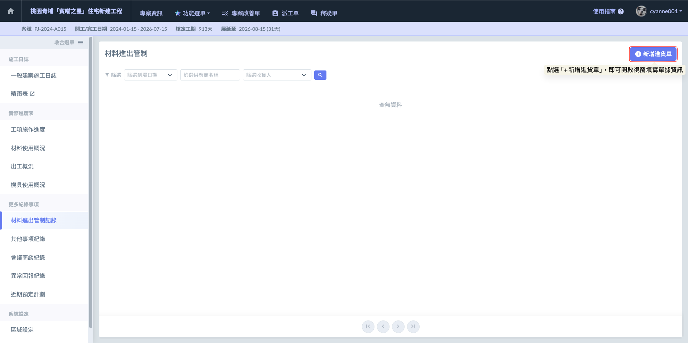

**2. 填寫核心進貨資料**

如圖二，在視窗中，請備妥以下關鍵資訊以利後續追蹤：

* 出貨單號： 對應廠商隨車附上的紙本簽單編號。
* 採購訂單 (PO)：連結至公司內部的採購合約，確保採購量與到貨量相符。
* 供應商名稱：填寫發貨的協力廠商或材料商。
* 到場日期 (Arrived Date)：指材料實際抵達工地並完成簽收的日期。

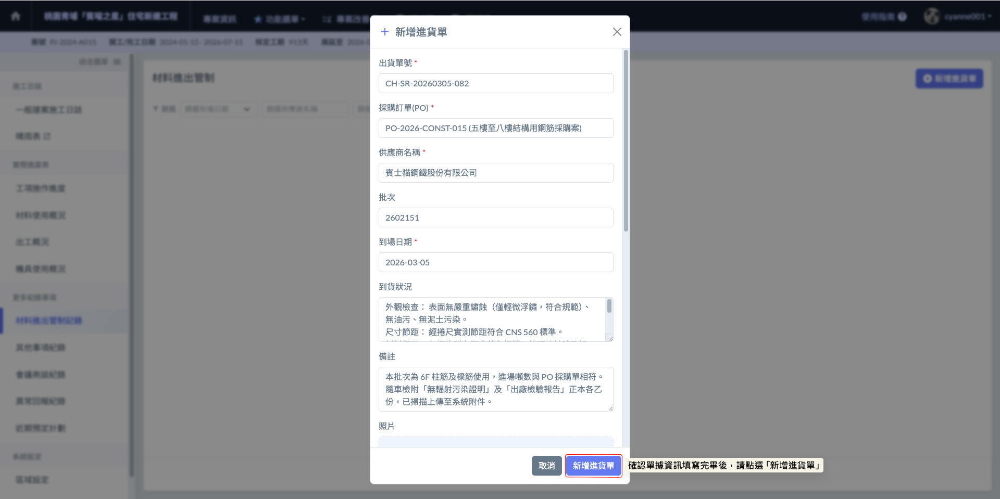

完成進貨單建立後，畫面如下所示。請直接點選該筆進貨單，即可進入單據內部並開始編列具體的材料清單內容。

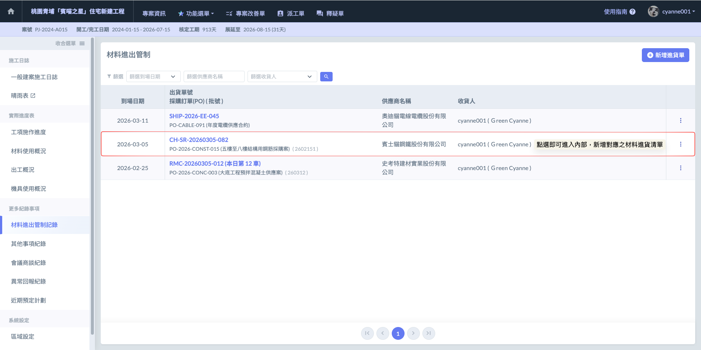

***

#### 01 - 2｜新增材料

如圖四，進入進貨單內部後，點選右上方之  按鈕，即可開啟填寫視窗，詳實記錄進場物料的規格與性質。

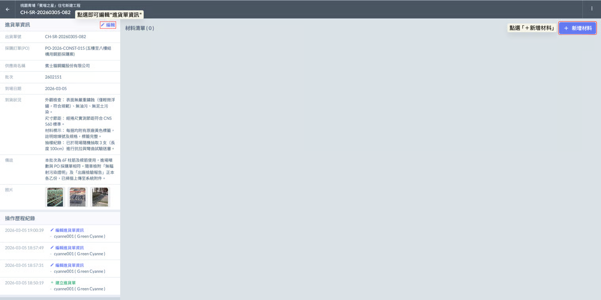

**1. 選擇材料類型 (Material Categorization)**

系統預設了四種專業表單，請依據本次進貨品項選取：

* 一般材料： 適用於機電、裝修或散裝建材。
* 混凝土： 強化坍度、強度與澆置時間紀錄。
* 鋼筋： 記錄號數、節距與堆置狀況。
* 鋼構： 針對構件編號、銲道與表面品質進行存證。

**2. 材料納管與合約對接 (Managed vs. Extra Materials)**

為了確保成本控管與合約執行的一致性，系統提供兩種選取模式：



定義：若該材料已預先設定於專案的『施工材料清單』中。

您可直接於清單中選取，系統會自動對接對應的協力廠商與合約資訊。



定義：針對臨時採購、非合約內或尚未列入施工材料清單的品項。

勾選『額外材料』後，管理員可自行填寫材料名稱、單位與規格。這提供了現場作業的靈活性，方便記錄臨時性的雜貨進貨。



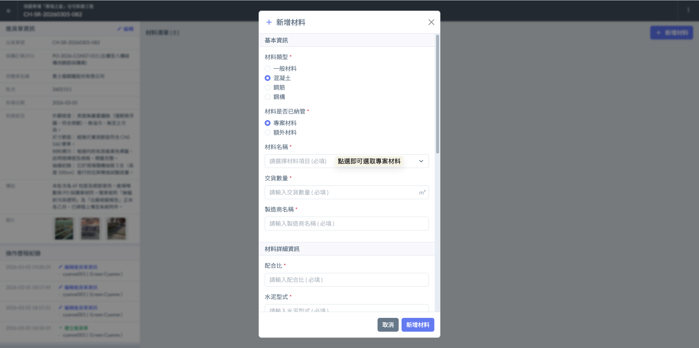

下圖以****混凝土****為例，操作時請先詳實填寫交貨數量、供應商名稱等核心基本資訊，隨後針對材料特性完善詳細資訊，包含：配合比、強度、坍度、氯離子含量、車號、車次、供貨批號及各項關鍵時間點，並精確標註澆置地點，以確保施工紀錄的完整性與溯源性。

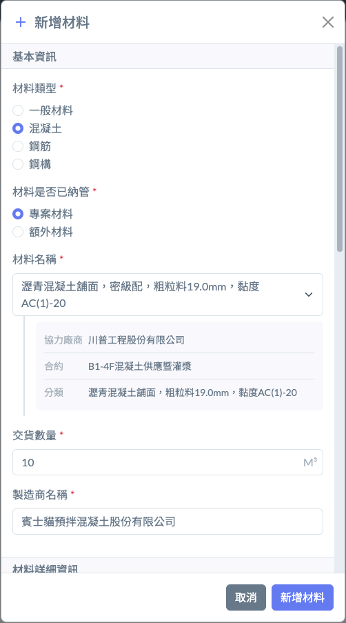 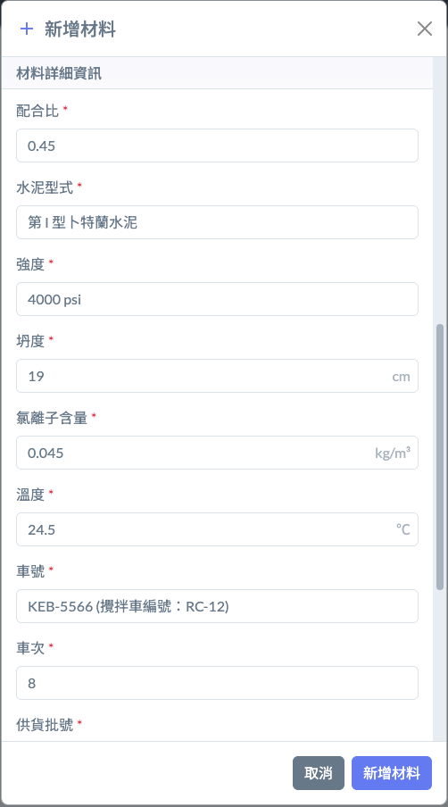 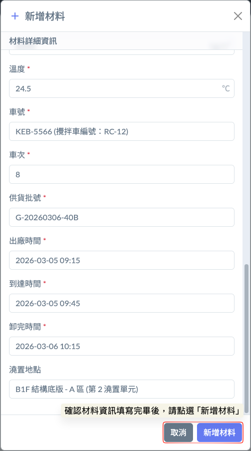

完成畫面如下：

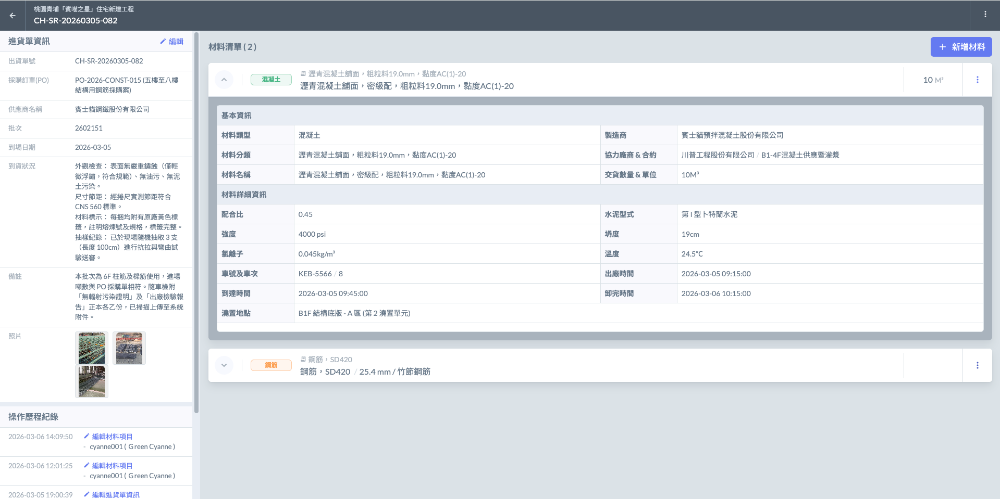

***

#### 01 - 3｜**日誌中的材料概況 (Material Summary in Daily Log)**

材料資訊新增完畢後，您在填寫施工日誌時即可直接查看當日的進貨資訊。系統會完整串接「材料進出管制紀錄」中的資料，讓日誌內容與實體進貨單據達成同步：

!!! info
    #### 確保資訊對等
    
    此功能確保了現場施作紀錄與材料進場動態的一致性，省去重複輸入資料的時間，並方便管理人員隨時比對日報與進貨簽單。



日誌會詳實條列當日每一筆進貨材料及對應之進貨單號。



您可以透過日誌介面，快速回溯每筆進貨單內的所有詳細資訊，包含基本資訊、材料詳細資訊及各類相關證明圖檔。



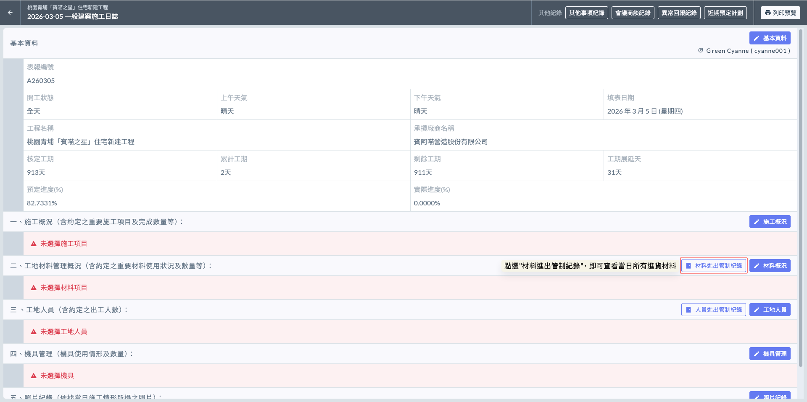

如圖十一，進出場紀錄會自動顯示當日所有的進貨材料明細，並提供各項材料對應之**進貨單超連結**，方便您快速切換至該筆進貨單的詳細畫面，以便即時查閱或修改更深層的檢驗數據與圖檔存證。

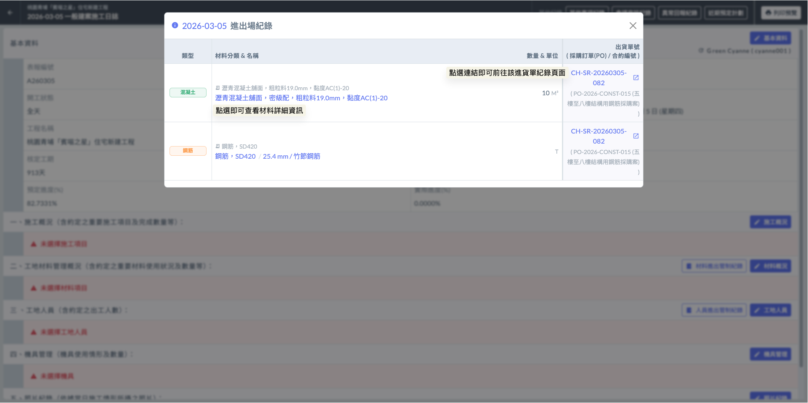

如圖十二，點選欲查看之材料後，系統即會彈出視窗，詳實顯示該材料當日的所有進貨基本資訊與詳細檢驗數據。

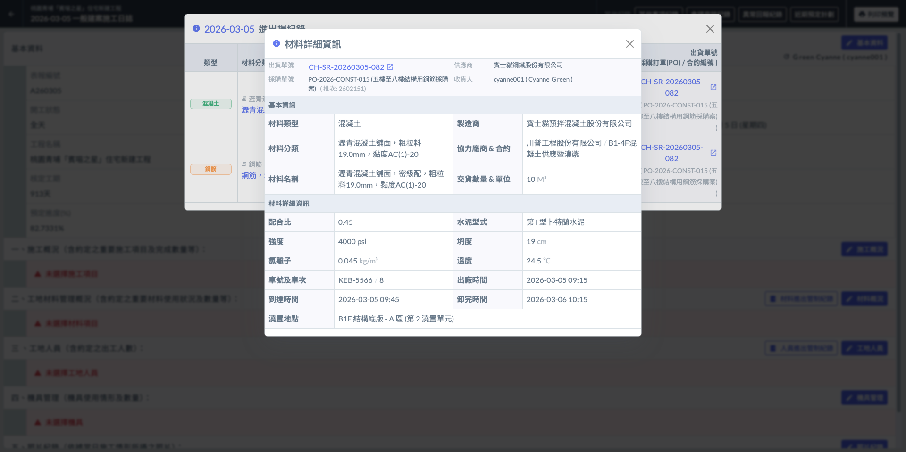

***

#### 01 - 4｜操作歷程紀錄

如圖十三，所有的操作紀錄，包含進貨單之編輯、材料新增、材料刪除等，皆會於『操作歷程紀錄』中詳實顯示；系統會精確記錄**操作人員**、**操作時段**以及**具體執行內容**。

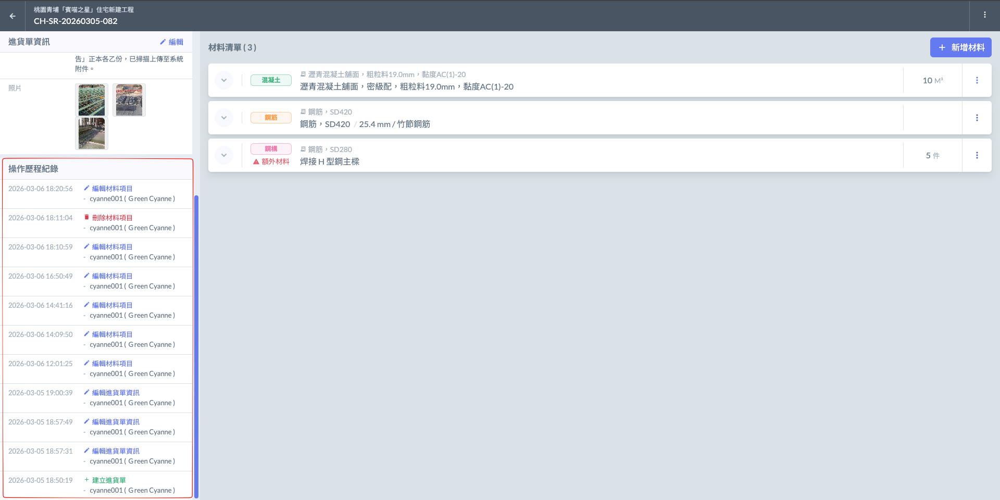

***

### 02｜App 端

1. **App 端與網頁端的架構差異 (Mobile vs. Web)**

在操作邏輯上，您可以清楚感受到兩者的定位區隔：



將 材料進出管制紀錄 收納於「施工日誌」的更多事項中。這是為了讓內業人員在審核日報時，能在一條龍的介面中完成所有數據的檢視與核銷。



將其設計為獨立的功能按鈕。

由於現場工程師在材料進場（如混凝土車抵達、鋼筋卸貨）時，往往需要第一時間處理。將功能獨立做一個入口，能讓您在手機上「一鍵進入」，無需先開啟日誌分頁，大幅縮短操作路徑。



2. **App 端的新增與操作**

雖然入口位置不同，但 App 端的權限與功能依然完整：

* 快速新增進貨單：App 端優化了輸入介面，讓您在走動中也能輕鬆填寫。
* 即時拍照存證：App 端最大的優點是能直接啟動相機。在編列材料清單（如鋼筋、鋼構）時，拍完照片時立即上傳至該筆單據，比網頁端事後上傳照片更具效率。
* 數據同步機制： 在 App 端新增的任何進貨單與材料細節，會即時同步至網頁端的施工日誌中。換句話說，您在門口簽收一車混凝土，辦公室的內業人員打開網頁日誌就能立刻看到數據。

#### 02 - 1｜新增進貨單

進入 App 畫面後，請點選 材料進出管制。進出系統會依據日期，詳細顯示當日對應的進貨單。點選下方的 圖示，即可開啟填寫視窗，快速紀錄進場資訊。

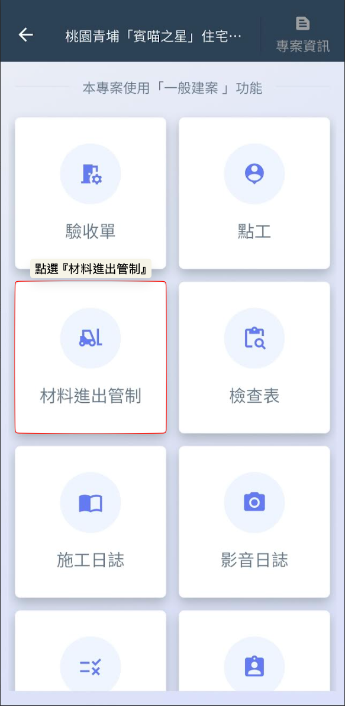 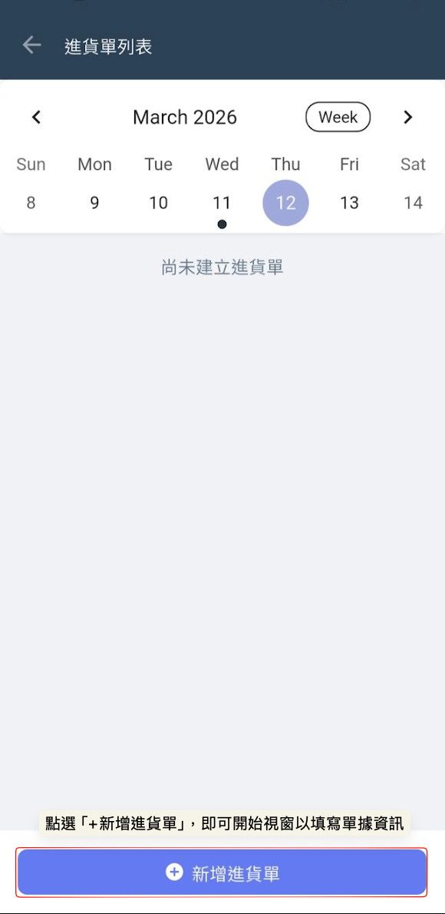 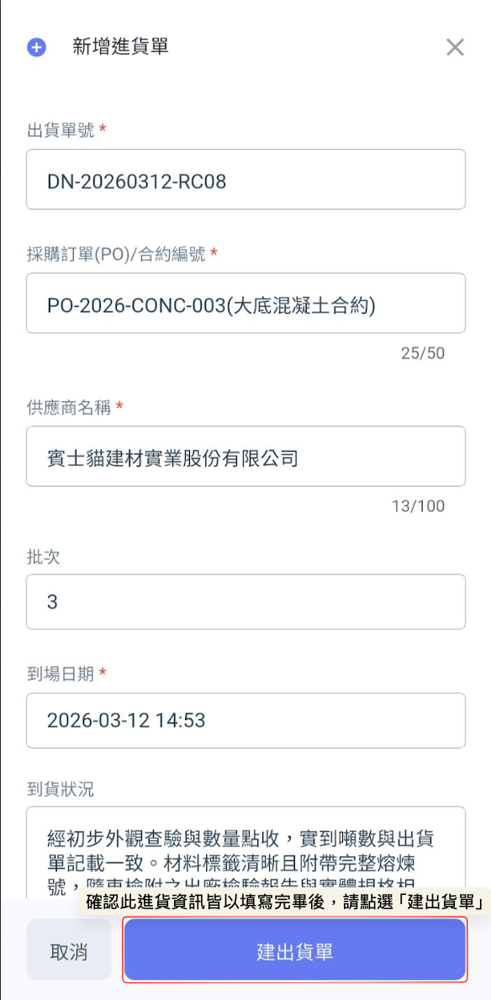

**操作導覽：進貨單管理與頁籤切換 (Management & Tab Navigation)**

在 App 端建立完畢後，您可以透過以下方式進行深度管理：



如圖四，系統會將當日所有進貨單依序排列，您可以快速確認每一筆單據的收貨人、單號及到場時間等。



如圖五，點選單據進入後，若發現單號或到場日期填寫錯誤，可隨時修正。



* ［進貨單資訊］：管理單據主檔，包含供應商、PO 編號、到貨狀況與備註照片。
* ［材料列表］：此為管理的核心，點選切換後即可透過  按鈕，將實體的混凝土、鋼筋或鋼構構件逐編列進單據中。



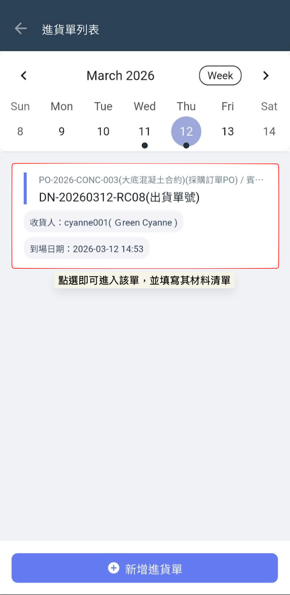 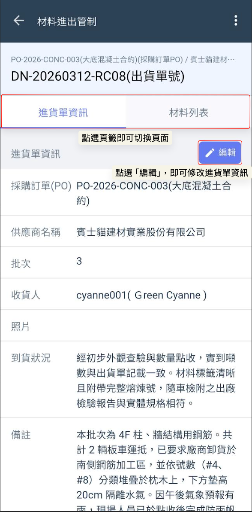 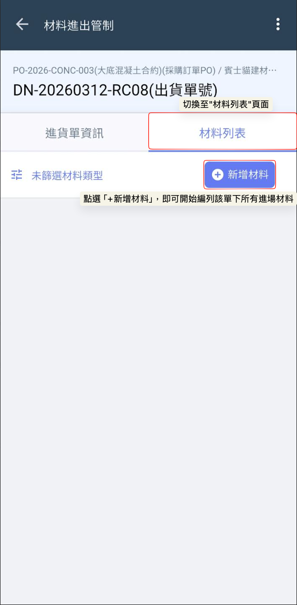

***

#### 02 - 2｜新增材料

**1. 選擇材料類型 (Material Categorization)**

系統預設了四種專業表單，請依據本次進貨品項選取：

* 一般材料： 適用於機電、裝修或散裝建材。
* 混凝土： 強化坍度、強度與澆置時間紀錄。
* 鋼筋： 記錄號數、節距與堆置狀況。
* 鋼構： 針對構件編號、銲道與表面品質進行存證。

**2. 材料納管與合約對接 (Managed vs. Extra Materials)**

為了確保成本控管與合約執行的一致性，系統提供兩種選取模式：



定義：若該材料已預先設定於專案的『施工材料敲單中』。

您可直接於清單中選取，系統會自動對接對應的協力廠商與合約資訊。



定義：針對臨時採購，非合約內或尚未列入施工材料清單的品項。

勾選『額外材料』後，管理員可自行填寫材料名稱、單位與規格。這提供了現場作業的靈活性，方便記錄臨時性的雜貨進貨。



***

以下為針對鋼筋材料詳細資訊的填寫範例，涵蓋了從原廠證明到現場量化的關鍵品管數據：

**【材料詳細資訊】填寫範例：******鋼筋******材料**

<table><thead><tr><th width="151.1832275390625">欄位</th><th>說明</th></tr></thead><tbody><tr><td>爐號 / 批號  (Heat No.)</td><td>
如：48297...
<ul><li><em>註：必須與原廠出廠證明書（MTR）上的熔煉號完全一致，作為品質溯源的唯一索引。</em></li></ul></td></tr><tr><td>材料等級</td><td>
<em>選項：SD280、SD280W、SD420、SD420W 或其他。</em>

<em>其中「W」代表具備良好可焊接性，常規用於耐震結構設計。</em>
</td></tr><tr><td>規格 (直徑/型號)</td><td>如：19.1 mm / D19 竹節鋼筋 <em>說明：填寫標稱直徑以及對應的竹節型號 (Deformed Bar)，確保符合設計圖說要求。</em></td></tr><tr><td>號數 (Size)</td><td>如：#6 (六號筋)</td></tr><tr><td>噸數 (Tonnage)</td><td>如：12.50 t (公噸) <em>說明：依據磅單或出貨單記載之實到重量填寫。</em></td></tr><tr><td>出廠證明文件 (Test Certificate)</td><td><em>操作：請於附件處拍照或上傳該批次對應之原廠材質證明書，確認抗拉強度、伸長率及化學成分合格。</em></td></tr><tr><td>無輻射證明 (Non-Radiative)</td><td><em>說明：確認供應商隨車附上該批鋼材之無放射性污染證明，確保建材安全無虞。</em></td></tr></tbody></table>

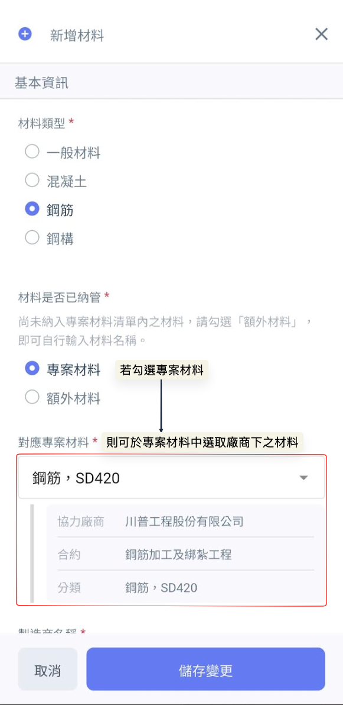 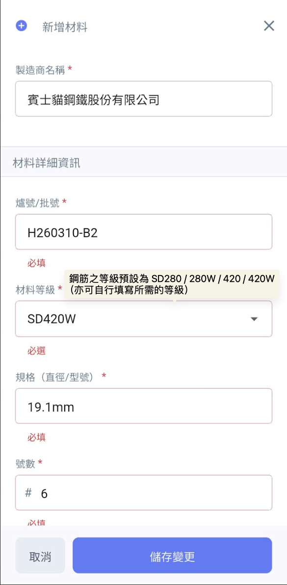 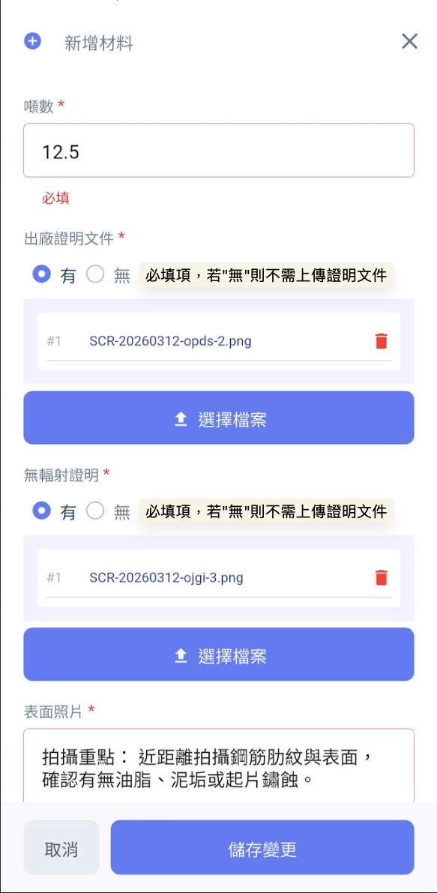

**【鋼筋品質查驗紀錄】填寫說明與範例**

<table><thead><tr><th width="152.109619140625">欄位</th><th>說明</th></tr></thead><tbody><tr><td>表面狀況 (Surface Condition)</td><td>
如：表面呈自然紅褐色浮鏽，經查驗無油脂污染，無片狀鏽蝕或層剝現象。

<em>說明：檢查鋼筋表面是否受油脂、泥垢污染，或產生嚴重的片狀鏽蝕（層剝）。</em>
</td></tr><tr><td>變形狀況 (Deformation)</td><td>如：鋼筋外觀平直，竹節肋紋清晰且完整，無異常彎折或撞擊受損。 <em>說明：檢查鋼筋外觀是否直挺，竹節肋紋是否完整，有無因機械搬運造成的異常彎折或損傷。</em></td></tr><tr><td>材料標示 (Identification Tags)</td><td>如：每捆均附有原廠黃色耐候標籤，標註規格 SD420W、號數 #6，經核對爐號與出廠證明相符。 <em>說明：確認每一捆鋼筋是否皆附有原廠標籤，並標明廠名、規格、號數及爐號。</em></td></tr><tr><td>尺寸與節距 (Dimensions &#x26; Pitch)</td><td>如：現場隨機實測節距為 13.2 mm，符合 CNS 規範之 13.4 mm 以下要求。 <em>說明：實測鋼筋的直徑及竹節間的距離，確保其符合國家標準(如 CNS 560)規範。</em></td></tr><tr><td>堆置保護狀況 (Storage &#x26; Protection)</td><td>如：材料已依號數分類堆置於枕木上 (墊高20 cm)，並已完成防水帆布覆蓋，避免受潮生鏽。 <em>說明：紀錄材料到場後的存放方式，包含是否墊高隔離地面水氣及是否覆蓋防雨設施。</em></td></tr><tr><td>現場抽樣紀錄 (On-site Sampling)</td><td>
如：已於今日隨機抽取樣品一組 (3支)，標籤編號 S-20260312-01，預計明日送交第三方實驗室進行抗拉及彎曲試驗。

<em>說明：紀錄是否已進行現場取樣、抽樣的編號以及後續送驗的計畫。</em>
</td></tr></tbody></table>

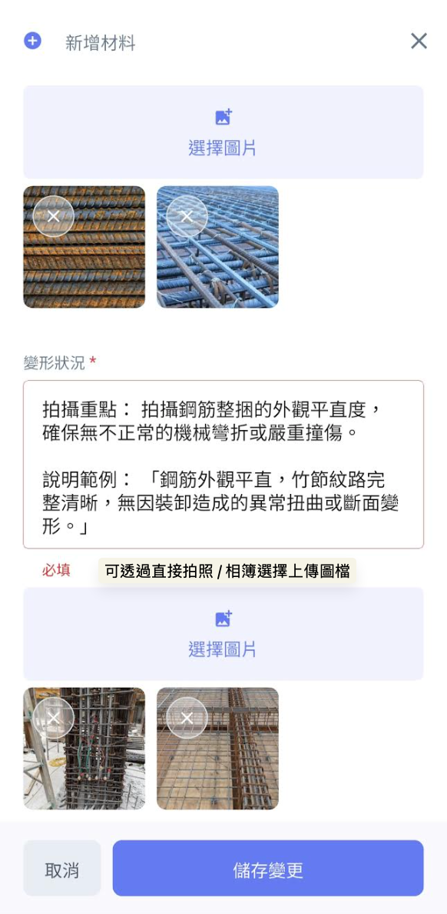 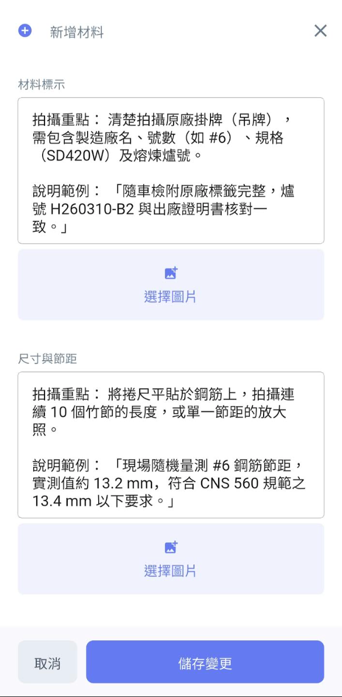 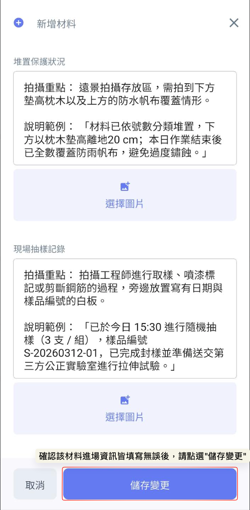

完成畫面如下：

!!! warning
    #### App 端操作差異
    
    請注意：App 端的施工日誌介面，並未提供像網頁版那樣可直接點開的『材料進出管制紀錄』連結。若欲查閱或編輯進料詳情，必須跳出日誌畫面，直接進入獨立的 \[材料進出管制] 功能內查看。

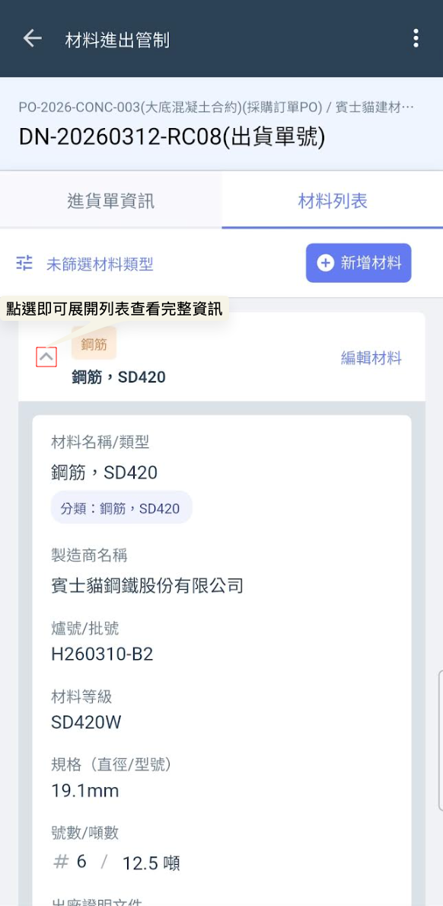 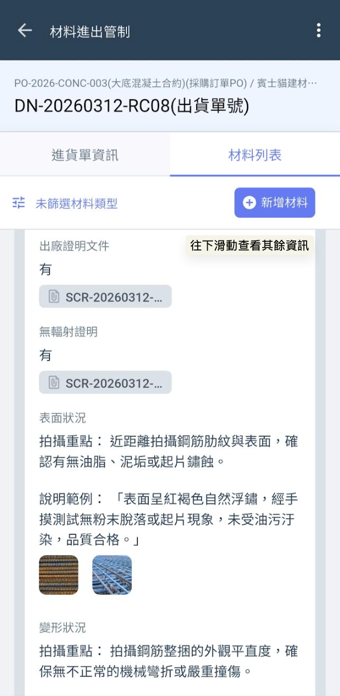 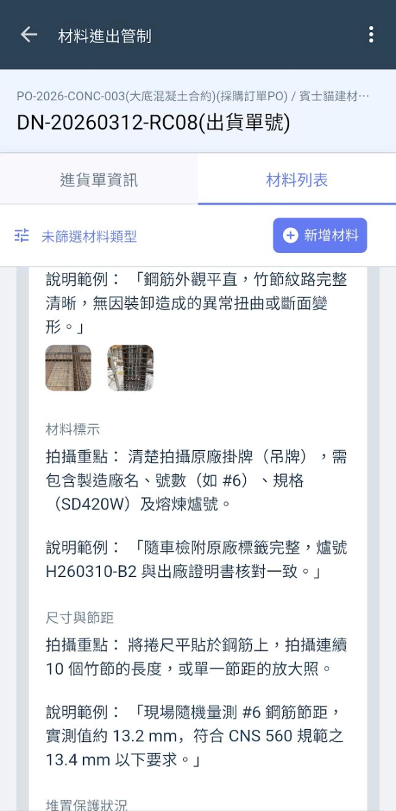

***

#### 02 - 3｜操作歷程紀錄

如圖十六 \~ 十八，所有的操作內容，包含進貨單之編輯、材料新增、材料刪除等，皆會於『操作歷程紀錄』中詳實顯示；系統會精確紀錄**操作人員**、**操作時段**以及**具體執行內容**。

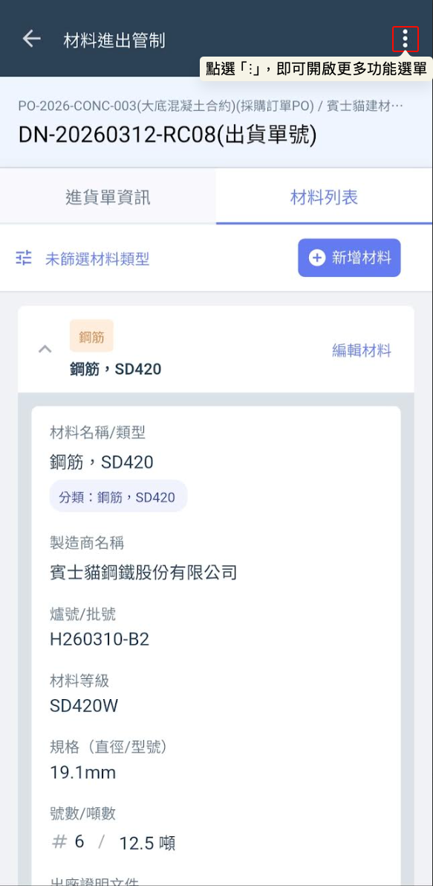 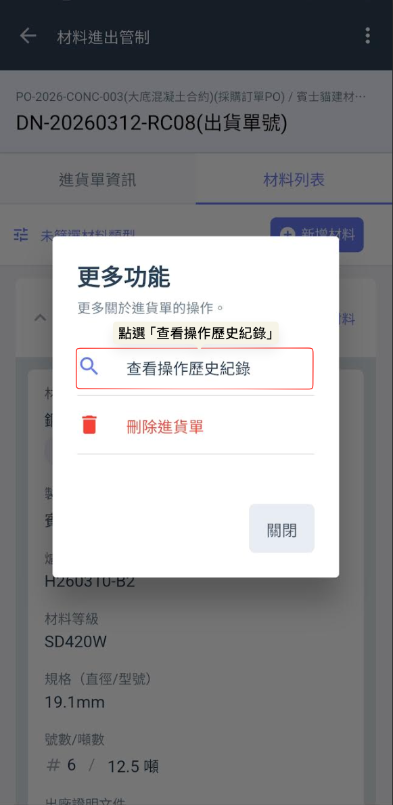 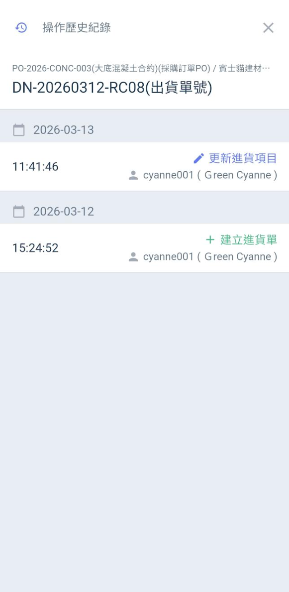

