# 檢查工作相關

在 Jobdone 系統中，『檢查工作』是落實施工品質控管的執行核心。當管理人員完成「範本」與「流程」的預設後，現場人員即可針對各分項工程展開標準化的數位查驗作業。本模組將查驗週期完整拆解，確保從發起、回報、缺失追蹤到最終報表產出，皆具備嚴謹的數位軌跡與責任歸屬。

為了協助您快速掌握各階段的操作要領，本說明將分為以下分頁進行詳細指引：



選定對應範本與流程，定義施工位置，啟動查驗任務。



現場查驗判定、照片留存與標準值比對，提交初步紀錄。



若初驗結果為"不合格"，則針對缺失改善成果進行二次查驗與紀錄。



由工地主任或專案管理人員針對初/複驗回報內容進行核實簽認。



### 01｜新增檢查工作

進入檢查表模組後，在<kbd><mark style="color:purple;">**檢查工作**<mark style="color:purple;"></kbd>主分頁點擊右下角的  圖示，即可啟動建立程序，新增一筆查驗任務。

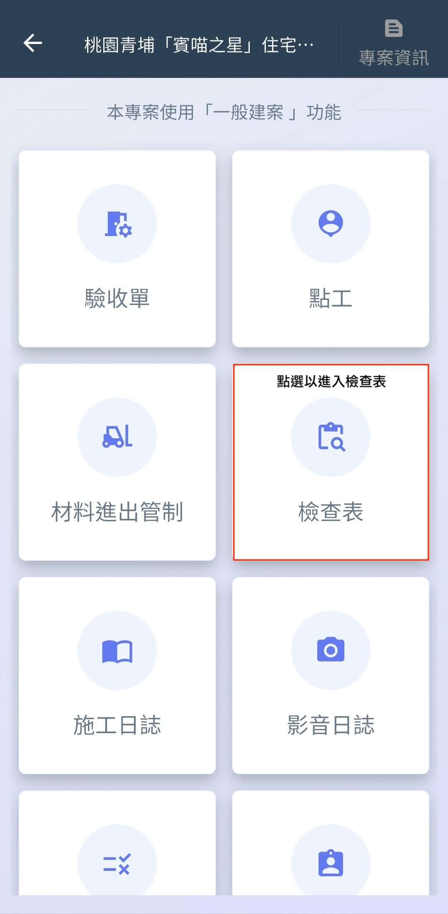 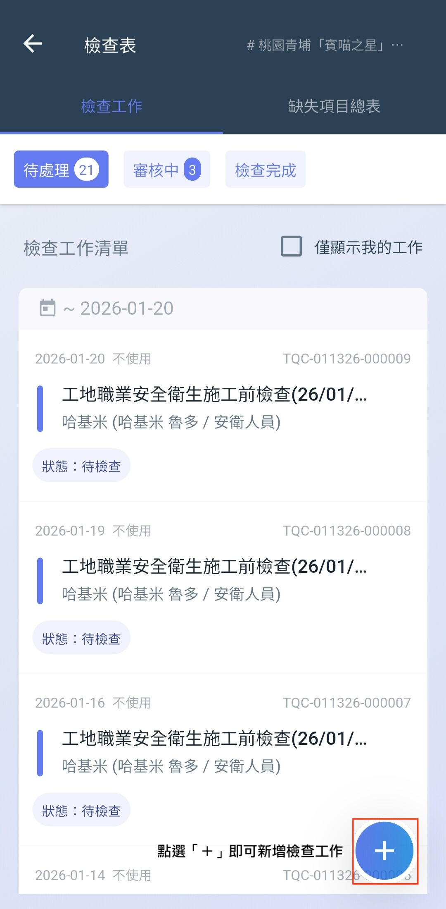 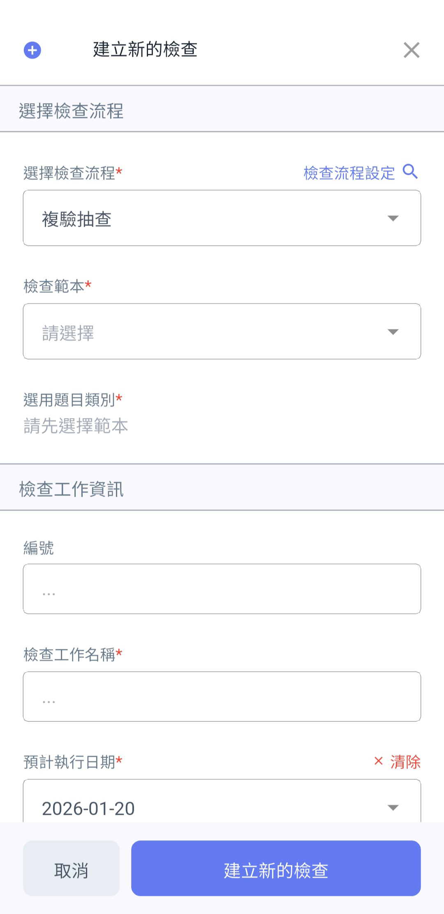

如圖四\~五，開啟新增畫面後，會需要請您先選取該檢查需用到的『檢查流程』，再選取欲執行的『檢查範本』。

如圖六，完成檢查範本選取後，系統將載入該範本所涵蓋的所有查驗內容。此時，請根據本次現場作業的實際範圍，勾選欲執行的檢查類別。

!!! info
    同一張範本（如：鋼筋工程）可能包含多種查驗細項，透過勾選特定的『檢查類別』，您可以只針對當次施作的部分進行紀錄，避免無關項目的干擾。

 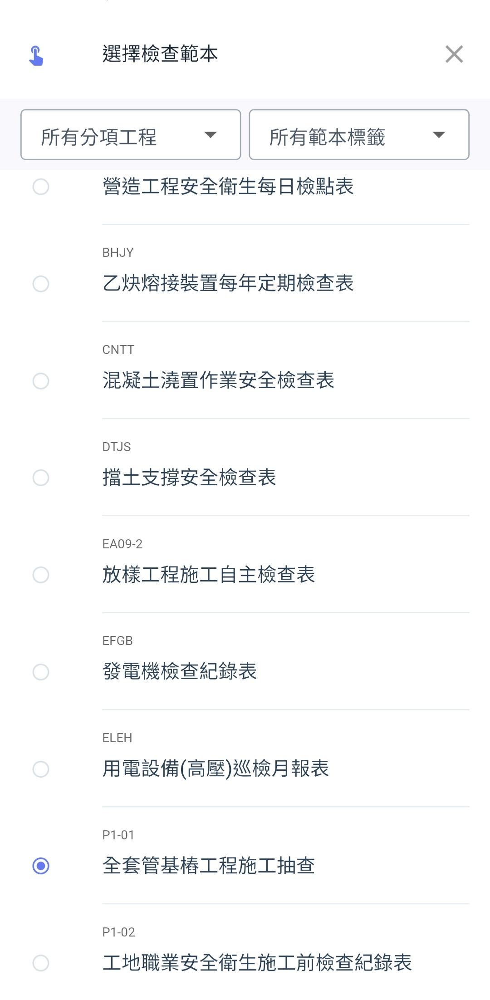 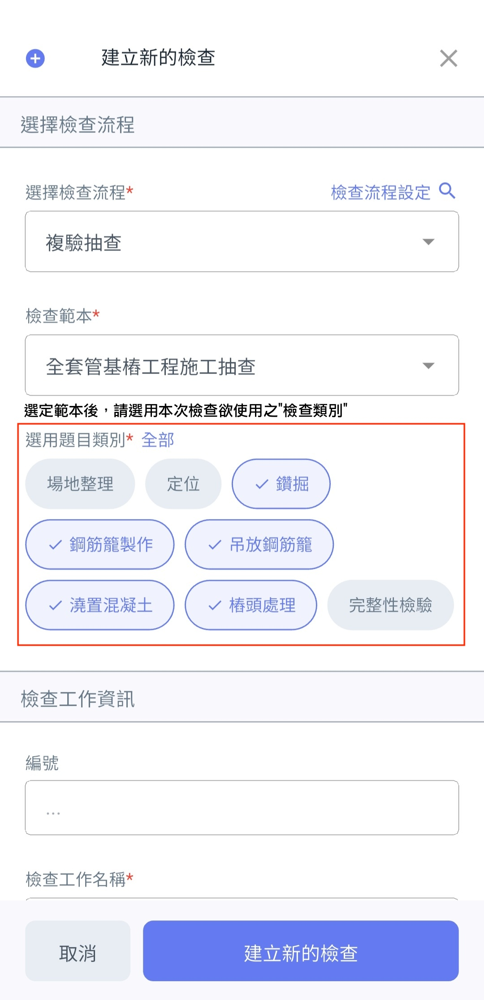

如圖七\~八，將檢查類別與流程填寫完畢後，接下來是填寫檢查工作資訊，包含：編號(選填)、檢查工作名稱、預計執行日期、檢查人及檢查時機等。



可依公司內部編碼填寫；若留空，系統將自動產生唯一的追蹤編碼。



建議採用具識別性的命名（如：B區梯間-外牆防水塗佈查驗 / 3F柱筋綁紮自主檢查），便於後續於檢查清單中快速檢索。



設定預計進行查驗的時間，便於管理階層掌握各工項的品質查驗進度。



系統預設為發起人，亦可指派其他具權限之現場工程師負責執行，確保責任歸屬明確。



標註查驗的時間點，如「施工中」（確認塗料厚度）或「施工後」（確認閉水試驗結果），確保查驗紀錄符合程序規範。



!!! danger
    #### ❗請注意
    
    目前 App 版本僅支援『逐筆建立』檢查任務，暫不支援『批次建立』功能。若您有大量查驗需求（例如一次建立整層樓的所有查驗單 / 定期性巡檢），建議切換至網頁版進行批次操作，以提升作業效率。

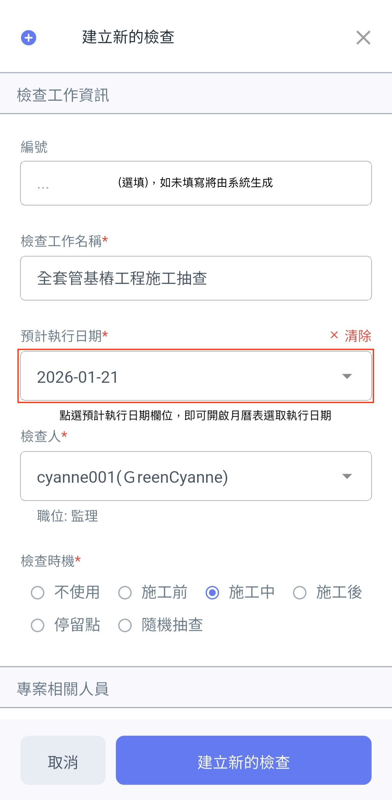 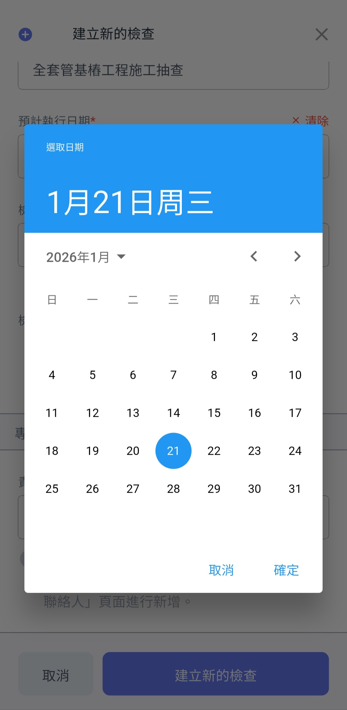 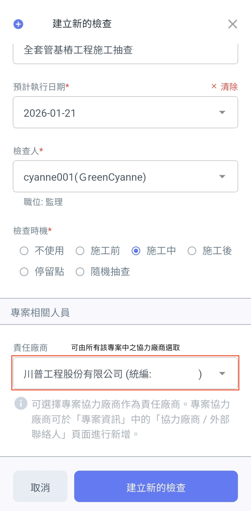

為了讓查驗人員在即時比對設計規範，並在報告中呈現精確的圖文對照，您可以在建立檢查工作時預先選定相關圖面：

如圖十，於『檢查可能使用圖面』欄位，點選  圖示，即可切換至圖面選擇畫面。

如圖十一，開啟頁面後，可透過上方篩選器（依據：分項工程、圖面性質）於專案內之所有施工圖中篩選符合條件者。

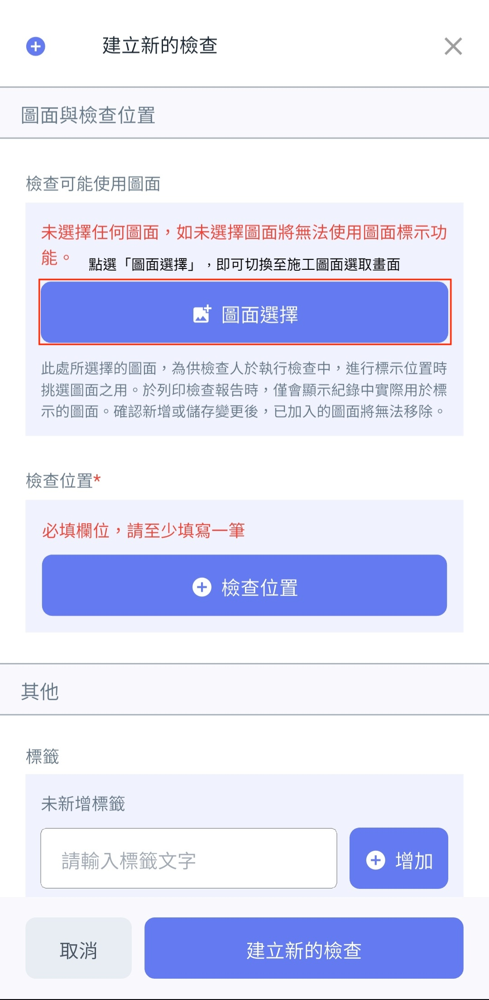 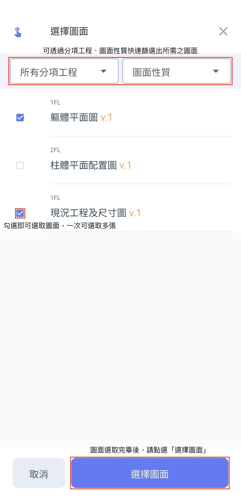 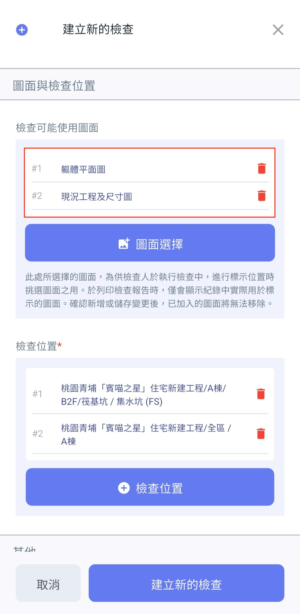

在營建品管中，明確的施工空間標註是數據分析與缺失追蹤的基礎。Jobdone 系統要求檢查位置必須與專案預設的建地結構完全對接，以維持資料的一致性：

如圖十三\~十五，檢查位置是依據專案資訊中的『建地結構資料』進行選取。點選  圖示即可新增檢查位置，系統採一次一筆的方式選取，若本次檢查涵蓋多個空間，可重複點選以新增多筆位置。

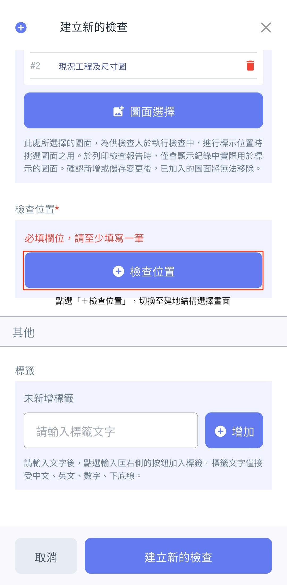 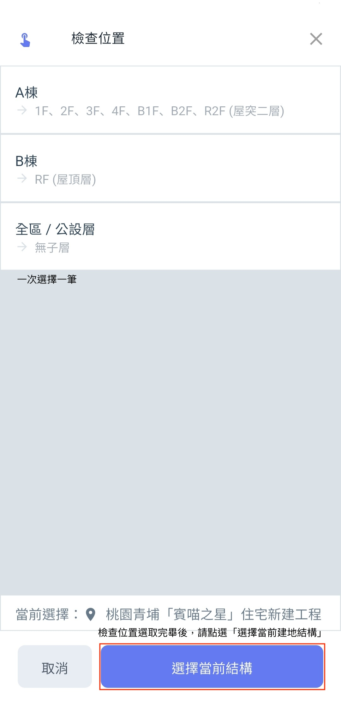 

檢查標籤是您在建立或設定檢查範本時，自定義的分類關鍵字。它就像幫檢查表貼上『便利貼』，讓您能跳脫傳統的資料夾分類，快速抓出特定重點。

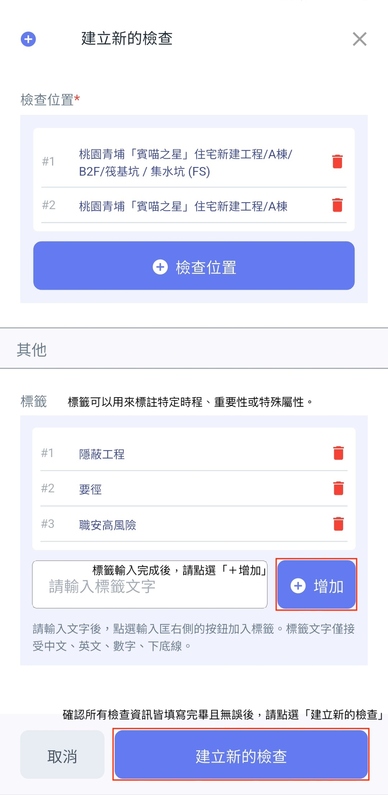 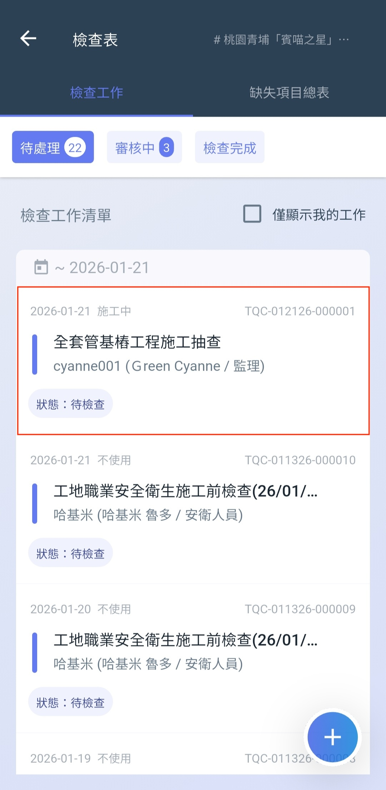

