# 執行檢查工作

## 01｜填寫檢查紀錄

當檢查任務建立完成後，現場人員即可隨時透過行動裝置展開即時查驗，將現場施作狀況轉化為數位紀錄：

如圖一，於檢查工作頁面，點選欲執行之檢查工作，即可進入該檢查內部，查看所有檢查項目並填寫檢查結果。

!!! warning
    系統預設會自動勾&#x9078;**『僅顯示我的工作』**，優先呈現由您發起或負責的任務。若您需要查閱全專案負責的項目或專案全局進度，請務必手動關閉此選項，以免無法查看完整的檢查清單。

**檢查結果說明**

在執行現場查驗時，針對每一項檢查條目，系統提供三種明確的判定結果。這三種狀態將決定後續的報表呈現與流程走向：



代表該施工項目符合技術規範與設計圖說。



代表該項目存在品質缺失，須進行整改。



代表該項目在本次查驗範圍或當前施工階段中****不需執行****。

* **實務情境：**&#x82E5;範本包含『電梯井檢查』，但當前工區並無電梯工程；或範本包含『雨天施工防護』，但查驗當日為晴天，即可勾選不適用。
* **報表呈現：**&#x52FE;選不適用的項目在產出正式報表時，會明確標註為『不適用』，確保報告邏輯完整，證明該項目並非『漏檢』而是『不需檢查』。



!!! danger
    #### ⚠️ 重要操作導覽：區分「檢查紀錄」與「結果判定」
    
    在執行查驗任務時，請務必辨識正確的點擊區域，以確保進入正確的操作介面：
    
    請特別注意（如圖二所示）：若欲針對項目進行『合格/不合格』的結果判定，請直接點擊該項目下方之框框。請勿點擊右側的『＋』符號，因為該符號是導向『檢查紀錄』視窗（用於新增細部描述），而非判定檢查結果。

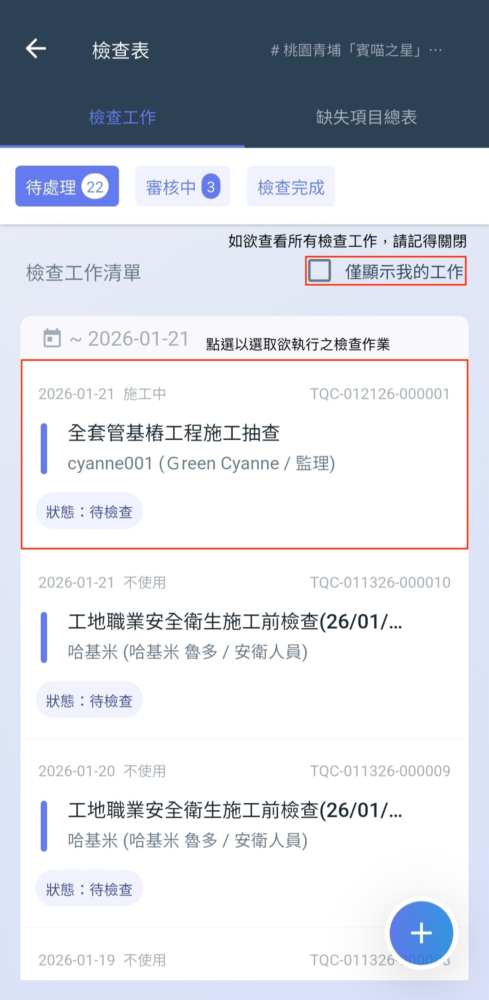 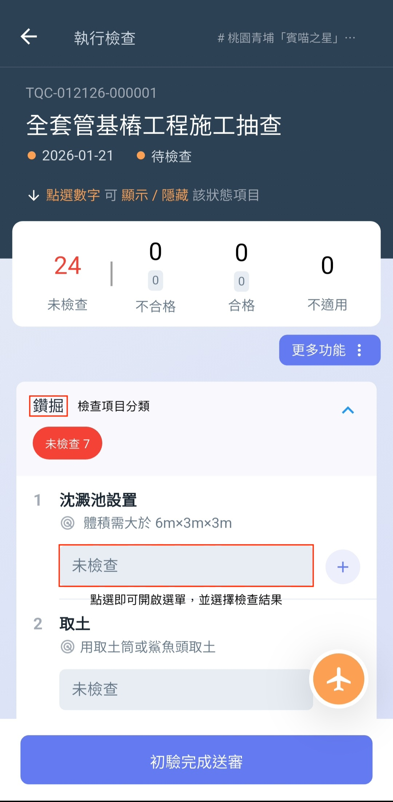 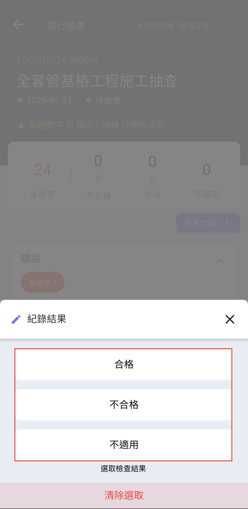

***

### 01 - 1｜檢查紀錄

在執行查驗作業時，系統會根據您的判定結果（合格/不合格）啟動不同的引導流程，確保品質數據能完整留存並具備可追蹤性。



系統視該項目符合品質標準，為提升作業效率，系統不會主動彈出視窗（檢查紀錄）。然而，若該項目涉及重要數據（如：量測值、壓力數值）或需留存完工照，您仍可主動於右側點選『＋』圖示進行補充，填寫包含檢查位置、標準、描述、圖面標示、附圖及附件等資訊。



系統將視為品質缺失，並自動彈出『檢查紀錄』填寫視窗。除了檢查位置、檢查標準及描述等外，此時必須詳細登載缺失細節，以啟動後續的改善追蹤與複驗流程。如：缺失責任人與改善人： 明確指派負責整改的人員，落實責任歸屬。

!!! info
    建議透過『圖面標示』定位缺失點，並上傳『附圖（缺失照片）』與相關『附件』作為改善前的依據。&#x20;




在營建現場，單一檢查項目（標準）往往需對應多個實體構件。系統支援「每筆檢查項目皆可建立多筆檢查紀錄」，這能完美對應複雜的施工查驗情境：

> **實務範例：連續壁工程 — 壁體鋼筋籠及預埋件檢查**
>
> 假設本次查驗項目是「預埋連接器（Coupler）位置與數量」，而現場當日要施作的是「一整個單元（Unit）」，內部包含多組預埋件。
>
> * 操作方式： 您不需要為每一組預埋件建立一份檢查表，只需在同一個「預埋連接器」項目下，利用『檢查紀錄』 功能（點擊右側的「＋」）一一回報。
> * 數據呈現： 您可以針對「單元左側」、「單元右側」、「轉角處」等不同位置分別新增紀錄，並在每一筆紀錄中上傳對應的照片、填寫實測數值。
> * 混合判定（核心價值）： 若其中 5 處預埋件合格、1 處偏移不合格，合格的紀錄會作為品質存證存檔，而不合格的那一筆紀錄則會自動標記缺失，並同步至「缺失檢查項目總表」，確保每一處細節都能被追蹤到結案。

**01 - 1 - 1｜合格**

如圖四，於該檢查項目右側，點選  圖示，即可開始新增多筆檢查紀錄。

**【視窗欄位說明與實務應用】**



系統預設會自動帶入專案預設的『建地結構資料』（如：A 棟 / 3F），提供標準化選取。但若該檢查範本已關閉『[限定建地結構資料](../../../../qc--1/jian-cha-liu-cheng-she-ding#xian-ding-jian-di-jie-gou-zi-liao)』，則建議您在此手動填寫更具體的物理位置，以利精確定位。



顯示該項目的技術規範。執行人員可在此比對實測數據，例如標準為「垂直度 ± 3mm」，可於描述欄填寫實測結果，落實數據化管理。



用於記錄現場執行細節。

> 範例：「經現場實測，鋼筋間距誤差控制在 5mm 內，且箍筋彎鉤角度均符合 135 度要求，無鬆脫現象。」



現場拍攝之缺失照或合格存證照。

App 系統支援自動帶入時間、座標、工程名稱、施工位置之浮水印，確保照片的真實性，符合營建業品管規範（如公共工程委員會之照片紀錄要求）。



可上傳與該紀錄相關的電子文件，如：材料出廠證明、試驗報告 PDF、或施工說明書截圖。這讓查驗紀錄不僅是照片，更具備完整的法律證據效力。



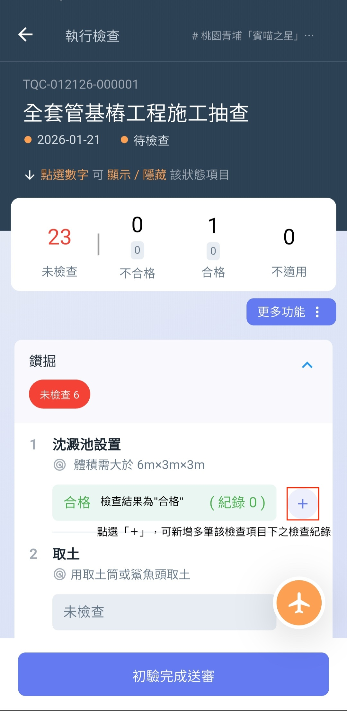 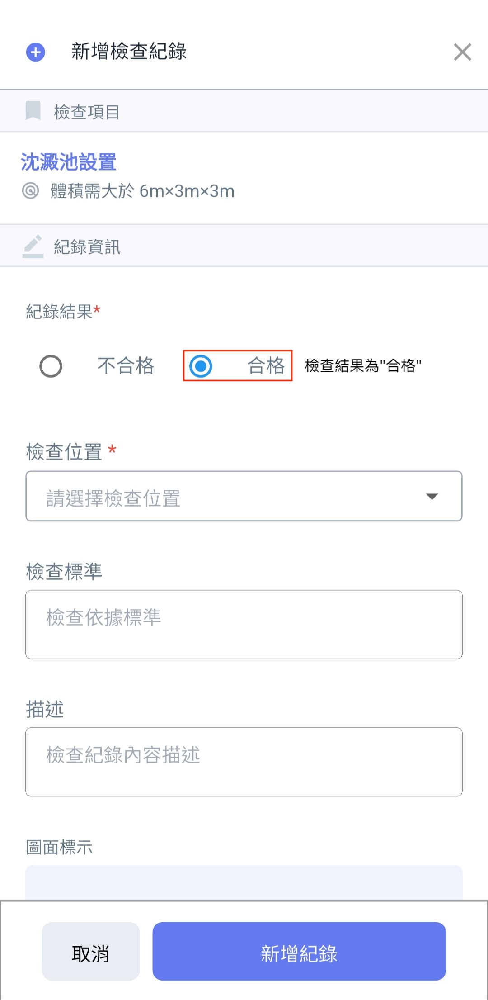 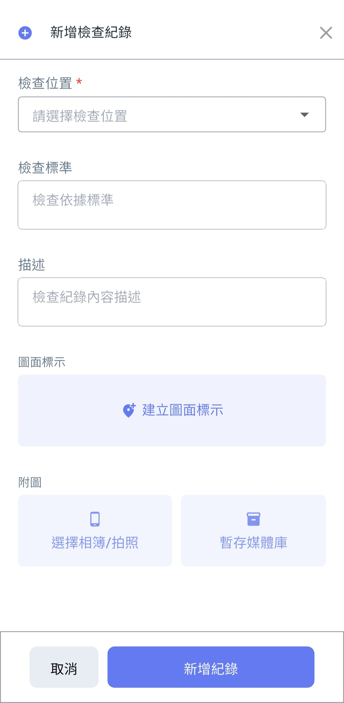

***

**01 - 1 - 2｜不合格**

當檢查結果判定為『不合格』後，系統即會自動跳出檢查紀錄視窗，要求填寫相關缺失資訊。

為了落實圖文對照的查驗標準，當您需要針對特定缺失或檢查點進行精確定位時，請執行以下操作：

如圖七\~八，點選『圖面標示』欄位後，即可開啟圖片選擇視窗。您可以從原先檢查範本設定之『檢查可用圖面』中，選取本次檢查工作實際需用到的圖面。

如圖九，圖面挑選後，即可開始於該圖面上進行打點標示。系統支援標示多個位置點，且每一點皆會依序產生專屬的編號。

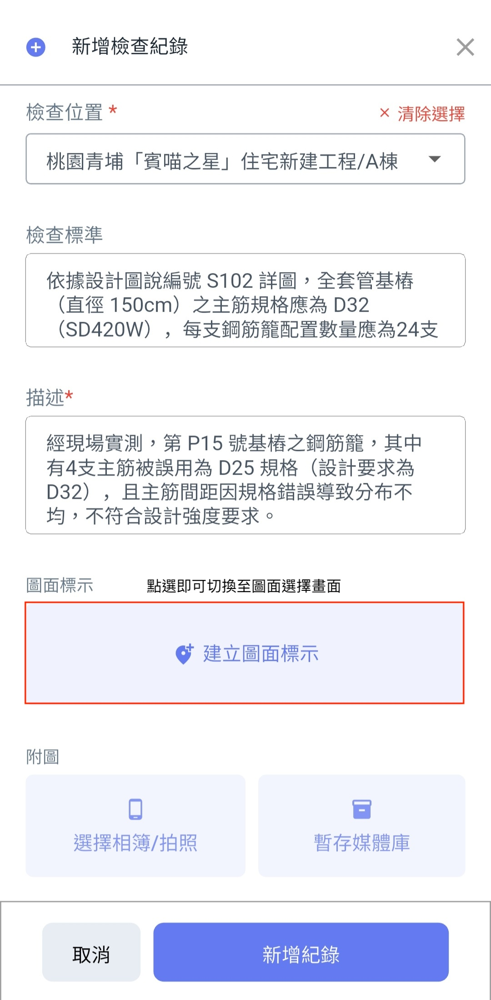 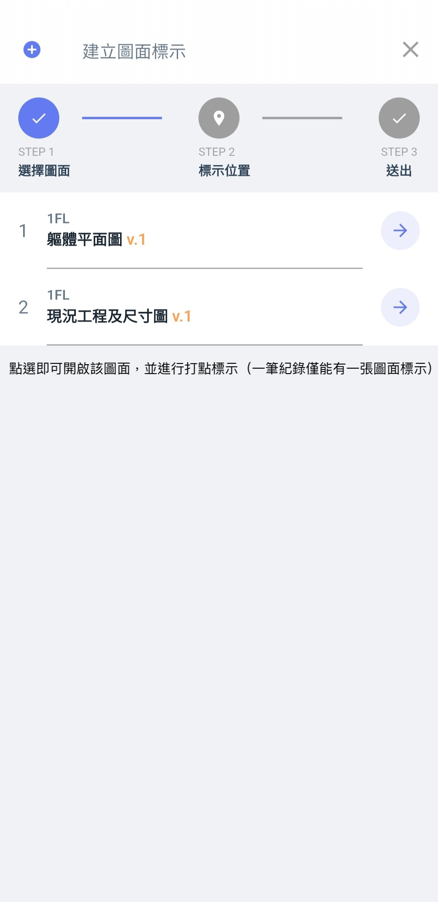 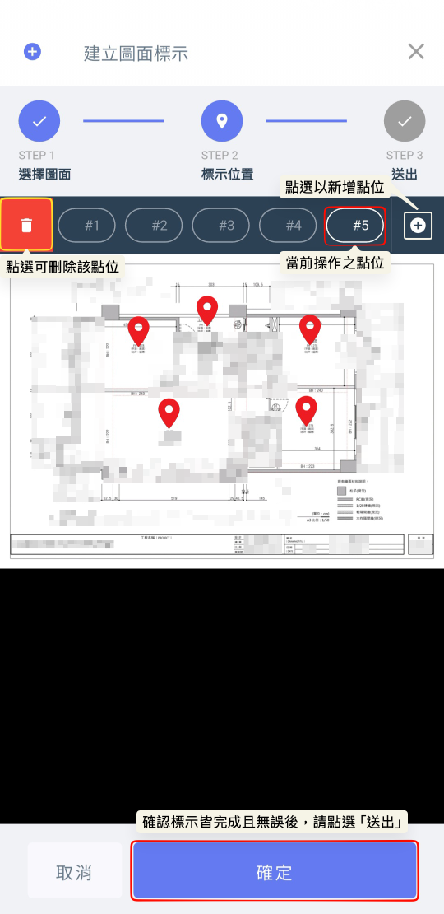 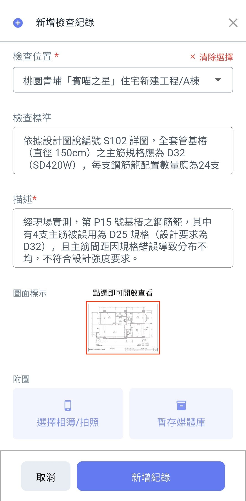

當您在檢查項目中進行回報時，除了前述的「圖面標示」外，系統提供以下關鍵欄位，用以建構完整的「責任歸屬」與「品質證據」：



缺失責任人： 指出造成該品質缺失的負責方。

缺失改善人： 指派負責進行整改作業的人員。

> 實務： 這兩個欄位皆可靈活選取「外部協力廠商」。例如：結構體發現漏水，責任人可選取「某某模板包商」或「某某混凝土廠商」之人員；改善人則選取「某某防水專業分包」之人員。系統會依據此設定，於發出缺失改善時，自動帶入相關欄位。



雖然整體檢查工作已有大位置，但此處可進一步細化。例如大位置在「3F」，此處可具體填寫「3F 第 5 號樑柱節點」，達成精確定位。

有關檢查位置填寫方式設定，請參閱 ➙ [限定建地結構資料](https://docs.jobdone.cc/user_guide/cpm/bc/qc--1/jian-cha-liu-cheng-she-ding#xian-ding-jian-di-jie-gou-zi-liao)



針對該單一紀錄的具體量測標準。如前述範例之「偏移量 ≤ 10cm」，讓後續審核者有明確的對照基準。



以文字詳述現場狀況。建議包含「現況發現」、「可能原因」及「建議處理方式」。



現場拍攝之缺失照或合格存證照。

App 系統支援自動帶入時間、座標、工程名稱、施工位置之浮水印，確保照片的真實性，符合營建業品管規範（如公共工程委員會之照片紀錄要求）。



可上傳與該紀錄相關的電子文件，如：材料出廠證明、試驗報告 PDF、或施工說明書截圖。這讓查驗紀錄不僅是照片，更具備完整的法律證據效力。



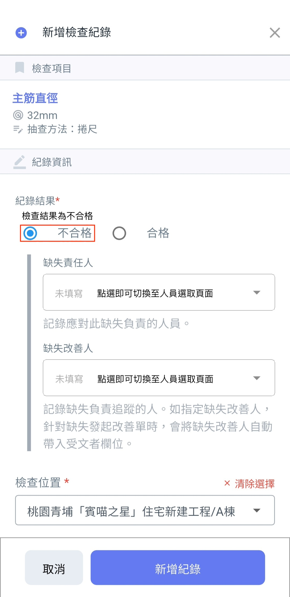  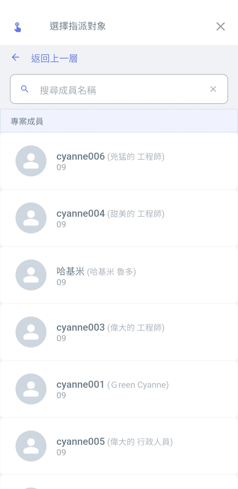 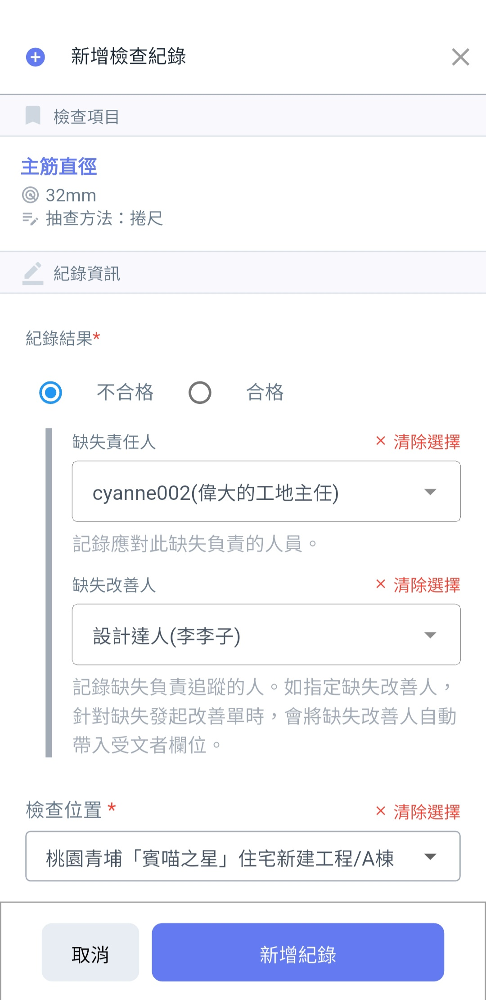

附圖上傳方式有二，分別為<kbd><mark style="color:purple;">**選擇相簿/拍照**<mark style="color:purple;"></kbd>&<kbd><mark style="color:purple;">**暫存媒體庫**<mark style="color:purple;"></kbd>選取。確認檢查紀錄填寫完畢後，請點選 圖示，系統將正式儲存該筆資料。

詳細操作說明請參閱下方之 ➙ [#id-02-fu-tu-gong-neng-shuo-ming](#id-02-fu-tu-gong-neng-shuo-ming "mention")

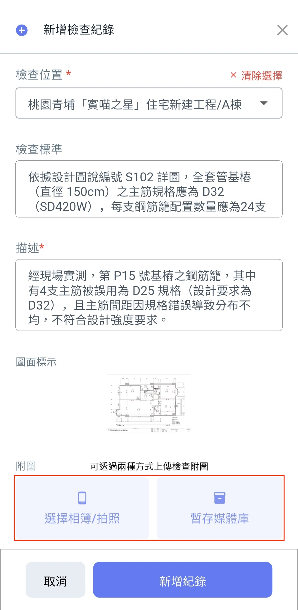 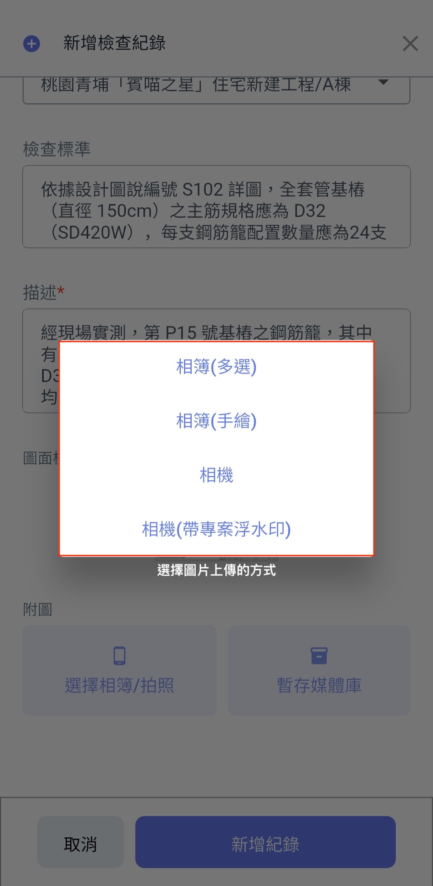 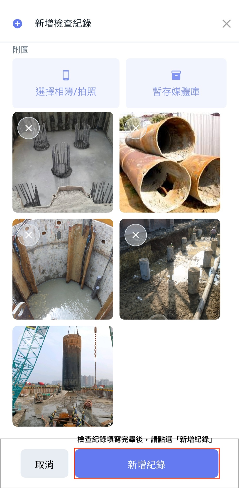

***

### 01 - 2｜更多功能

在執行檢查工作時，App 提供多項「快捷功能」與「彈性管理」工具，協助您應對現場多變的狀況，確保查驗流程不中斷。包含：<kbd><mark style="color:purple;">**一鍵不適用**<mark style="color:purple;"></kbd>、<kbd><mark style="color:purple;">**一鍵未填寫**<mark style="color:purple;"></kbd>、<kbd><mark style="color:purple;">**一鍵發起改善單**<mark style="color:purple;"></kbd>、<kbd><mark style="color:purple;">**新增項目與管理**<mark style="color:purple;"></kbd>

在營建現場，為了應對突發的施作異動或單一工序的特殊性，系統提供了快速同步所有項目狀態的功能：

當原定的檢查表項目與當日檢查工作完全不相符，或依使用者自身情況而定時，系統提供『一鍵不適用』及『一鍵未填寫』，讓您能夠一次更改所有檢查項目的檢查結果。



當整份範本中的項目在當前階段完全不需執行時（例如：原定進行封板檢查，但現場因故停工或工序調整），可使用此功能快速將所有『未填寫』項目標記為『不適用』。這不僅節省逐一勾選的時間，更能確保該次檢查紀錄在產出報告時具備完整的合理解釋。



若需要重新評估或誤選了大量項目的結果，可使用此功能將所有已選為『不適用』的判定一併清空，恢復至初始狀態重新進行判定，確保數據錄入的正確性。



查驗結束後，發現多個項目標註為「不合格」。

系統會自動彙整所有不合格紀錄，一次性產生缺失改善通知單並派發給改善人，無需針對所有缺失重複填寫改善單資訊。



支援現場增列範本外的特殊查驗內容，確保「計畫外」的施工細節也能被數位化追蹤。您可以自定義名稱與標準，並隨時調整其在檢查表中的排序。



#### **01 - 2 - 1｜一鍵不適用、一鍵未填寫**

點選畫面右上方的  圖示開啟選單，並選取  。系統將自動把當前檢查工作內『尚未判定』的所有項目，一鍵標註為『不適用 (N/A)』。

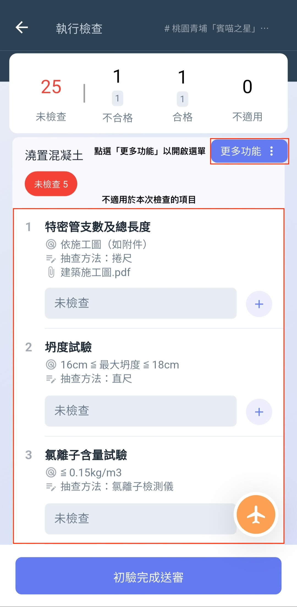 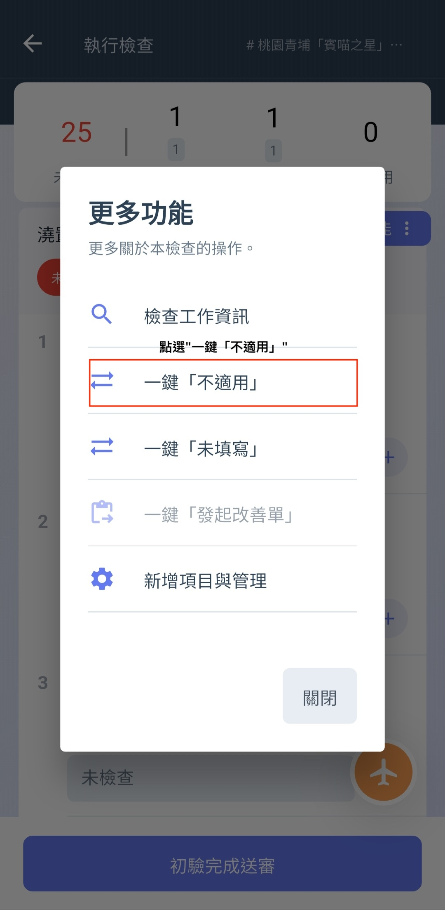 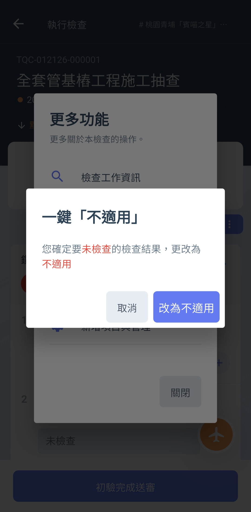 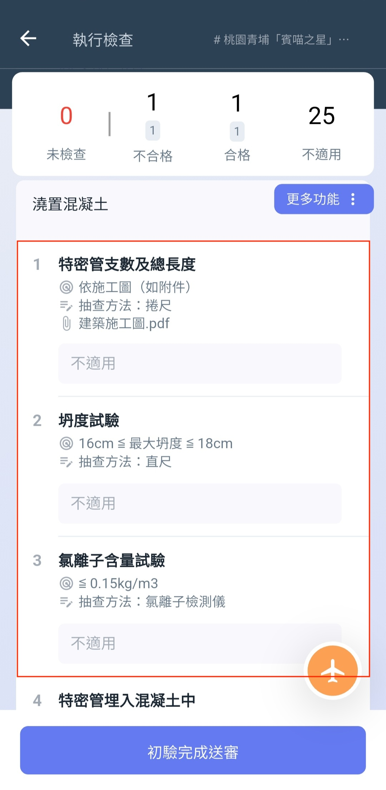

點選畫面右上方的  圖示開啟選單，並選取 。系統將會立即清空當前檢查工作內所有已填寫的判定結果****（不適用）****，將狀態統一重置為初始的『未填寫』狀態。

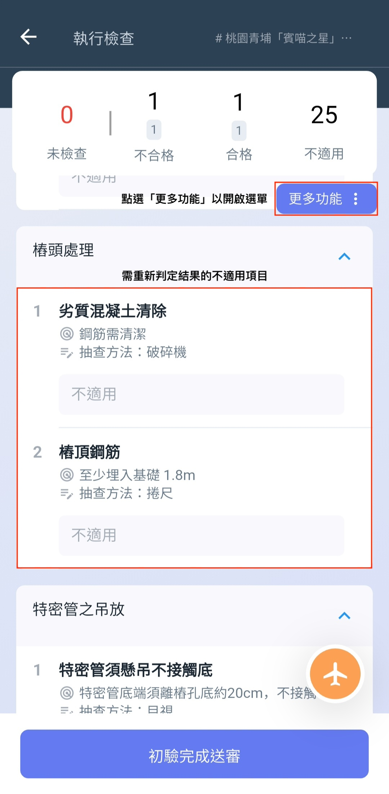 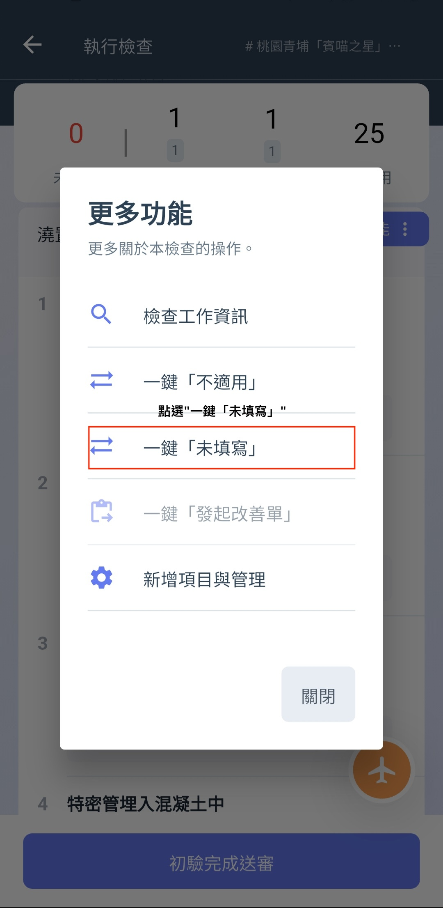 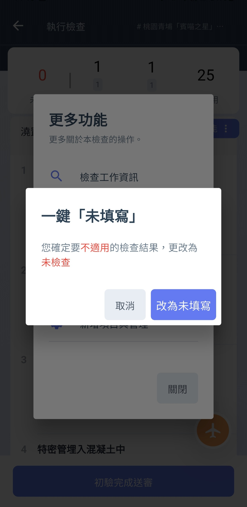 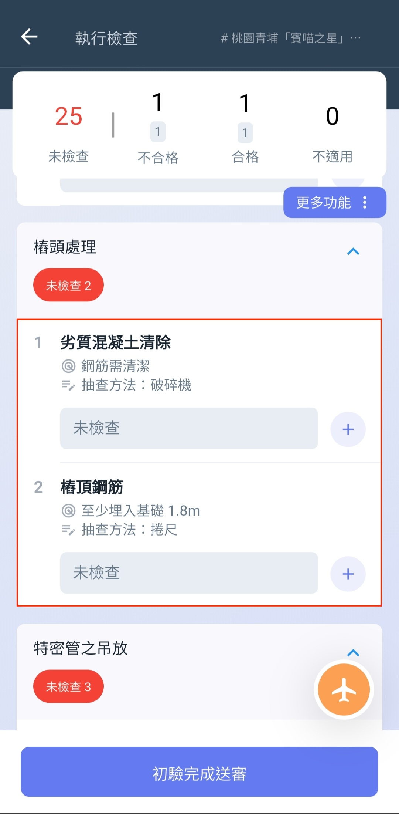

***

#### **01 - 2 - 2｜一鍵發起改善單**

當檢查表完成後，若存在多個「不合格」項目，您可以使用此功能快速啟動整改流程，無需逐項建立改善單。

!!! warning
    #### 請注意
    
    若該檢查表已開啟複驗流程，則 <kbd>**一鍵發起改善單**</kbd> 功能僅限於 **複驗** 階段使用。此設計是為了確保改善單能精確對應複驗後的最終判定結果，避免流程衝突。

**1. 自動化資訊帶入機制**

由於此功能為批次發送，為了確保溝通效率，系統會以檢查紀錄自動帶入：



系統將自動帶入該檢查項目的項目的『檢查題目』作為主旨，並將您在檢查紀錄中填寫的文字描述直接轉為缺失描述。



該項目對應的所有附圖（包含手繪標註）會自動夾帶於改善單中，確保收件人能精確對應缺失位置。



**2. 受文者派發規則 (Recipient Logic)**

您可以根據專案管理的需求，選擇以下兩種派發邏輯：



**邏輯：**&#x7CFB;統會優先檢查每一筆紀錄是否有指定特定的『缺失改善人』。

**結果：**&#x6709;指定對象的紀錄將發送給該人員；若該筆紀錄為指定，則會發送給您在批次畫面中所選擇的『統一受文者』。

**適用情境：** 當同一張檢查表涉及多個不同專業廠商（如水電、泥作、木作）時使用。



**邏輯：**&#x7CFB;統將忽略個別紀錄的指定人選。

**結果：**&#x6240;有不合格項目的改善單，將全數統一發送給您在此次批次選擇的特定對象。

**適用情境：**&#x7576;所有缺失皆歸屬於同一承包商，或需統一由該廠商的工地負責人對口處理時使用。



***

#### **01 - 2 - 3｜新增自訂檢查項目 (Customizing Inspection Items)**

由於工程現場的狀況多變，實際查驗項目可能與預設的檢查範本有所差異。為了提升檢查過程的彈性，系統支援於「執行中」的檢查工作內直接增列項目：

!!! warning
    #### ⚠️ 重要操作限制：新增項目之使用時機
    
    『新增項目與管理』功能僅限於****初驗檢查****階段使用。一旦進入複驗或後續流程，系統將鎖定檢查清單，不再支援自訂項目之增列或刪除，以確保複驗內容與初驗標準完全對應。
    
    ***
    
    **💡 為什麼有這項程序限制？**
    
    1. **確保對等比照：** 複驗的核心目標是確認「初驗所發現的缺失是否已改善」。若在複驗時又能任意新增項目，會導致初、複驗的基準不一，造成結案評估的困難。
    2. **防止遺漏缺失：** 所有的查驗需求應在初驗時一次界定完畢。若現場臨時有新增的查驗需求，應另行建立一筆新的「檢查工作」，而非在現有的複驗流程中安插新項目。
    3. **合規與稽核：** 在外部稽核（如三級品管）時，紀錄的「一致性」是檢查重點。鎖定複驗清單能證明管理過程嚴謹，未隨意竄改或事後補件。

如圖一\~二，在檢查工作頁面中，點選  開啟選單，選擇  即可進入設定介面。

在此您可直接修改現有的自訂類別與項目，或點選下方的  開始建立新的查驗內容。

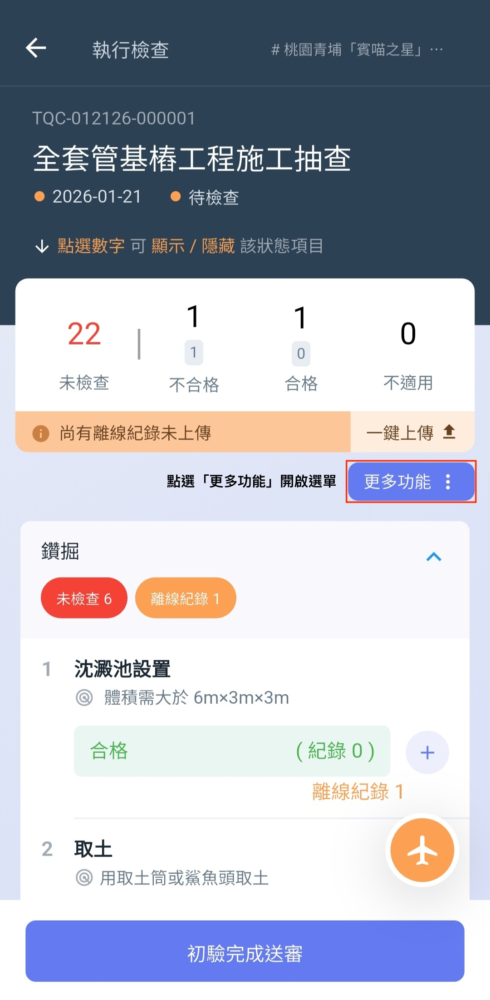 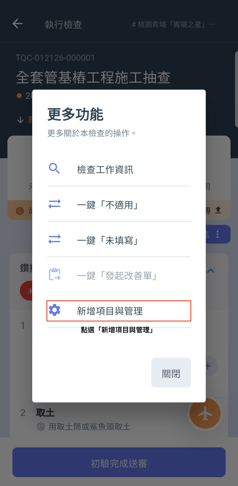 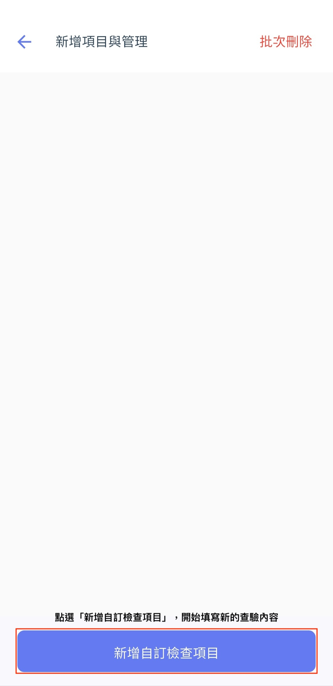

**操作導覽：建立自訂檢查項目**

進入新增介面後（如圖四所示），請依照以下層級完成設定，以確保自訂項目能正確歸類並產出報表：

1. **設定自訂分類：** 您必須先建立或選擇一個「分類」（例如：`[追加] 臨時結構`），作為項目的母體。
2. **填寫項目詳情：**&#x20;

* 檢查項目名稱： 具體的查驗動作（如：`基樁沈澱池容積量測`）。
* 檢查標準： 定義合格的量化指標（如：`需大於 6m × 3m × 3m`）。
* 備註： 提供額外的施工提醒或圖說參考索引。

3. **選取分析屬性：** 您可以為此項目掛載特定的屬性標籤（如：`安全`、`品質`），這將有助於系統在後台自動進行數據統計與戰情分析。

!!! danger
    #### ⚠️ 重要功能限制提醒
    
    在建立自訂項目時，請留意以下限制：
    
    * **不支援上傳附件：** 自訂檢查項目不支援在『建立階段』上傳參考附件（如參考圖說或標準圖集）。

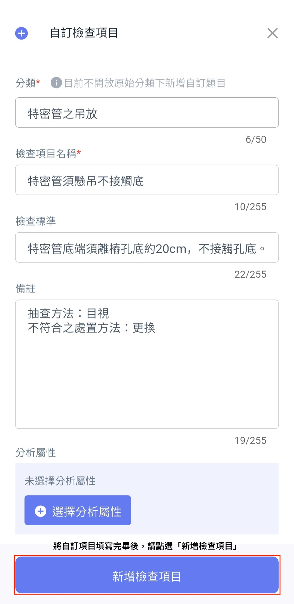 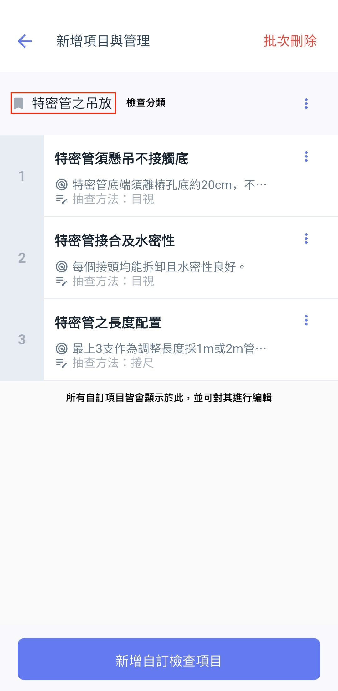 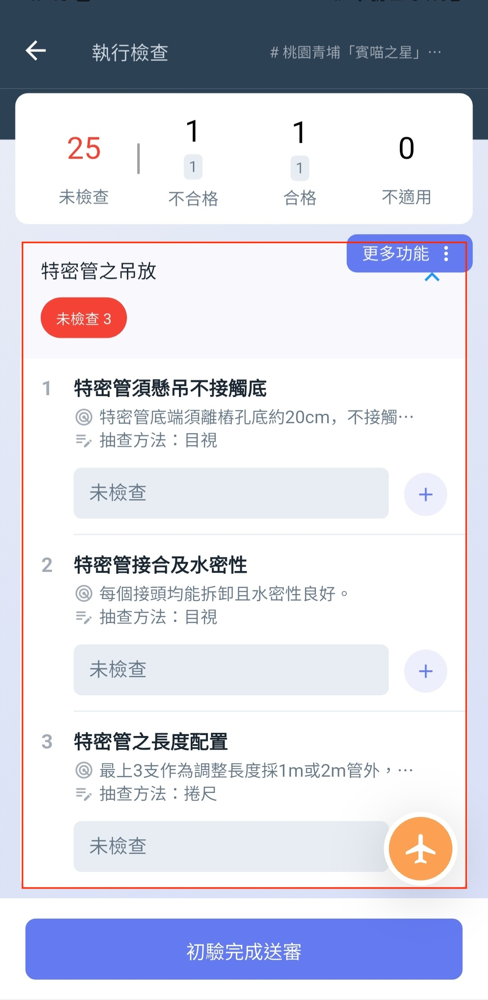

***

### 01 - 3｜修改紀錄與刪除

在執行檢查時，若需要調整已建立的紀錄內容，請留意以下操作差異，以避免產生重複的冗餘資料：

**1. 如何修改既有紀錄？**

如圖，直接點擊該筆紀錄的顯示區塊，進入紀錄結果畫面後，再點選  圖示，即可進入編輯頁面修改文字描述、調整標記或更換照片。

!!! info
    若您點擊右側的  圖示，系統將判定為 「新增另一筆紀錄」，而非修改舊有資料。

**2. 如何刪除紀錄？**

如圖，進入紀錄的編輯頁面後，點選  選項即可移除該筆資料。

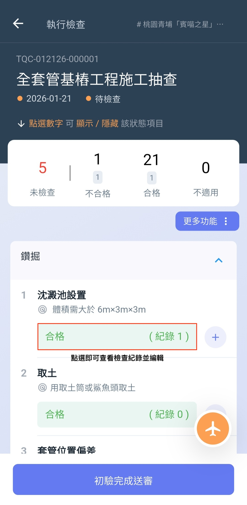 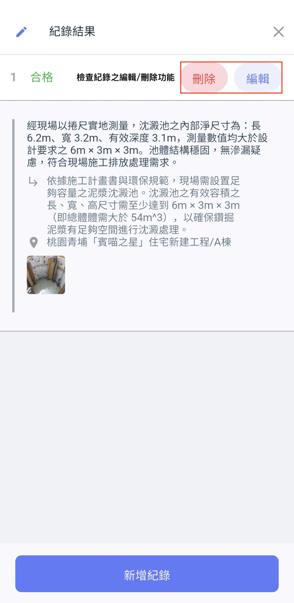 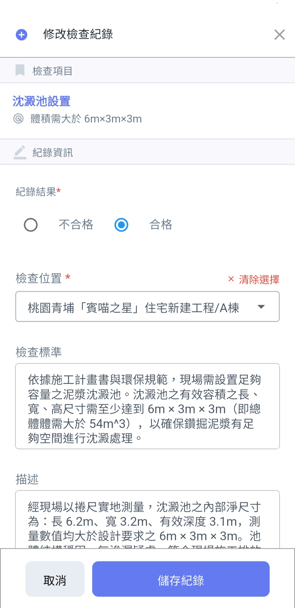

***

## 02｜附圖功能說明

**操作導覽：靈活運用附圖功能 (Image Attachment Methods)**

在執行查驗並填寫檢查紀錄時，完善的影像佐證是品質管理的核心。系統提供兩種靈活的上傳方式，滿足不同的現場作業情境：



* **操作：**&#x9EDE;選後可直接啟動手機相機進行即時拍攝，或從手機相簿中選取已存有的照片。
* **適用情境：**&#x9069;用於發現突發缺失、或是需要針對特定查驗細節進行近距離特寫時。



* **操作：**&#x9EDE;選後可直接從系統內部的媒體空間選取照片。
* ****來源說明：****此處可選取的照片，是同步自該專案中****『影音日誌內的暫存媒體庫』****。
* **適用情境：**
  * 避免重複拍攝： 若工程師在巡視現場時，已先透過「影音日誌」大量拍攝了當日的施工狀況，在進入「檢查表」時，只需從暫存媒體庫中勾選對應照片即可，無需重新開相機拍照。
  * 資料一致性： 確保施工紀錄與自主檢查表使用的是同一組影像來源，強化資料的互證性。



!!! info
    #### 💡 為什麼要善用「暫存媒體庫」？
    
    1. **節省手機空間：** 照片儲存於雲端媒體庫中，不會佔用手機實體相簿容量，避免因手機空間不足導致 APP 閃退。
    2. **跨功能串聯：** 現場巡檢人員可以先專心『拍照紀錄』到影音日誌中，等回到工務所休息時，再利用『暫存媒體庫』功能，優雅地將照片分派到各個檢查項目的紀錄內。
    3. **雲端協作：** 只要照片已上傳至該專案的媒體庫，無論是哪位工程師執行查驗，都能共享這些影像資源，實現團隊協同品管。

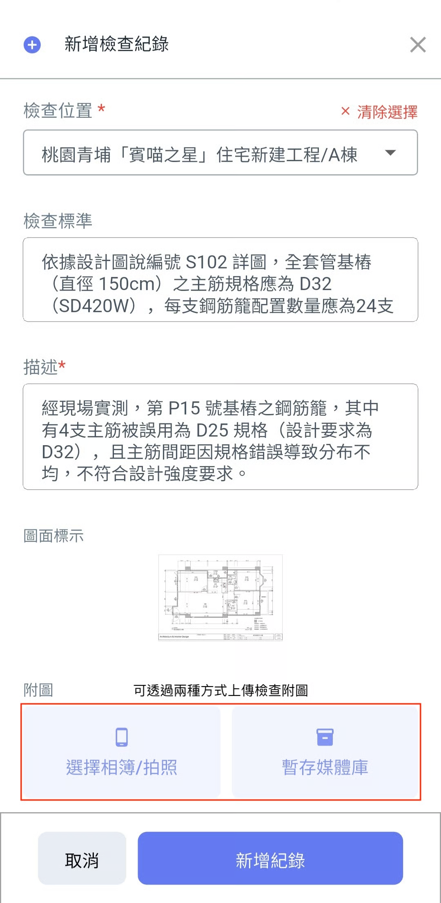  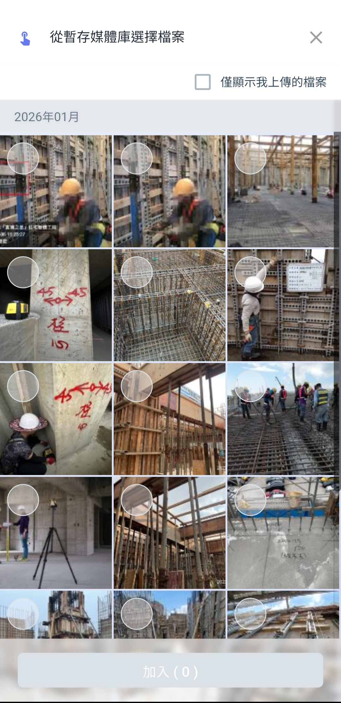

***

### 02 - 1｜**四大圖片上傳模式 (Image Upload Modes)**

當您點選「選擇相簿/拍照」時，系統提供以下四種方式，讓您可以根據現場查驗的需求，選擇最適合的存證工具：



* **操作：**&#x5F9E;手機相簿中一次勾選多張照片。
* **適用情境：**&#x7576;您已在現場完成大量巡檢拍攝，回到工務所準備補齊紀錄時。這能幫助您快速地將同一區域的多張角度一次匯入，大幅節省單張點選的時間。



* **操作：**&#x5F9E;相簿選取圖片後，立即啟動手繪編輯工具。
* **適用情境：**&#x6700;適合『不合格』項目的判定。您可利用畫筆在照片上直接圈選缺失位置（如：樑柱裂縫處、滲水點），或標注尺寸數值，讓後續負責改善的廠商一眼就能看出問題所在。



* **操作：**&#x76F4;接開啟手機原始相機鏡頭拍照。
* **適用情境：**&#x8FFD;求快速拍攝速度時。適用於一般性的查驗紀錄，保留照片最原始、最高清的影像細節，方便日後放大檢視。



* **操作：** 拍照時自動在照片上壓印「專案名稱、施工位置、日期時間、GPS 座標」等關鍵資訊。
* **適用情境：** 公共工程或嚴謹品管必備。 浮水印提供了不可竄改的時空證明，能直接產出符合「三級品管」標準的工程照片，省去後端再用軟體後製壓字的行政工作。



!!! info
    #### 💡 管理建議：如何選擇？
    
    * **遇到缺失時：** 優先使用 ，圈出問題點，這能減少 80% 的溝通誤解。
    * **關鍵節點存證時：** 優先使用 ，確保這張照片在兩年後的保固爭議中，依然具備強大的證據力。
    * **例行性查驗時：** 透過  進行快速填報，維持每日作業的高效流動。

#### **02 - 1 - 1｜相簿(多選)**

從相簿選取照片後，為了確保上傳的查驗存證清晰且精確，您可以針對每一張照片分別進行以下微調：



移除照片中多餘的背景干擾，將畫面聚焦在關鍵的查驗細節上（如：鋼筋搭接長度、儀器數值、防水層塗佈厚度）。



修正拍攝時的傾斜角度。無論是橫拍還是縱拍，都能調整至最符合閱讀習慣的方向，確保產出的 PDF 報表整齊專業。



放大檢視特定的施工瑕疵，或調整圖片比例，確保重點區域在報表縮圖中依然清晰可辨。



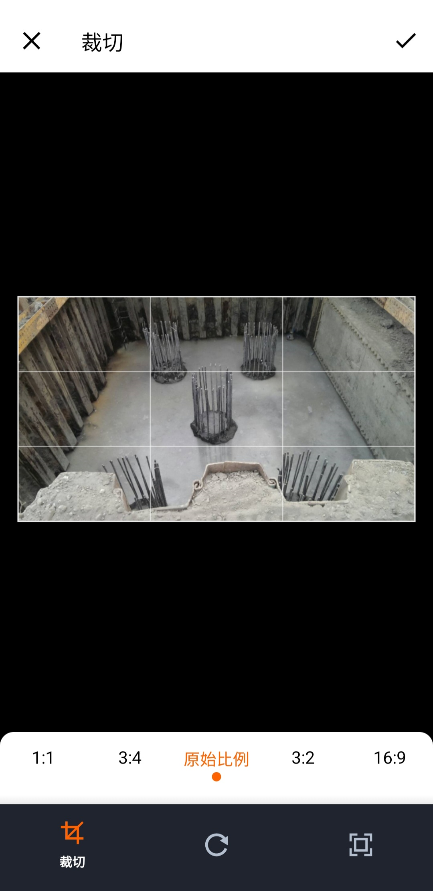 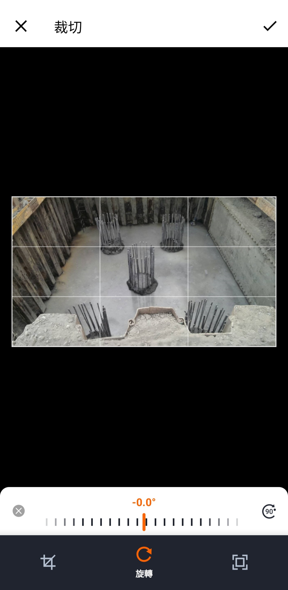 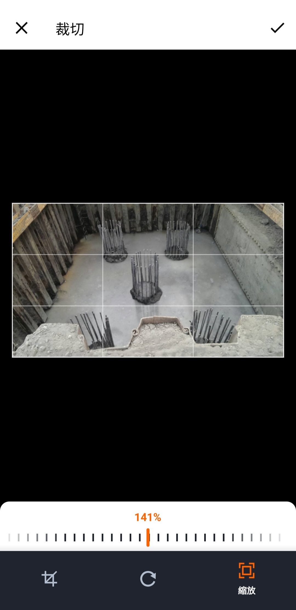

***

#### **02 - 1 - 2｜相簿(手繪)**

進入手繪編輯模式後，系統提供多樣化的標註工具，協助您將現場發現的狀況（尤其是缺失項目）轉化為直觀、具備說服力的影像紀錄：



* **自由畫記：** 用於隨手勾勒不規則的裂縫走向或漏水範圍。
* **線條/折線：** 用於標註施工尺寸或引線（Leader lines），協助說明文字指向特定位置。



最常用於『聚焦缺失』。

例如：用紅色方框框住蜂窩現象，或用圓圈圈出缺少墊塊的部位，確保廠商開單修復時不會找錯重點。



直接在照片上標註規格、數據或具體指令（如：填入『補強 D13@20』或『此處需重新清理』）。



* **顏色區分：** 建議使用紅色標註缺失、黃色標註注意事項、綠色標註合格位置，建立直覺的視覺語言。
* **線條粗細：** 可根據背景複雜度調整，確保標註在雜亂的工地背景中依然清晰醒目。



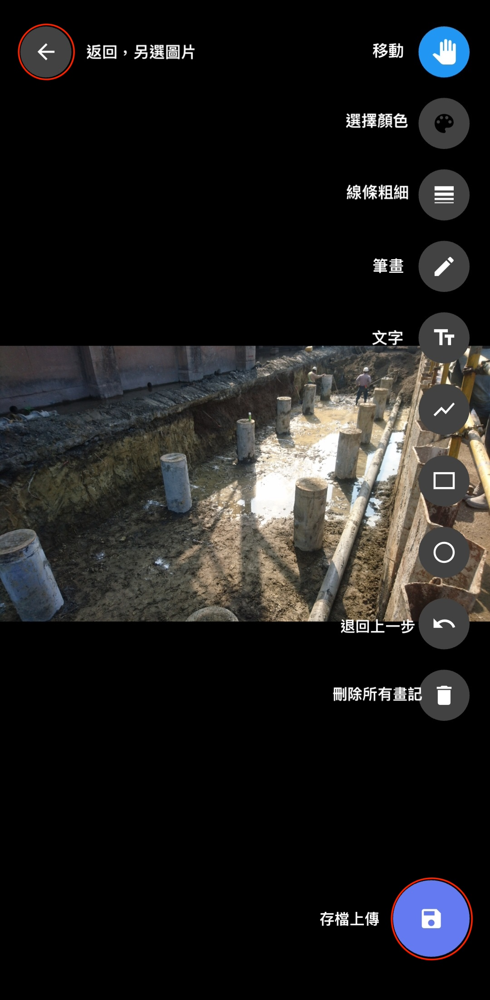 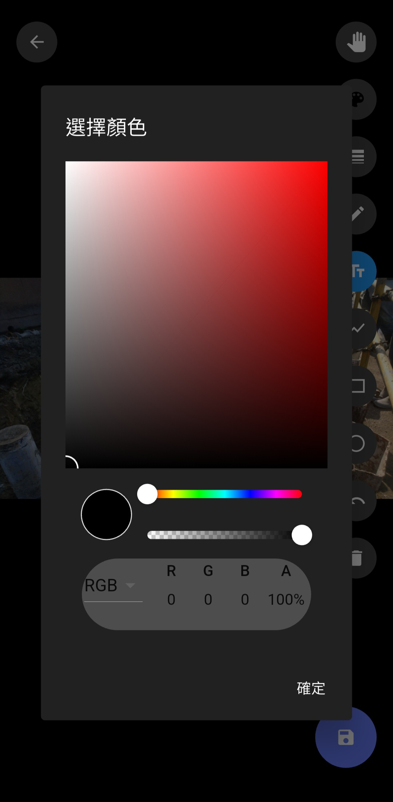 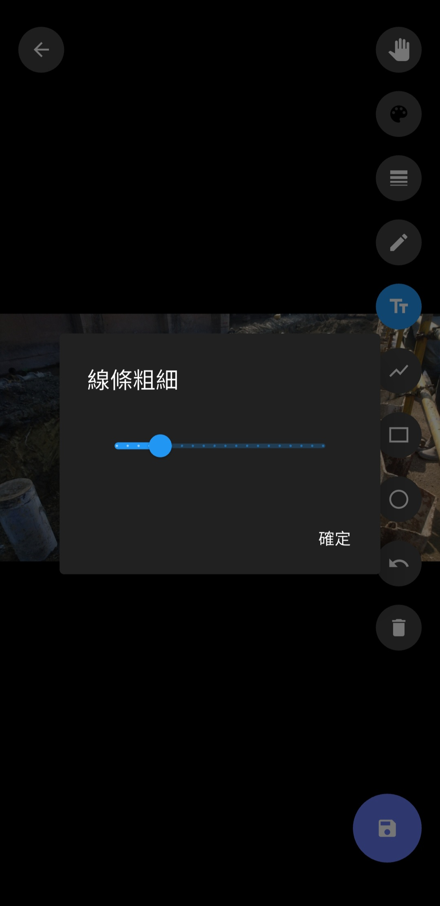 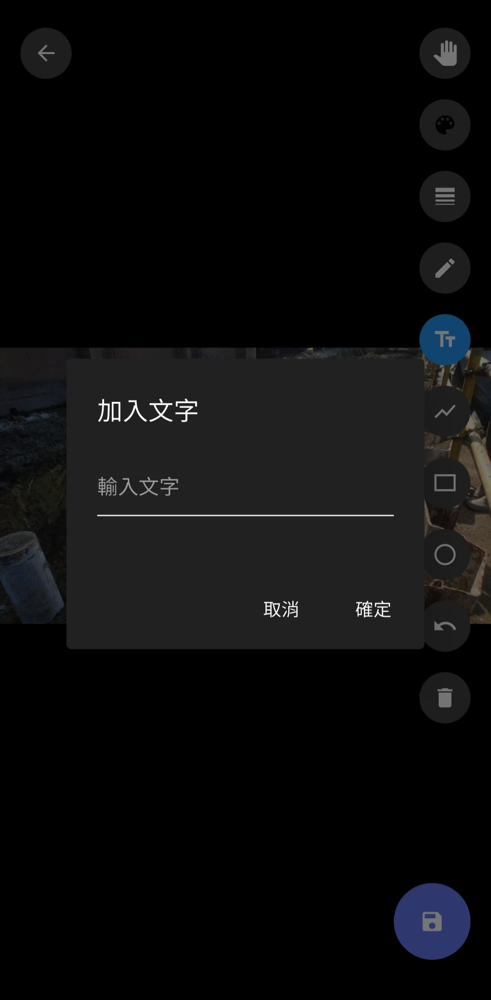

***

#### **02 - 1 - 3｜相機(帶專案浮水印)**

系統內建的浮水印相機可直接拍攝並自動壓印關鍵資訊，確保「所見即所得，拍完即存證」。您可以彈性勾選欲顯示的項目，只需輕點開關，相關數據便會立即附註在照片邊角：



提供精確到秒的時戳（Timestamp），詳細標記該紀錄的時間。



自動帶入專案全銜。



可根據現場實況手動輸入具體位置（例如：『B 棟 3 樓電梯廳』）。



自動抓取經緯度，為戶外、土方或大地工程提供無可抵賴的地理位置證明。



清晰標註紀錄人與所屬公司。



可即時輸入當下的特殊狀況或測量數值（例如：『實測間距 15cm』）。



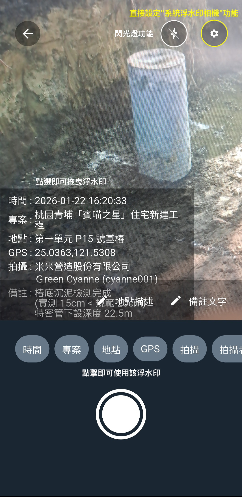 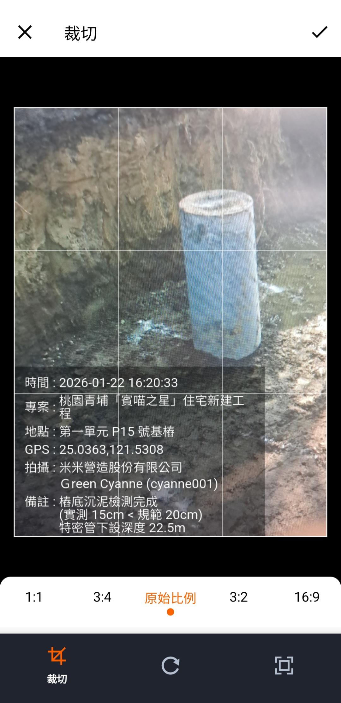

***

## 03｜離線上傳功能

在營建現場（如地下室、連續壁溝槽或隧道工程），網路訊號往往不穩定。系統內建了強大的『離線紀錄模式』，確保您的查驗進度不會因斷網而中斷。此模式會透過以下兩種情境自動或手動觸發：



* **情境：**&#x5373;便現場仍有微弱網路，但您預知即將進入完全無訊號的區域（如進入深地下層等易阻隔訊號處），可主動點選切換至離線模式。
* **優點：**&#x907F;免 App 頻繁嘗試尋找訊號而導致操作卡頓，讓您可以專注於現場的拍攝與文字紀錄，維持流暢的操作體驗。



* **情境：**&#x7576;您檢查到一半，系統判定目前已完成失去網路連線且無法傳輸訊息時，將自動啟用離線紀錄模式。
* **優點：**&#x60A8;無需分心操作設定，系統會自動將當下的檢查結果、檢查紀錄等安全地儲存至離線暫存區。待您回到有網路的區域（如回到工務所或地面層）時，系統將引導您一鍵同步將離線紀錄上傳。

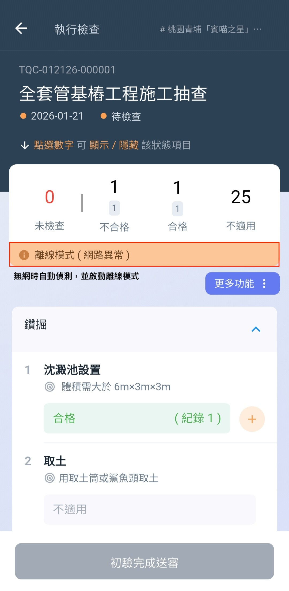




!!! danger
    #### ⚠️ 請注意
    
    1. 離線模式下不支援變更檢查結果（即無法切換：****合格****/****不合格****/****不適用****）。此模式僅供填寫『檢查紀錄』，包含文字描述、拍照、圖面標示等。
    
    
    
    ***
    
    2. 為了確保數據的安全與一致性，在啟用「離線模式」期間，系統將暫時停用以下功能：
    
    離線模式下無法使用 <kbd>**一鍵不適用**</kbd>、<kbd>**一鍵未填寫**</kbd>、<kbd>**一鍵發起改善單**</kbd>及<kbd>**新增項目與管理**</kbd>等自動化與管理功能。
    
    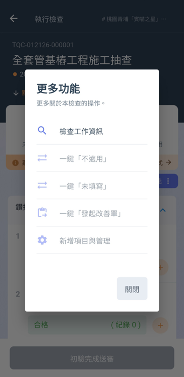

***

### 03 - 1｜主動切換

如圖一，即便在有網路的環境下，您仍可點選檢查工作畫面右下角的  圖示，手動啟用離線紀錄模式。

如圖二，開啟離線模式後，請於檢查項目右側點選  圖示，即可進入新增檢查紀錄頁面。

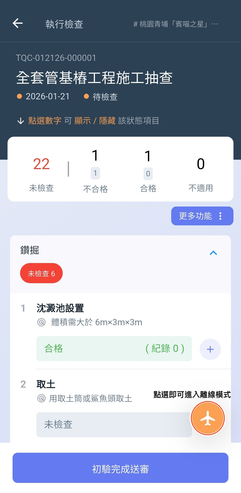 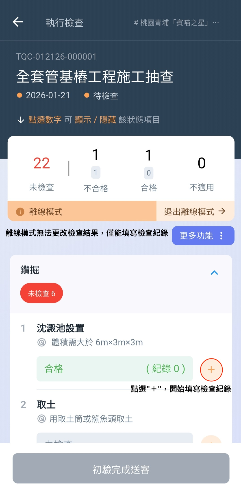 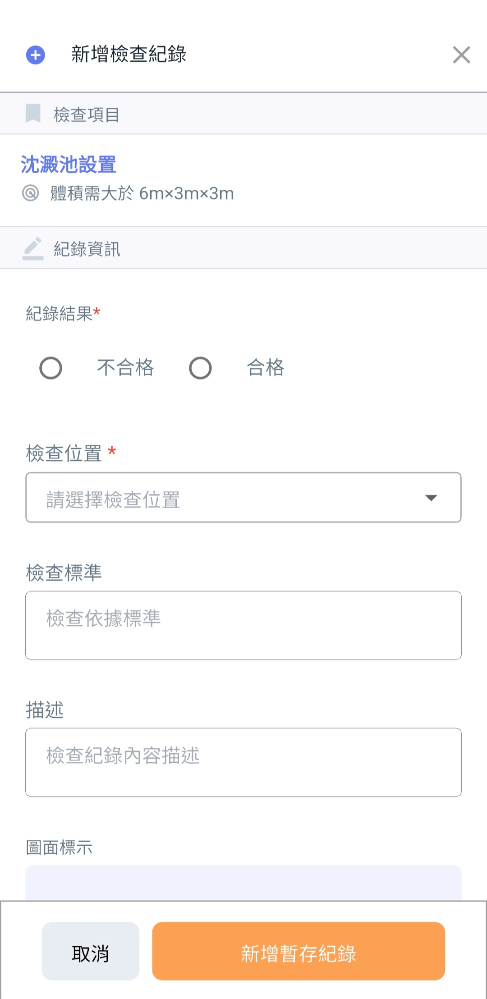

系統的離線模式不僅能紀錄文字，更完整支援核心的視覺化工具。即使在完全無網路的環境下（如深地下室或隧道內部），您依然可以進行以下操作：



您可以開啟預載於專案中的平面圖，並在正確的位置進行標注(Pin)。系統會暫存這些座標資訊，待連線恢復後自動同步至雲端。



無論是即時拍照還是從相簿選取照片，所有編輯功能（包含裁切、旋轉、縮放及手繪功能）皆可正常運作。



離線拍照時，浮水印相機仍能根據專案資訊自動產生資訊壓印，確保存證不中斷。



!!! info
    #### **💡** 離線作業的核心優勢
    
    * **多點紀錄不中斷：**&#x5373;使在離線狀態，針對同一個檢查項目（例如：基樁鋼筋龍），您依然可以點擊多次  圖示，分別紀錄不同位置的狀況。
    * **即時編輯無延遲：**&#x7531;於不需等待雲端回傳，離線模式下的照片裁切、手繪標注與文字輸入會變得極度流暢，大幅提升現場作業效率。
    * **資料安全暫存：**&#x6BCF;筆暫存皆會鎖定在 App 的離線快取中，即使不小心退出 App 或手機重啟，紀錄也不會遺失。

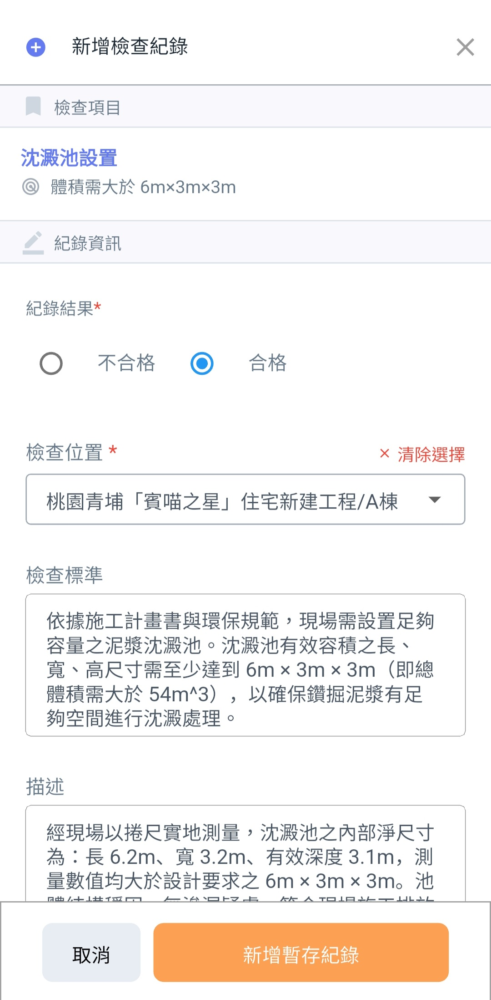 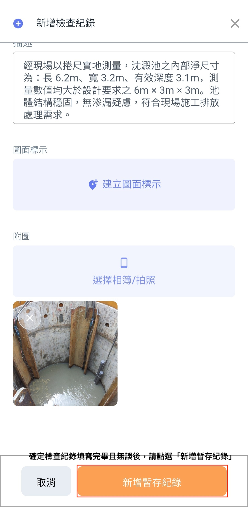 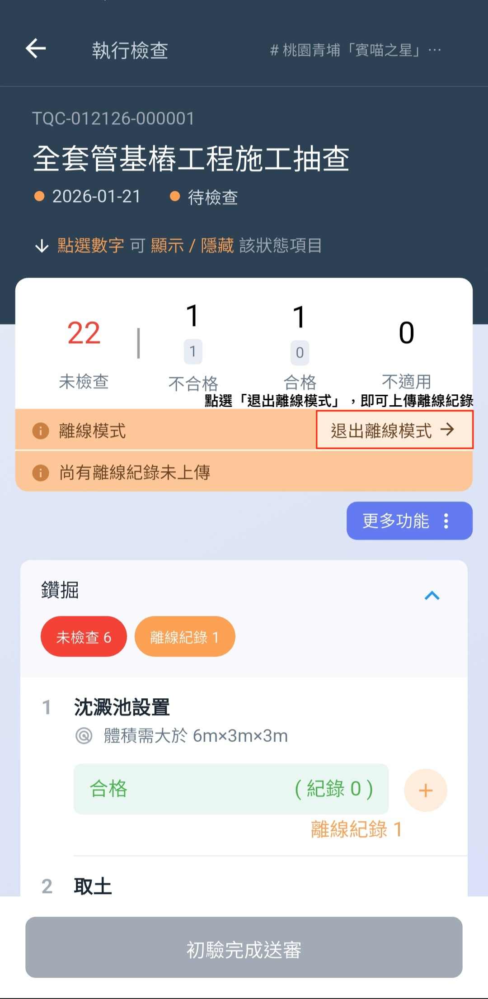

當您結束在訊號死角的作業，重新連上網路或手動退出離線模式後，系統會立即偵測本機端是否有尚未上傳的快取資料，並引導您完成同步

**1. 即時同步提示 (Sync Notification)**

系統會跳出醒目提示，告知您目前有待處理的離線紀錄。您可以點擊進入管理介面，查看所有在離線期間拍攝的照片、標記的圖面以及文字描述。

**2. 編輯與上傳選項 (Upload Options)**

為了確保資料精確，系統提供兩種彈性的上傳方式：

* **逐筆上傳與編輯：** 您可以先一一檢視各筆紀錄，確認照片標註是否清晰、描述是否需微調，確認無誤後點擊該筆紀錄旁的  圖示。
* **一鍵同步 (One-tap Sync)：** 若您已在現場確認過所有內容，可直接點選  圖示。系統將啟動批次處理機制，自動依序將所有離線紀錄同步至雲端專案庫。

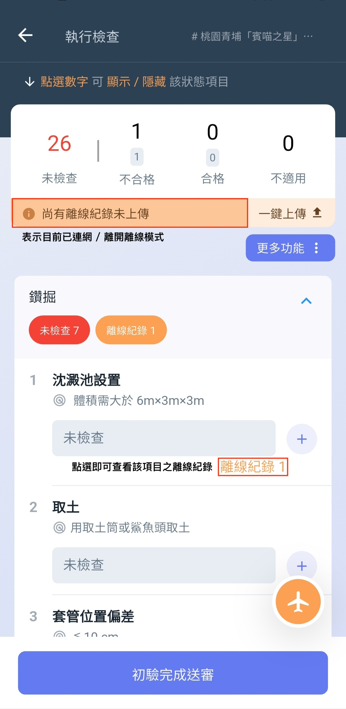 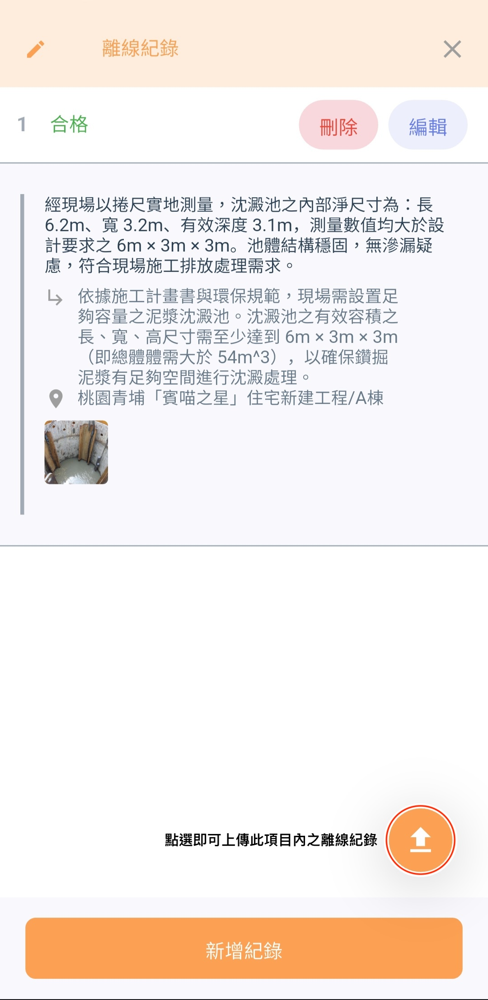 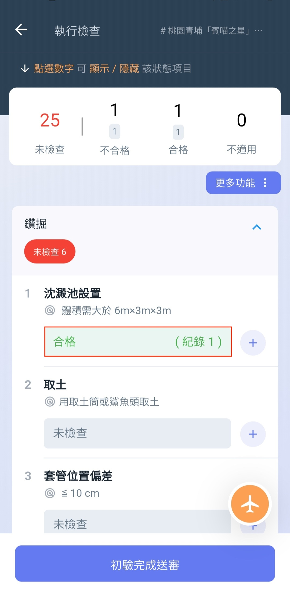

***

## 04｜送交審核

確認所有檢查項目皆已填寫完畢，且紀錄確實無誤後，即可點選<kbd><mark style="background-color:blue;">**初驗完成送審**<mark style="background-color:blue;"></kbd>。系統將依據該檢查所使用之『檢查流程』，將該筆紀錄即時傳送給相關管理人員（如：工地主任或專案管理人員）進行評估與簽認。

!!! warning
    #### 請注意
    
    若仍有檢查項目處於『未填寫』之狀態，則系統將限制提交，無法將紀錄送往下一階段審核。

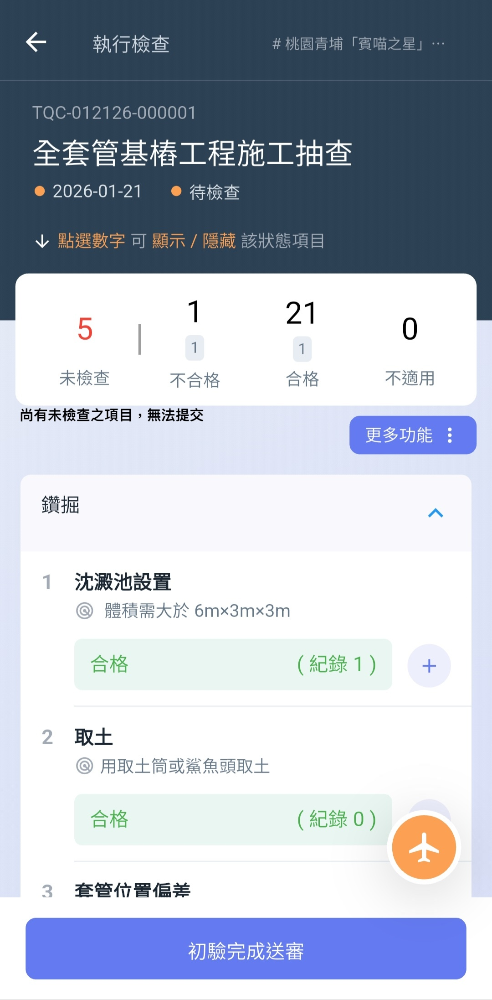 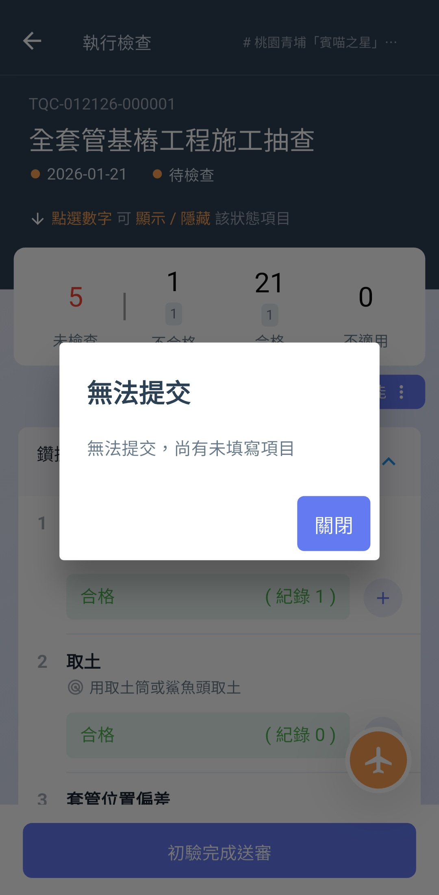 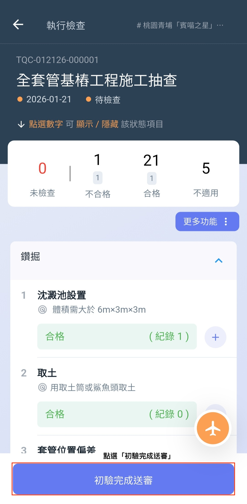

（一）將檢查送審後，該檢查工作之狀態即會由<kbd><mark style="color:blue;">**待檢查**<mark style="color:blue;"></kbd>轉為<kbd><mark style="color:yellow;">**初驗審核中**<mark style="color:yellow;"></kbd>。

1. 狀態轉為<kbd><mark style="color:yellow;">**初驗審核中**<mark style="color:yellow;"></kbd>後，原執行人員將無法再隨意修改檢查結果或紀錄內容。這確保了審核者所看到的數據與現場提交時是一致的，維持紀錄的嚴謹性與不可篡改性。
2. 此時，審核人員（如工地主任或專案管理人員）的待辦清單中會出現該筆任務，並查看您上傳的所有照片、圖面標示及實測數據。並獲得核定、退回的權限。

（二）在審核過程中，若審核人員（如工地主任 或 專案管理人員）認為檢查紀錄不夠詳盡、照片不清晰或判定結果有誤，可執行****退回****操作：

若審核人員將檢查紀錄退回，該檢查工作之狀態則會由<kbd><mark style="color:yellow;">**初驗審核中**<mark style="color:yellow;"></kbd>更改為<kbd><mark style="color:blue;">**修正中**<mark style="color:blue;"></kbd>。

1. 當狀態轉為<kbd><mark style="color:blue;">**修正中**<mark style="color:blue;"></kbd>時，系統會解除資料鎖定，重新開放編輯權限給原執行人員。執行人員可針對審核意見進行內容補正、更換照片或重新判定。
2. 執行人員修正完畢後，需再次點選「送交審核」，狀態將重新回到審核中，直到審核人員核定通過為止。
