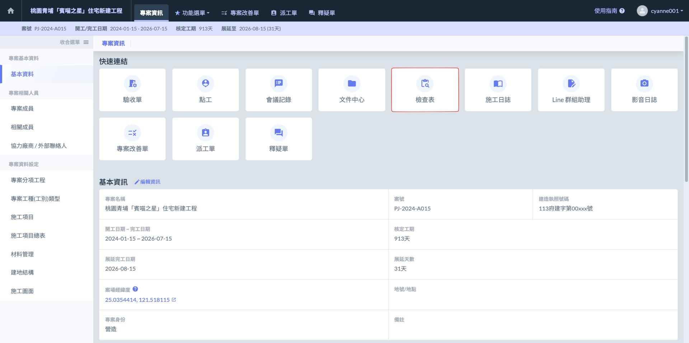

# 檢查表

在傳統營造工地的品質管理流程中，資訊往往存在於碎裂的紙本表單與通訊軟體群組中，導致「查驗紀錄」與「缺失改善」兩者之間存在巨大的斷層。Jobdone 檢查表系統的設計核心，在於將營造業最重視的一、二、三級品管邏輯，轉化為可隨時追蹤、不可篡改的數位工作流。這不僅僅是將紙本轉為電子檔，而是透過數位空間定位、時間戳記與責任歸屬，為每一項隱蔽工程建立起完整的數位履歷。無論是深達數十米的基樁工程，還是結構複雜的鋼筋籠製作，系統都能確保每一份紀錄皆具備高度的專業公信力。

***

營造實務中最具挑戰性的莫過於隱蔽工程的品質保留。Jobdone 開發了圖面標示功能，讓工程師能直接在施工圖面（如樁位圖、鋼筋詳圖）上進行精確打點，並將查驗紀錄掛載於特定的幾何座標上。

針對如全套管基樁的垂直度（標準值 < 1/200）或樁底沉泥量（標準值 < 5cm）等關鍵數據，系統提供「多筆紀錄」功能，允許在同一項目下記錄多個深度或不同方位的數據，輔以自動嵌入 GPS 座標與精準時間的浮水印照片。這種做法從根源上杜絕了「拿舊照充數」或「位置張冠李戴」的弊端，讓審核人員即使不在現場，也能透過一張張對應空間位置的影像，確認施工品質是否符合設計規範。

***

### 監造單位

對於監造單位來說，檢查表提供了以下功能：

✔ **審查乙方品質管理計畫：**&#x76E3;造單位可檢查並審核乙方提出的品質管理計畫，確保其符合項目需求。

✔ **查證材料與設備：**&#x7528;於核對乙方所提供的材料和設備，確保其符合規範與標準。

✔ **查核施工作業：**&#x76E3;造單位可檢查施工過程中的各項作業，確認施工質量和流程是否符合要求。

!!! tip
    此功能有助於形成完整的二級品管流程，確保施工質量的全程監控。
    
    此外，針&#x5C0D;**「公共工程」**&#x7684;建案，軟體也提供「**材料檢試驗**」功能，針對施工材料進行抽樣檢測並記錄結果，確保材料品質符合施工要求。

***

### 營造單位

對於營造單位來說，檢查表提供了以下功能：

✔ **自主檢驗作業程序：**&#x71DF;造單位可根據內部要求，對承攬商的作業流程進行自我檢查，確保各項作業符合規範。

✔ **內部工程細項檢驗：**&#x5305;括對施工材料、施工過程、以及各項品管要求進行內部檢查與驗證，確保工程品質達標。

!!! tip
    此功能有助於形成完整的一級品管流程，並確保施工質量在每個階段都能得到有效控制。
    
    此外，針&#x5C0D;**「公共工程」**&#x7684;建案，營造單位同樣可以使&#x7528;**「材料檢試驗 」**&#x529F;能，針對施工材料進行抽樣檢測並記錄結果，以確保材料符合施工要求。

