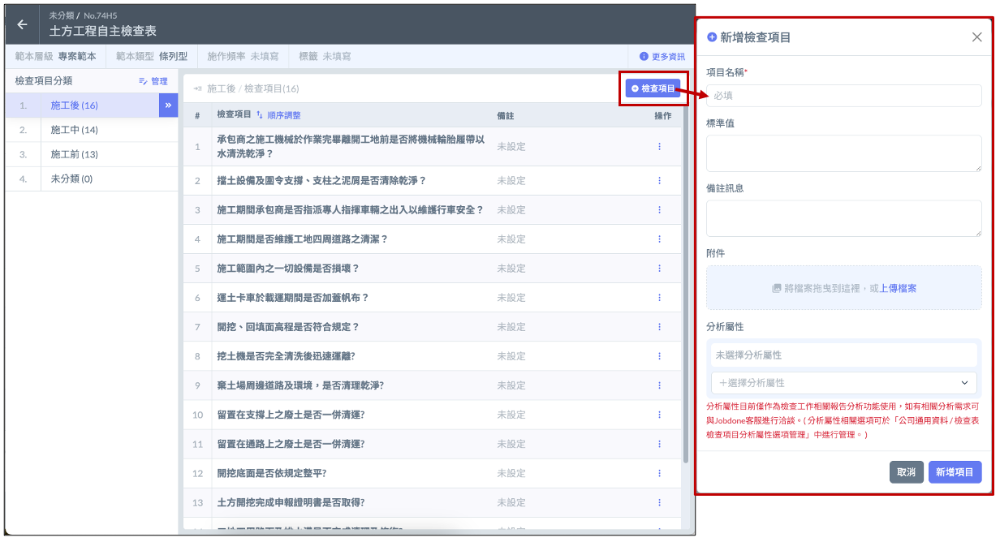
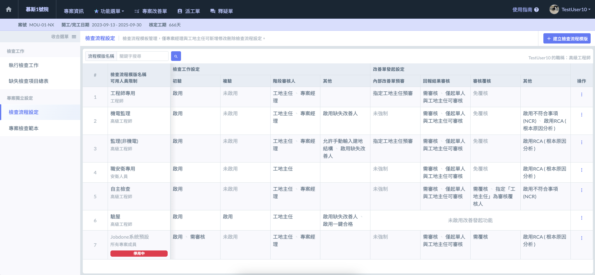
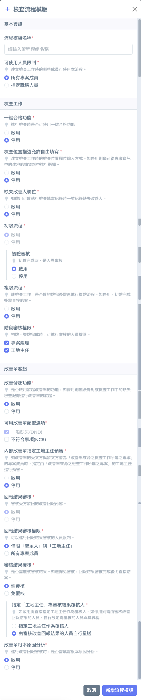

# 功能說明

---
description: Feature Description
---

# 功能說明

Jobdone 的檢查表系統專為多元工程情境設計，具備極高的泛用性。無論是一、二、三級品管的嚴謹稽核，或是現場的自主檢查與自動檢查，皆能透過系統進行彈性配置。

本系統最核心的優勢在於將『檢查表』與『改善單」』設計為兩個既能獨立運作、又能無縫串接的專業應用程式（AP）：

* 自動化關聯： 於檢查表中判定為「****不合格****」的缺失項目，可一鍵轉入改善單功能。
* 閉環式追蹤： 系統會自動指派負責人，並完整追蹤後續的「改善執行、現場回報、管理審核」流程，確保品質瑕疵確實歸零。

***

在開始執行這套數位化品質循環流程前，請先確認並了解以下四項關鍵設定，以確保流程符合專案需求：

**1. 檢查表範本 (Inspection Templates)**

預先建立各工序的檢查項目、判定標準與技術規範。良好的範本設定是現場人員產出高品質紀錄的基石。

**2. 檢查表流程 (Inspection Workflows)**

定義查驗後的簽核層級（如：初驗人提交 $$\rightarrow$$ 工地主任審核）。您可以根據不同工程類別，彈性設定是否需要進入「複驗循環」。

**3. 改善單 (Correction Orders)**

設定缺失改善單的格式與管理邏輯。包含缺失類型分類、嚴重程度分級，以及改善完成後的核定標準。

**4. 預設資料 (Default Data Settings)**

包含預設的負責廠商清單、常用人員權限及空間位置資料庫。完善的預設資料能大幅減少現場人員輸入文字的時間，實現「一鍵指派」。

 <strong>專案檢查表範本</strong>

檢查執行，要先有檢查表的範本，檢查表的範本，可以在公司層級設定也可以在專案層級設定。可以從Excel表匯入，也可以在網頁上編輯。Jobdone平台本身提供數百種範例，還在持續透過AI增加中。

!!! info
    檢查表可以設定與專案角色的關係，指定只有相關角色的人才能啟用某些檢查表。

<strong>檢查表流程設定</strong>

檢查表在執行時，可以選擇不同的<kbd>檢查﹥改善</kbd>流程，以因應不同的角色的檢查。流程可以預先設定並命名，讓執行者可以清楚了解。系統會預設一個基本的流程，若沒有自行定義，會以預設帶入。

 

<strong>改善單流程</strong>

改善單是一個完整且嚴謹的缺失管理系統，整合了營建品質管理中常見的 DND 與 NCR 兩套流程。系統會根據缺失的嚴重程度，自動引導至對應的處理路徑：

**1. 一般缺失 DND (Deficiency Notice & Disposition)**

適用於現場較小、可立即執行修正補救的瑕疵。

* **流程特性：** 採直接整改、直接回報模式。
* **回報重點：** 負責人執行整改後，須詳實回報改善紀錄，內容包含：
  * 矯正措施： 針對現況缺失所做的具體修正。
  * 原因分析： 探討缺失發生的根本原因。
  * 預防再發生： 提出未來避免同類缺失重複出現的對策。

**2. 不符合事項 NCR (Non-Conformance Report)**

適用於結構性、安全性或較嚴重的品質違規，需進行跨單位討論之問題。

* **流程特性：** 採「先規劃、後執行」模式。
* **回報重點：** 負責人無法立即修補，必須先提出改善計畫書，經由工地主任或監造單位審核確認方案可行後，方可依照計畫執行整改並提交最後的改善紀錄。

***

為了方便使用者快速定位待辦事項，改善單列表分為兩個維度：

* <kbd><mark style="color:blue;">**專案改善單**<mark style="color:blue;"></kbd> **(Project-wide List)**
  * **全域視角：** 顯示該專案下所有成員發出的改善項目。
  * **執行用途：**&#x9069;合專案管理人員或工地主任統覽整體施工品質現況，監督各分包商的整改效率。
* <kbd><mark style="color:blue;">**我的改善單**<mark style="color:blue;"></kbd>**&#x20;(My Personal Tasks)**
  * **個人視角：** 僅顯示「分派給自己」/「由自己發派」負責的改善工作。
  * **執行用途：**&#x65B9;便第一線工程師或分包商領班集中火力處理手頭上的待辦任務，落實責任制管理。

<strong>預設資料</strong>

為了確保檢查表功能發揮最大效益，且完整的前置資料能提升現場查驗的速度，實現「自動化對位」與「責任閉環」，在開始建立檢查工作前，請務必確認以下核心資料已於系統中建置妥當。

**一、專案成員 (Project Members & Roles)**

專案成員是所有流程的執行主體。請在系統中預先建置成員名單、權限及職稱等。

有關專案成員之詳細編列說明，請參閱 ➙ [team-members](../../project_level/project_stakeholders/team-members "mention")

<table><thead><tr><th width="122.88330078125">操作</th><th>說明</th></tr></thead><tbody><tr><td>定義人員角色</td><td>在執行檢查時，可區分檢查人（第一線執行）、審核人（工地主任/專案經理）、缺失責任人、檢查範本及流程<mark style="color:yellow;"><strong>可使用之特定職稱人員</strong></mark>等。</td></tr><tr><td>權限精確控管</td><td>確保合適的人員擁有對應的編輯、審核或結案權限，避免非權限人員異動檢查數據，維持資料的嚴謹性與不可篡改性。</td></tr></tbody></table>

***

**二. 分項工程 (Sub-item Works / Work Packages)**

分項工程是品質數據的分類核心，決定了檢查表範本的應用範圍與統計維度。

有關分項工程之詳細編列說明，請參閱 ➙ [zhuan-an-fen-xiang-gong-cheng](../../project_level/project_data/zhuan-an-fen-xiang-gong-cheng "mention")

<table><thead><tr><th width="125.347900390625">操作</th><th>說明</th></tr></thead><tbody><tr><td>結構化分類</td><td>依據施工計畫書將工程劃分為如「基樁工程」、「鋼筋工程」、「混凝土工程」等分項。這能讓現場人員在建立檢查時，快速篩選出對應的範本，達成自動化對位。</td></tr><tr><td>精準對應範本</td><td>當分項工程建置妥當後，系統可預設特定分項僅能使用特定的檢查表範本，有效降低人員選錯表格的機率，確保查驗內容百分之百符合技術規範。</td></tr></tbody></table>

***

**三、 協力廠商 (Subcontractor Management)**

在營建品管實務中，缺失必須明確落實至施工單位。

有關協力廠商與外部聯絡人之編列，請參閱 ➙ [subcontractor](../../project_level/project_stakeholders/subcontractor "mention")

<table><thead><tr><th width="185.4459228515625">操作</th><th>說明</th></tr></thead><tbody><tr><td>協力廠商 / 外部聯絡人</td><td>凡涉及特定分項工程（如模板、鋼筋、水電）之檢查，皆需在系統中預先建立對應的協力廠商資料庫。這些資料將作為檢查表中「缺失責任人」、「缺失改善人」的選取來源。</td></tr><tr><td>責任廠商指派</td><td>在執行檢查時，若特定項目判定不合格，系統將要求連結「缺失責任人」、「缺失改善人」。正確的廠商名稱與對應之聯絡人，能確保系統在發現缺失時，第一時間透過『改善單功能』請廠商進行整改，達成高效的協作處理。</td></tr></tbody></table>

***

**四、 建地結構與空間定位 (Construction Structure & Location)**

準確的位置標註是品管大數據分析的基石。

有關專案建地結構資料之編列，請參閱 ➙ [建地結構](https://docs.jobdone.cc/user_guide/cpm/project_level/project_data/construction_structure)&#x20;

<table><thead><tr><th width="169.38916015625">操作</th><th>說明</th></tr></thead><tbody><tr><td>結構資料填寫</td><td>專案啟動前，應完成建地結構的空間單元。這些資料將輔助檢查人員在查驗時，從下拉選單中精確選取位置。</td></tr><tr><td>位置標記與精確對照</td><td>結構資料能幫助檢查人員快速對應設計圖說。若涉及具體結構位置之缺失，系統將利用這些預設資料進行精確標註，確保後續整改人員能準確定位問題點。</td></tr></tbody></table>

***

**五、 施工圖面 (Drawing Management)**

圖面是檢查人員在現場最重要的參照工具與標示載體。

有關施工圖面資料之編列，請參閱 ➙ [施工圖面](https://docs.jobdone.cc/user_guide/cpm/project_level/project_data/construction_drawings)

在建立檢查工作時，系統允許從已上傳的施工圖庫中選擇相關圖紙。查驗人員發現缺失時，可直接於電子圖面上進行標註（Pinning），實現「圖文對照」的直觀紀錄。

***

**六、專案檢查範本 (Inspection Template)**

**七、檢查流程 (Inspection Workflow)**

!!! danger
    以上所述之七項核心設定，包含前述的『檢查範本 (Inspection Template)』與『檢查流程 (Inspection Workflow)』，皆為執行專業自主檢查時不可或缺的基礎資料。為確保檢查表功能順暢運行並發揮最大效益，在正式啟動現場查驗作業前，應務必完成相關前置資料的建置。

