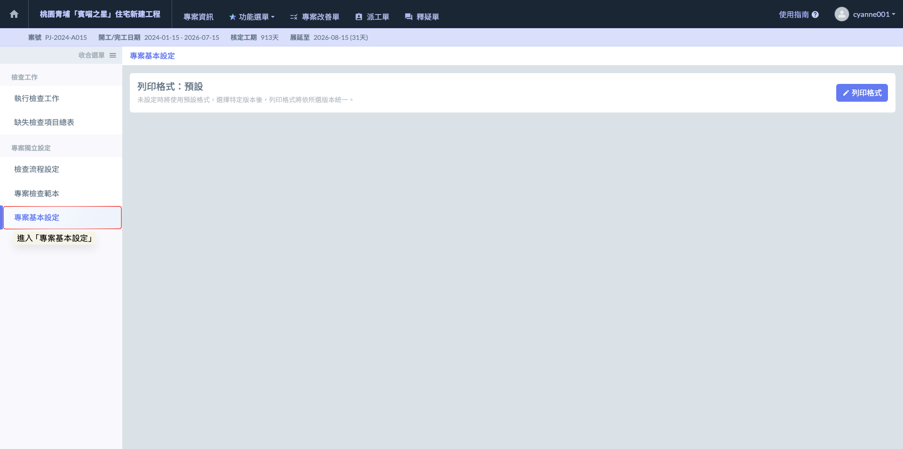
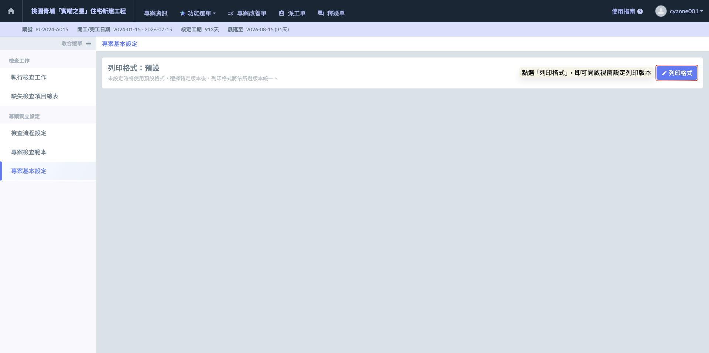
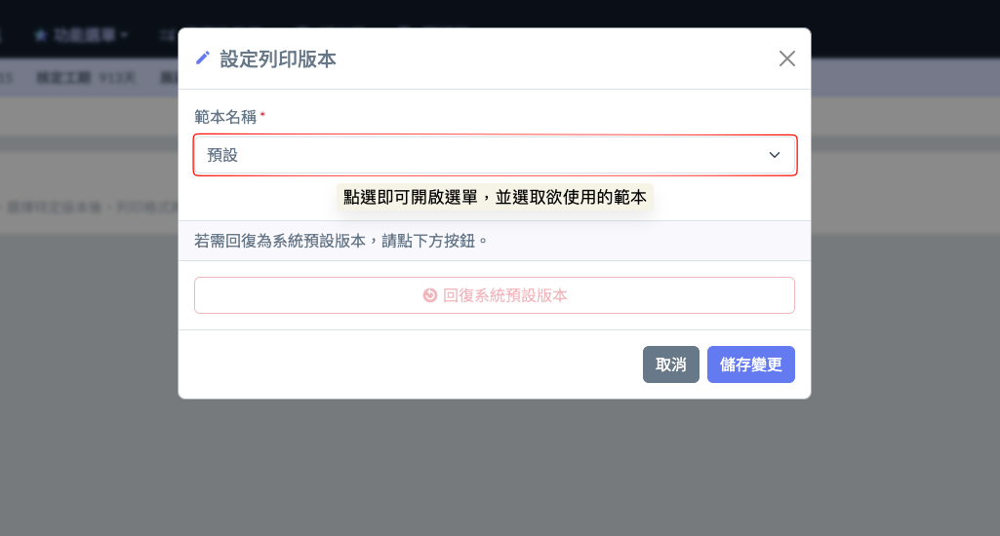
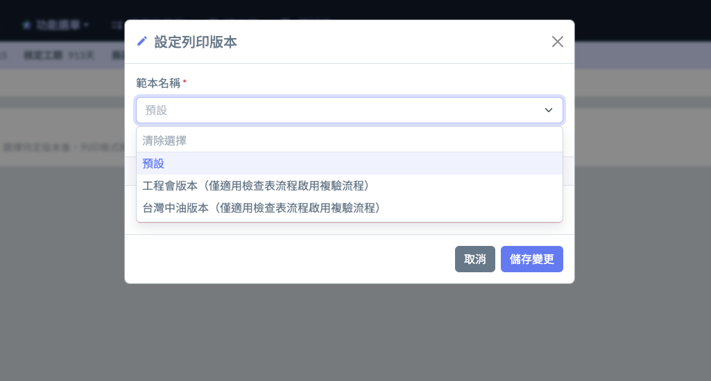

# 專案基本設定

<kbd><mark style="color:red;">**您不再需要手動調整表格，只需專注於現場的品質管控，剩下的文書作業交給 Jobdone。**<mark style="color:red;"></kbd>

Jobdone 系統不僅實現了查驗流程的數位化，更能將現場檢查結果無縫轉化為各類發包單位（業主）所需的正式文件格式。這意味著承包商無需再指派專人進行二次作業（打字、排版）—— 如：將手機照片下載後再貼入 Word、手動輸入缺失描述與位置等。達成「現場檢查完，報告即產出」的自動化目標。

專案經理可於『專案基本設定』中，依照當前建案的業主屬性，預先設定最合適的列印模板，目前提供以下三種版本：



適用於私人建案或營造廠內部自主品管，介面直觀，圖文並列清晰。



嚴格遵循公共工程委員會之自主檢查表格式。

> ※ 限制規範： 由於工程會報表需呈現「缺失、改善、複驗」之完整邏輯軌跡，故僅在該檢查流程啟用『複驗流程』時方可選用。



針對中油標案所要求的特殊查驗套表所製。

> ※ 限制規範： 同樣須於啟用「複驗流程」之情境下適用，確保紀錄符合業主稽核標準。



為了服務接洽不同單位標案的承包商，Jobdone 致力於將各家公司的「套表規範」數位化。未來將持續針對以下單位開發專屬格式：

* **公用事業：** 自來水廠、台電 (TPC)、台鐵 (TRA) 等專屬報表。
* **各縣市政府：** 針對台北市、新北市等地方政府公共工程之些微格式差異進行優化。

!!! info
    #### 價值
    
    此功能的核心在於「數據結構化」。由於現場工程師在檢查時已依照系統規範選取位置、判定結果並上傳照片，系統會自動將這些數據填入對應的表格欄位中：
    
    * **自動帶入：** 包含檢查日期、位置、檢查項目、初/複驗結果、照片說明及審核人員簽名。
    * **合規上報：** 現場檢查完成後，即可即時產出符合規範的 PDF 報告。承包商能完美地將檢查結果自動套入各家公司所需的格式，大幅提升報表上報的速度與專業度，降低行政文書成本，並確保上報資料的正確性與即時性。

若需切換或預設專案的報表輸出格式，請依照以下步驟執行：

如圖二，進入專案基本設定頁面後，請點選右上方之  圖示，即可開啟視窗並設定列印版本。

如圖三、圖四，開啟設定列印範本視窗後，點選<kbd>**範本名稱**</kbd>欄位即可開啟選單，選取欲使用的範本。

 

