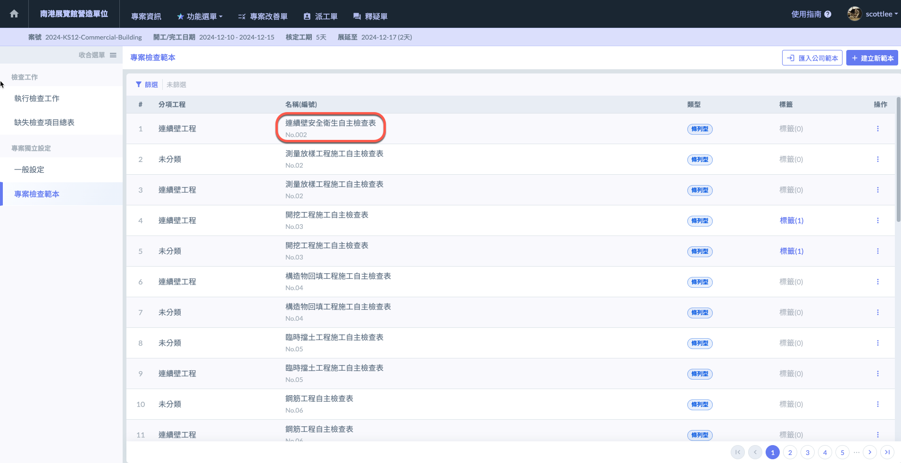
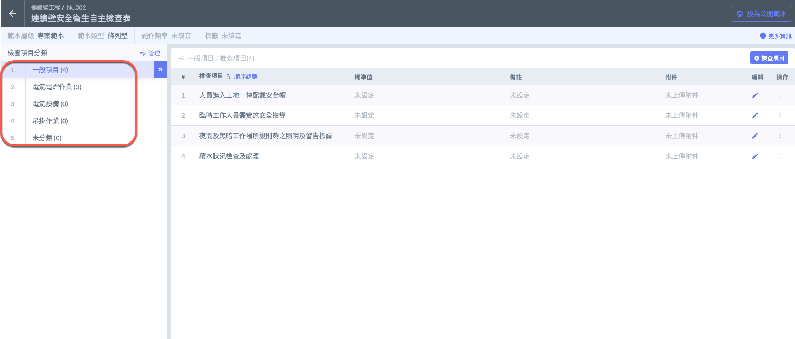
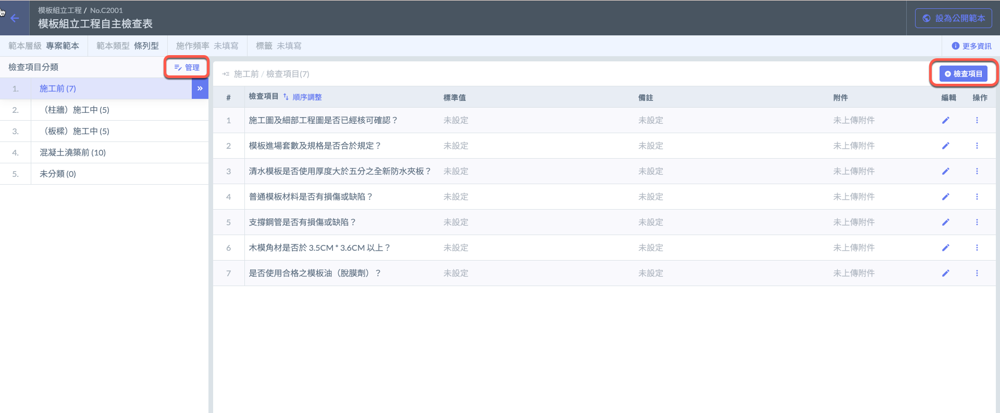
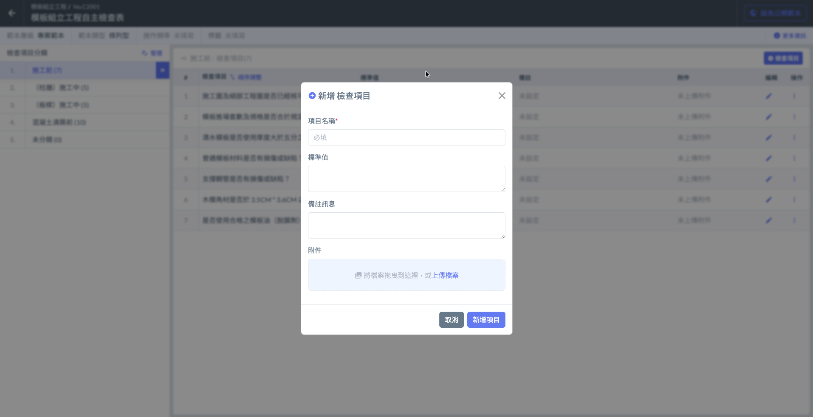

# 建立 / 修改範本檢查內容

## 編輯細部內容



### 點擊檢查表

由此進入編輯頁面




### 點擊檢查項目分類之「管理」

您可針對檢查項次編輯。如施工前、施工中、柱牆、板樑、支撐等。

例如：以連續壁工程之安全衛生自主檢查表來說大致有以下幾個項次：

1. 一般項目
2. 電氣焊接作業
3. 電氣設備
4. 吊掛作業




### 點擊「檢查項目」

針對該檢查項次編輯內部之檢查項目。

例如：以模板組力工程自主檢查表之施工前來說概略有以下幾個項目：

1. 施工圖及細部工程圖是否已經核可確認？
2. 模板進場套數及規格是否合於規定？
3. 清水模板是否使用厚度大於五分之全新防水夾板？
4. 普通模板材料是否有損傷或缺陷？
5. 支撐鋼管是否有損傷或缺陷？
6. 木模角材是否於 3.5CM \* 3.6CM 以上？
7. 是否使用合格之模板油（脫膜劑）？&#x20;



