# 檢查工作相關

---
description: Inspection Tasks
---

# 檢查工作相關

在 Jobdone 系統中，『檢查工作』是落實施工品質控管的執行核心。當管理人員完成「範本」與「流程」的預設後，現場人員即可針對各分項工程展開標準化的數位查驗作業。本模組將查驗週期完整拆解，確保從發起、回報、缺失追蹤到最終報表產出，皆具備嚴謹的數位軌跡與責任歸屬。

為了協助您快速掌握各階段的操作要領，本說明將分為以下分頁進行詳細指引：



選定對應範本與流程，定義施工位置，啟動查驗任務。



現場查驗判定、照片留存與標準值比對，提交初步紀錄。



若初驗結果為 NG，針對缺失改善成果進行二次查驗與紀錄。



由工地主任或專案管理人員針對初/複驗回報內容進行核實簽認。



根據設定之範本格式（如工程會、中油版），一鍵產出正式報表。



***

### 01｜新增檢查工作

如圖一，進入執行檢查工作頁面後，點選右上方之  圖示，即可開啟視窗填寫檢查資訊。

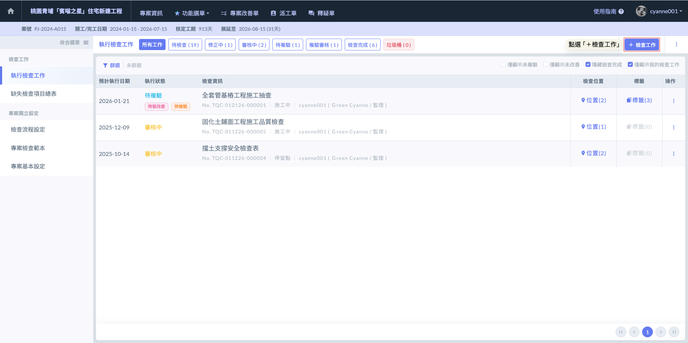

如圖二，開啟視窗後，會需要請您先選取該檢查需用到的『檢查流程』，再選取欲執行的『檢查範本』。



此欄位決定了此次檢查工作的『簽核路徑』、『結案邏輯』及『缺失改善流程』。例如：此次檢查是否需要工地主任審核？若判定不合格是否進入複驗？缺失改善單結果審核與覆核？透過選取正確的流程，系統將自動啟動對應的品管防護機制。

有關檢查流程之編列與設置說明，請參閱 ➙ [jian-cha-liu-cheng-she-ding](../../qc--1/jian-cha-liu-cheng-she-ding "mention")



此欄位決定了該檢查工作的『檢查內容』及其下的標準值、附件等詳細資訊。選定範本後（如：鋼筋工程自主檢查表），系統會自動帶入該範本內建立好之所有檢查要點、標準值與參考圖說，確保現場人員能依照規範進行逐項確認。

有關檢查範本之新增與細部檢查項目之編列，請參閱 ➙ [zhuan-an-jian-cha-fan-ben-yi-hou-yao-yong-de](zhuan-an-jian-cha-fan-ben-yi-hou-yao-yong-de "mention")



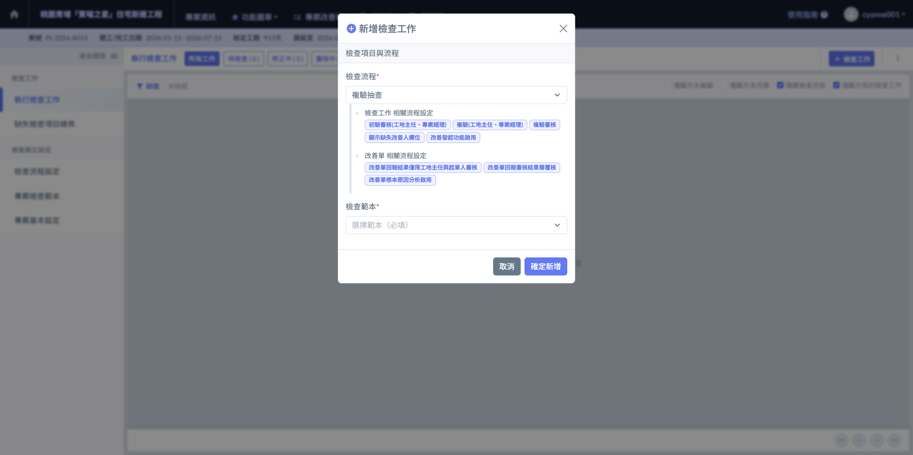

在定義檢查工作的內容時，系統提供強大的搜尋與篩選機制，確保您能在眾多工項中快速定位所需的表單：

點選『檢查範本』欄位，即可開啟範本選擇視窗，可透過篩選器，在所有專案檢查範本中選出欲使用的範本。

設定好篩選條件後（可依照：分項工程、名稱、類型、標籤進行過濾），點選下方之  按鈕，即可於符合條件的範本列表中查看所有項目，並點選欲使用之範本。

選取完畢並確認無誤後，即可點選右下方之 ，系統將開啟『檢查項目分類』欄位，讓您選取該範本內此次檢查工作會使用到的檢查分類（例如：鋼筋籠製作、鋼筋籠吊放等相關檢查）。

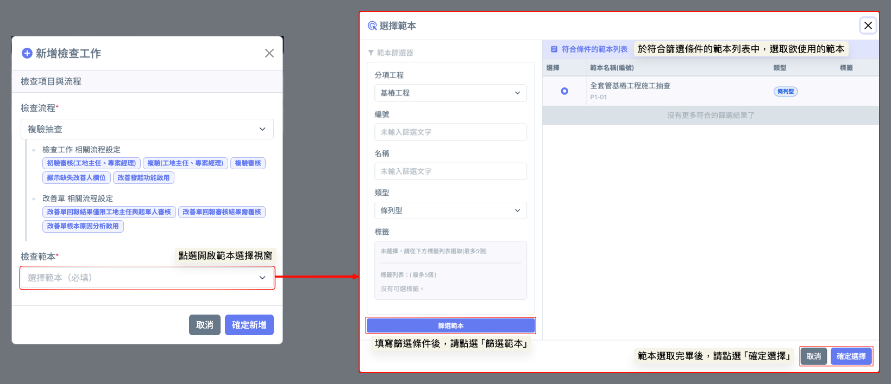

如圖四，在進入正式查驗前，您可以依據現場實際的施作進度，靈活勾選本次需要檢查的範疇，以選定好欲使用的分類（每筆分類內皆包含您預先建立好的檢查項目）。

：表示該檢查項目分類已被選進此次檢查工作中。

：表示該檢查項目分類未被選進此次檢查工作中。

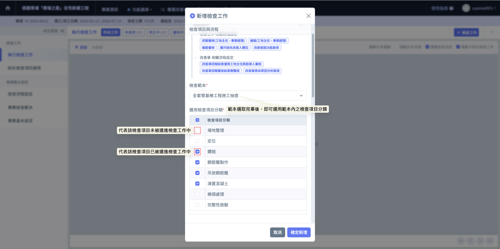

如圖五，將檢查項目與流程填寫完畢後，接下來是填寫檢查工作資訊，包含：檢查工作名稱、檢查人、預計執行日期及檢查時機。



建議採用具識別性的命名（如：A棟3F柱筋綁紮自主檢查），便於後續在清單中快速檢索。



系統預設為發起人，亦可指派其他具權限之現場工程師負責執行，確保責任歸屬明確。



設定預計進行查驗的時間，便於管理階層掌握各工項的品質查驗進度。



此欄位是品質計畫控管的核心，幫助判斷該次檢查的性質與重要程度：

* 不使用： 適用於一般性或非計畫性的簡易紀錄。
* 施工前： 著重於材料進場檢驗（如：鋼筋、混凝土出廠證明核對）或放樣確認。
* 施工中： 用於工序間的查核，確保各施工步驟符合施工圖說規範。
* 停留點 (Hold Point)： 最重要的管制節點。依規定必須經由特定人員（如監造方或專案經理）查驗合格後，方能進行下一道工序（如：灌漿前檢驗、耐壓試驗）。
* 施工後： 針對完成品進行驗收、尺寸量測或自主查驗。
* 隨機抽查： 用於主管巡檢或非常態性的品質稽核，確保現場隨時維持施工水準。



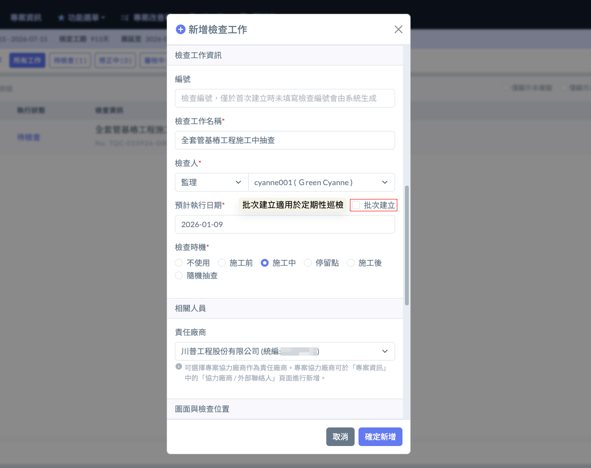

為了讓查驗人員在現場能即時比對設計規範，並在報告中呈現精確的圖文對照，您可以在建立檢查工作時預先選定相關圖面：

如圖六，於『檢查可能使用圖面』欄位，點選  圖示，即可開啟視窗選擇施工圖面。

開啟視窗後，可透過篩選器（依據：圖號、圖面名稱、分項工程、圖面性質、相關建地結構）於專案內之所有施工圖中篩選符合條件者，並於篩選結果列表中，選取本檢查會使用到的圖面。

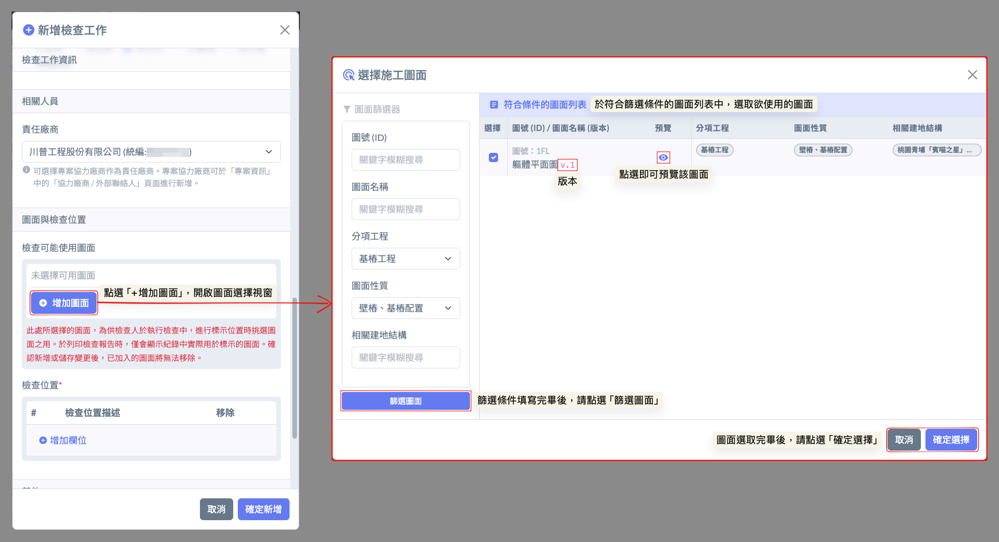

在營建品管中，明確的施工空間標註是數據分析與缺失追蹤的基礎。Jobdone 系統要求檢查位置必須與專案預設的建地結構完全對接，以維持資料的一致性：

如圖七，檢查位置是依據專案資訊中的『建地結構資料』進行選取。點選  圖示即可新增檢查位置，系統採一次一筆的方式選取，若本次檢查涵蓋多個空間，可重複點選以新增多筆位置。

!!! info
    透過強制從建地結構選取，可避免人員手動輸入造成的名稱分歧，讓後續統計各區域合格率時更加精確。

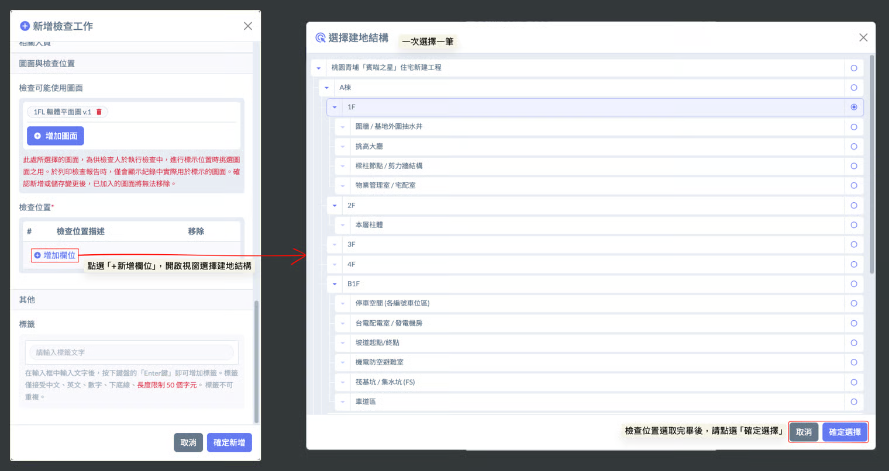

如圖八，完成上述範本、流程、資訊、圖面及位置的設定後，點選最下方之 ，系統即正式建立該筆檢查工作，您可於檢查列表中開啟該項目並開始執行現場查驗。

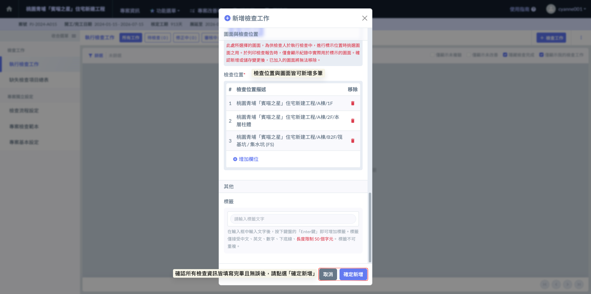

完成畫面如下：

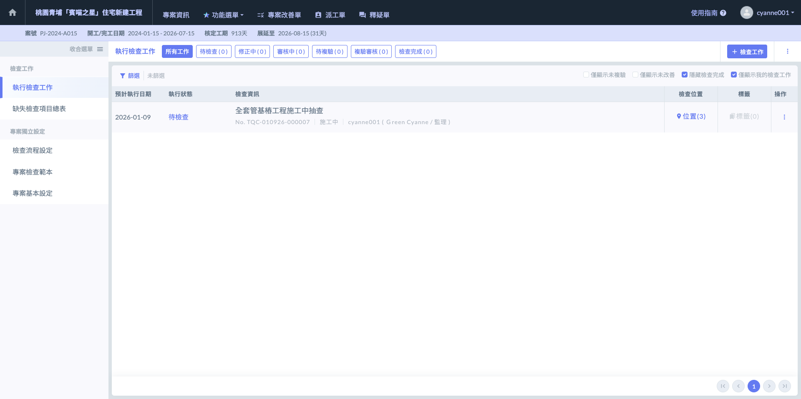

***

### 02｜批次建立（自動檢查表）

針對需要大規模巡檢或具備規律性的查驗項目（如：每日自動檢查、每週環境巡檢、大規模基樁查驗等），Jobdone 提供了強大的『批次建立功能』，協助管理人員快速完成任務佈署，毋須重複執行單一建立的繁瑣動作，也因此大幅簡化重複性的行政作業。

> **實務建議：**
>
> * 定期性巡檢： 此功能極度適合用於如「每日環境巡檢」、「每週職安檢查」或「每月設備定期保養」等工作。管理員只需設定好一次範本與流程，並在日期欄位批次選填未來一週或一個月的執行日，系統便會預先產出所有檢查清單，確保品管計畫不遺漏。
> * 標準化作業複製： 透過批次建立，現場人員無需逐日重複填寫相同的檢查資訊（如名稱、檢查人、範本），僅需在預定日期到達時進入對應的紀錄進行執行即可。這不僅提升了管理效率，更能確保定期檢查任務的連續性與完整性。

在批次建立過程中，您可以統一設定這些檢查工作的「分項工程」、「檢查人」及「審核流程」等相關資料。系統會將這些設定自動套用至批次生成的每一筆紀錄中，確保設定的一致性。

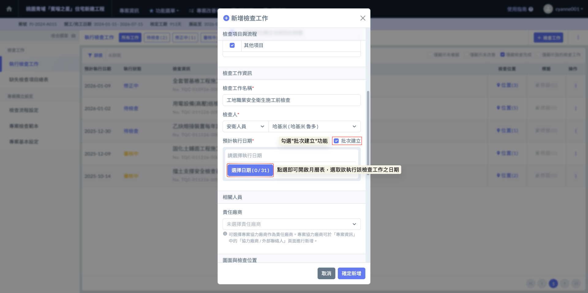

如圖十一，批次建立功能適用於填寫『預計執行日期』時。您可以一次選定多個日期（最多選取31天），系統將會依據您選取的日期數量，自動複製並產生相對應的多份檢查工作。

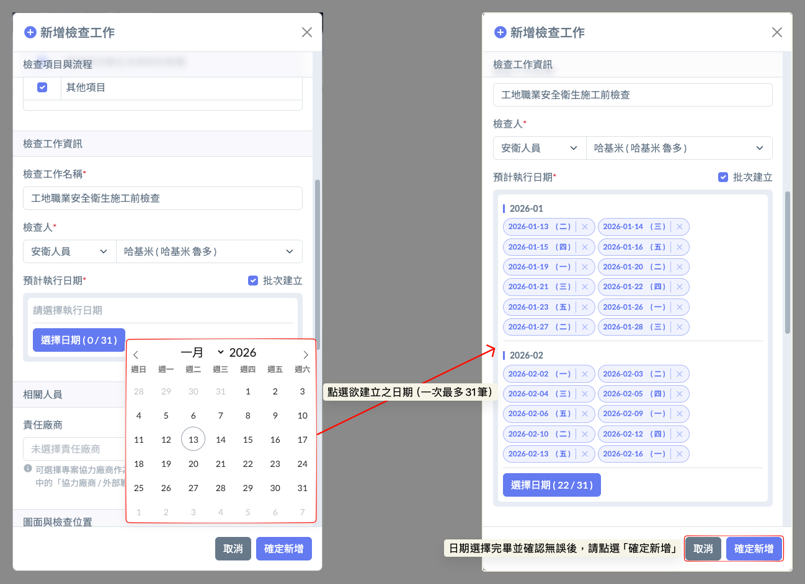

完成畫面如下：

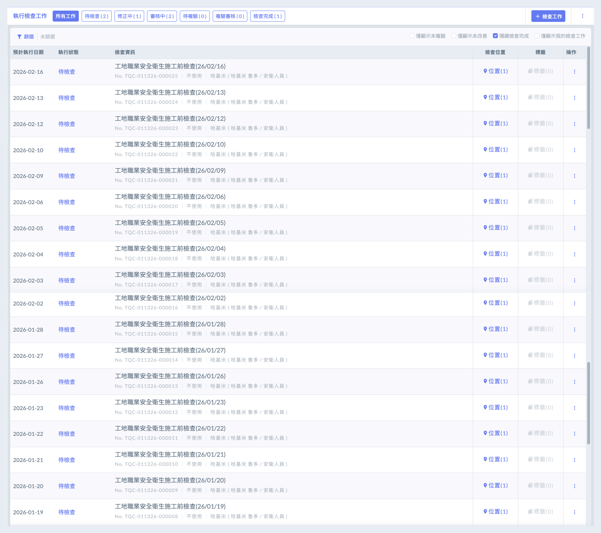
