# 列印檢查報告

---
description: Export
---

# 列印檢查報告

在品質管理流程中，「報表」是展現管理成果最直接的載體。Jobdone 提供了極具彈性的列印機制，讓您能針對不同的對象與時機，產出最具公信力的工程文件：

**1. 全生命週期的即時列印 (Real-time Reporting)**

Jobdone 突破了傳統系統必須結案才能產製報表的限制。檢查報告可在任何執行狀態下進行列印，無論是『待檢查』、『審核中』還是『檢查完成結案』階段，系統皆支援即時產出。這代表您隨時可以根據需求，匯出初驗報告、複驗進度報告，甚至是最終上報用的結案查驗單。

> **實務範例：**&#x5728;現場查驗完畢但尚未送審前，即可先產出草稿報表供領班參考；或在複驗過程中，產出中間進度報告回報業主，確保資訊同步。

***

**2. 多元格式與智慧型模式選擇 (Flexible Layout & Intelligent Options)**

為了適應公共工程、民間建築或是企業內部稽核等不同報表需求，系統不僅提供多種標準化列印格式，更可針對細節進行模式化調整：

系統會因選取的格式不同，在列印時提供多元的自定義模式選擇，確保報表呈現最符合您的實務需求。以**Jobdone 預設**之列印格式來說，其細節調整大致包括：

<table><thead><tr><th width="210.869140625">模式</th><th>說明</th></tr></thead><tbody><tr><td>
親簽欄位編列 

(Digital &#x26; Manual Signature)
</td><td>
可自由決定是否要在報表末端預留手寫簽名空間，或是直接帶入系統的數位簽章歷程。

<h4>補充</h4>
<strong>1. Jobdone 預設格式：高度靈活的彈性編輯</strong>

在一般的企業內部查驗或民間建案中，系統提供最彈性的編輯空間。 「在 Jobdone 預設的標準格式下，系統允許您根據公司內部的審核層級，<mark style="color:red;"><strong>彈性自行編輯親簽欄位</strong></mark>。無論是需要一級或二級簽認，皆可依照您的管理流程進行編排。」

<strong>2. 公共工程案格式：嚴格遵循官方範本</strong>

針對政府公共工程案，系統採取「標準化優先」原則。 若選用公共工程會範本，系統將<mark style="color:red;"><strong>關閉欄位編輯功能，完全依照工程會要求的官方格式產出</strong></mark>。簽名欄位將固定編列為『工地主任』及『現場施工人員』等法定職位，確保報表送交稽核時完全合規，不因格式錯誤被退件。

<strong>3. 特定業主需求（如：中油、公營事業）：精確對位職稱要求</strong>

不同的大型公營事業對報表簽認有其特定的行政文化與合約要求，Jobdone 亦針對此類需求進行客製化適配。 「針對特定業主（如中油案），報表格式將<mark style="color:red;"><strong>依照其合約規範進行嚴格鎖定</strong></mark>。例如，最後的簽核欄位會根據其要求，精確顯示為『協力廠商』、『建造工程師』及『建造主任』等特定職稱，確保報表產出即符合驗收標準。」

</td></tr><tr><td>
不適用項目顯示/隱藏 

(NA Items Visibility)
</td><td>針對該次查驗「不適用 (N/A)」的項目，可選擇顯示以求完整，或隱藏以簡化內容。</td></tr><tr><td>
無資料欄位自動隱藏 

(Hide Empty Fields)
</td><td>若某些檢查紀錄未填寫數值（非必填項），系統可自動隱藏該欄位，避免報表出現過多空白，維持版面美觀。</td></tr><tr><td>
描述/意見隱藏 

(Toggle Descriptions)
</td><td>視對象決定是否呈現細部的備註與文字描述。例如給業主的最終報告可選擇隱藏內部溝通的描述，僅呈現判斷結果與影像。</td></tr></tbody></table>

***

### **01｜**&#x5982;何列印？

如圖一，進入執行檢查工作頁面後，於檢查工作列表中選取欲列印之檢查工作，點選該筆項目即可進入檢查單內部詳情，準備執行列印作業。

!!! info
    #### 操作補充
    
    1. 在進入列表時，您可以利用系統上方的篩選器（如：依分項工程、檢查位置、檢查工作、檢查人或標籤等），快速過濾出目前需要的任務。並且利用執行狀態頁籤，找出不同狀態下之檢查。
    
    如：篩選「已結案」的機具檢查表（檢查人：/ 檢查圖號：），或「待複驗」的鋼筋工程表（檢查時機：/ 檢查位置：）。
    
    2. 誠如前述，您不一定要等到「檢查完成」才能點入。即使任務目前處於「待檢查」或「審核中」，只要您點選進入該檢查單，同樣可以進行列印，方便產出階段性的進度報告。
    3. 進入檢查單詳情後，建議在執行列印前先快速瀏覽各項檢查點與改善紀錄。確認照片已同步完成且數據填寫無誤後，再點選  圖示，可確保產出的報表最為完美。

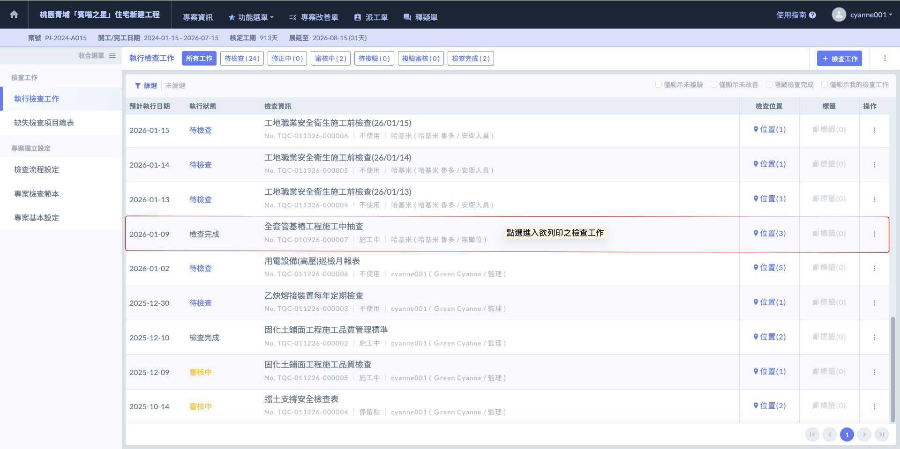

如圖二，進入檢查單內部後，點選右上方的  圖示，系統即會開啟預覽視窗。您可以於此查看列印預覽，並根據實際需求選用合適的列印模式。

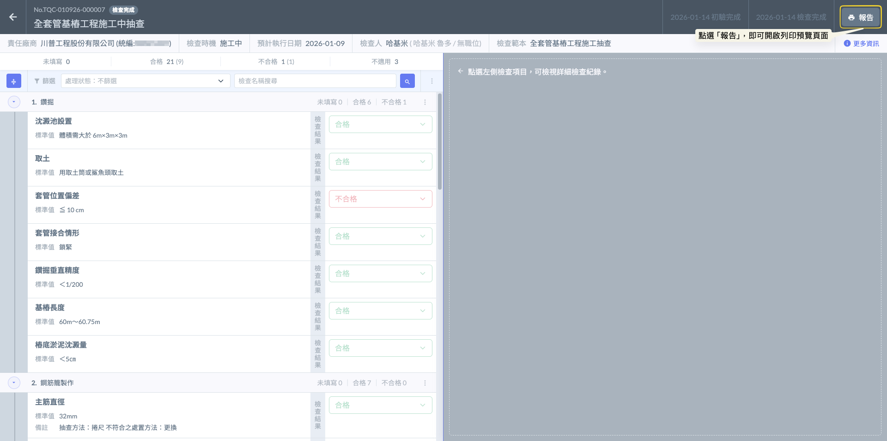

***

### **02｜**&#x5217;印功能說明

檢查報告提供以下列印選項，選擇想要的模式：

#### **02 - 1｜公司名稱**

* **功能：**&#x9078;擇是否在報告開頭顯示公司名稱（顯示/隱藏）。
* **應用：**&#x6B63;式對外文件通常開啟，內部討論草稿則可視需求隱藏。

公司名稱之顯示與隱藏範例如下：

!!! info
    #### ❗請注意
    
    此項自定義功能****僅限於 Jobdone 預設之列印格式****提供。若選用特定業主（如公共工程會、中油等）之專用範本，則不提供此開關切換。
    
    **為什麼這樣設計？**
    
    * Jobdone 預設格式（通用型）： 針對民間建案或公司內部自主管理，系統提供最高靈活性。您可以自由決定是否掛載公司 Logo 或名稱，方便您將報告用於跨單位的簡報或內部存檔。
    * 公共工程/特定業主格式（合規型）： 由於公共工程會或公營事業（如中油）對於報表表頭有嚴格的法定格式要求，包含專案名稱、契約編號等皆有固定位置。為了確保產出的報表絕對合規（Compliance），系統會鎖定該範本的表頭資訊，不允許使用者隨意隱藏公司名稱或修改配置，以防止因格式不符而被監造單位退件。

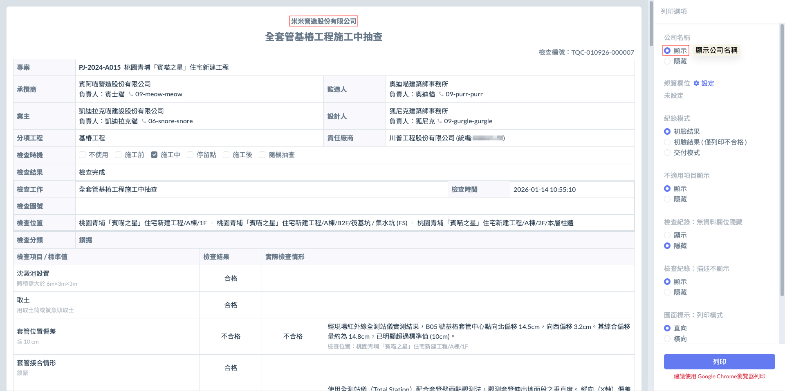 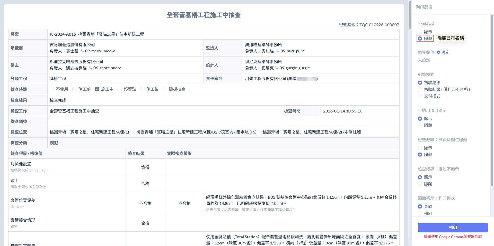

***

#### **02 - 2｜親簽欄位**

* **功能：**&#x81EA;行編列，可輸入欲簽合檢查報告的人員職稱（如：工地主任、品管工程師、現場監造、工程師等）。
* **應用：**&#x5728; Jobdone 預設格式下，此選項提供極高彈性，確保報表符合貴司內部的簽核流程。

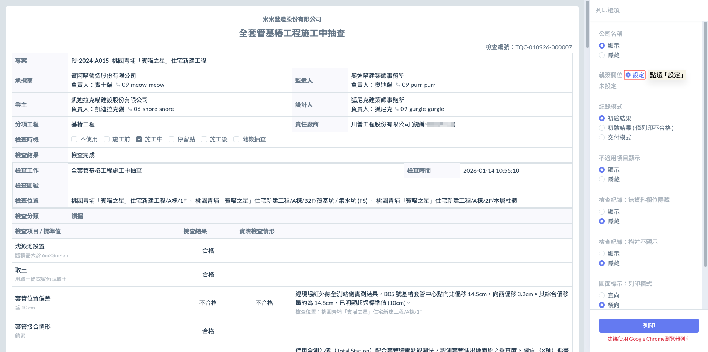

如圖七所示，開啟親簽欄位設定視窗後，點選  按鈕，即可手動填寫欲簽名人員之職稱（如：工地主任、品管工程師、現場施工人員等）。

確認所有欲簽名之欄位職稱皆填寫完畢後，即可點選  按鈕。系統即會將您新增的欄位同步反映在（檢查結果）報表末端（檢查紀錄前）的簽認區塊中。

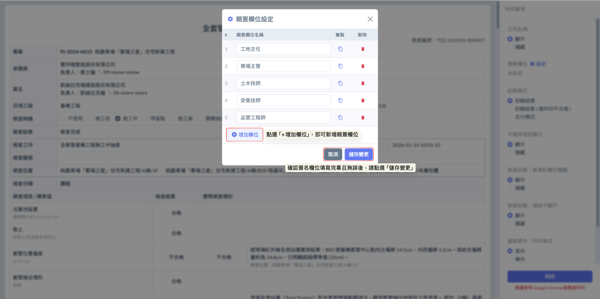

完成畫面如下：

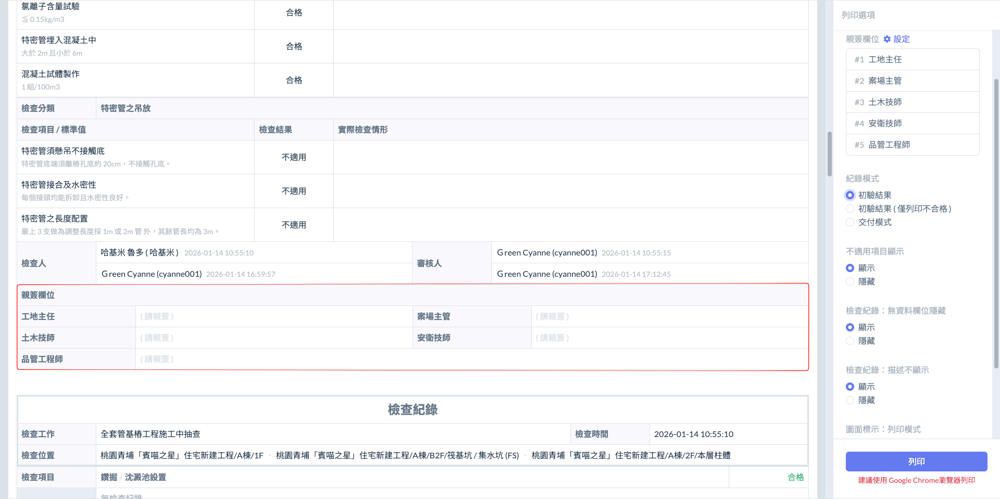

***

#### **02 - 3｜紀錄模式**

為了滿足工程各階段的呈報需求，系統在產出報告時提供三種**紀錄模式**。透過這些模式，您可以靈活決定如何呈現查驗過程中的合格與不合格項目：



* **呈現邏輯：** 完整輸出當次檢查的所有原始紀錄，不論判定結果為合格或不合格，皆會忠實呈現初驗時的數據與照片。
* **適用情境：** 用於內部初查或當日進度匯報，讓管理人員掌握最原始的施工現場品質現況。



* **呈現邏輯：** 系統會自動過濾掉合格項目，僅針對判定為「不合格」的紀錄進行排版輸出。
* **適用情境：** 用於缺失改善會議或派發整改通知。這能讓分包商或負責人一目了然需要處理的問題點，避免被大量的合格資訊干擾，提高溝通效率。



這是最關鍵的專業輸出模式，具備智慧過濾與狀態轉換邏輯，確保呈交給業主或監造的報表是「最終合格」的狀態。其運作邏輯如下：

* 若某筆不合格紀錄下方已附帶複驗紀錄，系統會自動在報表中顯示複驗的數值與照片，並將該紀錄的最終狀態標記為「合格」。
* 若該不合格紀錄尚未完成複驗（即沒有「複驗紀錄」），系統則會直接將其隱藏，不顯示於報表中。
* **適用情境：** 用於****估驗請款****、****結案上報****或****正式驗收****。此模式能確保遞交出去的報表展現的是「最終整改完成且合格」的專業結果，避免未結案的缺失出現在正式文件中，展現嚴謹的品管成果。



各模式之範例如下（範例選用工程會格式）：

!!! info
    #### ❗請注意
    
    紀錄模式具備高度的系統相容性，完全適用於所有列印格式，包含 Jobdone 預設、公共工程會標準範本、中油專案範本及其他特定業主格式。
    
    不論業主要求的格式如何變化，品質管理的本質是不變的。 Jobdone 確保了無論您在做哪種案子，都能享有這套「自動化數據篩選」的便利性。這意味著工程師不需要為了適應不同格式而重新學習操作邏輯，只要學會一套紀錄模式，就能應對所有類型的工程報表。

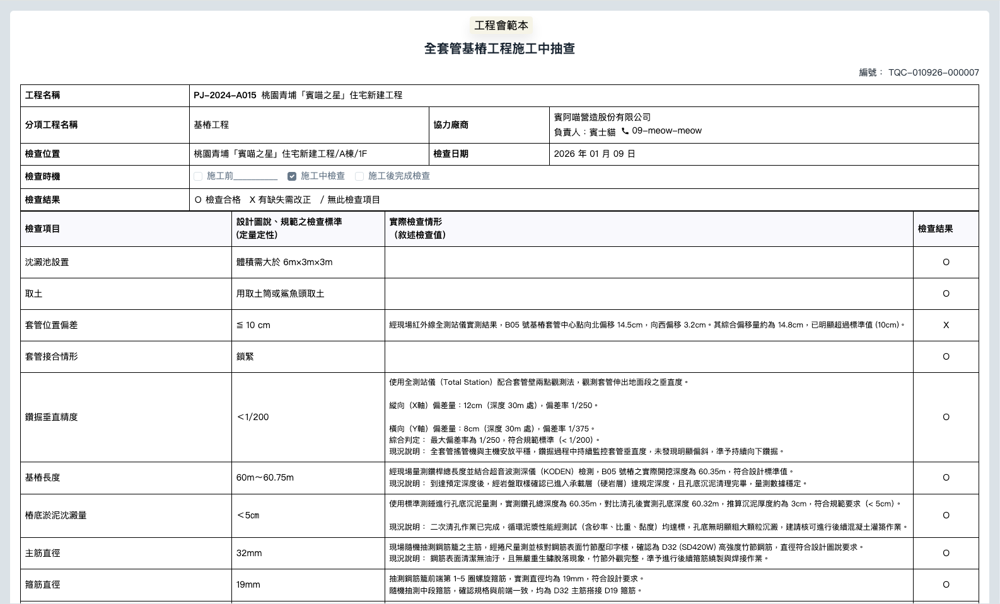 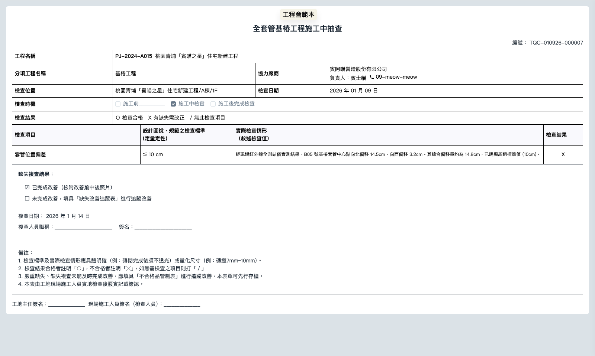 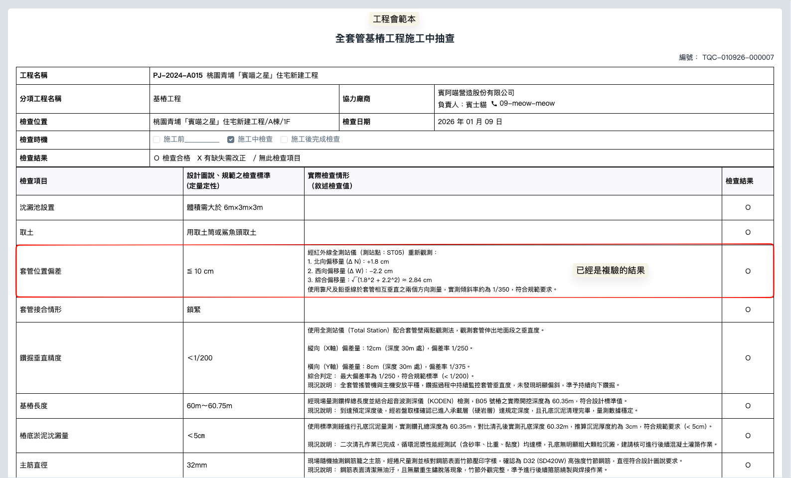

***

#### **02 - 4｜不適用項目顯示 (N/A Items Visibility)**

* **功能：**&#x6C7A;定是否呈現判定為『不適用』的檢查項。
* **應用：**&#x96B1;藏後可縮減報表長度，讓讀者專注於實際有施作且有數據的檢查項目。

不適用項目之顯示及隱藏範例如下（範例選用台灣中油格式）：

!!! info
    #### ❗請注意
    
    在營造實務中，一套完整的檢查表（範本）往往包含許多細目，但在特定樓層或工區，並非所有項目都會發生。Jobdone 的 「不適用項目顯示/隱藏」 選項，同樣 完整適用於所有列印格式，包含預設格式、公共工程會、中油等特定範本。
    
    **實務應用價值：**
    
    * **縮減報表冗長度：** 許多標準化範本（如工程會範本）項目眾多。若當次查驗僅涉及部分工項，透過隱藏「不適用項目」，可以讓報表從原本的 3-4 頁濃縮至 1 頁精華，讓審核人員一眼看見重點，提升估驗與審查效率。
    * **避免無效數據干擾：** 在進行複雜的機具巡檢或環安衛檢查時，隱藏不適用的項目可以避免「非當前設備」的空白格出現在報表中，減少誤讀的可能性。

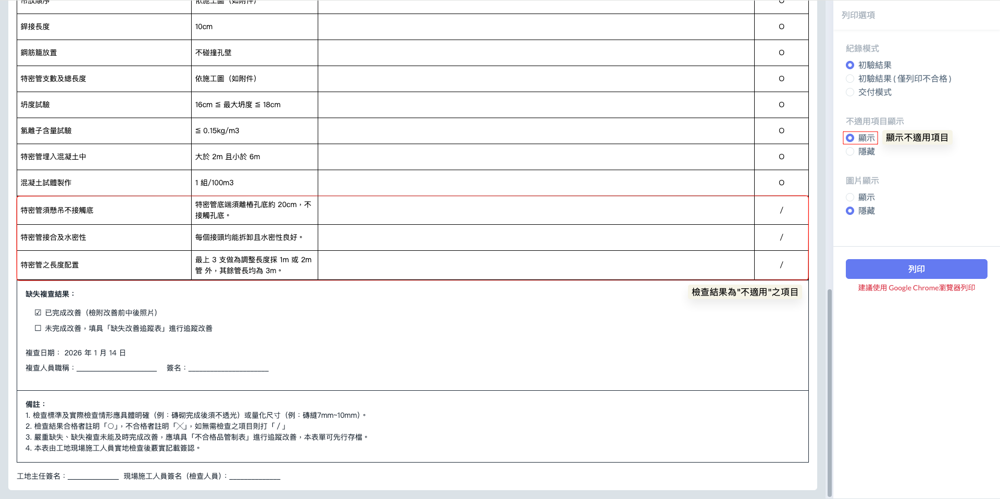 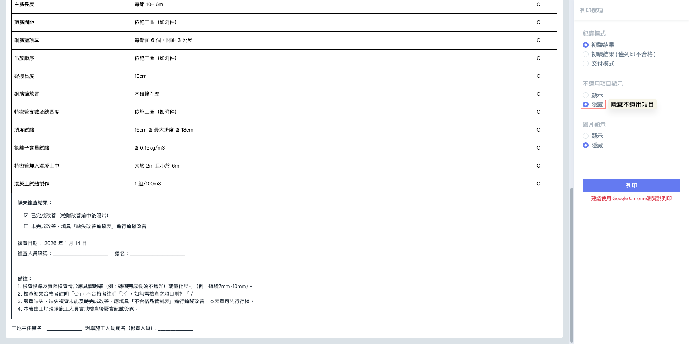

***

#### **02 - 5｜檢查紀錄：無資料欄位隱藏 (Hide Empty Fields)**

* **功能：** 當某個檢查項目未填寫任何數值或文字時，系統將自動隱藏該列。
* **應用：** 避免報表出現大量空白欄位，使排版更顯精鍊專業。

無資料欄位之顯示與隱藏範例如下（範例選用 Jobdone 預設格式）：

!!! info
    #### ❗請注意
    
    『無資料欄位隱藏』****僅適用於 Jobdone 預設之列印格式****。若選用公共工程會、中油或其他特定業主之專用範本，則不提供此隱藏功能。
    
    **為什麼在特定範本（如工程會、中油）中不能隱藏？**
    
    1. **確保報表完整性（Integrity）：** 公共工程與公營事業的報表通常被視為法律文件。在官方的標準格式中，每一個檢查細項（包含非必填的數值欄位）都被視為表單結構的一部分。若因為沒填資料就將該欄位隱藏，會導致產出的報表與官方標準範本的「格數」或「外觀」不一致，這在嚴謹的稽核程序中是不被允許的。
    2. **避免「漏填」疑慮：** 對於監造單位而言，保留「無資料欄位」可以清楚辨識該項目是「未檢查」還是「不適用（應選用 N/A）」。若系統自動隱藏，審核者可能無法判斷該項目是否被遺漏，進而影響報告的公信力。
    3. **Jobdone 預設格式的彈性：** 在民間建案或公司內部查驗時，為了追求報表的精簡與美觀，我們提供此功能。當您有些參考用的欄位未填寫時，開啟「隱藏」能讓排版更顯精鍊，避免報表出現過多無意義的空白行，提升閱讀效率。

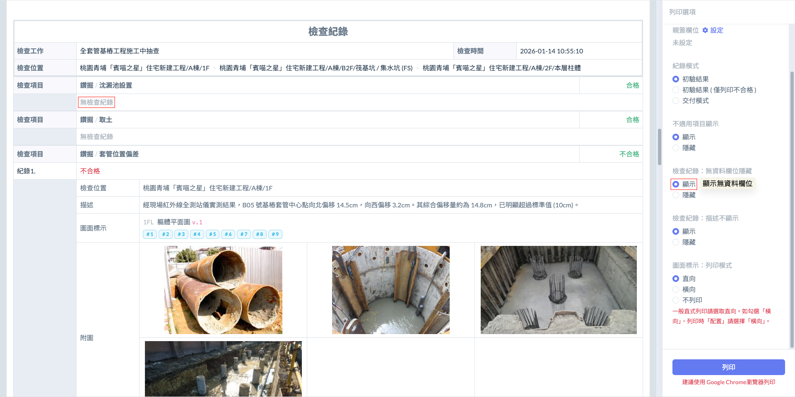 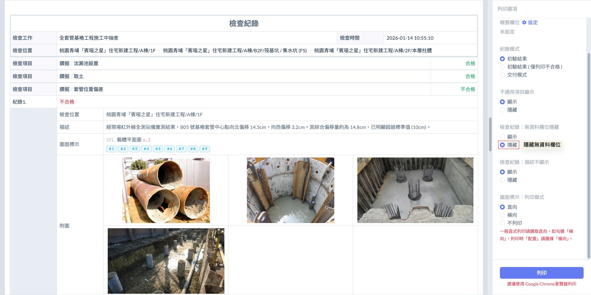

***

#### **02 - 6｜檢查紀錄：描述不顯示 (Hide Description Text)**

* **功能：** 僅保留「合格/不合格」判定與「數據」，隱藏文字描述（備註）欄位。
* **應用：** 當備註內容僅供內部溝通參考、不宜對外揭露時，可使用此模式。

描述欄位之顯示與隱藏範例如下（範例選用 Jobdone 預設格式）：

!!! info
    #### ❗請注意
    
    此項功能僅適用於 Jobdone 預設之列印格式。若選用公共工程會、中油或其他特定業主之官方範本，系統將強制顯示描述內容，不提供隱藏選項。
    
    **為什麼在官方範本（工程會、中油）中必須顯示描述？**
    
    1. **確保查驗歷程完整：** 在公共工程或公營事業的品質管理中，「描述」欄位通常包含重要的備註、施工狀態說明或不合格原因的補充。這些資訊是判定品質合格與否的重要佐證，若將其隱藏，報表將失去「詳細紀錄」的本質。
    2. **符合稽核規範：** 官方範本的結構設計是經過法定程序核定的。隨意隱藏文字描述欄位，會導致報表內容過於簡略，可能造成監造或查核人員無法從報表中理解現場的真實狀況，進而導致報告被退件。
    3. **預設格式的資訊過濾：** 在民間建案或內部自主檢查時，管理人員有時僅希望查看「數據與結果」，而不希望被瑣碎的現場紀錄文字干擾；或者有些描述內容僅供內部溝通，不適合呈交給最終客戶。此時，Jobdone 預設格式提供「描述不顯示」功能，能協助您產出更為精簡、導向清晰的專業報告。

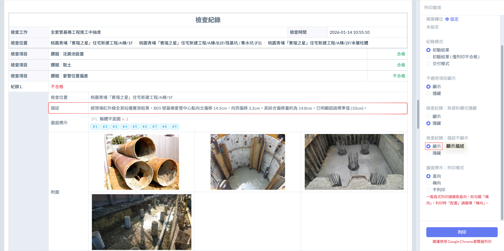 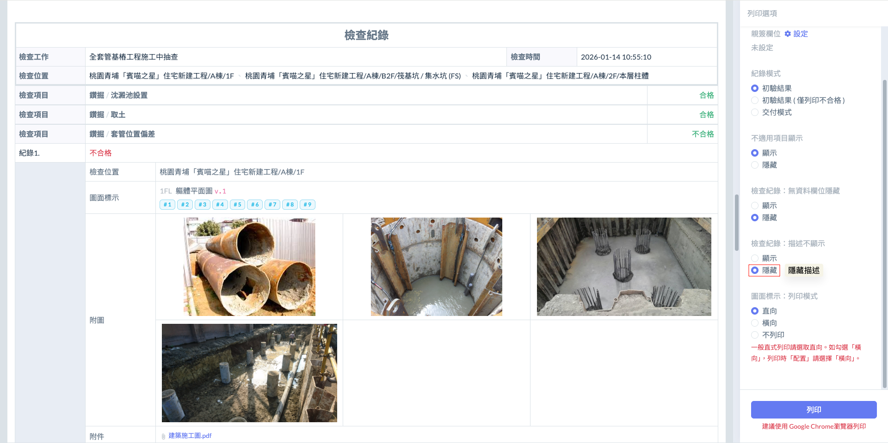

***

#### **02 - 7｜圖片顯示 (Photo Evidence Display)**

* **功能：** 選擇是否在檢查紀錄下方顯示該項目所拍攝的現場照片，可能包含初驗照、複驗照及改善照等。
* **應用：**



適用於正式查驗報告、缺失改善單、最終結案報表。照片是工程品質最具力的證明，開啟後報表將自動排列「缺失 vs. 改善後」的照片對照，讓審核者無需到場即可確認整改實況。



適用於純數據統計、快速核對清單或內部存檔。當報告僅需確認數值（如：混凝土坍度值、鋼筋數量統計）且頁數過多時，隱藏圖片可大幅縮減 PDF 檔案體積，方便快速閱覽或純文字存檔。



圖片之顯示與隱藏範例如下（範例選用工程會格式）：

!!! info
    #### 請注意
    
    『圖片顯示』功能僅適用於工程會、中油或其他版本格式。Jobdone 預設列印格式不支援此開關切換。
    
    **1. Jobdone 預設列印格式：【必然印出圖片】**
    
    在預設格式下，系統不提供圖片隱藏的選項。
    
    * Jobdone 預設格式的核心目標是提供一份「最完整、最具備影像公信力」的品質履歷。我們認為影像證據與數據紀錄在數位化管理中是不可分割的，因此在預設模式下，系統會自動排版並印出所有相關照片。
    * 確保任何一份由 Jobdone 產出的標準報告，都能具備完整的圖文對照，避免因遺漏照片而導致事後爭議。
    
    ***
    
    **2. 工程會、中油或其他專用範本：【可選擇顯示/隱藏】**
    
    當選用這類官方特定格式時，系統則開放了圖片顯示的開關。您可以自由勾選是否要將照片附在報表之後。
    
    * **應用場景：**
      * 開啟圖片： 用於正式提交給監造或業主審核時，作為缺失整改的附件存證。
      * 隱藏圖片： 在某些官方行政流程中，若只需要遞交「純文字簽核表單」或是為了節省大量的列印紙張、減輕 PDF 檔案體積時，可選擇關閉圖片，僅輸出符合官方格式的純文字表格。

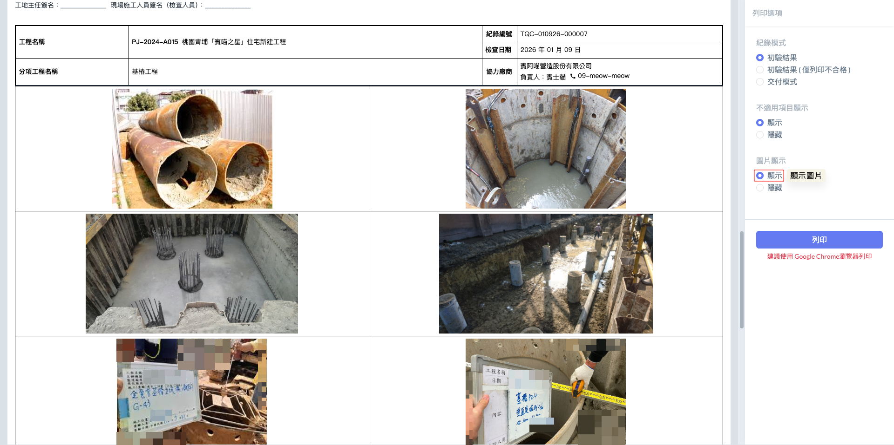 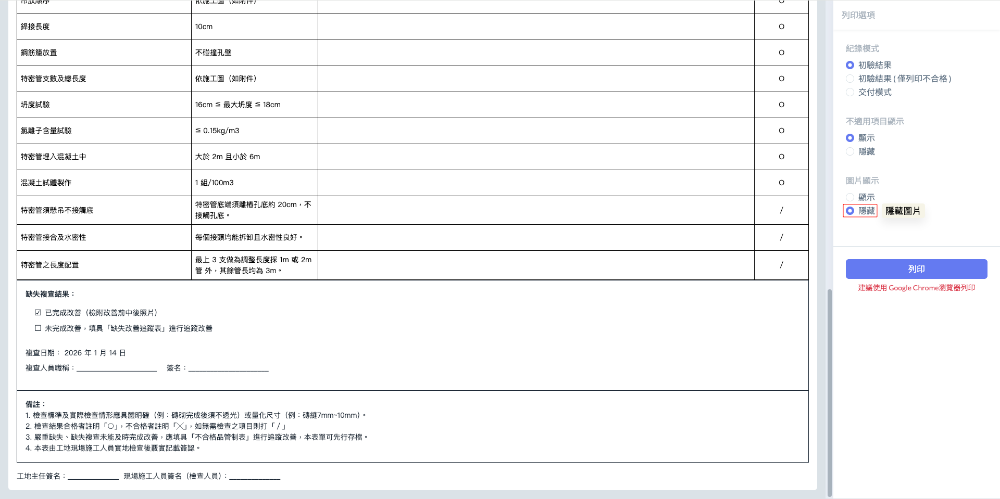

***

#### **02 - 8｜圖面標示：列印模式 (Drawing Markups)**

* **功能：** 決定施工圖面上的打點標示如何呈現，提供「直向」、「橫向」或「不列印」三種選擇。



配合施工圖的長寬比例選擇最佳視覺呈現，確保查驗點位一目了然。



若該次報告重點在於數據而非位置，可選擇隱藏圖面以節省紙張或減少檔案大小。



圖面標示之列印模式範例如下（範例選用 Jobdone 預設格式）：

!!! info
    #### ❗請注意
    
    圖面標示的列印模式，僅適用於 Jobdone 預設格式方能使用。若選用公共工程會、中油或其他官方特定範本，報表中並不會顯示圖面標示圖（儘管該檢查單在系統內有開啟圖片顯示功能）。

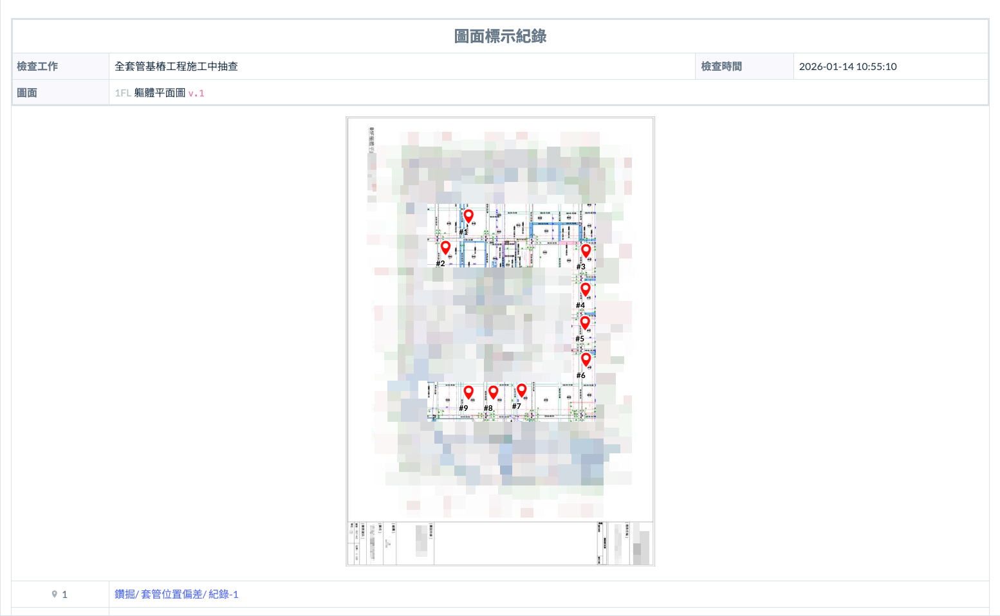 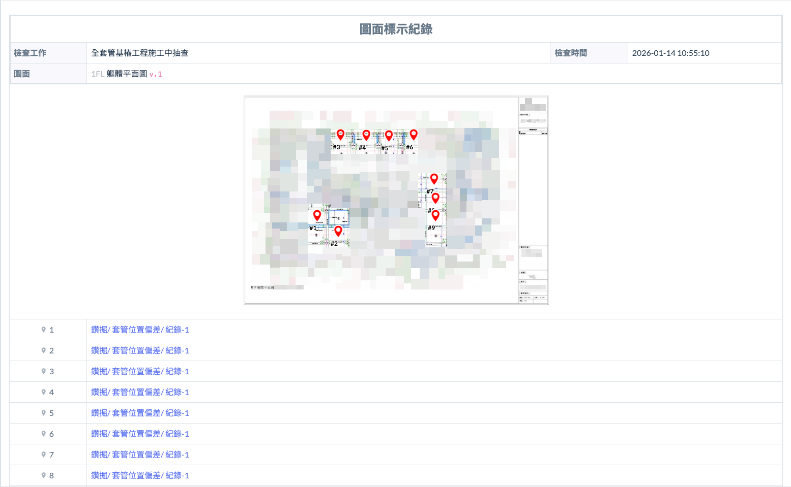

***

### **03｜**&#x5217;印選項：功能權限總表

為了幫助您與團隊快速記憶，我們將目前提到的所有列印開關進行彙整：

<table><thead><tr><th width="220.8826904296875">選項名稱</th><th>Jobdone 預設格式</th><th>工程會 / 中油版本</th></tr></thead><tbody><tr><td><a href="#id-02-1-gong-si-ming-cheng">公司名稱</a></td><td><i class="fa-check-double">:check-double:</i> 彈性選取</td><td><i class="fa-octagon-xmark">:octagon-xmark:</i> 固定顯示</td></tr><tr><td><a href="#id-02-2-qin-qian-lan-wei">親簽欄位編輯</a></td><td><i class="fa-check-double">:check-double:</i> 彈性選取</td><td><i class="fa-octagon-xmark">:octagon-xmark:</i> 固定欄位</td></tr><tr><td><a href="#id-02-4-bu-shi-yong-xiang-mu-xian-shi-na-items-visibility">紀錄模式（三模式）</a></td><td><i class="fa-check-double">:check-double:</i> 完整適用</td><td><i class="fa-check-double">:check-double:</i> 完整適用</td></tr><tr><td><a href="#id-02-4-bu-shi-yong-xiang-mu-xian-shi-na-items-visibility">不適用項目顯示</a></td><td><i class="fa-check-double">:check-double:</i> 彈性選取</td><td><i class="fa-check-double">:check-double:</i> 彈性選取</td></tr><tr><td><a href="#id-02-5-jian-cha-ji-lu-wu-zi-liao-lan-wei-yin-cang-hide-empty-fields">檢查紀錄：無資料欄位隱藏</a></td><td><i class="fa-check-double">:check-double:</i> 彈性選取</td><td><i class="fa-octagon-xmark">:octagon-xmark:</i> 固定顯示</td></tr><tr><td><a href="#id-02-6-jian-cha-ji-lu-miao-shu-bu-xian-shi-hide-description-text">檢查紀錄：描述不顯示</a></td><td><i class="fa-check-double">:check-double:</i> 彈性選取</td><td><i class="fa-octagon-xmark">:octagon-xmark:</i> 固定顯示</td></tr><tr><td><a href="#id-02-7-tu-pian-xian-shi">圖片顯示</a></td><td><i class="fa-octagon-xmark">:octagon-xmark:</i> 固定顯示</td><td><i class="fa-check-double">:check-double:</i> 彈性選取</td></tr><tr><td><a href="#id-02-7-tu-mian-biao-shi-lie-yin-mo-shi-drawing-markups">圖面標示：列印模式</a></td><td><i class="fa-check-double">:check-double:</i> 彈性選取</td><td><i class="fa-octagon-xmark">:octagon-xmark:</i> 不支援顯示</td></tr></tbody></table>
