# 執行檢查工作

### 01｜填寫檢查紀錄

當檢查任務建立完成後，現場人員即可隨時透過行動裝置或電腦端展開即時查驗，將現場施作狀況轉化為數位紀錄：

如圖一，於『執行檢查工作』功能頁面，點選欲執行之檢查工作，即可進入該檢查內部，查看所有檢查項目並填寫檢查結果。

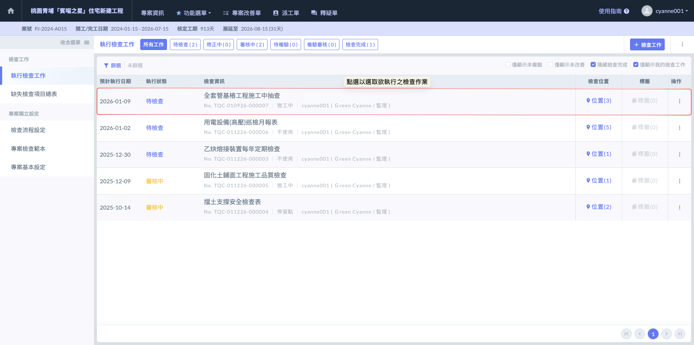

執行檢查畫面如下：

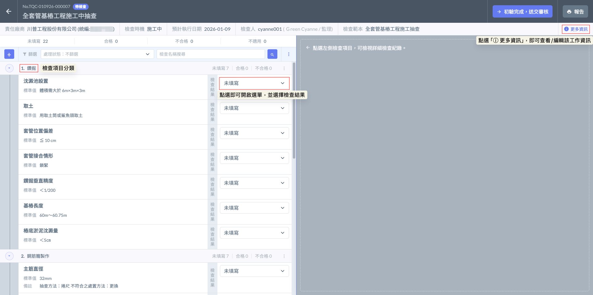

如圖三，點選右上方之  圖示後，即可開啟視窗查看該檢查工作之詳細資訊（包含：流程、範本、相關人員、圖面、檢查位置、檢查時機及執行日期等），亦可針對部分內容進行修改。

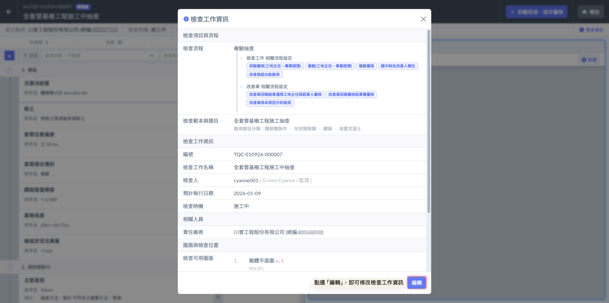

***

#### 01 - 1｜檢查結果說明

如圖四，在執行現場查驗時，針對每一項檢查條目，系統提供三種明確的判定結果。這三種狀態將決定後續的報表呈現與流程走向：



代表該施工項目符合技術規範與設計圖說。



代表該項目存在品質缺失，須進行整改。



代表該檢查項目在本次查驗範圍或當前施工階段中****不需執行****。

* **實務情境：** 若範本包含「電梯井檢查」，但當前工區並無電梯工程；或範本包含「雨天施工防護」，但查驗當日為晴天，即可勾選不適用。
* **報表呈現：** 勾選不適用的項目在產出正式報表時，會明確標註為『不適用』，確保報告邏輯完整，證明該項目並非「漏檢」而是「不需檢查」。



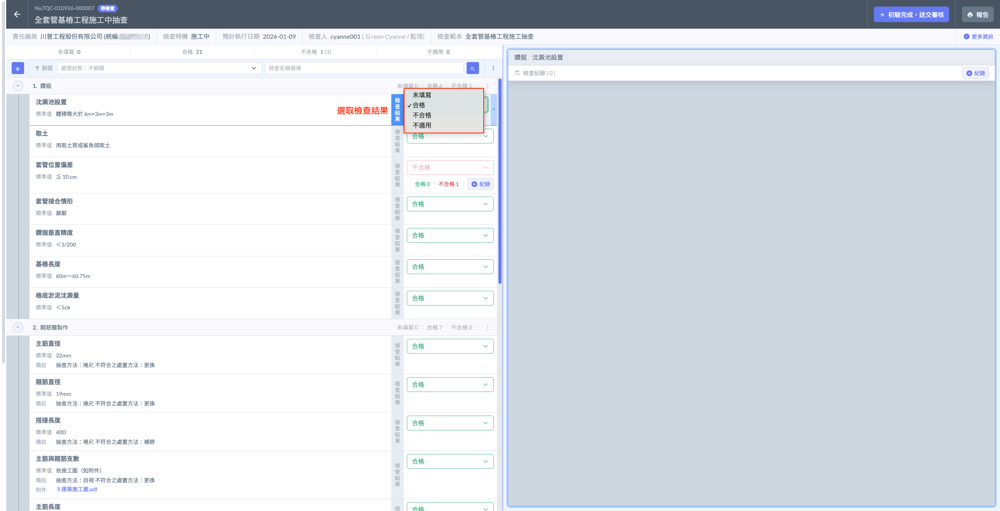

#### 01 - 2｜檢查紀錄

在執行查驗作業時，系統會根據您的判定結果（合格/不合格）啟動不同的引導流程，確保品質數據能完整留存並具備可追蹤性。



系統視該項目符合品質標準，為提升作業效率，系統不會主動彈出視窗。然而，若該項目涉及重要數據（如：量測值、壓力數值）或需留存完工照，您仍可主動於右側之『檢查紀錄』進行補充，填寫包含檢查位置、標準、描述、圖面標示、附圖及附件等資訊。



系統將視為品質缺失，並自動彈出『檢查紀錄』填寫視窗。除了檢查位置、檢查標準及描述等外，此時必須詳細登載缺失細節，以啟動後續的改善追蹤與複驗流程。如：缺失責任人與改善人： 明確指派負責整改的人員，落實責任歸屬。

!!! info
    建議透過「圖面標示」定位缺失點，並上傳「附圖（缺失照片）」與相關「附件」作為改善前的依據。




在營建現場，單一檢查項目往往對應多個實體構件。系統支援「每筆檢查項目皆可建立多筆檢查紀錄」，這能完美對應複雜的施工查驗情境：

> 實務：鋼筋工程檢查
>
> 假設本次檢查範本中的一個項目是「柱筋數量與間距」，而現場需同時查驗該樓層共 20 根柱子。
>
> * 操作方式： 您不需要建立 20 份檢查表，只需在同一個「柱筋數量與間距」項目下，利用「檢查紀錄」功能一一回報。
> * 數據呈現： 您可以針對第 1 根到第 20 根鋼筋分別新增紀錄，記錄每一根鋼筋的「檢查位置」、「檢查標準」及判定結果。
> * 混合判定： 若其中 18 根合格、2 根不合格，合格的紀錄可作為品質存證，不合格的紀錄則會觸發後續的改善流程，實現單一項目下的精細化管理。

**01 - 2 - 1｜合格**

如圖五，於該檢查項目右側之『檢查紀錄』列表，點選  圖示，即可開始新增多筆檢查紀錄。

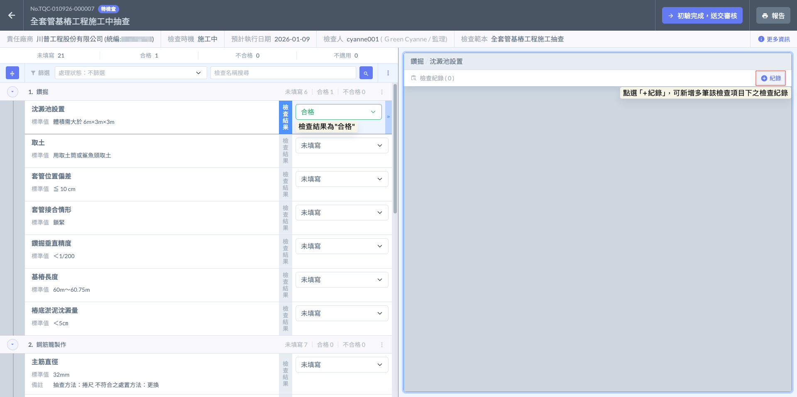

**【視窗欄位說明與實務應用】**



系統會預設帶入專案的建地結構，但若有該檢查有關閉『[限定建地結構資料](../../../../qc--1/jian-cha-liu-cheng-she-ding#xian-ding-jian-di-jie-gou-zi-liao)』，則建議在此細化至具體構件，例如「3F-B區樑柱接頭」，確保查驗點位精確。



顯示該項目的技術規範。執行人員可在此比對實測數據，例如標準為「垂直度 $$\pm$$ 3mm」，可於描述欄填寫實測結果，落實數據化管理。



用於記錄現場執行細節。

> 範例： 「經現場實測，鋼筋間距誤差控制在 5mm 內，且箍筋彎鉤角度均符合 135 度要求，無鬆脫現象。」



現場拍攝之缺失照或合格存證照。

App 系統支援自動帶入時間、座標、工程名稱、施工位置之浮水印，確保照片的真實性，符合營建業品管規範（如公共工程委員會之照片紀錄要求）。



可上傳與該紀錄相關的電子文件，如：材料出廠證明、試驗報告 PDF、或施工說明書截圖。這讓查驗紀錄不僅是照片，更具備完整的法律證據效力。



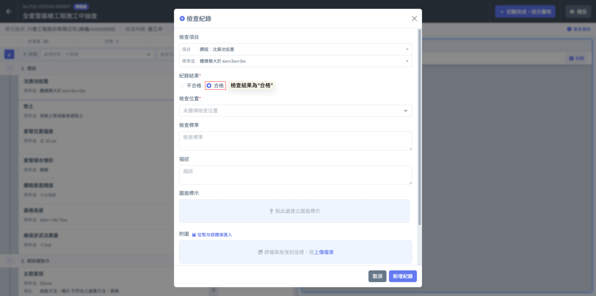

***

**01 - 2 -2｜不合格**

如圖七，當檢查結果判定為『不合格』後，系統即會自動跳出檢查紀錄視窗，要求填寫相關缺失資訊。

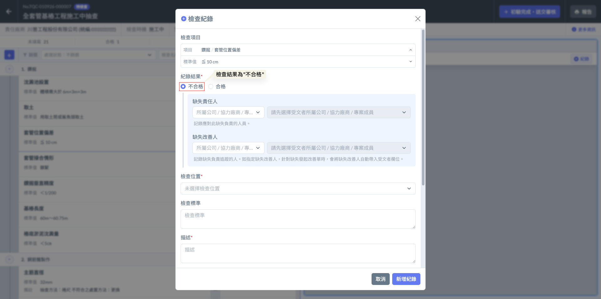

為了落實圖文對照的查驗標準，當您需要針對特定缺失或檢查點進行精確定位時，請執行以下操作：

如圖八，點選『圖面標示』欄位後，即可開啟圖片選擇視窗。您可以從原先檢查範本設定之『檢查可用圖面』中，選取本次檢查工作實際需用到的圖面。

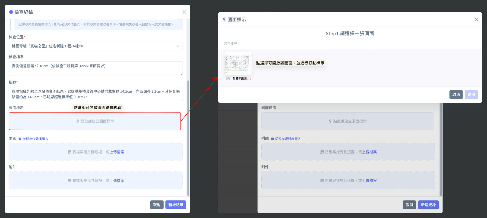

如圖九，圖面挑選後，即可開始於該圖面上進行打點標示。系統支援標示多個位置點，且每一點皆會依序產生專屬的編號。

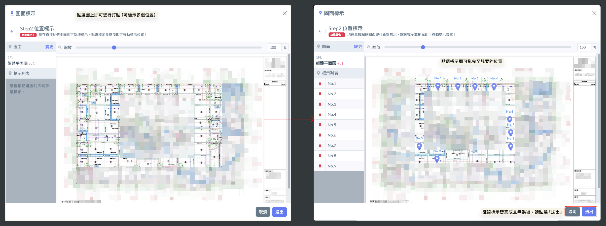

當您在檢查項目中進行回報時，除了前述的「圖面標示」外，系統提供以下關鍵欄位，用以建構完整的「責任歸屬」與「品質證據」：



缺失責任人： 指出造成該品質缺失的負責方。

缺失改善人： 指派負責進行整改作業的人員。

> 實務： 這兩個欄位皆可靈活選取「外部協力廠商」。例如：結構體發現漏水，責任人可選取「某某模板包商」或「某某混凝土廠商」之人員；改善人則選取「某某防水專業分包」之人員。系統會依據此設定，於發出缺失改善時，自動帶入相關欄位。



雖然整體檢查工作已有大位置，但此處可進一步細化。例如大位置在「3F」，此處可具體填寫「3F 第 5 號樑柱節點」，達成精確定位。

有關檢查位置填寫方式設定，請參閱 ➙ [限定建地結構資料](../../../../qc--1/jian-cha-liu-cheng-she-ding#xian-ding-jian-di-jie-gou-zi-liao)



針對該單一紀錄的具體量測標準。如前述範例之「偏移量 $$\le$$ 10cm」，讓後續審核者有明確的對照基準。



以文字詳述現場狀況。建議包含「現況發現」、「可能原因」及「建議處理方式」。



現場拍攝之缺失照或合格存證照。

App 系統支援自動帶入時間、座標、工程名稱、施工位置之浮水印，確保照片的真實性，符合營建業品管規範（如公共工程委員會之照片紀錄要求）。



可上傳與該紀錄相關的電子文件，如：材料出廠證明、試驗報告 PDF、或施工說明書截圖。這讓查驗紀錄不僅是照片，更具備完整的法律證據效力。



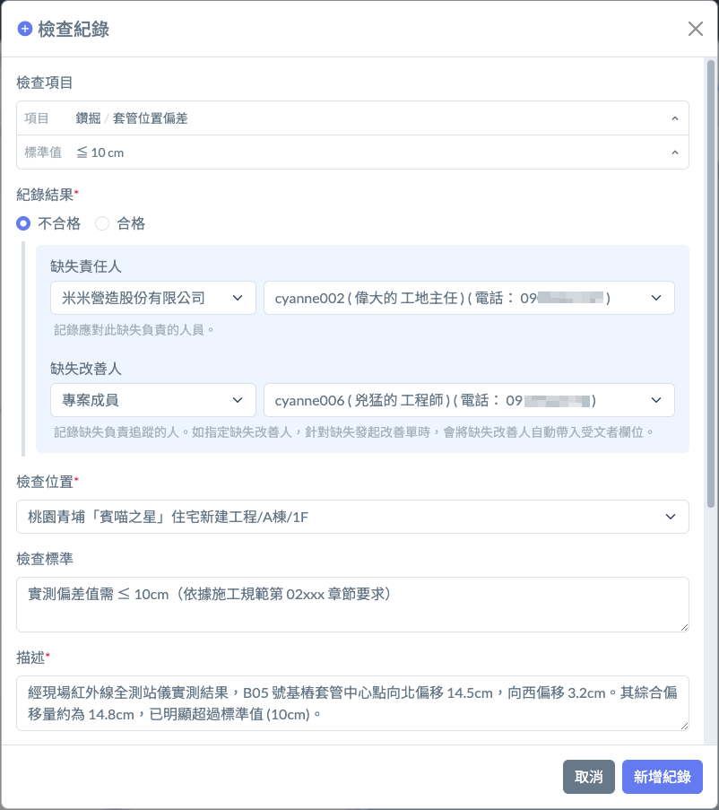 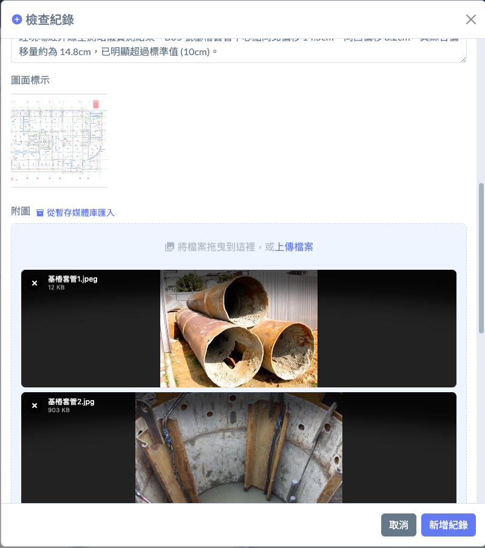 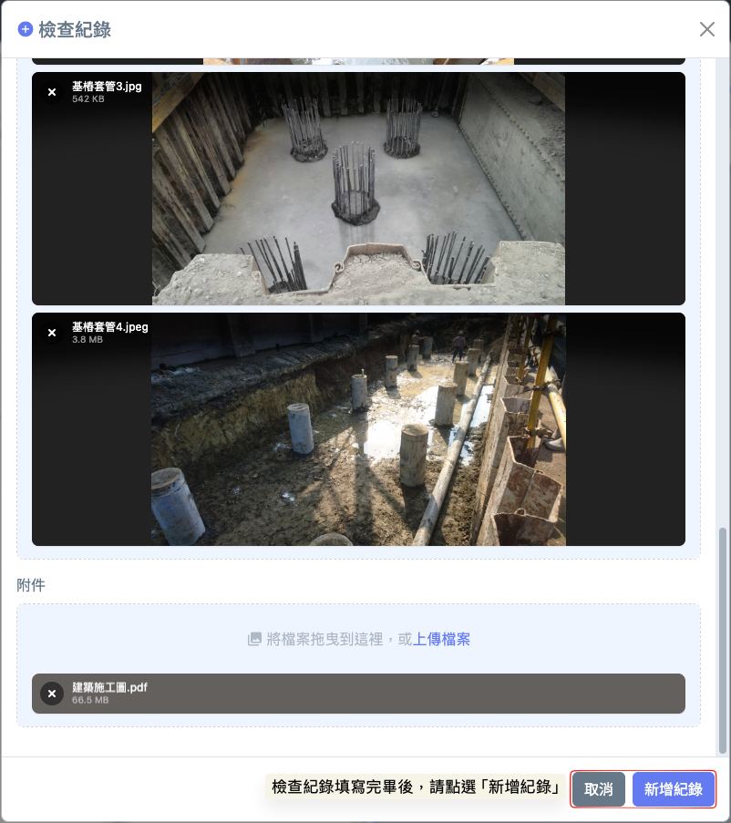

完成畫面如下：

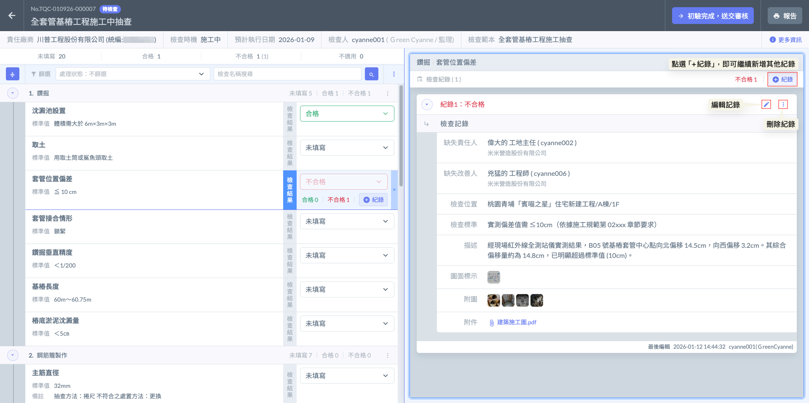

***

#### 01 - 3｜更多功能

如圖十四，於篩選功能欄位右側，點&#x9078;**「⋮」**&#x5716;示即可開啟選單，並可選取『一鍵不適用』、『一鍵未填寫』及『新增自訂檢查項目』等功能。

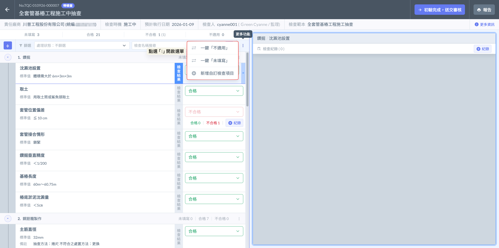

**01 - 3 - 1｜一鍵不適用、一鍵未填寫**

在營建現場，為了應對突發的施作異動或單一工序的特殊性，系統提供了快速同步所有項目狀態的功能：

當原定的檢查表項目與當日檢查工作完全不相符，或依使用者自身情況而定時，系統提供『一鍵不適用』及『一鍵未填寫』，讓您能夠一次更改所有檢查項目的檢查結果。



當整份範本中的項目在當前階段完全不需執行時（例如：原定進行封板檢查，但現場因故停工或工序調整），可使用此功能快速將所有『未填寫』項目標記為『不適用』。這不僅節省逐一勾選的時間，更能確保該次檢查紀錄在產出報告時具備完整的合理解釋。



若需要重新評估或誤選了大量項目的結果，可使用此功能將所有已選為『不適用』的判定一併清空，恢復至初始狀態重新進行判定，確保數據錄入的正確性。



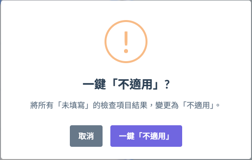 

**01 - 3 - 2｜自訂檢查項目**

如圖十七，若現場發現範本之外的特殊品質狀況或業主臨時要求的加查項，管理員可透過此功能即時增加該次檢查專屬的項目。

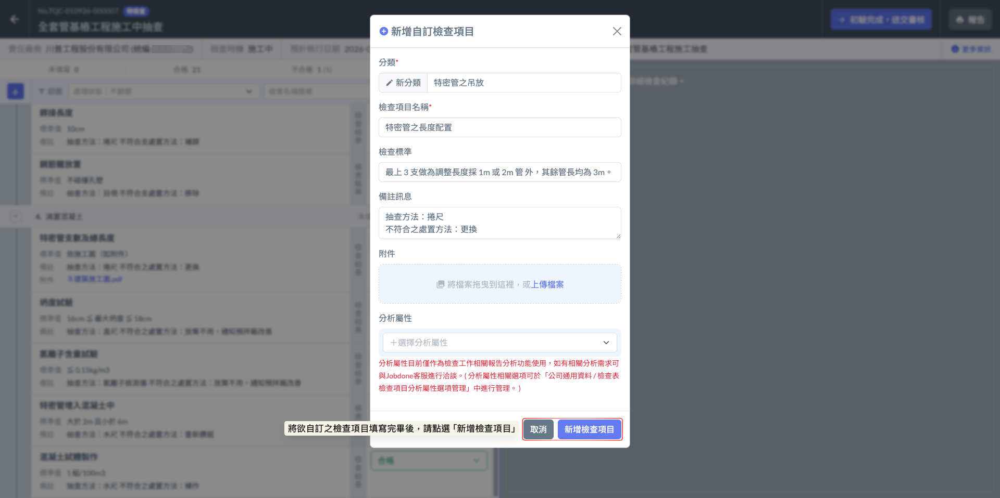

完成畫面如下：

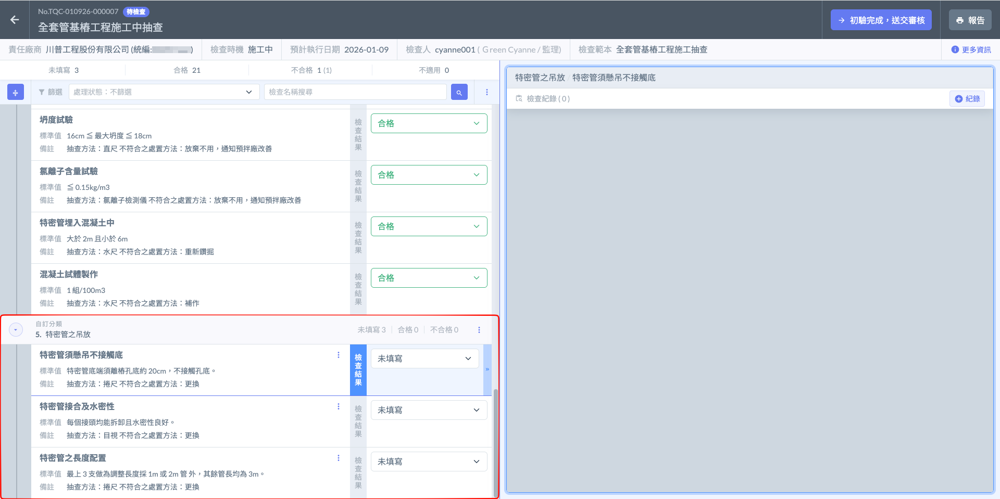

***

### 02｜送交審核

確認所有檢查項目皆已填寫完畢，且紀錄確實無誤後，即可點選<kbd><mark style="color:purple;">**初驗完成，送交審核**<mark style="color:purple;"></kbd>。系統將依據該檢查所使用之『檢查流程』，將該筆紀錄即時傳送給相關管理人員（如：工地主任或專案管理人員）進行評估與簽認。

!!! warning
    #### 請注意
    
    若仍有檢查項目處於『未填寫』之狀態，則系統將限制提交，無法將紀錄送往下一階段審核。

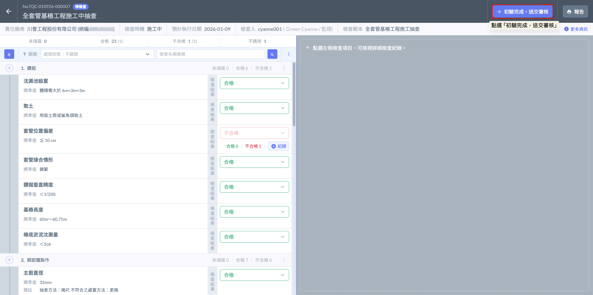

（一）將檢查送審後，該檢查工作之狀態即會由<kbd><mark style="color:blue;">**待檢查**<mark style="color:blue;"></kbd>轉為<kbd><mark style="color:yellow;">**審核中**<mark style="color:yellow;"></kbd>。

1. 狀態轉為<kbd><mark style="color:yellow;">**審核中**<mark style="color:yellow;"></kbd>後，原執行人員將無法再隨意修改檢查結果或紀錄內容。這確保了審核者所看到的數據與現場提交時是一致的，維持紀錄的嚴謹性與不可篡改性。
2. 此時，審核人員（如工地主任或專案管理人員）的待辦清單中會出現該筆任務，並查看您上傳的所有照片、圖面標示及實測數據。並獲得核定、退回的權限。

（二）在審核過程中，若審核人員（如工地主任 或 專案管理人員）認為檢查紀錄不夠詳盡、照片不清晰或判定結果有誤，可執行****退回****操作：

若審核人員將檢查紀錄退回，該檢查工作之狀態則會由<kbd><mark style="color:yellow;">**審核中**<mark style="color:yellow;"></kbd>更改為<kbd><mark style="color:blue;">**修正中**<mark style="color:blue;"></kbd>。

1. 當狀態轉為<kbd><mark style="color:blue;">**修正中**<mark style="color:blue;"></kbd>時，系統會解除資料鎖定，重新開放編輯權限給原執行人員。執行人員可針對審核意見進行內容補正、更換照片或重新判定。
2. 執行人員修正完畢後，需再次點選「送交審核」，狀態將重新回到審核中，直到審核人員核定通過為止。

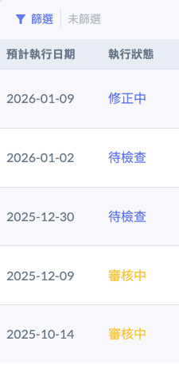
