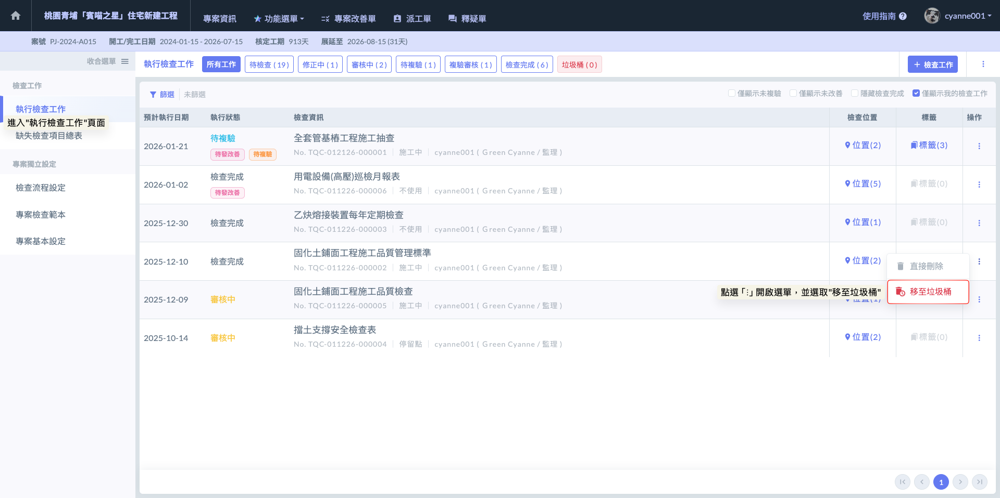
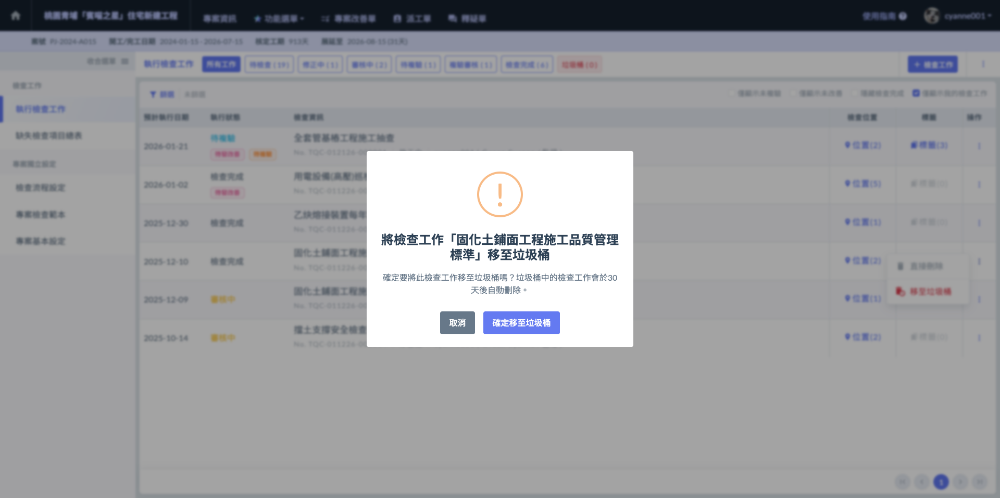
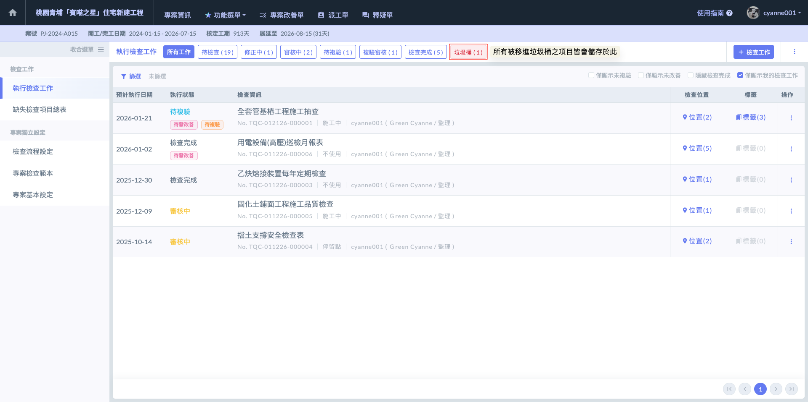
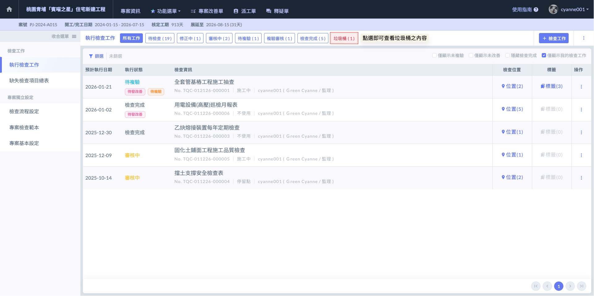
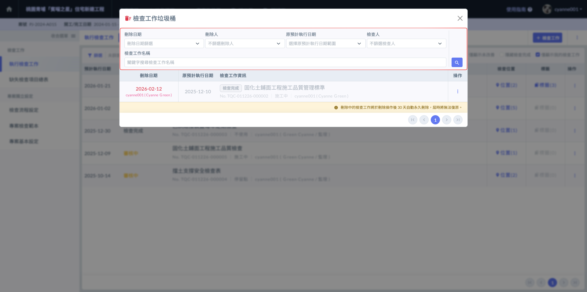
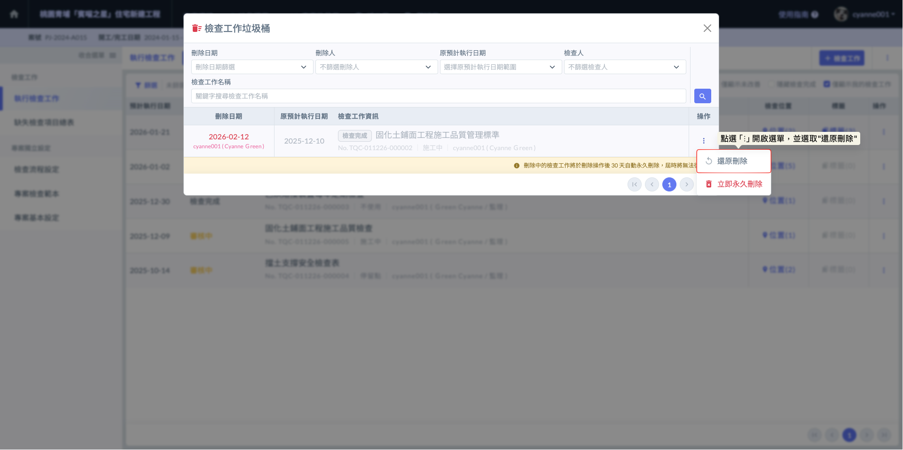
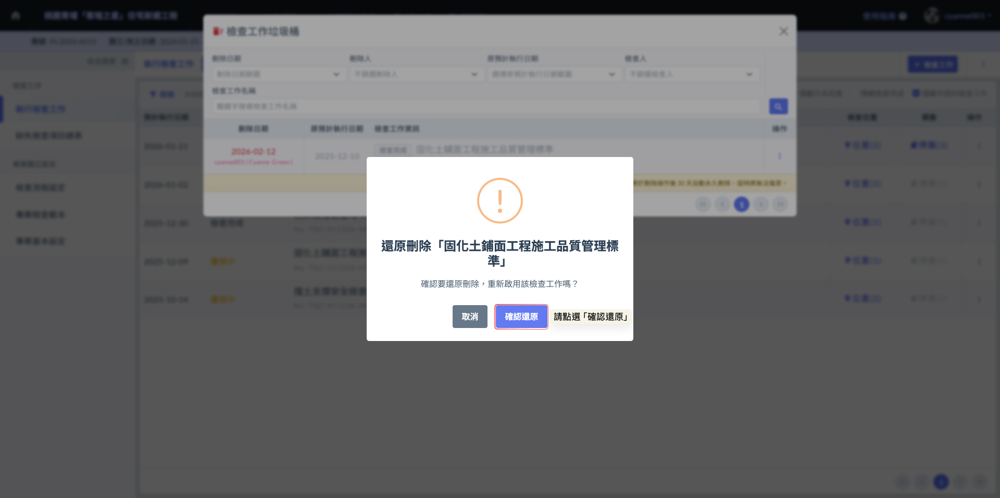
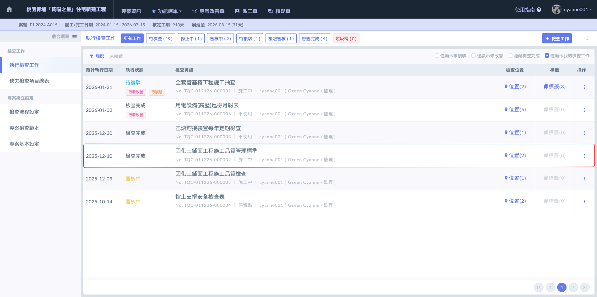
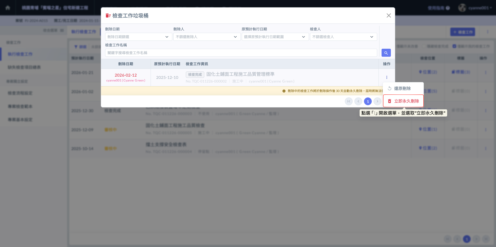

# 垃圾桶功能

為了應對施工現場頻繁的表單異動，系統新增了垃圾桶機制，提供『資料管理員』更靈活的清理權限，但同時設有嚴格的關聯保護機制，以確保工程紀錄的嚴謹性。

請務必留意，為了確保大宗資料管理的安全與嚴謹性，「檢查表垃圾桶」的所有管理動作目前僅支援於「網頁版（Web）」進行操作。

**【刪除權限與唯一限制】**

在一般權限下，使用者僅能刪除『待檢查』的檢查表單。然而，透過這項新功能：



『資料管理員』可將任何狀態（如待檢查、執行中、複驗中、已完成等）之檢查工作移入垃圾桶。



由於此操作具備高度敏感性，僅限『公司資料管理員』具備操作資格。您必須先於【公司資訊】➙ 【成員清單】中，為特定人員開啟資料管理員權限。



!!! warning
    #### ⚠️ 關鍵限制（不支援刪除）
    
    若該檢查表已發起『改善單』，系統將鎖定該檢查工作不允許刪除。這是為了防止因檢查工作消失，導致後續的缺失改善流程（如照片、位置、判定依據等）失去關聯與追溯性。

**【安全緩衝：30 天復原機制】**

針對被移入垃圾桶的資料，系統提供以下機制：



檢查工作被移入垃圾桶後，將暫存於系統後台 30 天。



在 30 天的保存期限內，資料管理員隨時可執行『復原』，表單將帶著所有照片與紀錄回到刪除前的狀態。



雖然垃圾桶功能提供了極大的便利，但在操作前請務必評估以下風險。檢查表並非孤立的檔案，其紀錄涉及許多系統聯動機制：

1. **影響改善單流程：** 若該檢查表已填寫多筆紀錄與照片回報，刪除檢查表可能會導致後續改善失去原始採證依據。不當的刪除會導致品質追蹤鏈（Quality Chain）斷裂，使分包商在回報缺失時找不到對應的原始紀錄。
2. **儀表板數據失真：** 檢查表的判定結果（合格/不合格）會即時連動至專案的『缺失項目總表』。隨意刪除已完成的表單，會導致品管週報或月報的數據產生落差。
3. **稽核追溯性風險：** 營建工程強調程序正義。若在業主或監造查驗後，不當刪除已結案的檢查表，可能引發稽核爭議。

> 管理建議：刪除動作應僅用於****填寫錯誤****、****重複建立****、****測試資料****。對於正式的工程紀錄，即便結果為不合格，也應保留並走完複驗流程，而非直接刪除。

***

### 01｜**將檢查表移至垃圾桶**

當您具備『資料管理員』權限，若需清理冗餘或錯誤的檢查工作，請依照以下步驟操作：

進入檢查表模組，在『執行檢查工作』頁面中，找到欲處理的檢查工作。點選該項目右側操作欄位的 「⋮」 圖示開啟選單，並選取  即可完成操作。

!!! info
    #### **💡 操作小提醒**
    
    * **權限確認：**&#x82E5;您在選單中沒有看到『移至垃圾桶』選項，請確認您的帳號是否已由公司後台設定為『資料管理員』。
    * **刪除檢查：**&#x7CFB;統在執行移動前，會自動檢查該表單是否已發起『改善單』。若已有改善單關聯，選單將會限制此操作，以確保品質紀錄的完整性。
    
    有關資料管理員權限之設定，請參閱 ➙ [member](../../../../../../company_level/member "mention")

如圖二，點選  後，系統會再次跳出確認視窗。請您點選 ，該檢查工作即會正式從執行清單中移除並轉存至垃圾桶內。

如圖三，確定將檢查表移入垃圾桶後，您即可於頁面上方的  圖示旁，看見顯示的數字同步增加。

***

### 02｜垃圾桶內的進階操作

一旦檢查工作進入垃圾桶，系統會提供資料管理員兩個決定性的選項：



* **功能描述：**&#x82E5;發現誤刪或該表單仍有參考價值，可執行此操作。
* **執行結果：**&#x6AA2;查表將立即從垃圾桶移回原專案的執行清單中，且原有原始填寫的判定結果、影響佐證及文字描述皆會完整保留，完全不影響後續的查驗流程。
* **適用時機：**&#x8AA4;觸刪除鍵、或專案決策變更需重新啟用該項查驗時。



* **功能描述：**&#x7E5E;過系統預設的 30 天緩衝期，直接將資料從資料庫中徹底清除。
* **執行結果：**&#x57F7;行後該筆資料將無法再透過任何方式復原。這將釋放系統空間，並確保無效或錯誤的資料徹底消失。
* **適用時機：**&#x6D89;及敏感資訊的錯誤填寫、或確定為絕對不需要保留的測試數據。



!!! warning
    #### 💡 管理員的重要提醒
    
    ****慎用****立即永久刪除功能。
    
    雖然系統提供了 30 天的緩衝期（自動清理機制），但『立即永久刪除』是不可逆的操作。在點選前，建議再次確認該表單是否真的不再具備任何稽核或追溯價值。

**權限與透明度：垃圾桶檢視權限 (View-only Access for Non-Admins)**

為了確保專案資訊的透明並方便團隊溝通，系統針對垃圾桶內容採取了「開放檢視、嚴格控管」的原則：



* **非管理員成員：**&#x4EA6;可點擊進入垃圾桶頁面，查看目前有哪些檢查表已被移除。這有助於成員確認自己負責的項目是否被誤刪，或了解專案資料的清理進度。
* **操作限制：**&#x975E;管理員帳號僅具備『查看』權利，無法執行任何『還原』或『永久刪除』的操作，確保資料處置權集中於核心管理人員。



不論是否為管理員，皆可利用內建的篩選器在垃圾桶中快速定位資料。您可以透過以下維度進行精準檢索：

* 刪除日期：追蹤特定時間區間內被移除的紀錄。
* 刪除人：釐清是由哪位管理員執行了刪除動作，落實管理責任。
* 預計執行日期：根據檢查工作原始預計執行檢查的日期篩選。
* 檢查人：根據原始負責人篩選，確定特定同仁的查驗紀錄去向。
* 檢查工作名稱：直接輸入關鍵字，找尋特定的檢查表單。



#### 02 - 1｜還原刪除

如圖六，進入垃圾桶頁面後，於欲救回的檢查工作右側操作欄位，點選「⋮」圖示開啟選單，並選取  即可。

如圖七，點選  後，系統會再次跳出確認視窗。請您點選 ，該檢查工作便會立即從垃圾桶移出，並重新回到『執行檢查工作』列表中。

完成畫面如下：

***

#### 02 - 2｜立即永久刪除

如圖九，進入垃圾桶頁面後，於欲刪除的檢查工作右側操作欄位，點選「⋮」圖示開啟選單，並選取  即可。

!!! danger
    #### 💡 管理員的重要提醒
    
    ****慎用****立即永久刪除功能。
    
    雖然系統提供了 30 天的緩衝期（自動清理機制），但『立即永久刪除』是不可逆的操作。在點選前，建議再次確認該表單是否真的不再具備任何稽核或追溯價值。

