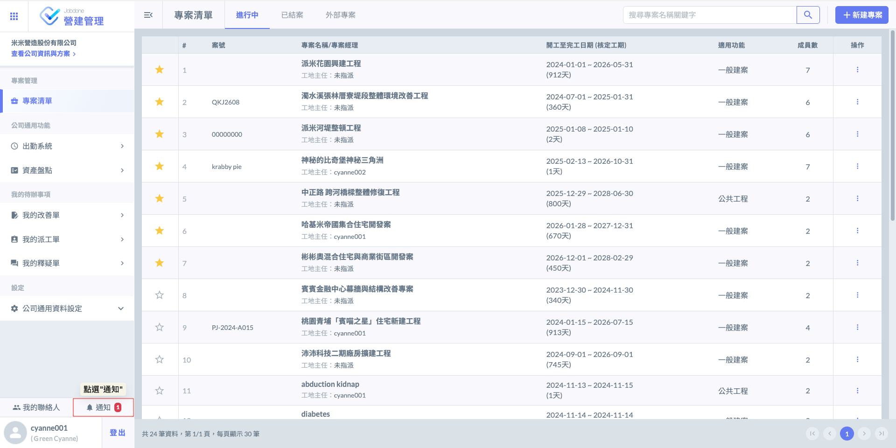
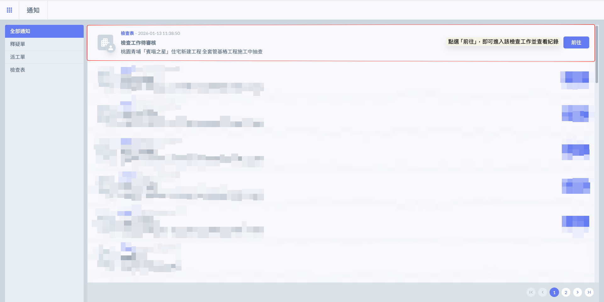
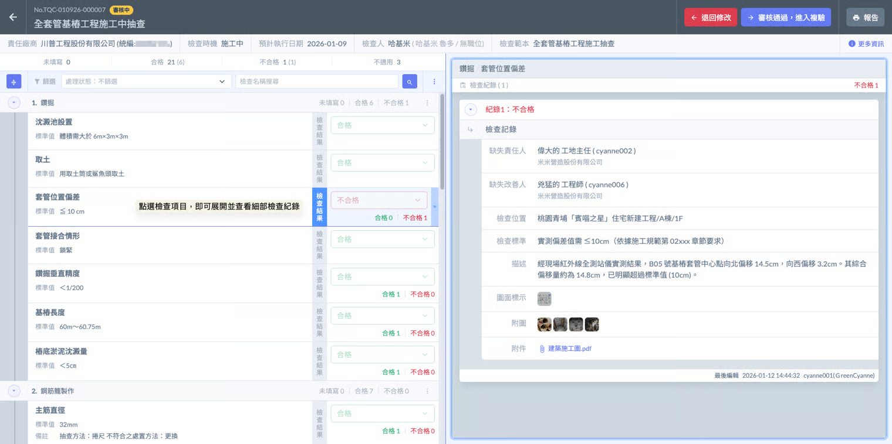
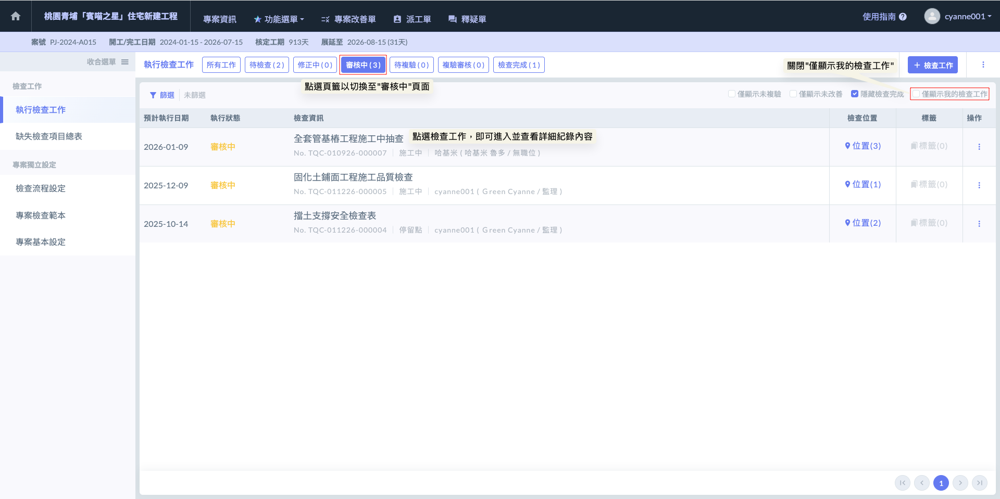
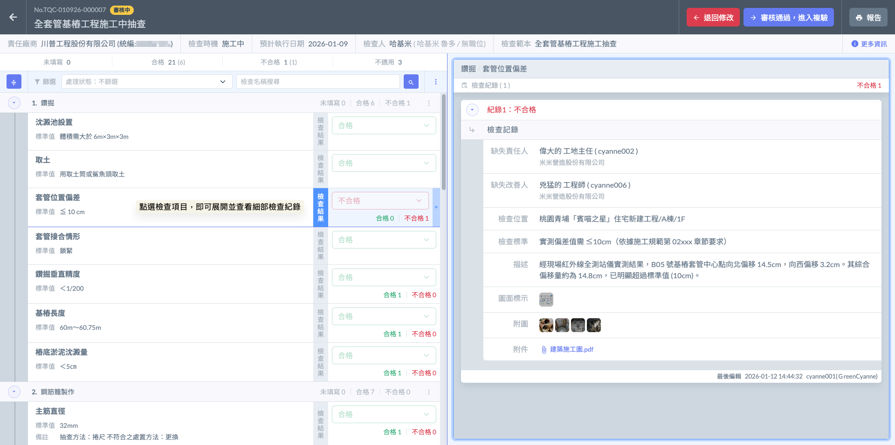
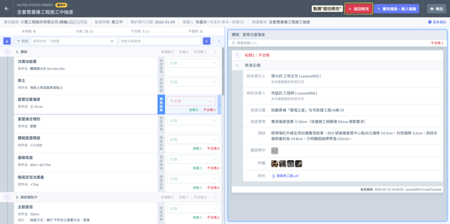
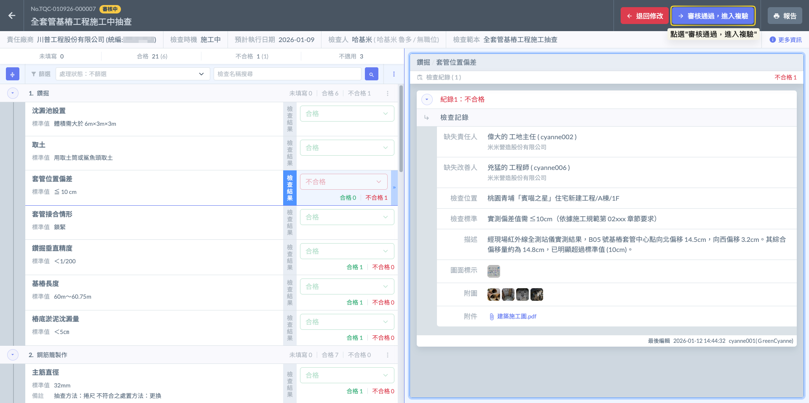
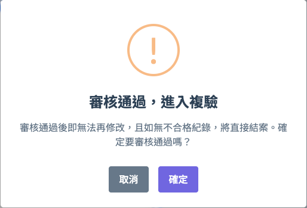
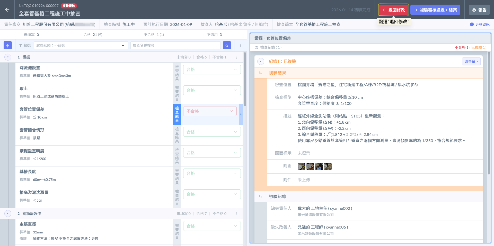
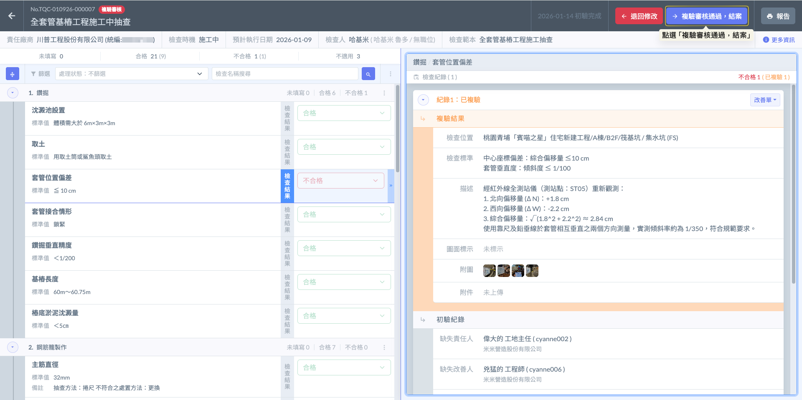

# 審核檢查紀錄

---
description: Review & Approve Inspection Records
---

# 審核檢查紀錄

在營建品管體系中，現場人員完成初驗、複驗後的「審核」動作，是確保紀錄真實性與落實責任管理的關鍵門檻。如果您擔任的是工地主任或專案管理人員（可能是技師、工程師、專案經理、監理、案場主管等），您將透過以下流程進行核定：

當檢查人員完成檢查並送交審核時，工地主任或專案管理人員會立即於自己的『通知訊息』中看到該筆待審核之檢查工作。點選通知後即可直接進入該檢查項目，查閱所有回報細節。

***

### 01｜通知

工地主任或專案管理人員無需手動搜尋海量的檢查清單，系統會主動將待辦事項推播至您的個人帳戶：

進入系統主頁面後，於個人帳號（大頭貼圖示）旁，點選  圖示，即可開啟並查看所有個人接收到的通知訊息，包含所有待您審核的檢查工作。

進入通知頁面後，通知訊息會詳細顯示該檢查工作的『名稱』、『提交日期』及『提交時間』。於該則通知右側點選  圖示，系統會直接跳轉至該筆檢查的審核頁面，節省層層點選選單的時間。

檢查審核之畫面如下：

***

### 02｜檢查表

除了通知功能外，您亦可直接於專案內的『檢查表』中查看所有檢查項目，並選取狀態為<kbd><mark style="color:yellow;">**審核中**<mark style="color:yellow;"></kbd>的項目，查看是否有需要您審核的檢查回報。

!!! danger
    #### ⚠️ 重要注意事項
    
    系統預設會自動勾選「僅顯示我的檢查工作」。若您需要查看其他成員送審的紀錄，請務必手動關閉此篩選選項，避免因過濾條件設定，導致找不到需審核的檢查工作。

檢查審核之畫面如下：

***

### 03｜退回/通過

在針對所有檢查判定、實測數據（如基樁垂直度、鋼筋直徑）及影像佐證進行一一核對後，審核人員可依據紀錄的正確性與品質現況，執行以下審核流程：



若發現初驗紀錄資訊不全、照片模糊或判定有誤，審核人可以要求執行人員重新補正：

* 操作： 於檢查回報頁面右上方，點選 ，該檢查工作將由<kbd><mark style="color:yellow;">**審核中**<mark style="color:yellow;"></kbd>轉為<kbd><mark style="color:blue;">**修正中**<mark style="color:blue;"></kbd> 。




當檢查項目中包含『不合格』項目，且您認可目前的缺失紀錄確實無誤時：

* 觸發條件：若該檢查工作之檢查流程有開啟『複驗流程』，且判定結果中含有不合格項。

點選  後。系統即會進入複驗程序，建議依據以下流程進行缺失追蹤與品質回查：

**1. 發送改善通知 (Issuing Deficiency Notice)**

審核通過後，系統將針對不合格項目，對相關改善人（如分包商或現場負責人）發送改善通知（改善單），明確告知缺失內容、位置與整改要求。

**2. 現場整改與改善回報 (Subcontractor Correction & Reporting)**

相關改善人員在收到通知後，需於現場執行整改作業，並透過系統上傳改善後照片（建議與缺失原位對照）及填寫整改內容說明。確認無誤後，提交「改善回報」。

**3. 改善審核與核對 (Correction Review)**

改善單發單人（或工地主任）會即時收到回報通知，並進入改善審核流程。此階段旨在確認廠商是否已依要求完成整改：

* 若整改不確實： 退回廠商重新處理，直到符合要求為止。
* 若整改完成： 執行審核通過後（或一併）由原檢查人進行「複驗」。

**4. 執行複驗紀錄 (Executing Retest Record)**

原檢查人（初驗人員）需再次回到現場，針對該不合格項目進行複驗紀錄：

* 檢查人需親自確認現場實況是否已真正符合技術標準。
* 於系統中再次記錄複驗結果，上傳複驗合格之佐證影像，並再次送交審核以進行最終結案。




若所有(非屬不適用)之檢查項目均判定為「合格」，且紀錄詳實：

* 操作結果： 點選 。該檢查工作狀態轉為「已結案」，並正式存檔於專案履歷中。




『複驗審核』之流程如下：



若發現複驗紀錄資訊不全、照片模糊或判定有誤，審核人可以要求執行人員重新補正：

* 操作： 於檢查回報頁面右上方，點選 ，該檢查工作將由<kbd><mark style="color:red;">**複驗審核**<mark style="color:red;"></kbd>轉為<kbd><mark style="color:orange;">**待複驗**<mark style="color:orange;"></kbd>。




當所有不合格之檢查紀錄皆已完成改善，且檢查人皆已落實複驗紀錄填寫後，即可將複驗紀錄送交審核。審核人（如工地主任或專案管理人員）在確認所有不合格紀錄的複驗數據、對照照片皆充分且正確無誤後，即可點選 。

審核人在點選通過前，應系統性地檢查「改善前後」的完整性。包含：

* **改善單回報內容：** 廠商是否確實針對缺失點進行處理。
* **複驗數據與照片：** 檢查人拍攝的複驗合格照是否具備浮水印資訊，且實測數值（如：鋼筋間距、平整度數據）是否確實回歸至合格範圍。

!!! warning
    #### 結案後的資料鎖定 (Data Lock-down)
    
    一旦執行『複驗審核通過』後，該筆檢查工作將轉為<kbd>**檢查完成**</kbd> 狀態。此時，所有的檢查數據、改善歷程與照片將被系統鎖定，不可再進行任何編輯或刪除，確保品質紀錄的不可篡改性與原始性。



