# 複驗紀錄與發起改善

---
description: Re-inspection & Corrective Action
---

# 複驗紀錄與發起改善

針對不合格的缺失項目，典型的作業流程為：『發起改善』 ➙ 『改善回報』 ➙ 『複驗紀錄』。



針對不合格項目，『發起改善』的動作具備高度靈活性：檢查人員可依據缺失對象直接發單給外部負責單位，亦可將缺失發給自己進行追蹤；同時，審核人員在覆核過程中若發現問題，同樣具備直接發起改善單的權限。

> **實例：**&#x73FE;場工程師在查驗過程中發現分包商施工不符規範（如：鋼筋間距過大），可直接於檢查表內發起改善單，指派給該分包商負責人，落實即時品管。



負責單位完成現場整改後，須透過 App 上傳改善後對比照片並說明處理措施，提交後即完成『回報』動作。



這是品質把關的最後一環。原檢查人在收到回報通知後，須親自到現場執行複驗。確認實況已符合技術規範後，於系統內紀錄複驗合格結果，這才算完成該項缺失的改善流程及管理。



當審核人通過初驗回報後，檢查執行狀態將自動更改為<kbd><mark style="color:orange;">**待複驗**<mark style="color:orange;"></kbd>。此時，檢查人員可針對判定為『不合格』的檢查紀錄（即便同一檢查項目內擁有多筆紀錄）逐一發起改善單。每一份改善單皆可根據缺失現況設置對應內容；待負責人改善完畢並經確認無誤後，即可返回各筆紀錄中填寫複驗結果。

***

### 01｜發起改善

如圖一，進入檢查工作頁面後，針對標示為不合格的檢查紀錄，點選  圖示，系統即會開啟功能視窗，供您填寫並發送改善單。

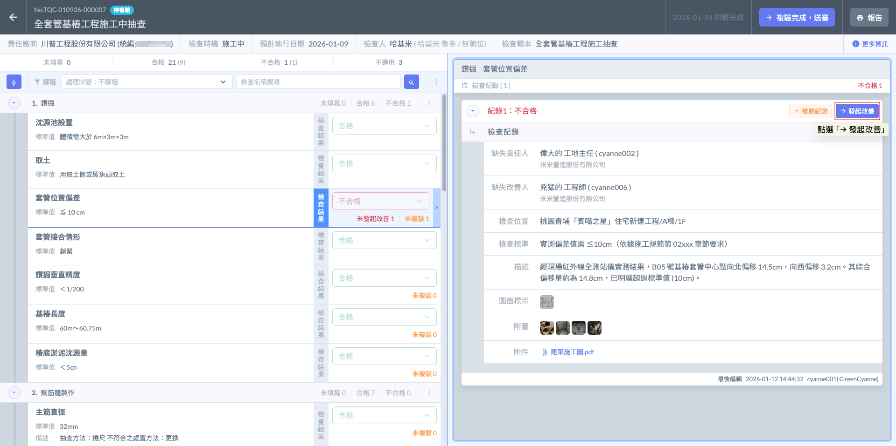

改善單畫面如下：

!!! info
    #### 細節補充
    
    1. 透過點選紀錄旁的圖示發起改善，系統會自動將該筆不合格的缺失主旨、內容與照片帶入改善單中，確保負責人能精確掌握問題點，不需手動重複輸入。
    2. 您可以根據缺失程度自定義：
       * 受文者： 指派給外部廠商、分包商領班或檢查人自己。
       * 改善期限： 明確要求需在特定日期前完成整改回報。
       * 可於描述欄位針對該缺失給予具體的修復指引（如：除鏽後重新塗裝、重新校正垂直度等）。
    3. 若該檢查項目內含有多筆不合格紀錄，您可以針對每一筆紀錄分別發起改善單，實現「一缺失、一單號」的精細化管理，避免責任混淆。

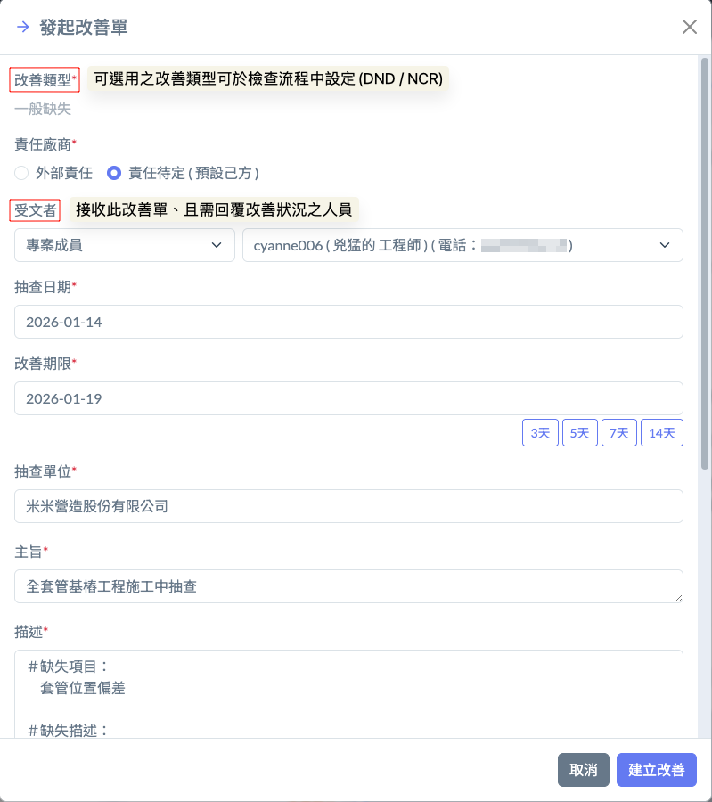 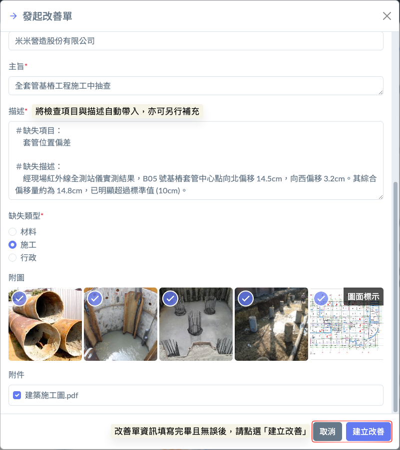

***

#### 01 - 1｜改善單進度 / 重新發起改善

當您針對不合格項目發出改善單後，原本的  圖示會更改為 ➙ ，成為管理該缺失的快捷入口：

發出改善單後，點選  圖示，即可開啟功能選單，並決定要查看<kbd>**改善單進度**</kbd>或<kbd><mark style="color:red;">**重新發起改善**<mark style="color:red;"></kbd>。



點選查看進度後，系統會直接跳轉至該筆改善單，您可以立即確認負責人是否已讀取、是否已上傳改善後照片，或是目前處於哪一個審核階段。這讓檢查人員無需在不同頁面間切換，即可掌握缺失整改的即時現況。



若原先的改善單因內容設定有誤需要作廢重開，或者該缺失在複驗時發現仍未達標、甚至衍生出新的問題，您可以透過此功能重新發起改善。系統將保留先前的歷程，並啟動一條新的改善路徑。



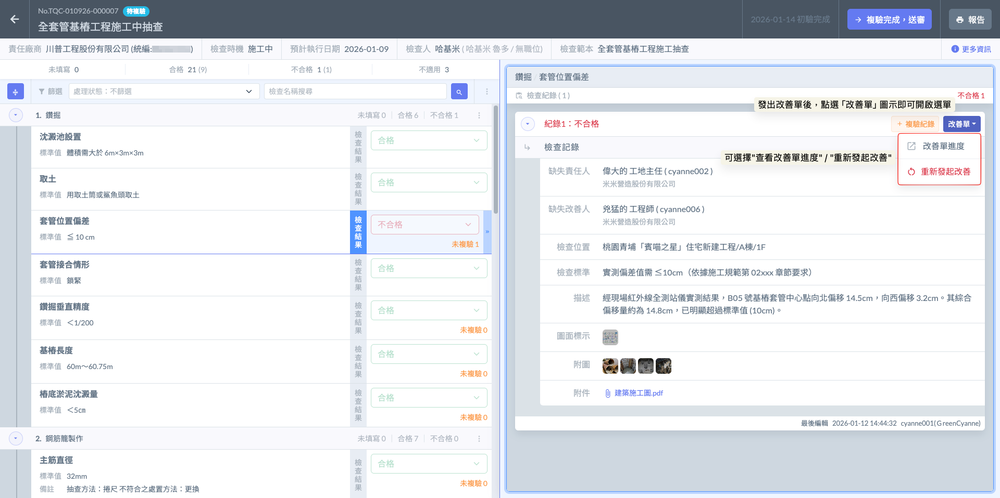

**改善單進度**

點選<kbd>**改善單進度**</kbd>後，系統將立即開啟新分頁，並自動跳轉至該筆改善單的詳情頁面。

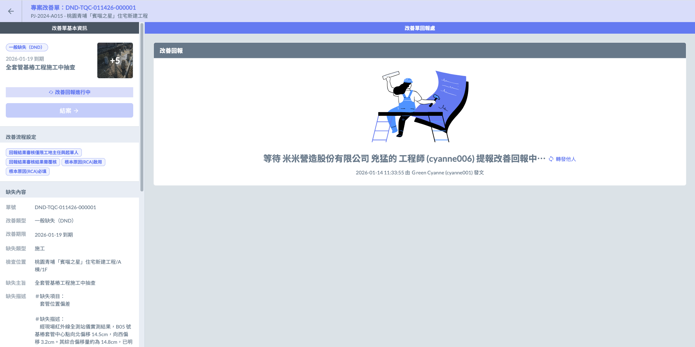

***

**重新發起改善**

在品管實務中，若複驗發現整改不完全，或原先的改善方案需要大幅度調整時，可利用此功能重啟流程：

點選<kbd><mark style="color:red;">**重新發起改善**<mark style="color:red;"></kbd>後，您需要再次填寫改善單，包含負責人、改善期限及整改要求等所有內容。

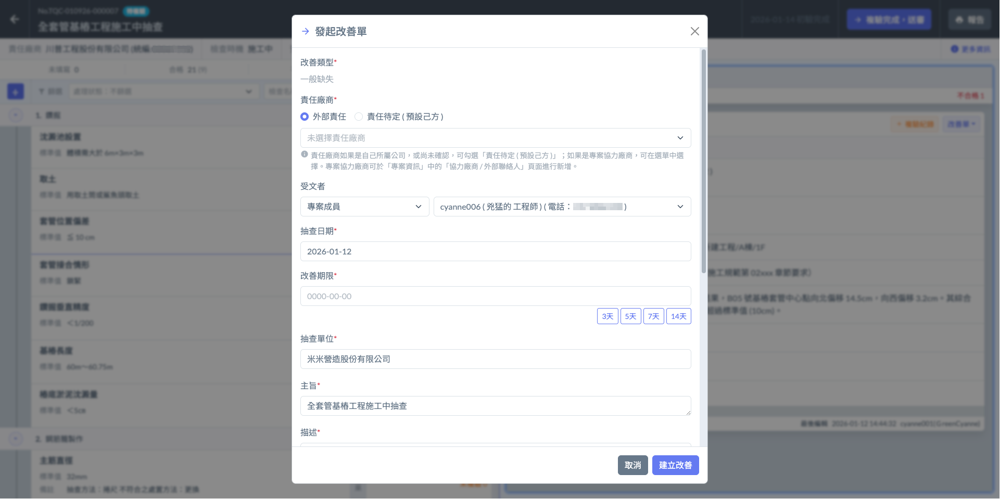

***

### 02｜複驗紀錄

如圖七、八所示，當受文者完成回報後，管理者即可於<kbd>**改善單進度**</kbd>中即時掌握最新狀況。一旦改善單顯示已完成改善並提交回報，檢查人即可開始執行複驗程序，並將結果回填於檢查紀錄內。

!!! info
    #### 實務範例
    
    1. **回報審視：**&#x5728;前往現場前，檢查人可先透過系統查看廠商(改善人)回報的內容，包含改善過程之照片及整改說明。初步確認廠商(改善人)已宣稱完成後，再行啟動複驗流程。
    2. **現場實地查驗：**&#x8907;驗並非僅是線上審核照片，檢查人應親赴現場，針對該『不合格點』重新進行量測或觀測。拍攝並上傳複驗合格照片，此照片將於報告呈現時，可與初驗時的缺失照對比，形成完整的整改證據鏈。
    3. 每一筆不合格紀錄在填寫完複驗結果並存擋後，狀態將更新。當該檢查工作內所有的不合格項皆完成複驗後，即可執行最後的『送交審核』。

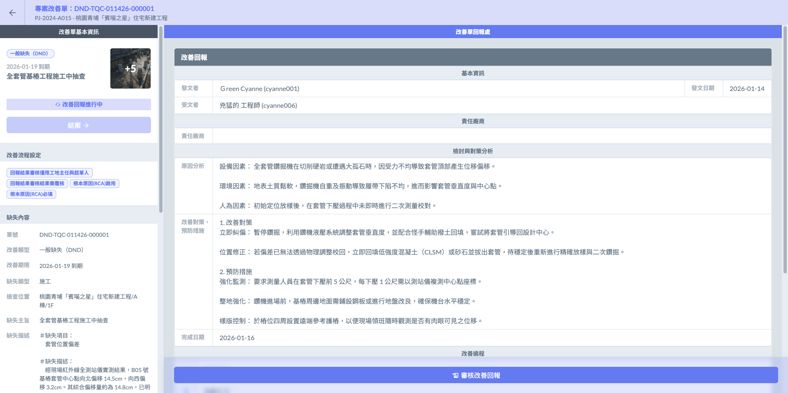 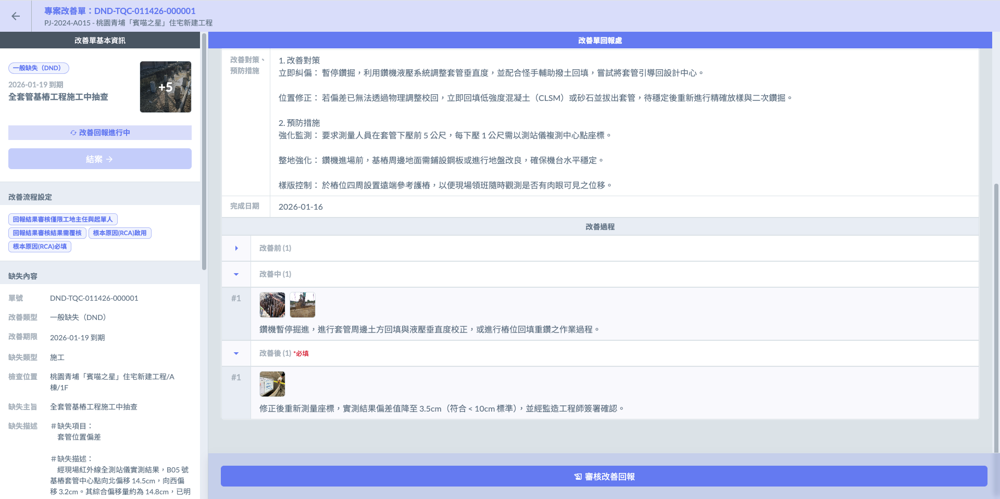

如圖九，針對標示為不合格的檢查紀錄，點選  按鈕，系統即會開啟填寫視窗，供您錄入複驗的實測數據與佐證資料。

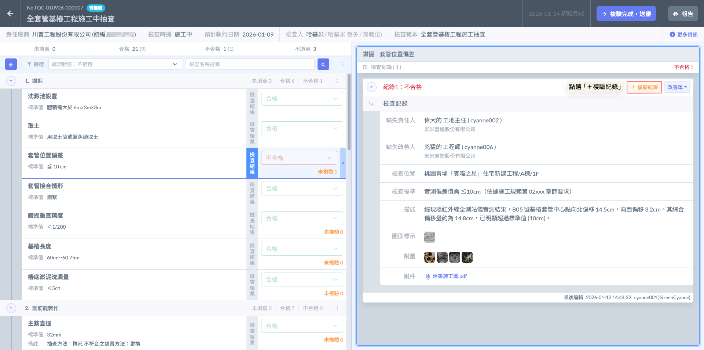

如圖十、十一，當您針對缺失項目完成改善後，請開啟『複驗紀錄』填寫視窗，並依序完成以下欄位資訊之建檔（包含檢查位置、檢查標準、描述、圖面標示、附圖及附件等）。

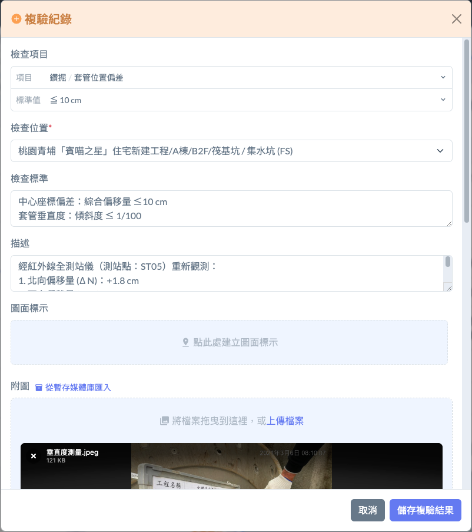 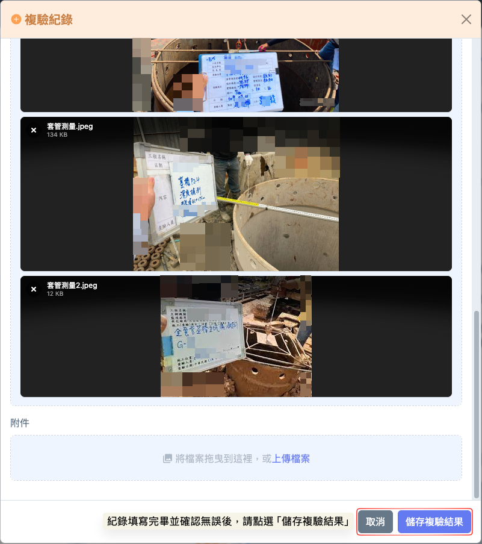

完成畫面如下：

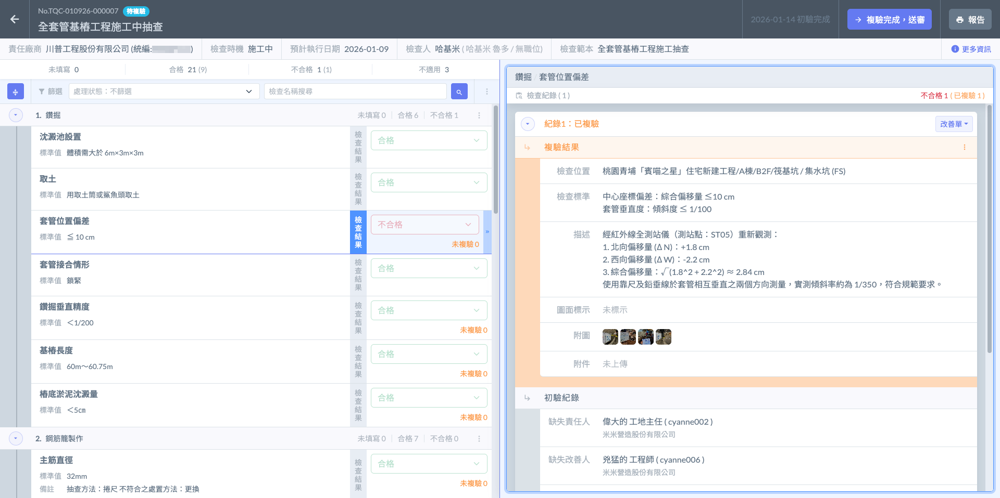

***

### 03｜複驗送審

當所有缺失項目皆經過現場實地回測並完成『複驗紀錄』後，即可執行最後送審。

!!! danger
    #### ⚠️ 請注意
    
    若尚有任何一筆不合格紀錄未完成複驗填寫，系統將限制送審功能，以確保品質無遺漏。
    
    * 強制性的品質完整性 (Integrity Check)： 系統具備自動檢核機制。只要檢查工作中存在『不合格』的判定，就必須對應一筆『複驗紀錄』。這種設計是為了防止因人為疏忽導致缺失未經確認就結案，落實「缺失不隱瞞、整改必複驗」的品管原則。
    * 一鍵送審 (Final Submission)： 確認所有紀錄點（含初驗合格與複驗合格）皆填寫完畢後，點選畫面右上方的<kbd><mark style="color:purple;">**複驗完成，送審**<mark style="color:purple;"></kbd>。此時，檢查工作的狀態將轉為<kbd><mark style="color:red;">**複驗審核**<mark style="color:red;"></kbd>，並即時推播給工地主任或專案經理。

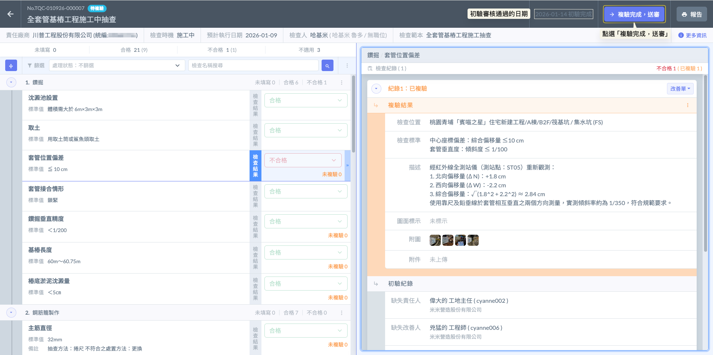

完成畫面如下：

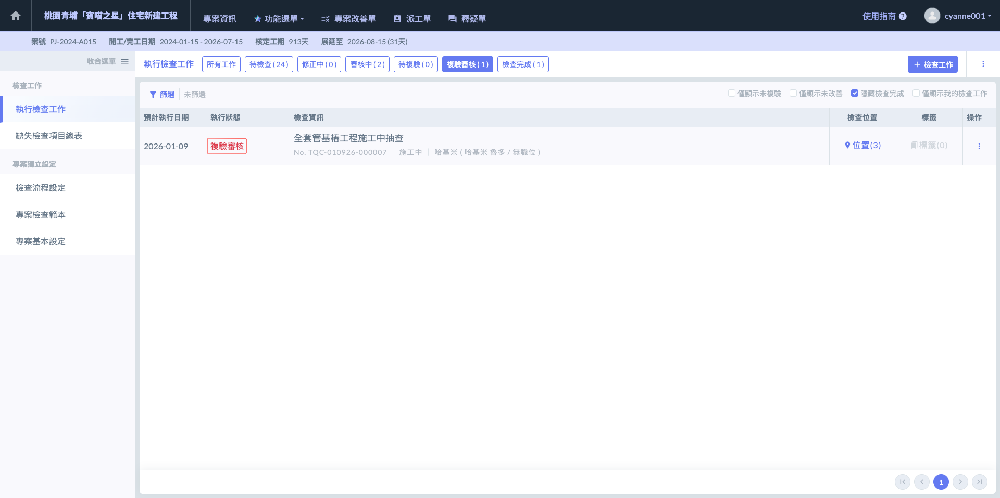
