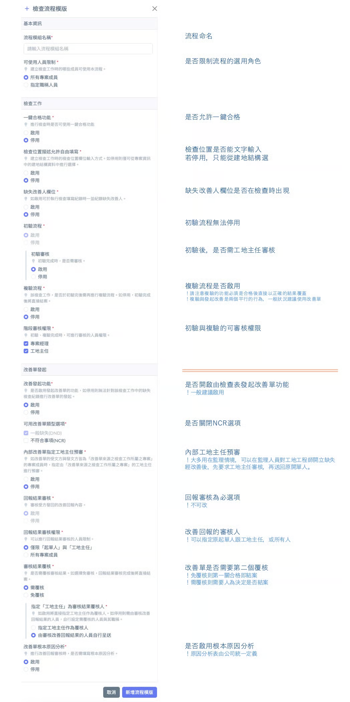
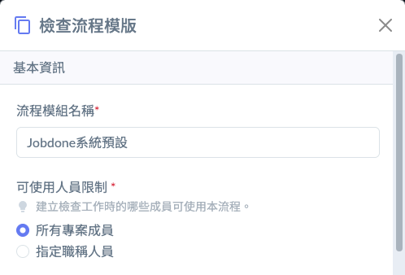

# 檢查流程設定

營建工程項目繁雜，從基礎開挖、結構體施工到裝修工程，每一階段的風險等級與查驗嚴謹度皆不同。Jobdone 的「檢查流程設定」功能，提供高度彈性，讓專案管理人員能根據合約要求、施工難易度及公司內控程序，打造專屬的數位化查驗工作流。

!!! info
    #### **檢查流程設定功能的價值在於**
    
    * **合規性管理：** 滿足公共工程或私人建案對「自主檢查」與「監造驗收」的不同行政要求。
    * **標準化作業（SOP）：** 規範現場工程師必須依照預設路徑執行任務，避免人為漏項或越級審核。
    * **責任分工（Accountability）：** 明確定義誰能發起、誰能審核、誰負責改善，建立完整的數位軌跡。

***

<kbd>**一、使用權限管理：精確掌握執行人員**</kbd>

為確保檢查工作的專業性與責任歸屬，系統支援『可使用人員』的篩選機制，避免無關人員誤用或建立不當的檢查項目。分為以下兩種模式：



適用於低風險、普適性的巡檢（如：工地環境清潔、每日職安巡查）。



針對具備專業技術門檻(或需專業證照)之項目（如：結構技師查驗、機電測試），僅限特定職稱人員（如：職安衛管理人員、上級監理、工地主任等）。



***

<kbd>**二、檢查工作定義：實務導向的彈性設置**</kbd>

此區塊定義了現場人員在執行查驗時的輸入規範與審核邏輯。

1. &#x20;**位置描述的約束力 (Location Rigidity)**

營建數據的統計價值取決於位置的精確度，分為以下兩種模式：



允許現場人員彈性輸入位置。適用於非主體工程或臨時維修案件。



強制執行人員必須從專案建立的「建地結構樹」中選取特定節點（如：A棟 > 15F > 梯廳）。



!!! info
    #### 建議
    
    在主體工程（如模板、鋼筋、灌漿）中，建議關閉自由填寫。要求人員選取建地結構，能確保所有檢查紀錄與建案物理空間完全掛鉤，避免因人員手寫習慣不同（如「1F」與「一樓」）導致的資料混亂。

***

**2. 初驗與複驗之設定（Initial and Re-inspection Workflow）**

根據工程重要程度，可靈活配置檢查單的結案邏輯：

<kbd>**2-1**</kbd>｜<kbd>**初驗審核機制**</kbd>



設定初驗紀錄完成時是否需要由管理階層審核。啟用後，紀錄須經權限者簽認方可繼續後續流程。



適用於記錄性質的簡易檢查，填寫完畢即視同初驗通過。



***

<kbd>**2-2**</kbd>｜<kbd>**複驗流程設定**</kbd>



系統將根據初驗判定結果自動切換路徑。若初驗結果包含「不合格」或「有缺失」項目，該查驗工作將不會因初驗動作完成而結案；系統會自動開啟『複驗路徑』，確保該案須經由複驗程序確認所有缺失皆已改善合格後，方可結案。

(註：若初驗結果為全數合格，即使該流程啟用了複驗功能，系統亦會判定流程已完備並直接結案，以確保行政效率)



初驗動作完成後（不論是否有不合格項目），系統即自動判定該檢查工作結束。此設定常用於『一次性現況紀錄』或『非關鍵工序巡查』，簡化行政作業程序。



> 對於涉及安全或隱蔽工程的項目，建議開啟「複驗流程」，以確保所有施工缺失皆有被追蹤至改善完成。

***

<kbd>**2-3**</kbd>｜<kbd>**複驗審核機制 (Re-inspection Approval)**</kbd>

除了初驗階段的審核外，針對品質管控要求較高的工程項目，系統亦提供「複驗審核」之功能開關，確保缺失改善的品質確實達標：



當現場工程師執行完「複驗」動作後，該檢查工作並不會立即結案，而是會提交至複驗審核人員（如：專案經理或工地主任）。審核者需針對複驗紀錄進行最終確認，經簽認核可後，該檢查案方能正式結案。這提供了二階段的品質把關，防止缺失在未經核實的情況下被關閉。



複驗動作一旦執行完成，系統即自動判定該檢查工作結案。此設定適用於缺失性質較單純、可由現場執行人員直接判定合格與否的情境，能有效加速作業流程。



***

<kbd>**2-4**</kbd>｜<kbd>**階段審核權限配置 (Multi-Stage Approval Authority)**</kbd>

本功能為品管制度的核心。當現場工程師（發起人）完成檢查紀錄並提交回報後，系統將依據此處的權限設定，將審核任務派發給指定的管理者，進行初驗、複驗紀錄的核實與簽認。

專案經理可依照公司管理扁平化或嚴謹程度，指派以下職稱人員擁有審核權（可複選或單選）：

* 專案經理 (PM)
* 工地主任 (Site Manager)

!!! info
    #### 補充
    
    1. 系統將嚴格確保只有具備上述對應職稱的人員，方能於行動端或後台看到待審清單，並執行『核可』或『退回』操作。
    2. 審核者的主要職責為針對現場人員提交的檢查照片、數據及現場描述進行核實。若審核通過，代表該檢查紀錄正式生效並歸檔；若予以退回，則發起人需重新補正資料。
    3. **一般自主檢查：**&#x53EF;由工地主任快速審核；**重要節點或請款依據查驗：**&#x53EF;要求至專案經理層級進行審核，確保品質風險受控。

