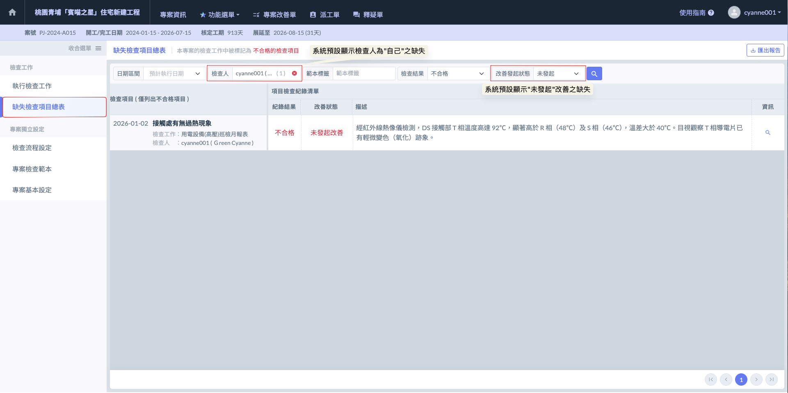
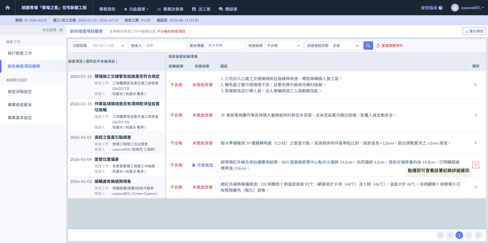
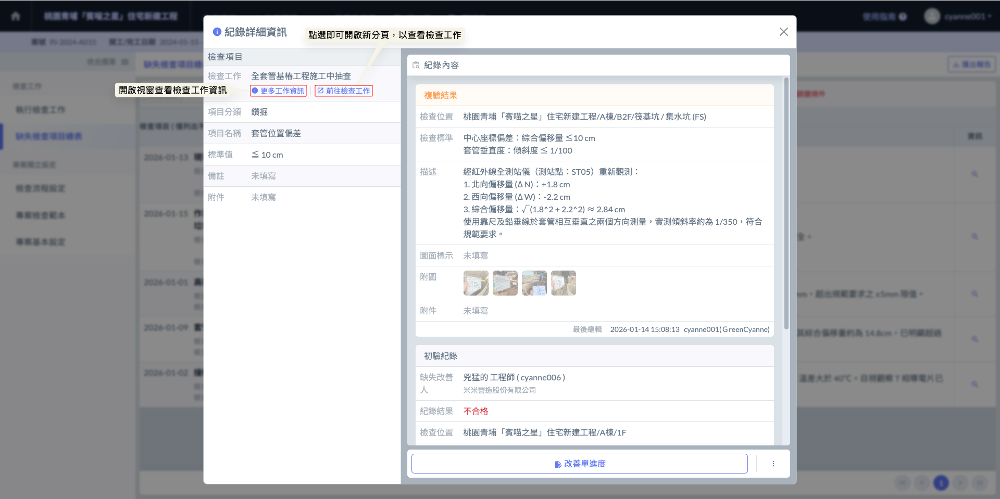
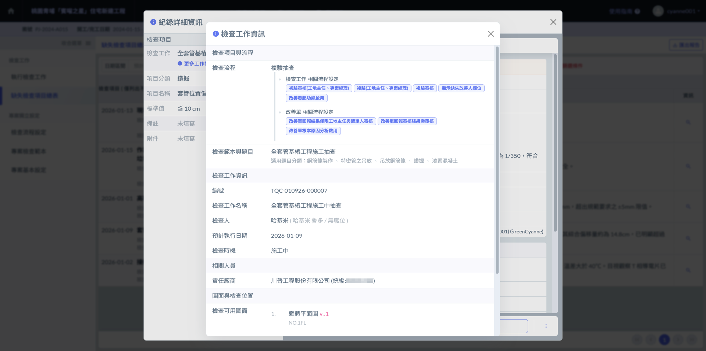
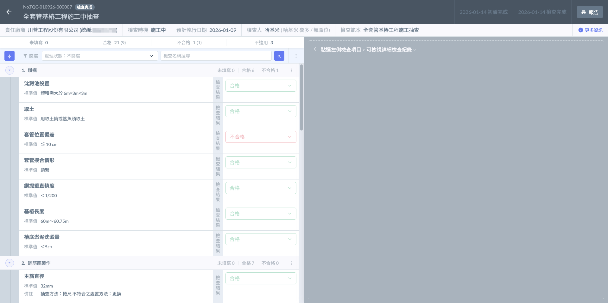
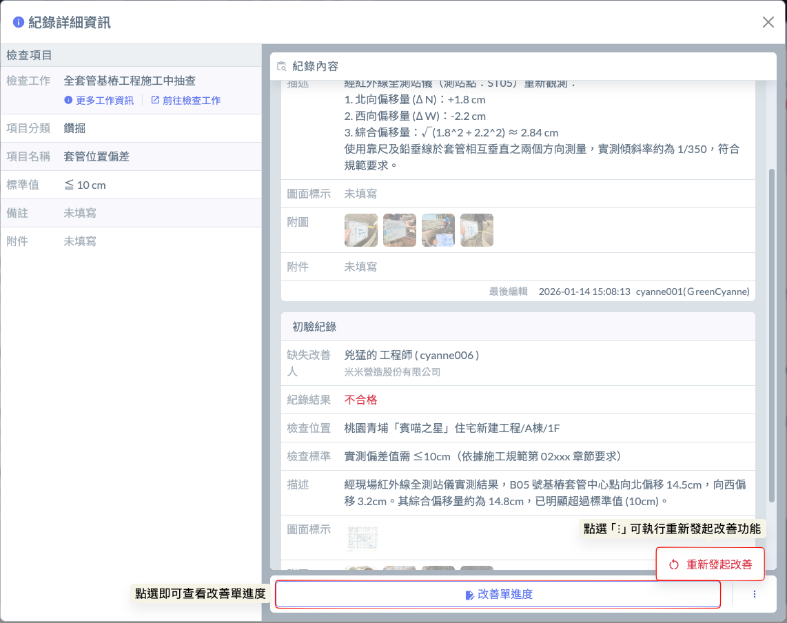
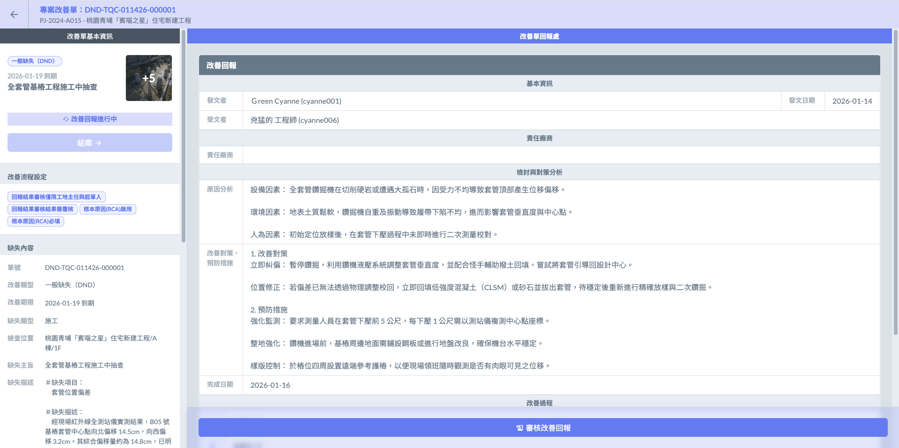
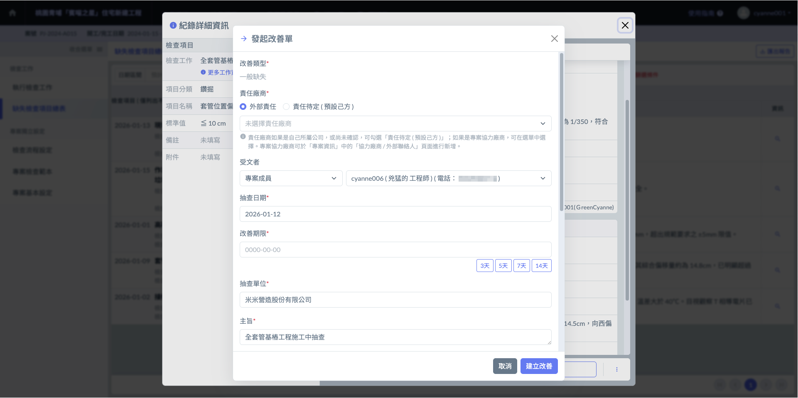
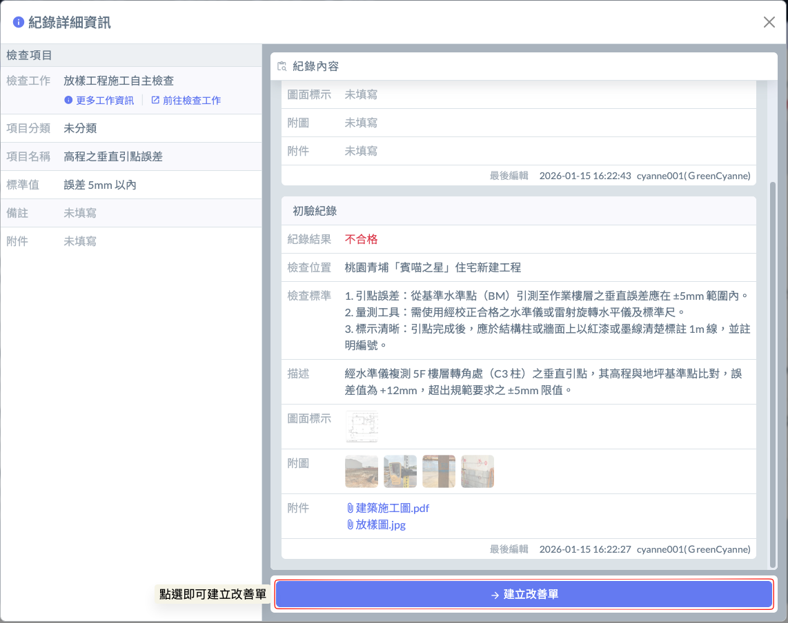
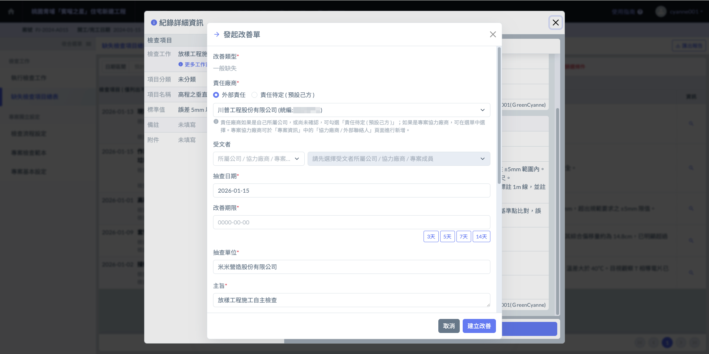

# 缺失檢查項目總表

---
description: Defect Management Dashboard
---

# 缺失檢查項目總表

這是一個專門為「解決問題」而設計的戰情中心。它將專案中分佈在各個分項工程、不同位置、不同時段的所有不合格紀錄全部提取出來，彙整成一個動態的全局清單。

『缺失檢查項目總表』的主要功能是集中顯示該專案下所有的不合格缺失項目。管理人員無需逐一開啟檢查表，即可在此一站式掌握全場品質現況，並針對尚未處理的缺失進行即時介入。

<table><thead><tr><th width="206.894287109375">功能特點</th><th>說明</th></tr></thead><tbody><tr><td>
跨檢查表彙整

(Cross-Table Aggregation)
</td><td>系統自動抓取所有檢查單（如：放樣、職安、高壓電巡檢等）中的『不合格』項目，統一呈現。這解決了管理人員過去需翻閱無數頁面才能找出漏掉哪項缺失改善的痛點。</td></tr><tr><td>
多維度智慧篩選

(Smart Filtering)
</td><td>
提供強大的篩選機制，讓管理效率倍增：
<ul><li><kbd>檢查人篩選</kbd>：快速查看『我負責的項目』，方便現場工程師聚焦個人待辦清單。</li><li><kbd>改善狀態篩選</kbd>： 快速過濾出『尚未發起改善』的項目，確保每一筆缺失都有被指派處理。</li><li><kbd>日期篩選</kbd>： 依據日期範圍進行分類查看。</li><li>
<kbd>範本標籤篩選</kbd>：這是最具彈性的管理維度。您可以依據在建立檢查表時自行設定的「標籤」進行篩選。例如：
<ul><li>標籤<kbd><mark style="color:purple;"><strong>重要缺失</strong></mark></kbd>： 立即篩選出會影響主結構或高危險性的核心問題。</li><li>標籤<kbd><mark style="color:purple;"><strong>2026 Q1稽核</strong></mark></kbd>： 快速取出針對特定稽核目標所設定的查驗項目。</li><li>標籤<kbd><mark style="color:purple;"><strong>外牆作業</strong></mark></kbd>： 跨不同分項工程，將所有與外牆相關的缺失（如：放樣誤差、吊車職安）一次集結。</li><li>

</li></ul></li></ul>

</td></tr><tr><td>
改善狀態追蹤

(Status Tracking)
</td><td>清晰顯示每一筆缺失目前的進度 — 是「已發起 / 未發起改善」</td></tr></tbody></table>

***

### 01｜查看檢查缺失

如圖一，進入檢查表模組後，點選 \[缺失檢查項目總表]，即可一覽該專案下所有的不合格檢查紀錄。為了幫助您聚焦待辦事項，系統預設會自動開啟篩選，僅顯示『檢查人為自己』且『改善狀態為尚未發起』的缺失項目。

!!! danger
    #### ⚠️ 注意事項及補充
    
    * **個人高效模式（預設）**： 一進入總表，系統會先幫您過濾出「您親自檢查發現，但還沒指派廠商改善」的項目。這能確保您每天開啟系統時，第一時間就能處理自己手頭上未完成的行政指派工作。
    * **全局管理模式（切換）：** 「若您是工地主任或品管主管，需要查看專案內『所有成員』回報的缺失，請務必記得手動關閉或重設篩選條件（如取消檢查人限制）。」 否則，您可能會因為預設篩選的關係，誤以為專案內目前沒有其他缺失紀錄。

如圖二，在檢查項目列表中，於欲查看之缺失右方點選  圖示，即可開啟彈出視窗查看該筆紀錄的詳細資訊（含初驗及複驗數據、描述與照片）。

如圖三，在紀錄詳細資訊視窗中，點選 ，即可展開查閱該檢查工作之背景詳細資訊。這能幫助管理人員在處理單一缺失點時，快速理解該項任務。

若尚需了解該缺失所屬的完整檢查脈絡，亦可透過視窗內的超連結 ，開啟新分頁直接跳轉至該筆檢查工作詳情頁面。

如圖四，檢查工作資訊頁面如下：

如圖五，檢查工作紀錄頁面如下：

***

### 02｜改善單相關

在缺失總表中，針對每一筆「不合格」項目，系統根據其改善狀態與使用者權限，提供精確的操作選項：



當缺失已進入整改程序時，系統提供持續監督的管道：

* **查看改善單進度：**&#x6240;有使用者皆可點選查看目前改善單的流轉狀態（例如：廠商是否已讀取、是否已回報完成）。
* **重新發起（管理權限專屬）：**「具管理權限人員或工地主任」 擁有更高階的操作權。若發現原發起的改善單內容有誤、指派對象不正確，或廠商處理不力需要撤回重發，管理者可執行「重新發起」，以修正管理指令。

改善單畫面如下：

點選<kbd><mark style="color:red;">**重新發起改善**<mark style="color:red;"></kbd>後，您需要再次填寫改善單，包含負責人、改善期限及整改要求等所有內容。




**即時發起改善：**「若該筆缺失尚未發起改善，則可直接針對該筆紀錄點選發起。」 這一操作會自動將該筆不合格的照片、描述與標準帶入改善單中，省去重複輸入的時間，讓現場工程師能快速指派協力廠商進行整改。

改善單發起畫面如下：

!!! info
    #### 補充說明
    
    1. 系統會自動將該筆不合格的缺失主旨、內容與照片帶入改善單中，確保負責人能精確掌握問題點，不需手動重複輸入。
    2. 您可以根據缺失程度自定義：
       * 受文者： 指派給外部廠商、分包商領班或檢查人自己。
       * 改善期限： 明確要求需在特定日期前完成整改回報。
       * 可於描述欄位針對該缺失給予具體的修復指引（如：除鏽後重新塗裝、重新校正垂直度等）。
    3. 每一筆紀錄只能個別發起一張改善單，實現「一缺失、一單號」的精細化管理，避免責任混淆。



