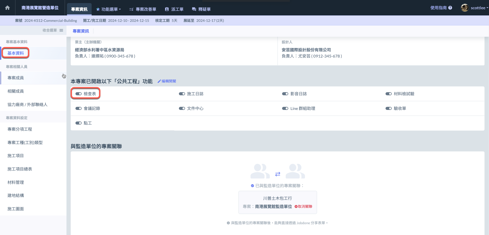
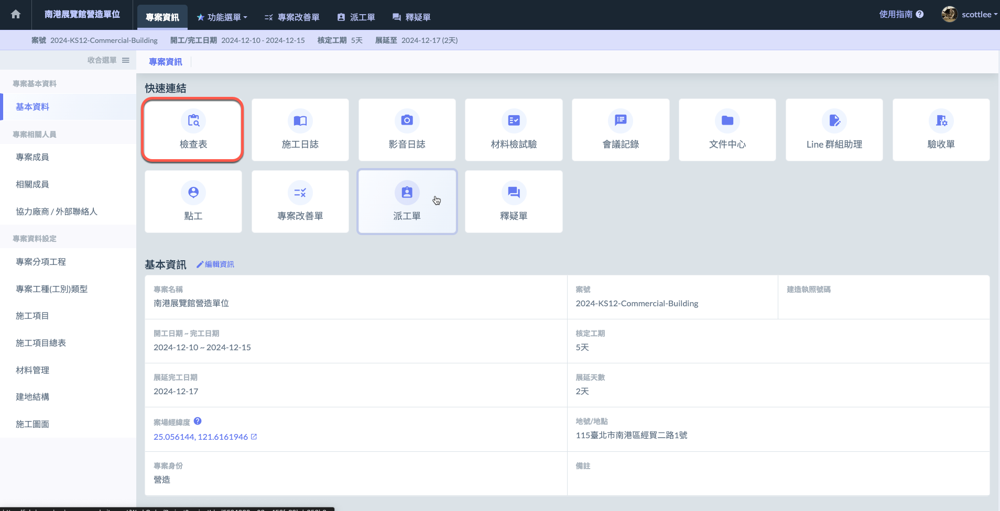
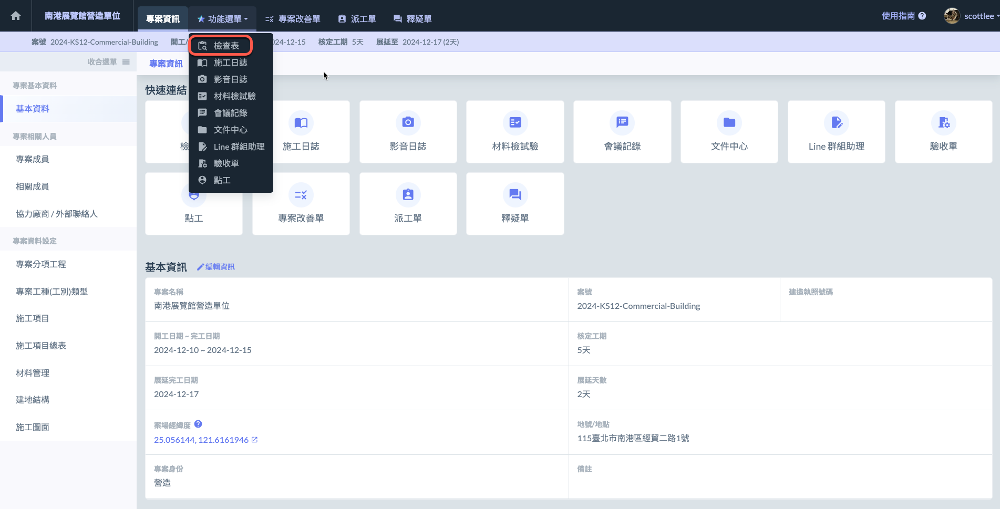

# 檢查表（舊

本軟體的檢查表功能根據不同角色屬性，賦予不同的操作權限與功能。

幫助使用者進行有效的品質管理與監控。

***

## 角色區分

### 監造單位

對於監造單位來說，檢查表提供了以下功能：

✔ **審查乙方品質管理計畫：**&#x76E3;造單位可檢查並審核乙方提出的品質管理計畫，確保其符合項目需求。

✔ **查證材料與設備：**&#x7528;於核對乙方所提供的材料和設備，確保其符合規範與標準。

✔ **查核施工作業：**&#x76E3;造單位可檢查施工過程中的各項作業，確認施工質量和流程是否符合要求。

!!! tip
    此功能有助於形成完整的二級品管流程，確保施工質量的全程監控。
    
    此外，針&#x5C0D;**「公共工程」**&#x7684;建案，軟體也提供「**材料檢試驗**」功能，針對施工材料進行抽樣檢測並記錄結果，確保材料品質符合施工要求。

***

### 營造單位

對於營造單位來說，檢查表提供了以下功能：

✔ **自主檢驗作業程序：**&#x71DF;造單位可根據內部要求，對承攬商的作業流程進行自我檢查，確保各項作業符合規範。

✔ **內部工程細項檢驗：**&#x5305;括對施工材料、施工過程、以及各項品管要求進行內部檢查與驗證，確保工程品質達標。

!!! tip
    此功能有助於形成完整的一級品管流程，並確保施工質量在每個階段都能得到有效控制。
    
    此外，針&#x5C0D;**「公共工程」**&#x7684;建案，營造單位同樣可以使&#x7528;**「材料檢試驗 」**&#x529F;能，針對施工材料進行抽樣檢測並記錄結果，以確保材料符合施工要求。

***

## 啟用檢查表

由專案管理員，於專案下的基本資料中啟&#x7528;**「檢查表」**&#x4EE5;使用檢查表功能。

開啟此功能後，即可透過功能選單或快速連結進入檢查表頁面。

***

