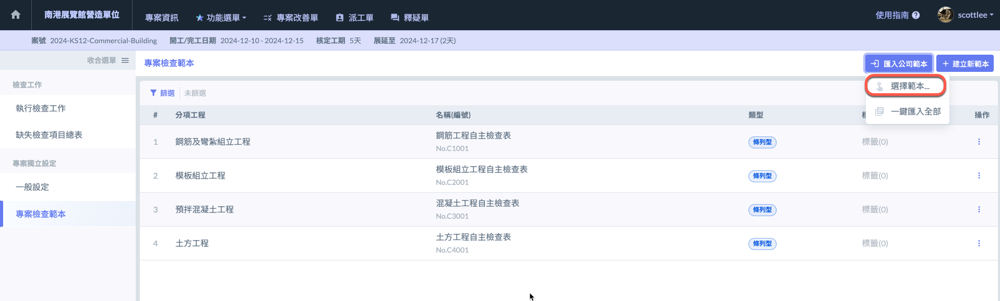
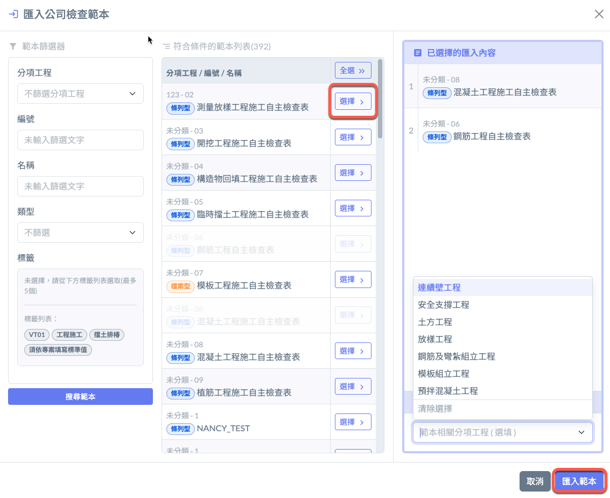
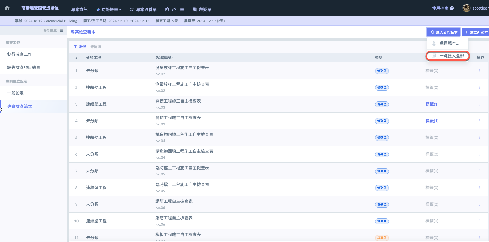
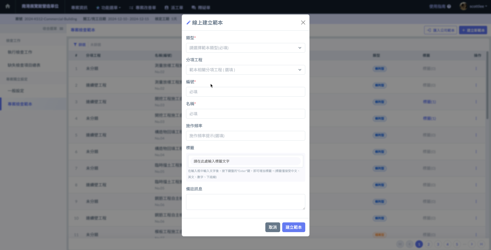

# 專案檢查範本

系統提&#x4F9B;**「匯入公司範本」**&#x53CA;**「自行建立檢查範本」**&#x5169;種方法建立檢查範本。

!!! warning
    檢查範本之設定僅能&#x65BC;**「網頁版」**&#x57F7;行。

***

## 匯入公司範本

系統提&#x4F9B;**「選擇匯入」**&#x53CA;**「一鍵匯入全部」**&#x5169;種方式。

!!! warning
    確&#x4FDD;**「公司通用設定」**&#x4E2D;&#x7684;**「公司自主檢查範本」**&#x5DF2;妥善建立資料。
    
    若後續在公司通用資料設定中更新公司自主檢查範本，則已放入專案中的範本**不會**受到影響。

### 選擇匯入

若您已建立公司自主檢查範本，點&#x64CA;**「匯入公司範本」之「選擇範本」**&#x958B;啟範本篩選器，設定篩選條件搜尋後，即可將指定項目匯入範本。

***

### 一鍵匯入全部

使&#x7528;**「一鍵匯入全部」**&#x529F;能可以直接將整份公司自主檢查範本作為專案範本使用。

!!! warning
    將完整導入整份公司範本，同名檢查範本亦會複製一份新的進入專案。

***

## 自行建立新範本

點選 **「 建立新範本 」** 即可建立專案內的檢查範本。若未指定分項工程則會被標示&#x70BA;**「未分類」**。  &#x20;

