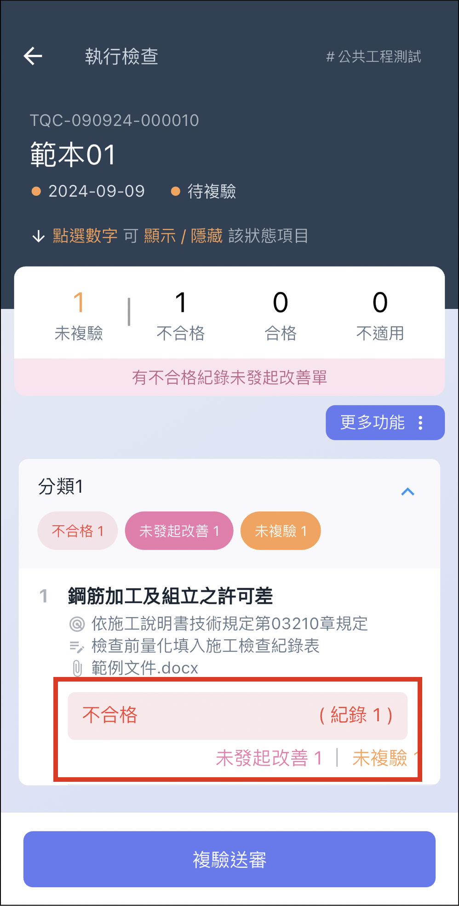
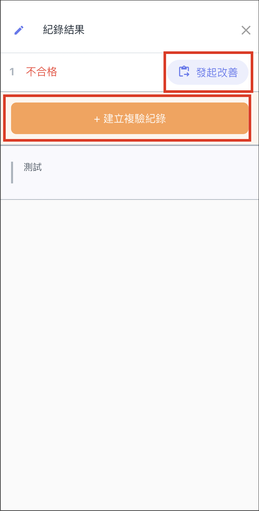
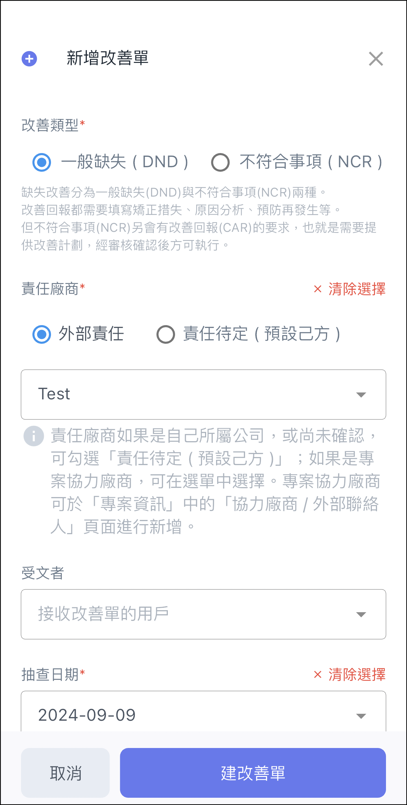
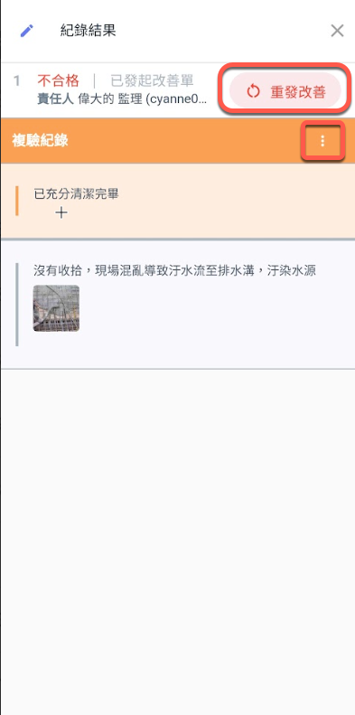
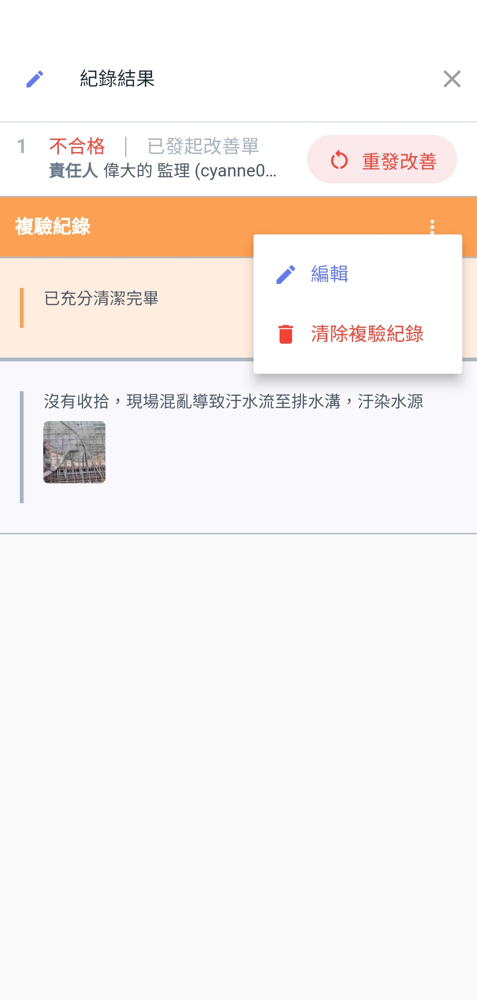
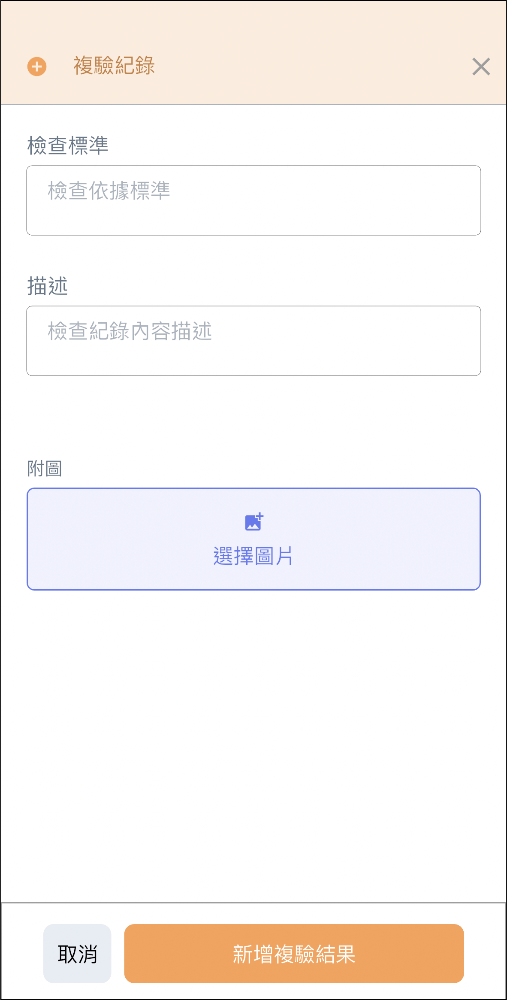

# APP 版

## 複驗

針對不合格的缺失項目，通常流程&#x70BA;**「發起改善」 ➙ 「改善回報」 ➙ 「複驗紀錄」。**

**詳細流程請參考  ➙  「** [**各設定之詳細簡介** ](broken-reference)**」** 與 **「** [**完整流程**](../wan-zheng-liu-cheng) **」**

***

### 尚未發出改善

初驗流程完成後，針&#x5C0D;**「不合格」**&#x7684;檢查項目，其紀錄結果介面會顯&#x793A;**「複驗紀錄」**&#x53CA;**「發起改善」**，點擊即可填寫複驗紀錄或發起改善單。

  

***

### 已發出改善

發出改善單後，&#x60A8;**「無法」**&#x65BC;檢查表查看改善單進度，只能前&#x5F80;**「專案改善單」**&#x529F;能查看。

僅能針對尚未回報的改善單重新發起改善。

 

***

### 填寫複驗紀錄

!!! warning
    針對每一筆檢查紀&#x9304;**，**&#x53EA;能填寫一&#x6B21;**「複驗紀錄」**。（檢查紀錄可有多筆）

