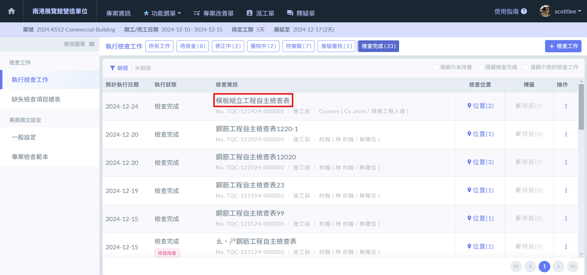
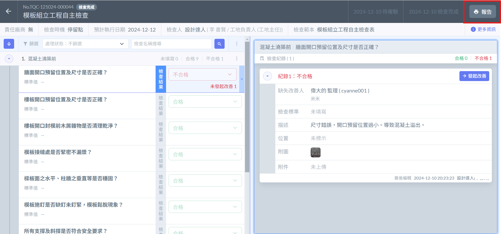
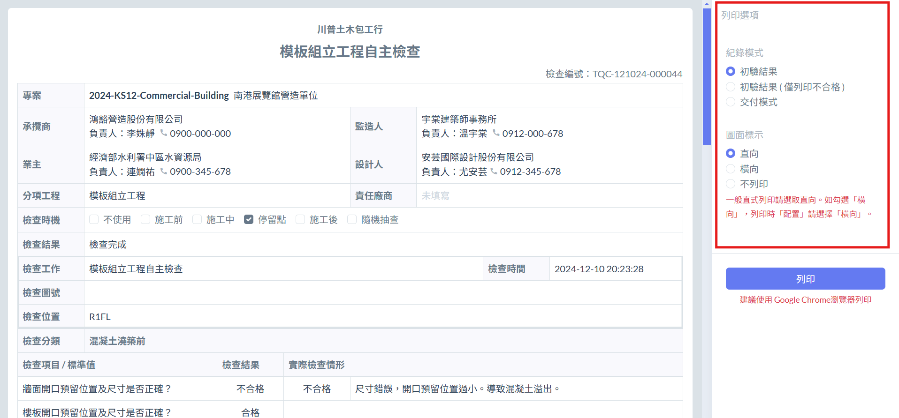

# 列印檢查報告

## 查看檢查資訊

點&#x64CA;**「檢查完成」**&#x7684;檢查表，進入內部以列印報告。

***

## 紀錄模式

系統給予以下三種紀錄：

1. **初驗結果**：列印所有檢查結果。
2. **初驗結果 ( 僅列印不合格 )：**&#x50C5;列印所有不合格的檢查項目。
3. **交付模式**：合格項目將全數列出。將依情形分&#x70BA;**「複驗 」**&#x8207;**「 未經複驗」**&#x7684;不合格項&#x76EE;**：**



若**不合格項目**經過**複驗**，將顯示**複驗結果**，並將該項目標記為**合格**（呈現改善後的最終結果）。



若**不合格項目**未經**複驗**，則該項目將被**隱藏**，不顯示於報告中。



!!! tip
    用於呈現原本為「**不合格的缺失項目」**&#x5728;經過**改善與複驗**後的**最終結果**，以清晰展現改善後的合格狀態，確保報告內容更為精煉且具備交付標準。

{% embed url="https://files.gitbook.com/v0/b/gitbook-x-prod.appspot.com/o/spaces%2FEqUCL3D5WQfpxJw8NL3P%2Fuploads%2FKYOXk3KGhrNXJzyX6Q3t%2F%E9%8C%84%E8%A3%BD%E5%85%A7%E5%AE%B9%202024-12-24%20015003.mp4?alt=media&token=7ec347d1-4f20-4964-8fa0-762e9d42de63" %}
