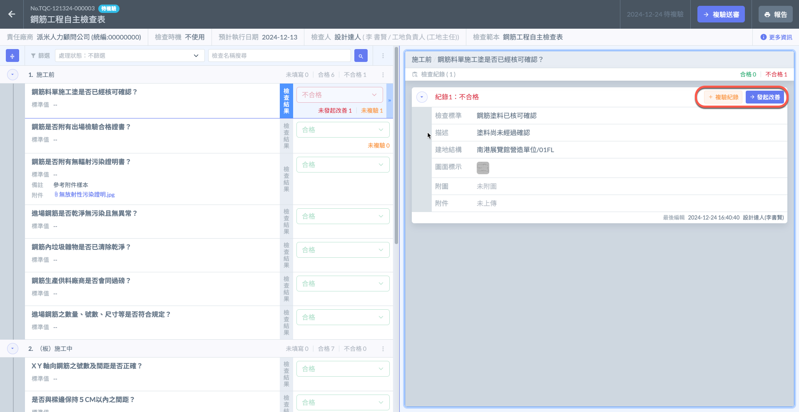
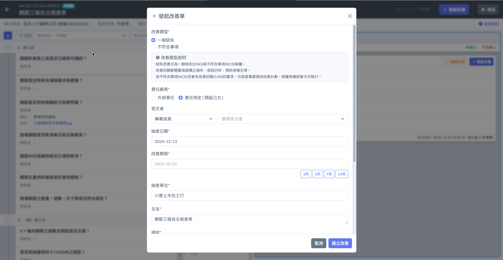
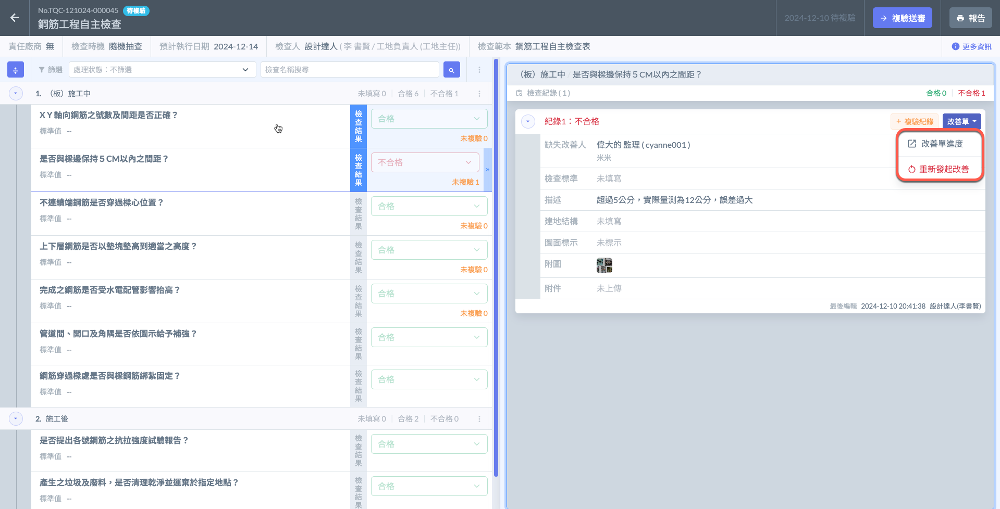
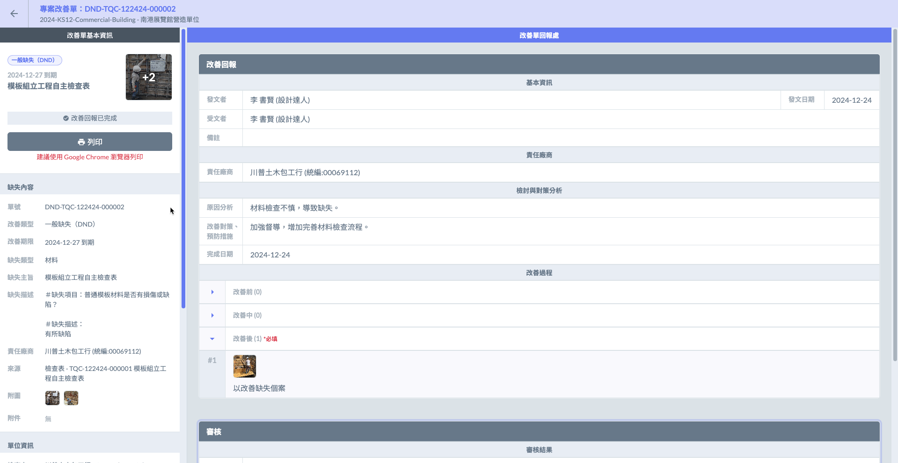
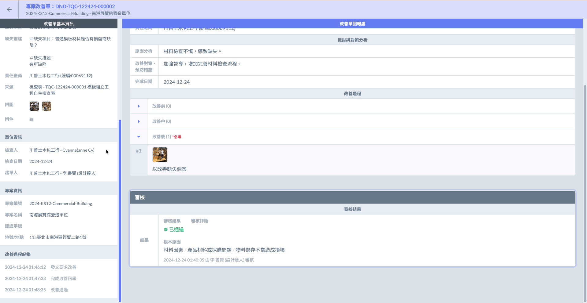
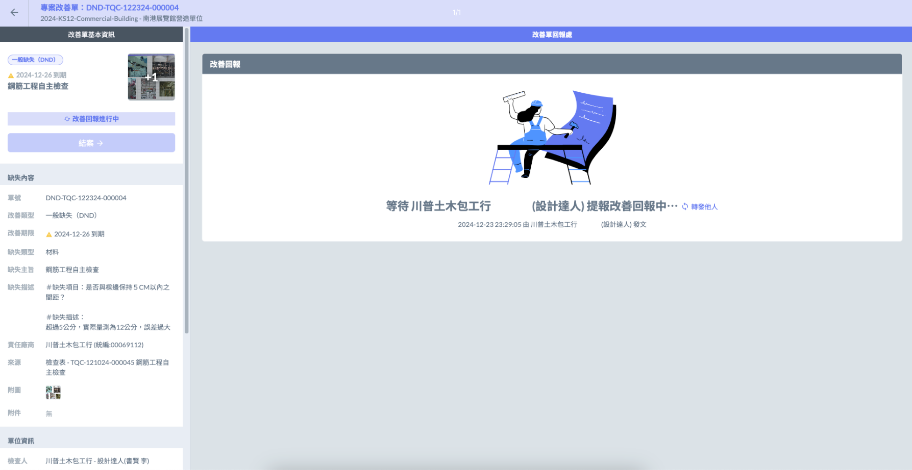
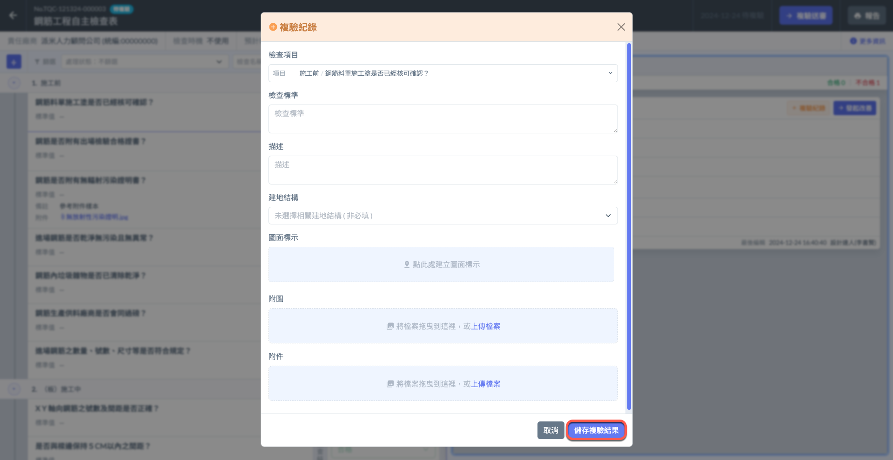
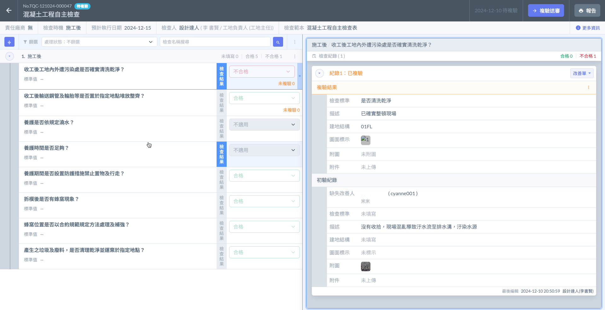

# 網頁版

## 複驗

針對不合格的缺失項目，通常流程&#x70BA;**「發起改善」 ➙ 「改善回報」 ➙ 「複驗紀錄」。**

**詳細流程請參考  ➙  「** [**各設定之詳細簡介** ](broken-reference)**」** 與 **「** [**完整流程**](../wan-zheng-liu-cheng) **」**

***

### 尚未發出改善

初驗流程完成後，針&#x5C0D;**「不合格」**&#x7684;缺失項目，其檢查紀錄會顯&#x793A;**「複驗紀錄」**&#x53CA;**「發起改善」**，點擊即可填寫複驗紀錄或發起改善單。

***

### 已發出改善

若已發出改善單，您將可以查看改善單進度。

點&#x64CA;**「改善單進度」**&#x5F8C;，將會連結到專案改善單，可查看該改善單之詳細資料。（查看圖二、圖三、圖四）

**已回報的改善單**

**尚未回報的改善單**

***

### 填寫複驗紀錄

!!! warning
    針對每一筆檢查紀&#x9304;**，**&#x53EA;能填寫一&#x6B21;**「複驗紀錄」**。（檢查紀錄可有多筆）

