# 執行檢查

## 01｜進入驗收紀錄列表

依據使用者是否為首次填寫驗收紀錄，畫面顯示內容將略有不同：



使用者**首次**進行驗屋選擇，且尚未填寫任何驗收檢查紀錄 (如缺失項目、同意事項與建議事項)。



使用者**已完成**任一階段之驗收檢查 (<kbd><mark style="color:red;">**自驗**<mark style="color:red;"></kbd>、<kbd><mark style="color:green;">**初驗**<mark style="color:green;"></kbd>、<kbd><mark style="color:blue;">**複驗**<mark style="color:blue;"></kbd>），並已填寫相關驗收紀錄 (如缺失項目、同意事項及建議事項)。



### 01 - 1 ｜首次填寫

如圖一\~三所示，進入驗收單頁面後，於欲執行檢查之驗收標的下方點&#x9078;**「執行檢查」**，選擇驗收狀態，並填寫檢查日期與天氣狀況後，即可開始新增驗收紀錄內容。

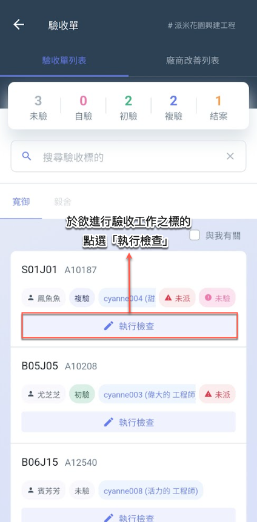 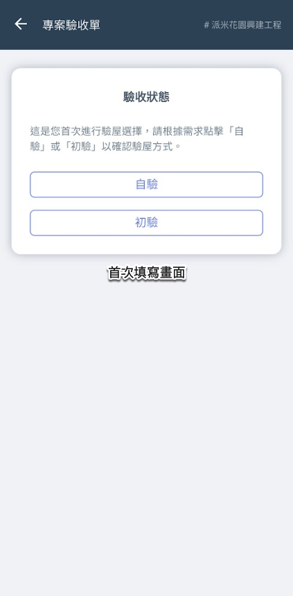 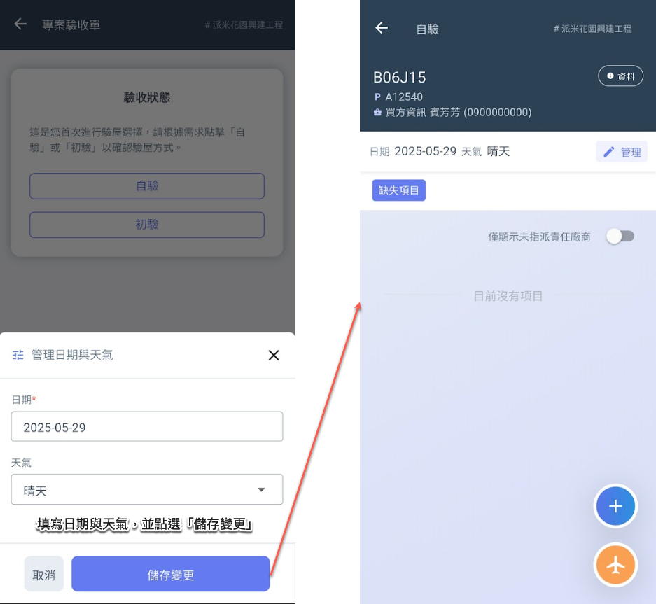

### 01 - 2｜非首次填寫

如圖四\~五所示，進入驗收單頁面後，於欲執行檢查之驗收標的下方點&#x9078;**「執行檢查」**，選擇驗收狀態後，即可查看先前已填寫之紀錄項目，並可新增驗收紀錄內容。

 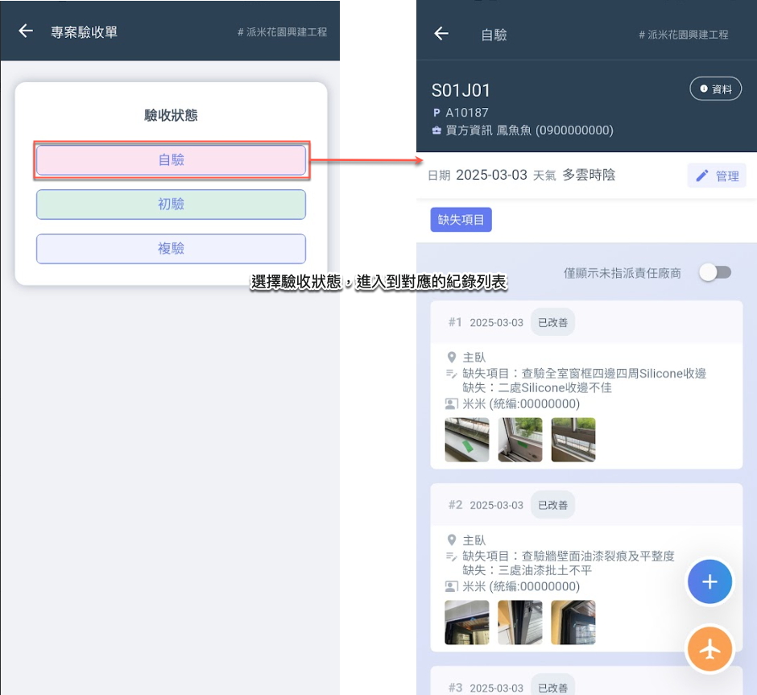

***

<table><thead><tr><th width="86.093994140625">驗收階段</th><th width="492.8358154296875">驗收對象</th><th width="281.537841796875">作業目的</th><th width="254.73291015625">紀錄內容</th><th>日期設定方式</th><th width="133.740234375">是否需要客戶簽名</th></tr></thead><tbody><tr><td>自驗</td><td>
第一級驗收：由承造人辦理自主檢查與修繕。

第二級驗收：由起造人會同監造人，辦理承造人施作之工程驗收。
</td><td>內部自主檢查，提前發現問題</td><td>缺失項目</td><td>統一設定</td><td>否</td></tr><tr><td>初驗</td><td>第三級驗收：由起造人會同承造人，辦理承購客戶之交屋驗收。</td><td>第三級驗收首次進行</td><td>缺失項目、同意事項、建議事項</td><td>統一設定</td><td>是</td></tr><tr><td>複驗</td><td>同如第三級，但為針對<strong>初驗階段所列缺失進行改善後之再次查驗</strong>。</td><td>缺失改善後再次查驗，可能執行多次</td><td>缺失項目、同意事項、建議事項</td><td>可個別設定</td><td>是</td></tr></tbody></table>

!!! warning
    請注意：在進行驗收紀錄填寫前，務必先於網頁版系統中&#x7684;**「空間設定」**&#x529F;能，完成所需驗收空間之編列。\
    詳細操作流程，請參閱 ➙ [space-settings](../../web-based/system-settings/space-settings "mention")

***

## 02｜自驗

驗收流程說明

第一級驗收：由承造人辦理自主檢查及修繕。

第二級驗收：由起造人會同監造人，辦理承造人施作之工程驗收。

!!! info
    當驗收狀態為『自驗』時，系統將不提供<kbd>**同意事項**</kbd>與<kbd>**建議事項**</kbd>之編輯功能，以確保操作流程與介面的一致性。  <kbd>**同意事項**</kbd>與<kbd>**建議事項**</kbd>僅適用於初驗或複驗等需與客戶進行交辦作業之情境。
    
    該階段重點在於內部查核與缺失確認，作為正式對外驗收前之準備依據。

### 02 - 1｜新增紀錄

!!! tip
    當遇到無網路或訊號不穩中斷的情況時，系統提&#x4F9B;**「離線上傳」**&#x529F;能，使用者仍可離線填寫驗收紀錄，並於網路恢復後一次上傳資料。
    
    詳細操作流程，請參閱 ➙ [offline-upload](conduct-inspection/offline-upload "mention")

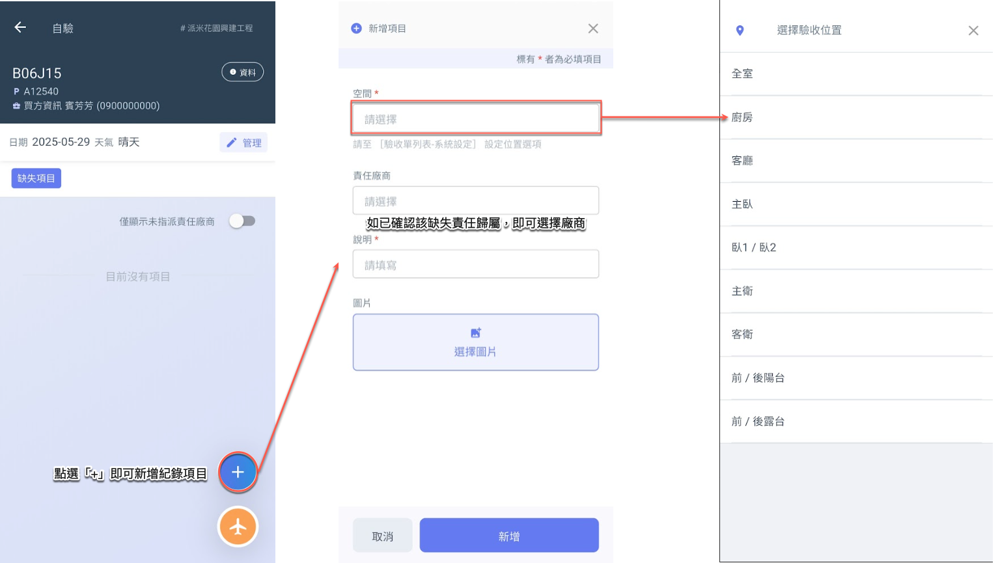

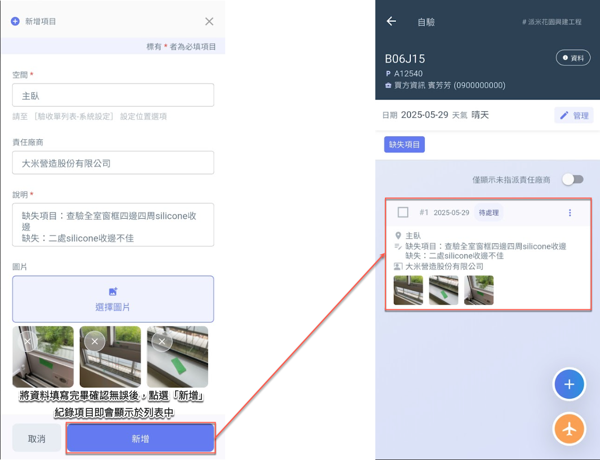

***

### 02 - 2｜編輯/刪除紀錄

#### 編輯紀錄

於欲編輯之紀錄項目右側，點&#x9078;**「⋮」**&#x9078;單中&#x7684;**「編輯」**，即可修改既有資料，並指定該缺失項目的責任廠商。

!!! tip
    由於新增缺失紀錄時，實務上可能尚未確認該項缺失之實際責任廠商。
    
    因此您可於驗收紀錄新增後，透&#x904E;**「批次勾選指派協力廠商」**&#x529F;能，統一指派多筆缺失項目之負責單位，提升作業效率並強化後續追蹤管理。
    
    有關指定責任廠商之相關操作，請參閱 **➙** [que-ren-que-shi-gui-shu](conduct-inspection/que-ren-que-shi-gui-shu "mention")

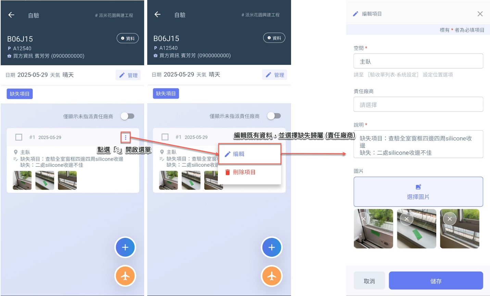

#### 刪除紀錄

於欲刪除之紀錄項目右側，點&#x9078;**「⋮」**&#x9078;單中&#x7684;**「刪除」**，即可刪除該筆缺失紀錄。

!!! warning
    請注意：
    
    1. 僅尚未完成改善之缺失項目可進行刪除。
    2. 紀錄一經刪除後即無法復原，務必謹慎操作。

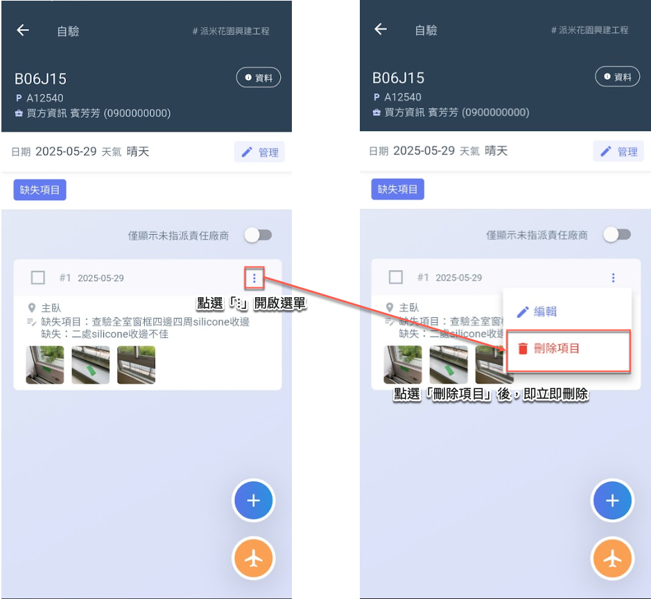

***

## 03｜初驗

系統中的「初驗」狀態對應於**第三級驗收作業**，即由承造人會同客戶進行之全面性驗收檢查。

因此，在此階段除需填寫**缺失項目**外，亦需完整記錄<kbd>**同意事項**</kbd>與<kbd>**建議事項**</kbd>，並於驗收作業完成後**由客戶進行簽收確認**，作為驗收結果之正式依據。

驗收流程說明

第三級驗收：由起造人會同承造人，辦理承購客戶之交屋驗收。

### 03 - 1｜新增紀錄

!!! tip
    當遇到無網路或訊號不穩中斷的情況時，系統提&#x4F9B;**「離線上傳」**&#x529F;能，使用者仍可離線填寫驗收紀錄，並於網路恢復後一次上傳資料。
    
    詳細操作流程，請參閱 ➙ [offline-upload](conduct-inspection/offline-upload "mention")

#### 切換頁籤

請先選擇欲填寫之紀錄事項 (<kbd>**缺失項目**</kbd>、<kbd>**同意事項**</kbd>及<kbd>**建議事項**</kbd>)。

點選欲操作之頁籤，即可針對該頁內容進行填寫紀錄。

!!! warning
    請注意，在填寫驗收紀錄前，務必確認目前所在頁面，確保於正確的頁面中編列對應的紀錄項目。

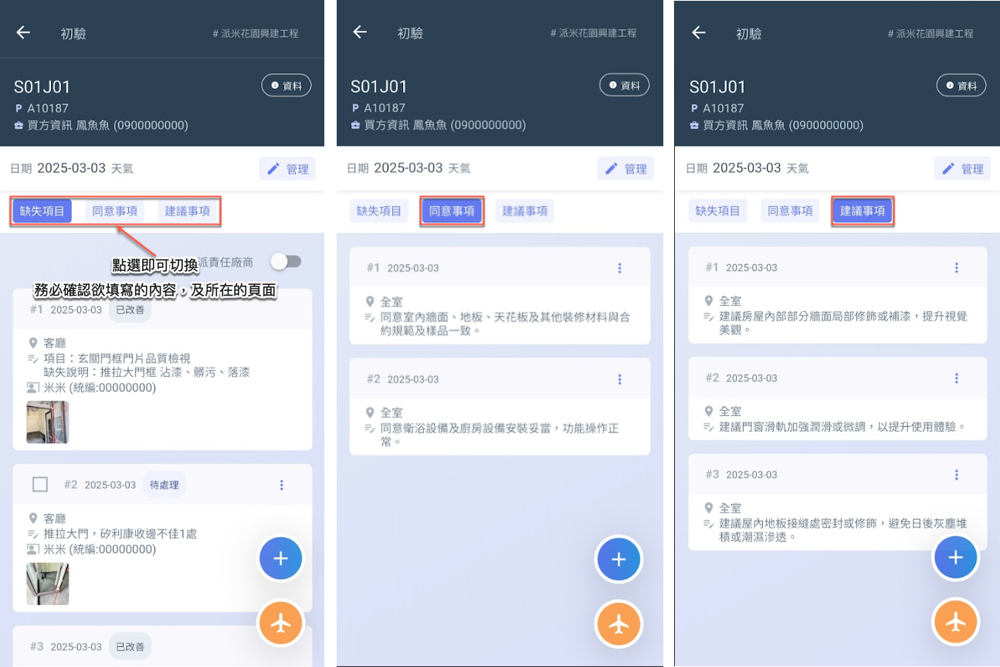

#### 新增紀錄

確認所在頁面無誤後，點選右下角&#x7684;**「+」**&#x6309;鈕，即可進入新增頁面，選擇驗收空間並填寫相關紀錄內容。

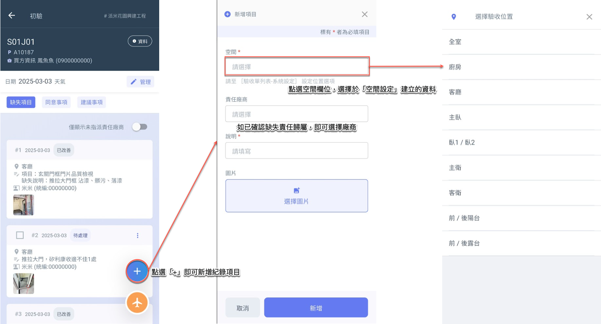

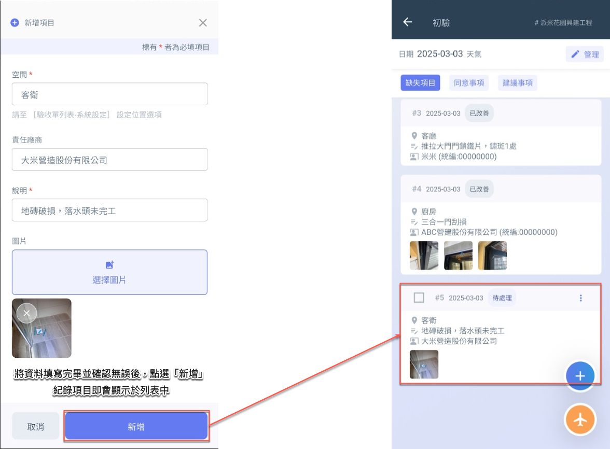

### 03 - 2｜編輯/刪除紀錄

#### 編輯紀錄

於欲編輯之紀錄項目右側，點&#x9078;**「⋮」**&#x9078;單中&#x7684;**「編輯」**，即可修改既有資料，並指定該缺失項目的責任廠商。

!!! tip
    由於新增缺失紀錄時，實務上可能尚未確認該項缺失之實際責任廠商。
    
    因此您可於驗收紀錄新增後，透&#x904E;**「批次勾選指派協力廠商」**&#x529F;能，統一指派多筆缺失項目之負責單位，提升作業效率並強化後續追蹤管理。
    
    有關指定責任廠商之相關操作，請參閱 **➙** [que-ren-que-shi-gui-shu](conduct-inspection/que-ren-que-shi-gui-shu "mention")

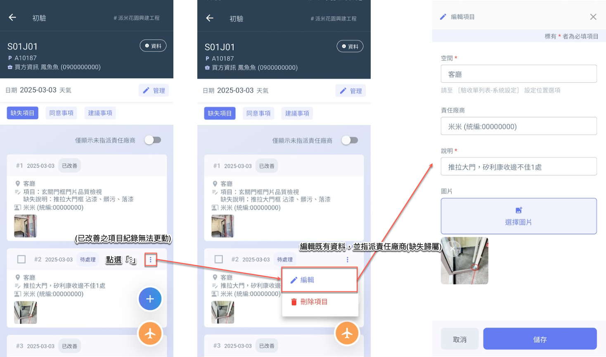

#### 刪除紀錄

於欲刪除之紀錄項目右側，點&#x9078;**「⋮」**&#x9078;單中&#x7684;**「刪除」**，即可刪除該筆缺失紀錄。

!!! warning
    請注意：
    
    1. 僅尚未完成改善之缺失項目可進行刪除。
    2. 紀錄一經刪除後即無法復原，務必謹慎操作。

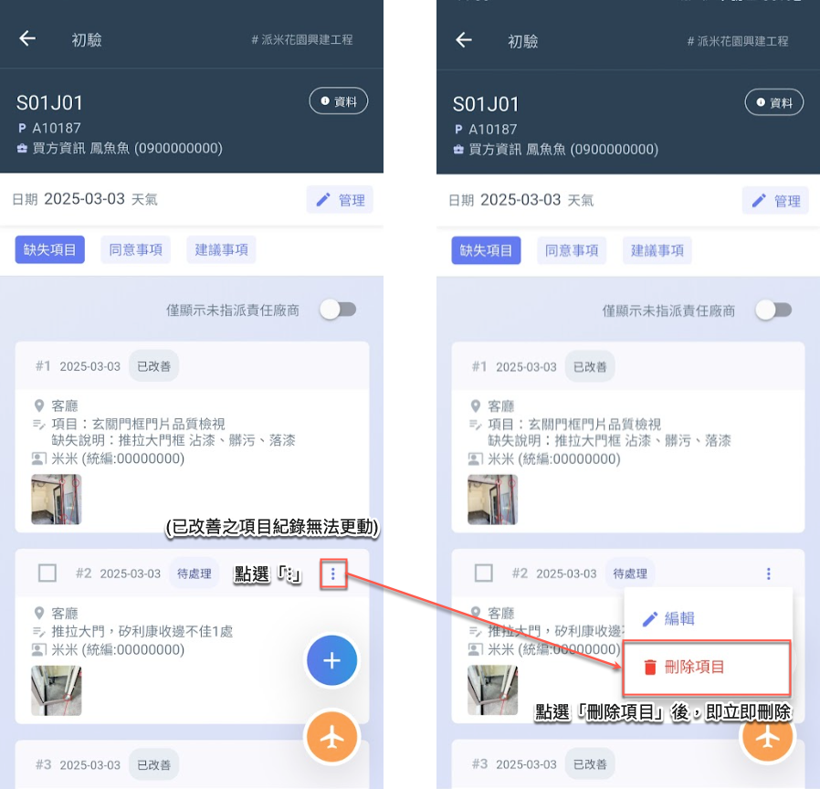

***

## 04｜複驗

系統中的「複驗」同屬於**第三級驗收作業**範疇，與初驗相同，皆為承造人會同客戶執行之全盤驗收流程。

差異在於，「初驗」為第三級驗收之第一次全面檢查，而「複驗」則為針對**初驗階段所列缺失進行改善後之再次查驗**。若改善未完全，可能需進行多次複驗，直至所有缺失確認完成為止。

因此，在「複驗」階段的作業上，有以下特殊性需特別留意：

* **每筆紀錄項目（包含缺失項目、同意事項、建議事項）皆可獨立指定日期**
* 相較於自驗與初驗之日期為統一設定，複驗需因應實際缺失修復進度，日期不盡相同

此設計可確保複驗流程具備**彈性與真實性**，並提供明確的歷程紀錄，方便後續查閱與缺失追蹤。

驗收流程說明

第三級驗收：由起造人會同承造人，辦理承購客戶之交屋驗收。

### 04 - 1｜新增紀錄

!!! tip
    當遇到無網路或訊號不穩中斷的情況時，系統提&#x4F9B;**「離線上傳」**&#x529F;能，使用者仍可離線填寫驗收紀錄，並於網路恢復後一次上傳資料。
    
    詳細操作流程，請參閱 ➙ [offline-upload](conduct-inspection/offline-upload "mention")

#### 切換頁籤

請先選擇欲填寫之紀錄事項 (<kbd>**缺失項目**</kbd>、<kbd>**同意事項**</kbd>及<kbd>**建議事項**</kbd>)。

點選欲操作之頁籤，即可針對該頁內容進行填寫紀錄。

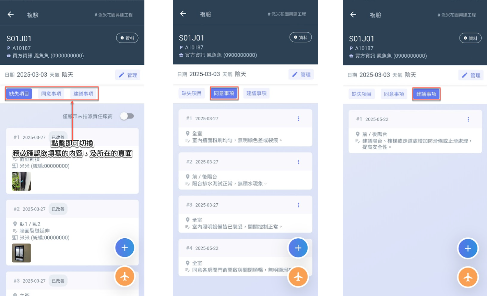

#### 新增紀錄

確認所在頁面無誤後，點選右下角&#x7684;**「+」**&#x6309;鈕，即可進入新增頁面，選擇驗收空間並填寫相關紀錄內容。

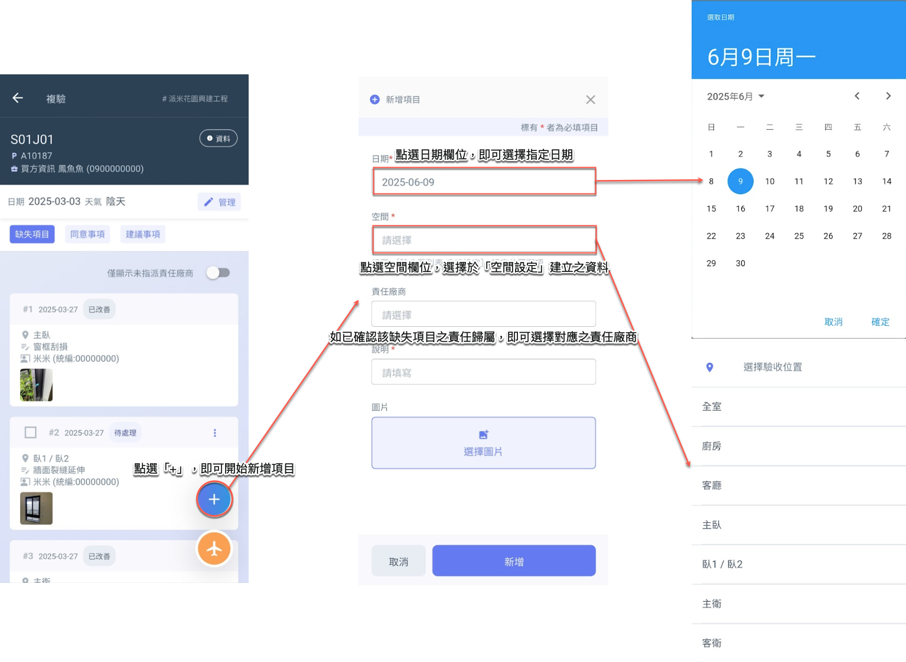

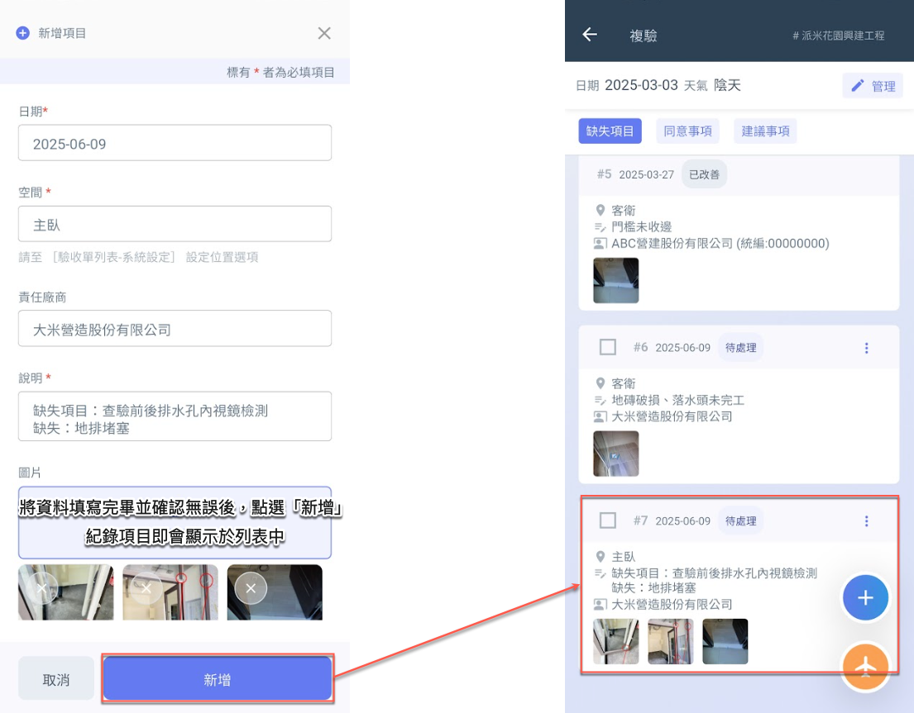

***

### 04 - 2｜編輯/刪除紀錄

#### 編輯紀錄

於欲編輯之紀錄項目右側，點&#x9078;**「⋮」**&#x9078;單中&#x7684;**「編輯」**，即可修改既有資料，並指定該缺失項目的責任廠商。

!!! tip
    由於新增缺失紀錄時，實務上可能尚未確認該項缺失之實際責任廠商。
    
    因此您可於驗收紀錄新增後，透&#x904E;**「批次勾選指派協力廠商」**&#x529F;能，統一指派多筆缺失項目之負責單位，提升作業效率並強化後續追蹤管理。
    
    有關指定責任廠商之相關操作，請參閱 **➙** [que-ren-que-shi-gui-shu](conduct-inspection/que-ren-que-shi-gui-shu "mention")

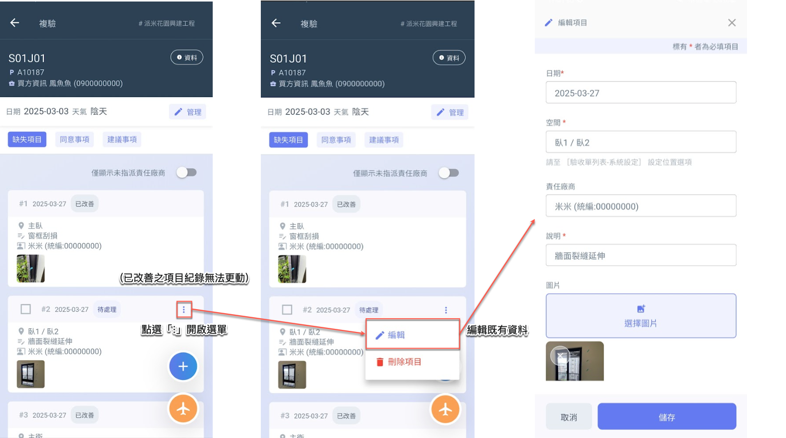

#### 刪除紀錄

於欲刪除之紀錄項目右側，點&#x9078;**「⋮」**&#x9078;單中&#x7684;**「刪除」**，即可刪除該筆缺失紀錄。

!!! warning
    請注意：
    
    1. 僅尚未完成改善之缺失項目可進行刪除。
    2. 紀錄一經刪除後即無法復原，務必謹慎操作。

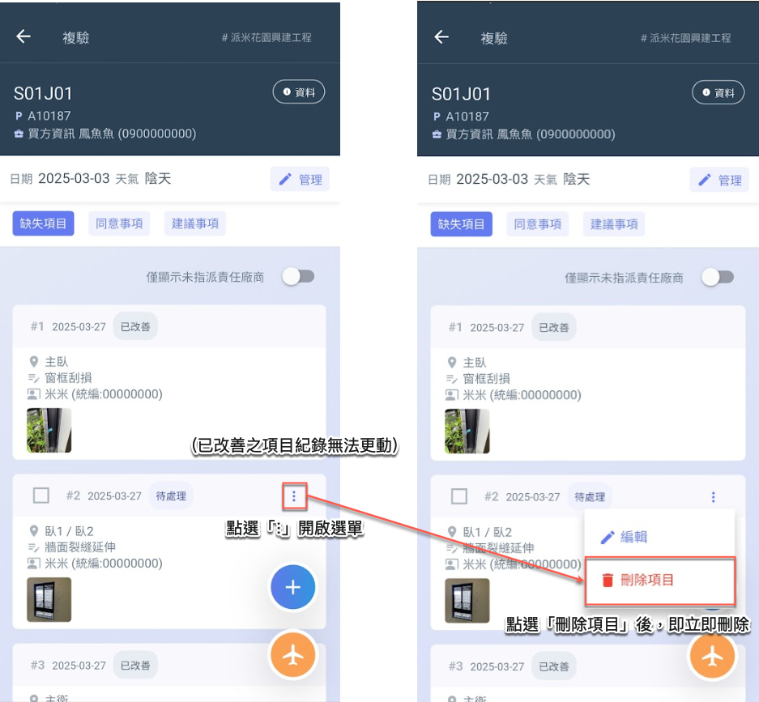
