# 交屋點交文件

---
description: Handover and Acceptance Documents
---

# 交屋點交文件

以下為網頁版與 App 版在交屋文件相關功能上的差異對照表：

網頁版詳細操作流程，請參閱 ➙ [handover-and-acceptance-documents](../../../web-based/system-settings/handover-and-acceptance-documents "mention")

<table><thead><tr><th>功能</th><th data-type="checkbox">網頁版</th><th data-type="checkbox">App版</th></tr></thead><tbody><tr><td>版本 - 新增/ 編輯/刪除</td><td>true</td><td>false</td></tr><tr><td>分類 - 新增</td><td>true</td><td>true</td></tr><tr><td>點交項目 - 新增/編輯/刪除</td><td>true</td><td>true</td></tr><tr><td>版本 - 套用/複製</td><td>true</td><td>false</td></tr><tr><td>分類 - 編輯</td><td>true</td><td>true</td></tr><tr><td>分類 - 刪除</td><td>true</td><td>false</td></tr><tr><td>設備點交確認簽名</td><td>false</td><td>true</td></tr></tbody></table>

***

## 01｜執行前提



### 確認操作之標的已套用版本

下圖為已套用文件版本與未套用文件版本之範例：

**如何套用文件版本？**&#x8A73;細操作說明，請參閱 ➙ [#id-01-3-ban-ben-tao-yong](../../../../web-based/system-settings/handover-and-acceptance-documents/other-related-actions#id-01-3-ban-ben-tao-yong "mention")          &#x20;

!!! tip
    驗收標的一經文件版本套用後 (即使該版本下無任何點交項目)，即可於自行建立該標的之點交項目。

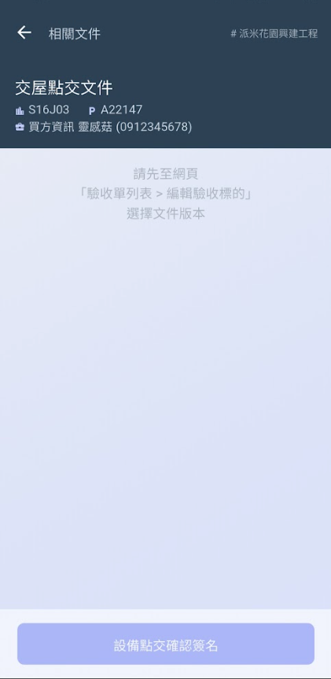 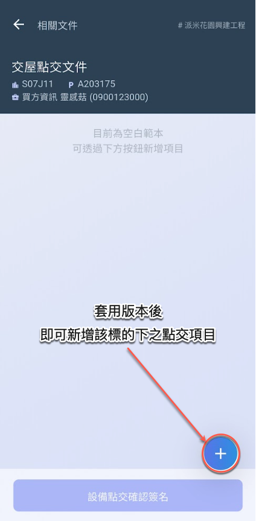

進入交屋點交文件主頁面後，於已建立之文件版本右側點&#x64CA;**「⋮」**&#x5716;示，即可展開功能選單。

點&#x9078;**「套用」**&#x5F8C;，便可選擇驗收標的，並將該文件版本套用至所選的驗收標的。

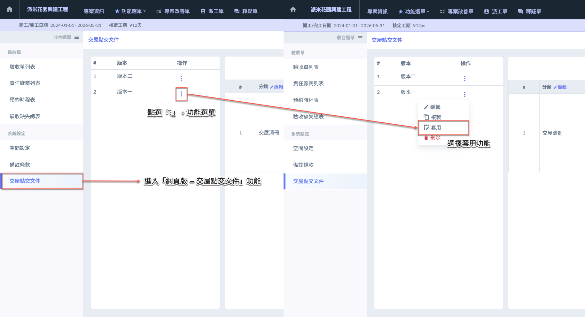

如圖四所示，進&#x5165;**「套用版本」**&#x9801;面後，點選上方的篩選欄位(預設<kbd>**未套用**</kbd>)，即可依&#x64DA;**「未套用」**&#x6216;**「已套用」**&#x7BE9;選驗收標的。

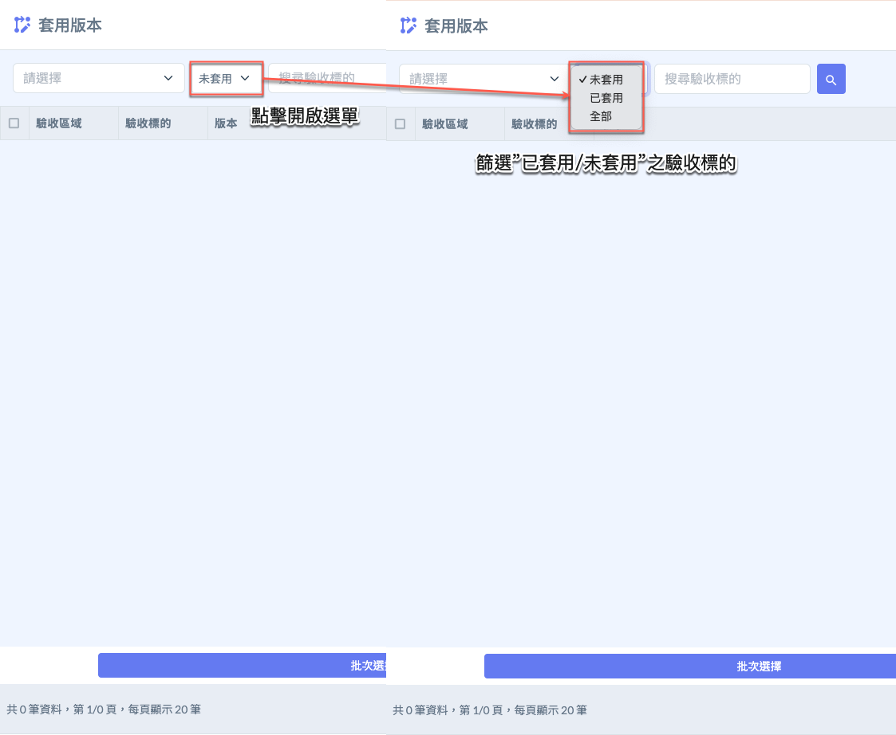



### 進入文件功能

如(圖一 & 圖二)所示，進入專案驗收單主頁面後，點選右上角&#x4E4B;**「驗收報告」**&#x5373;可開啟選。

選擇相關文件下&#x4E4B;**「交屋移交文件」**，點交文件預設畫面(如圖三)。

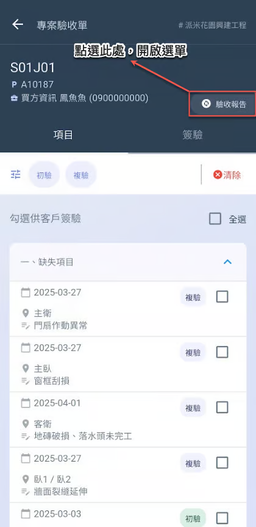 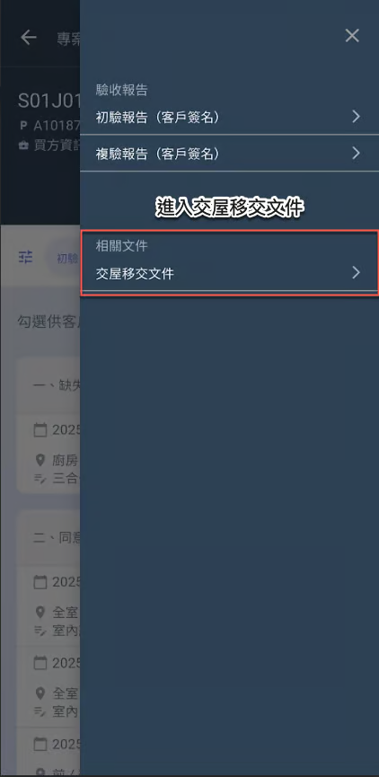 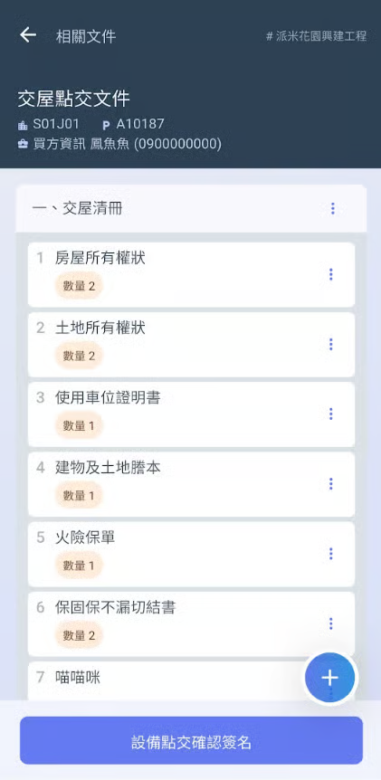




***

## 02｜新增點交項目

如圖一 \~ 三進入**交屋點交文件**主頁面後，點&#x9078;**「+」**&#x5373;可進入新增畫面，選擇分類並填寫欲新增之點交項目。

!!! warning
    請注意，由於各驗收標的需有對應之文件版本使能操&#x4F5C;**「交屋移交文件」**&#x529F;能，務必確認已有版本套用於標的中。

 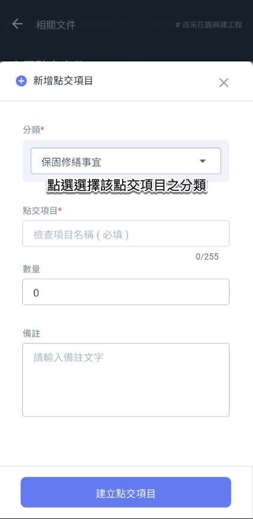 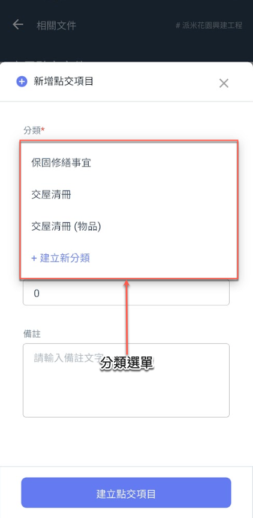

如圖四，將資料填妥並確認無誤後，點&#x9078;**「建立點交項目」**&#x5373;可儲存本次新增資料。

成功建立之點交項目即會顯示於點交文件列表中。

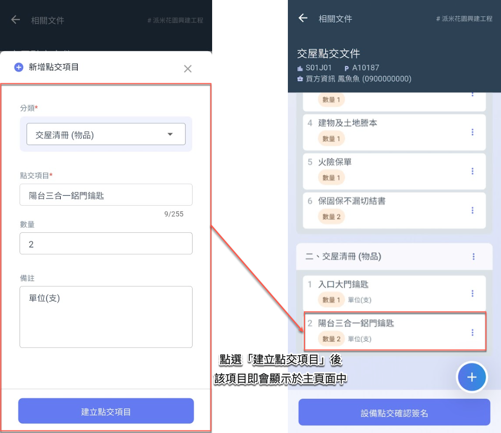

***

### 02 - 1｜建立新分類

如圖五 \~ 七，進入新增點交項目頁面後，點選分類欄位開啟選單，即可執&#x884C;**「+建立新分類」**。

如圖八所示，輸入新分類並填妥其點交項目後，點選下方&#x4E4B;**「建立點交項目」**&#x5373;可。

!!! warning
    請注意：
    
    1. 您**無法**於App中刪除交屋點交文件之已有分類。
    2. 所建立之分類不會同步於對應版本，僅會同步新增該標的所使用的點交文件中。
    3. 如您直接於網頁版修改點交文件資訊，請務必**重新套用**於對應標的。
    
    (流程：先行於網頁中建立交屋點交文件資料 ➙ 套用於特定驗收標的 ➙ 針對各標的內的文件內容進行編輯)

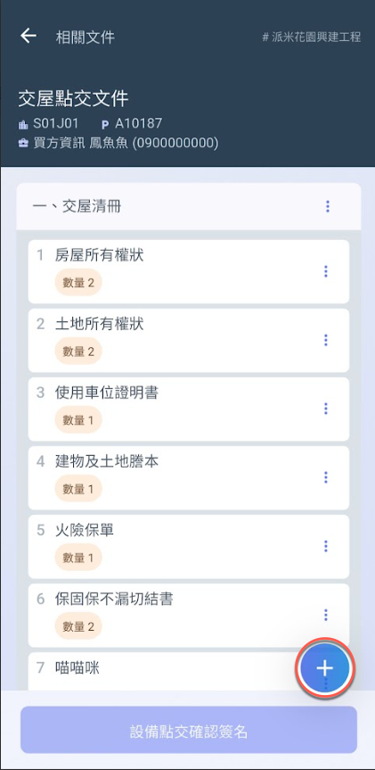 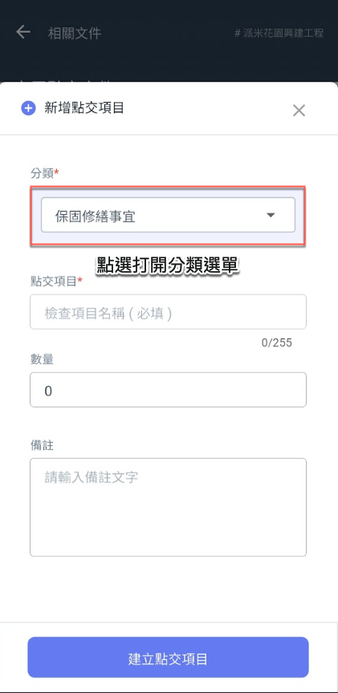 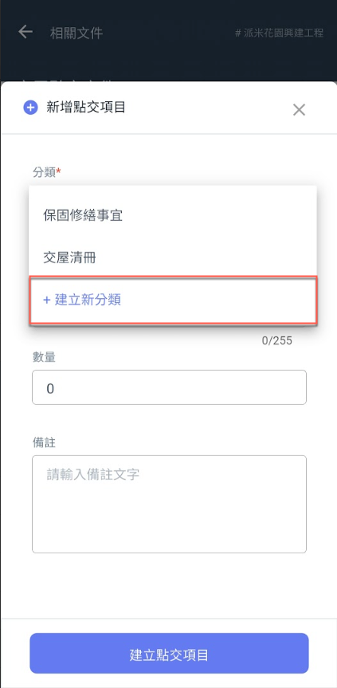 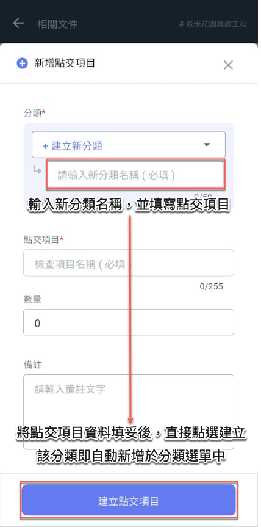

如圖九，輸入新分類並成功建立該點交項目後，即可於分類選單查看並選用。

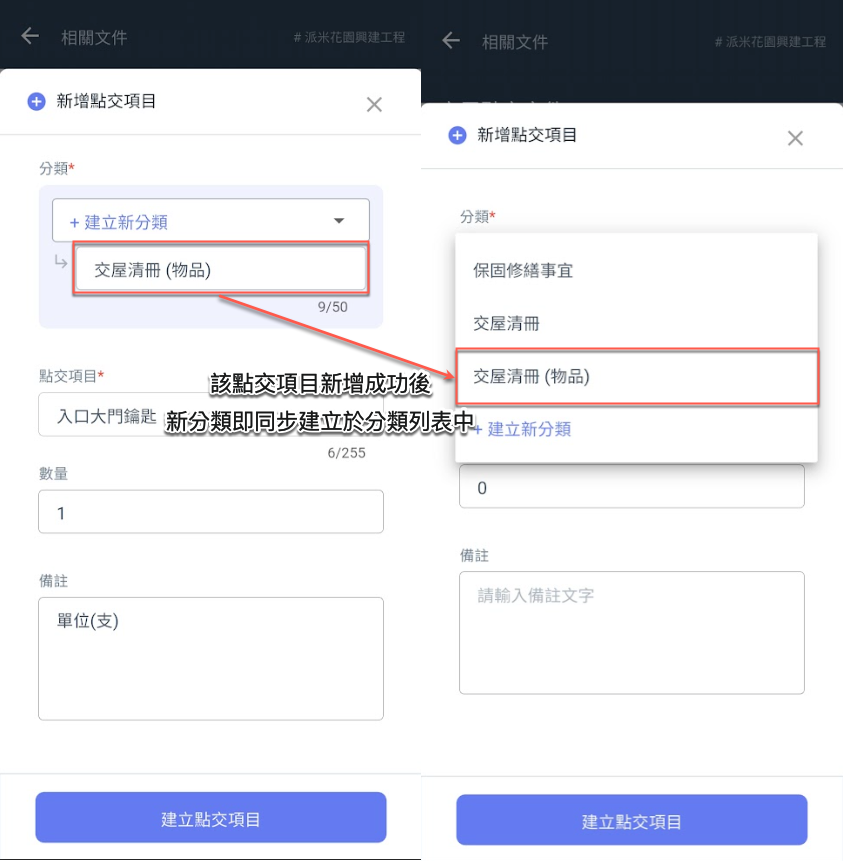

***

## 03｜編輯/刪除點交項目

### 03 - 1｜編輯點交項目

如圖一，於欲編輯之項目右側，點&#x9078;**「⋮」**&#x958B;啟選單。點&#x9078;**「編輯」**，即可修改該點交項目之資料。

(包含：分類、項目名、數量及備註)，修改完畢並確認資料無誤後，點選下&#x65B9;**「建立點交項目」**，即修改完成。

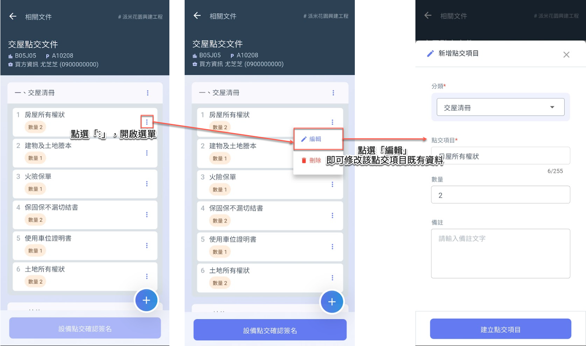

***

### 03 - 2｜刪除點交項目

如圖二，於欲刪除之項目右側，點&#x9078;**「⋮」**&#x958B;啟選單。點&#x9078;**「刪除」**，即可完全刪除該點交項目。

!!! warning
    請注意，資料一經刪除即無法復原，務必謹慎操作。(但已簽核之點交文件，即無法再進行任何更動。)

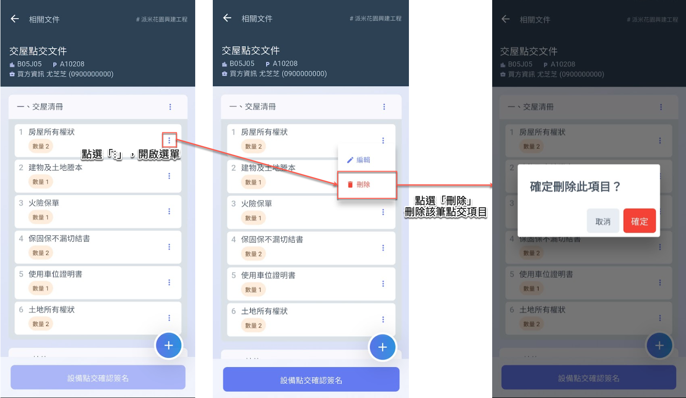

***

## 04｜設備點交確認簽名 (客戶)

如圖一，進入主頁面後點選下方&#x4E4B;**「設備點交確認簽名」**，即可開啟面板供客戶手寫簽名。

!!! warning
    請注意，交屋點交文件一經簽名後，即無法再更動其資料 (包含：新增、編輯等操作)。

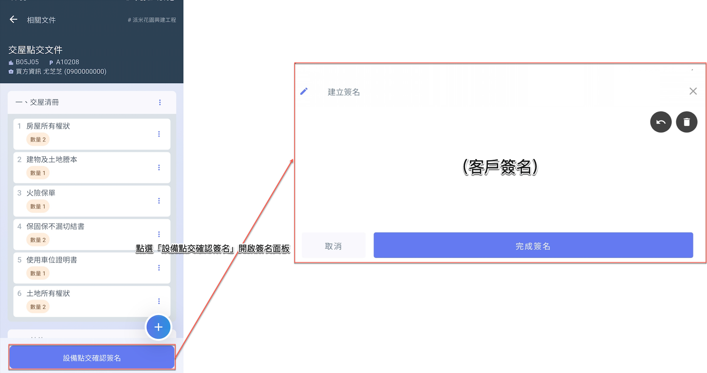

如圖二，(簽名細部功能如下) 客戶完成簽名並確認無誤後，即可點&#x9078;**「完成簽名」**。

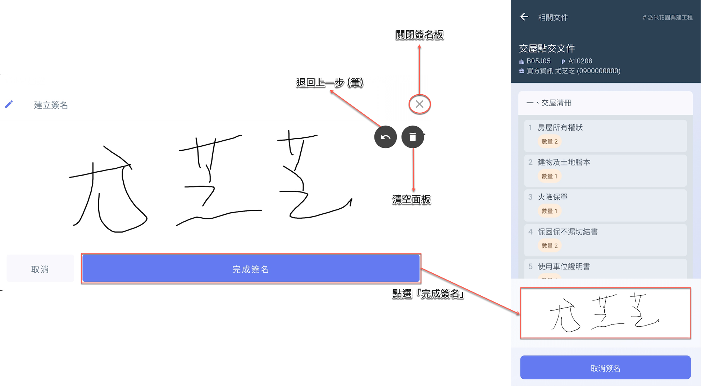

***

### 04 - 1｜取消簽名

如圖三\~四，客戶完成簽名，如有點交項目更動或其餘考量，於簽名下方點&#x9078;**「取消簽名」**，即可退回簽名。

!!! warning
    請注意，取消簽名後，您可對點交項目進行操作，但必須重新簽署設備點交確認簽名。

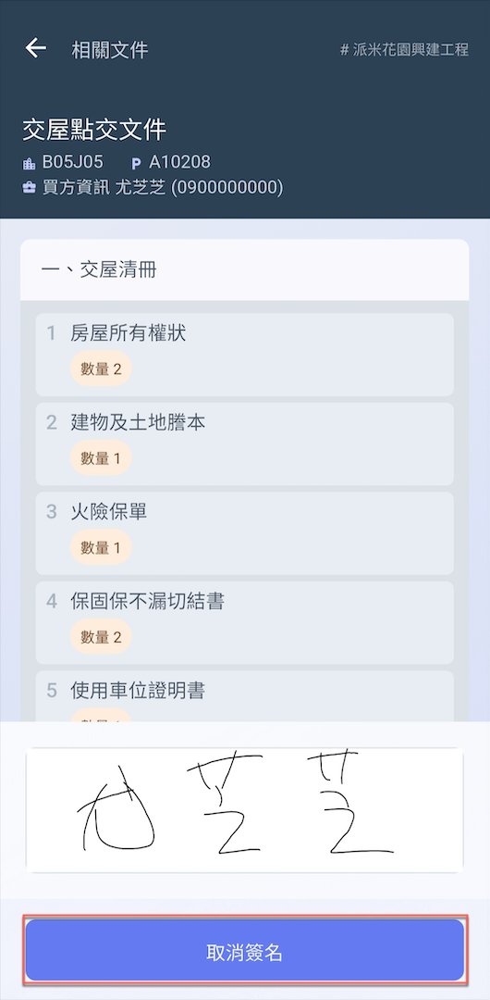 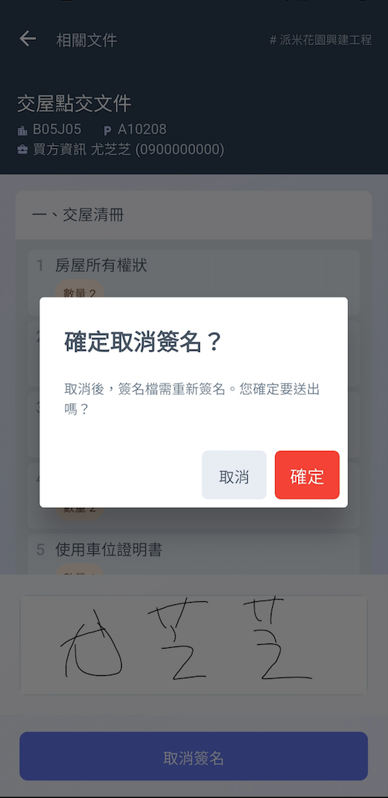 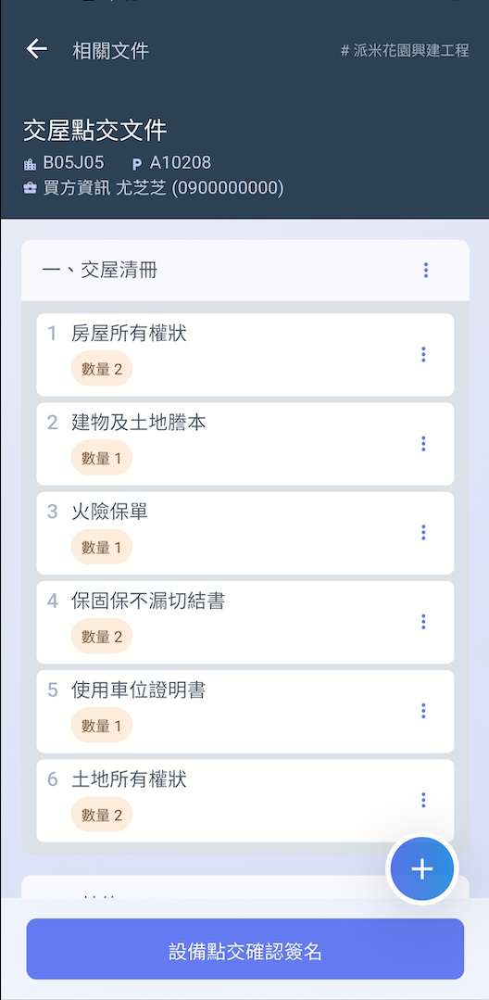

