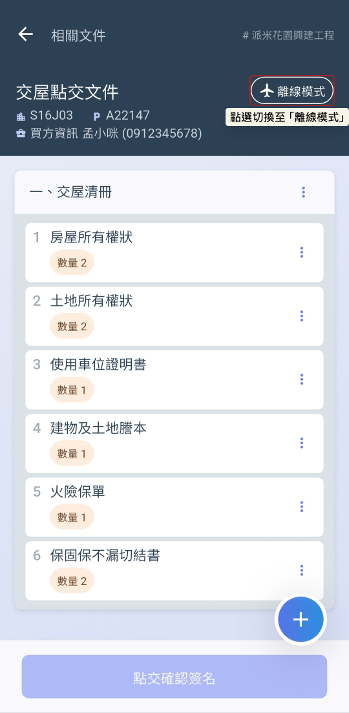
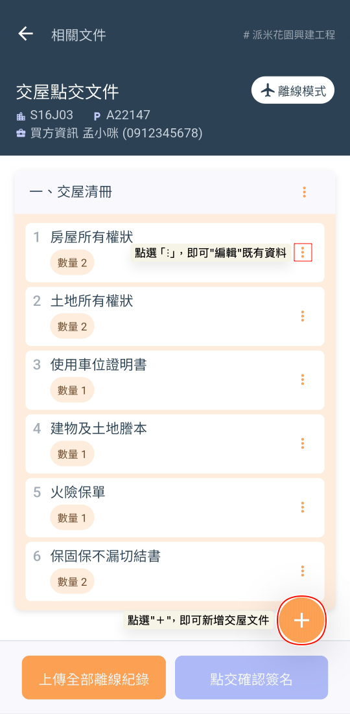
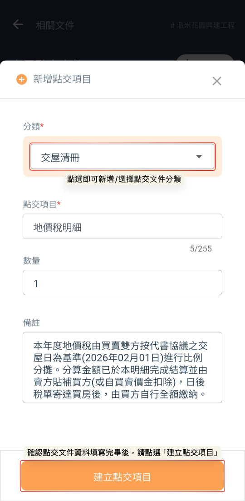
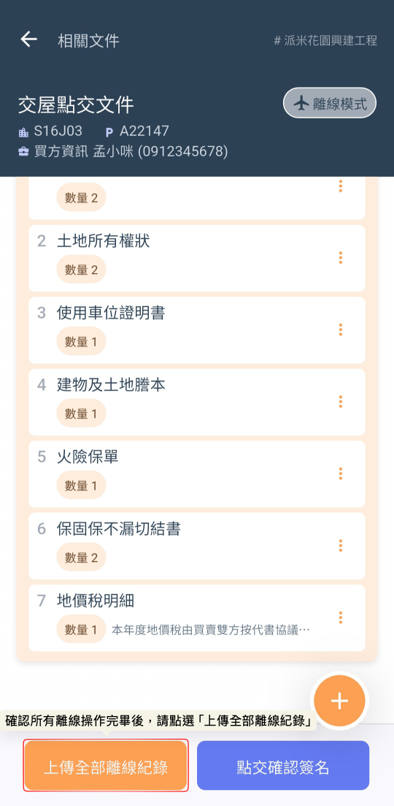
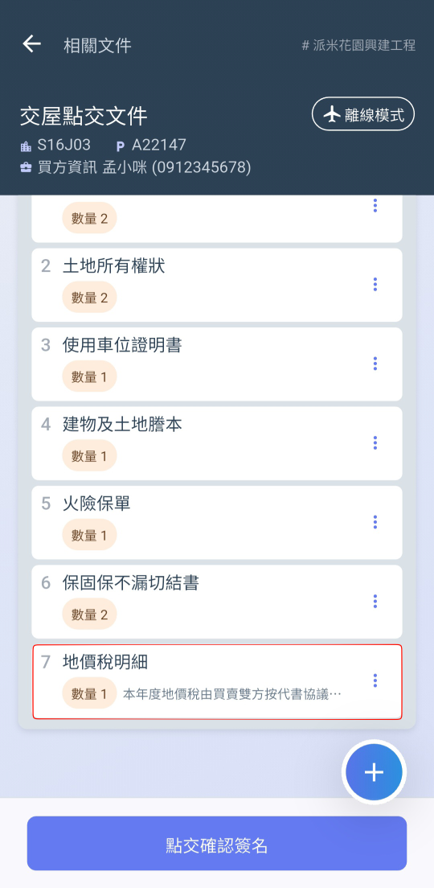

# 離線模式

在驗屋現場（如地下室、電梯間或高樓層遮蔽處），網路訊號往往極不穩定。系統內建了強大的『離線紀錄模式』，確保您在填寫交屋點交文件時，作業不會因斷網而中斷。

如圖一，不論您正處於無網路的收訊死角，或是即使在網路連線正常的環境下，若有預防性斷網需求，只需點選交屋文件畫面右上方的 「離線模式圖示」，即可手動啟用離線紀錄模式。

如圖三，開啟離線模式後，請於畫面右下方點選  圖示，即可進入新增點交文件頁面。

  

進入『新增點交文件』頁面後，您可以透過靈活的分類功能來組織您的文件，確保後續查閱的高效率：

1. 開啟選單：點選 『分類』 欄位即可開啟下拉選單。
2. 選取既有分類：從選單中直接選取已建立的分類名稱（如：交屋清冊、權狀文件、設備清單等）。
3. 新增新分類：若預設分類不敷使用，亦可直接於選單中輸入新名稱並執行新增。

如圖四，選取文件分類後，請依序填寫項目的詳細資訊，以確保點交過程與後續對帳的準確性，確認所有資料填寫正確無誤後，請點選  按鈕完成新增。

如圖五，當您在離線環境下完成所有點交文件、項目名稱、數量及備註的填寫後，請回到收訊良好的區域，點選畫面上的  按鈕，即可將資料同步至雲端。

  

