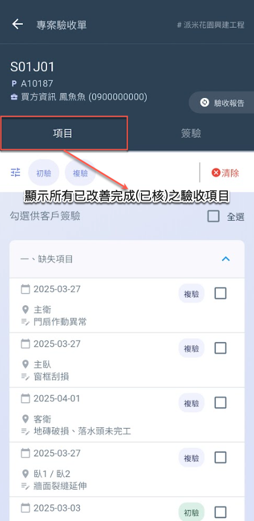
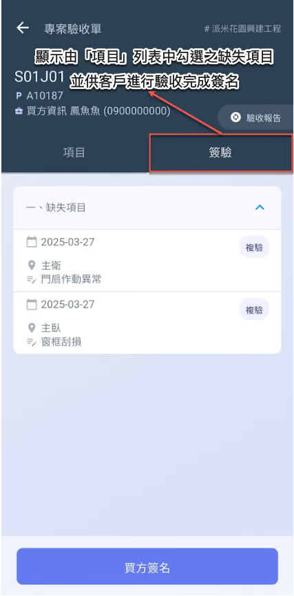
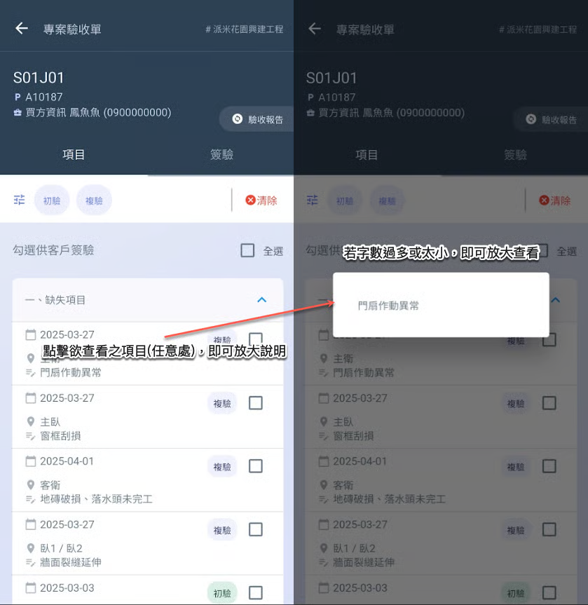
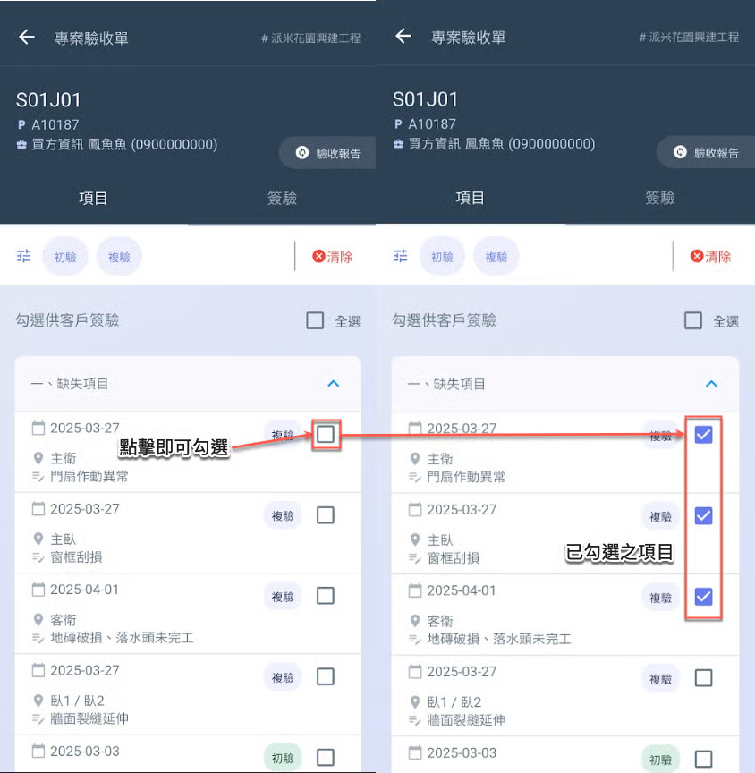
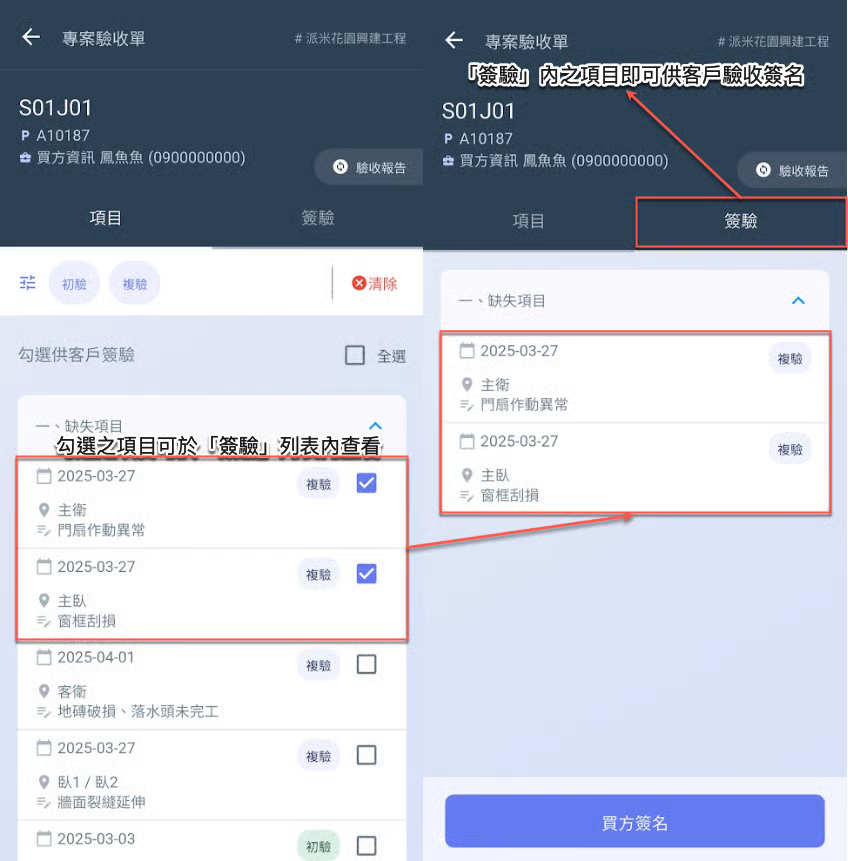
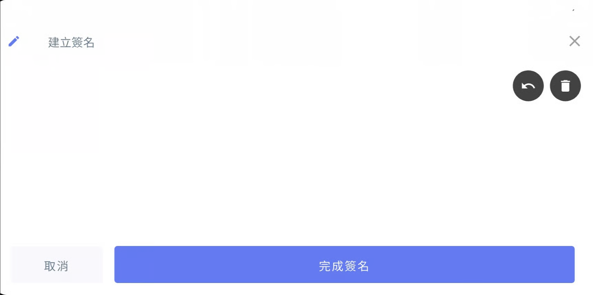
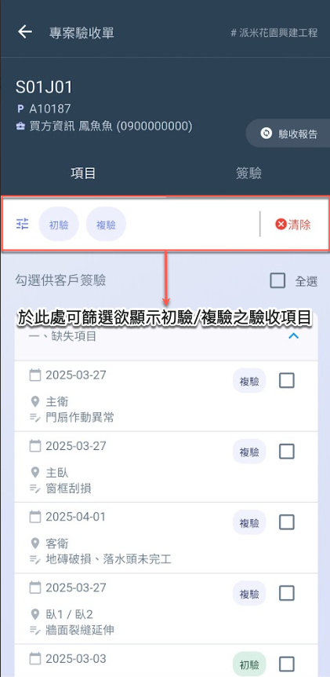
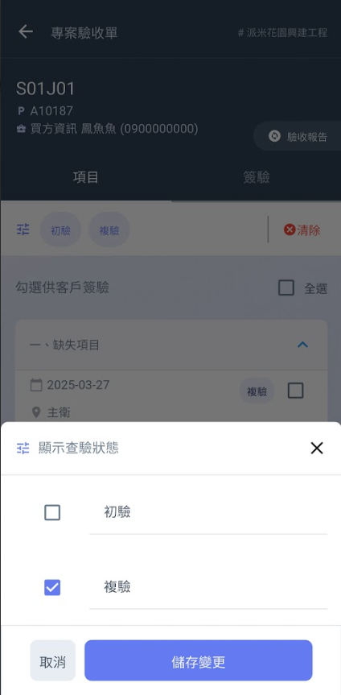
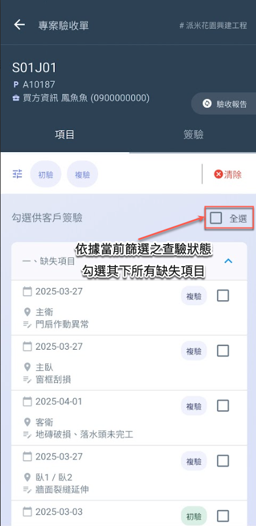
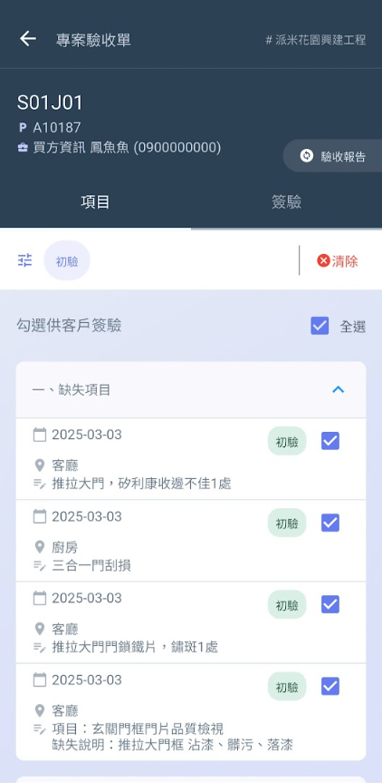

# 項目確認與簽驗

---
description: Item Confirmation and Sign-off
---

# 項目確認與簽驗

本系統的驗收審核流程**依序**包含以下三個階段：<kbd>**缺失確認簽名**</kbd>、<kbd>**缺失改善確認**</kbd>及<kbd>**驗收完成簽名**</kbd>。

<table><thead><tr><th width="121.26611328125">簽名</th><th width="89.50213623046875">角色</th><th width="375.7584228515625">說明與時機</th><th>操作說明</th></tr></thead><tbody><tr><td>缺失確認簽名</td><td>客戶</td><td>驗收人員完成缺失列表紀錄後，將該列表提供給客戶進行確認 (初驗/複驗)，並請客戶簽收。</td><td><a data-mention href="report">report</a></td></tr><tr><td>缺失改善確認</td><td>
負責廠商

相關人員
</td><td>缺失項目經相關人員完成改善作業，並由負責人或檢查人確認已如實改善且無誤後，於缺失清單中將該缺失狀態設為<strong>「已改善」</strong>。</td><td><a data-mention href="../conduct-inspection/que-ren-que-shi-gui-shu">que-ren-que-shi-gui-shu</a></td></tr><tr><td>驗收完成簽名</td><td>客戶</td><td>該驗收缺失已由相關人員完成改善，並經負責人核可。於最終客戶驗收階段，客戶亦確認缺失確實改善無誤，執行完成簽收程序。</td><td>本頁                        </td></tr></tbody></table>

***

## 01｜客戶簽驗流程

!!! warning
    請注意，於執行驗收項目及簽驗操作前，務必確認客戶已針對各驗收缺失紀錄，完&#x6210;**「驗收報告 - 缺失確認簽名」**。
    
    詳細操作說明，請參閱 ➙ [report](report "mention")



### 頁籤功能說明

如 (圖一 & 圖二)，<kbd>**項目**</kbd>頁籤顯示所有已改善完之驗收紀錄項目，透過手動勾選缺失項目，挑出確實無誤的項目，彙整於<kbd>**簽驗**</kbd> 列表中，供客戶進行**驗收完成簽名**。

 




### 查看紀錄說明

如圖三所示，如欲詳細查看驗收紀錄項目之說明內容，點選該項目即可查看。




### 勾選驗收缺失項目

如圖四所示，於<kbd>**項目**</kbd>頁籤即可勾選已改善完成之缺失項目，供客戶簽驗。




### 查看簽驗列表

您於<kbd>**項目**</kbd>頁籤中勾選之驗收紀錄項目，將會同步顯示於<kbd>**簽驗**</kbd>列表中，並可執&#x884C;**「買方簽名」**。




### 買方簽名

點選 (圖五-右圖) 下方&#x4E4B;**「買方簽名」**&#x5F8C;，即可開啟 (圖六) 簽名板，請客戶手寫簽名。




***

### 01 - 1｜篩選查驗狀態

如圖七所示，點選篩選欄位後，即可依需求選擇欲顯示的資訊 (初驗/複驗之驗收項目)。

 

***

### 01 - 2｜一鍵勾選

如圖八所示，進入項目頁籤後，點選右上角&#x7684;**「全選」**，即可勾選當前顯示模式下的所有缺失項目。

 

