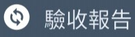
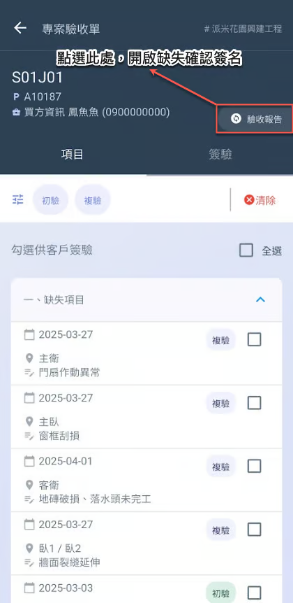
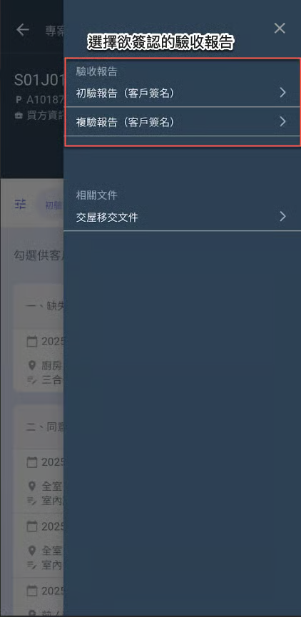
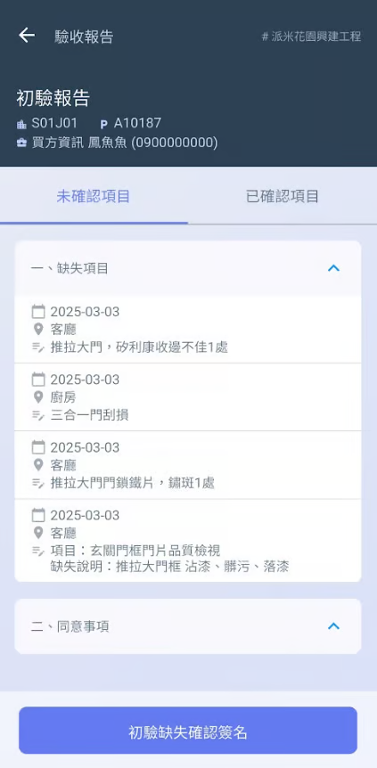
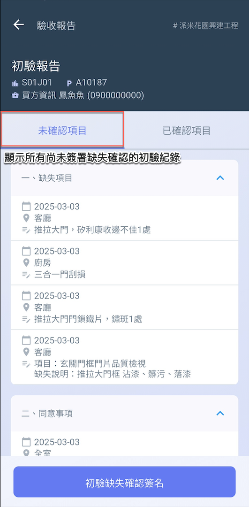
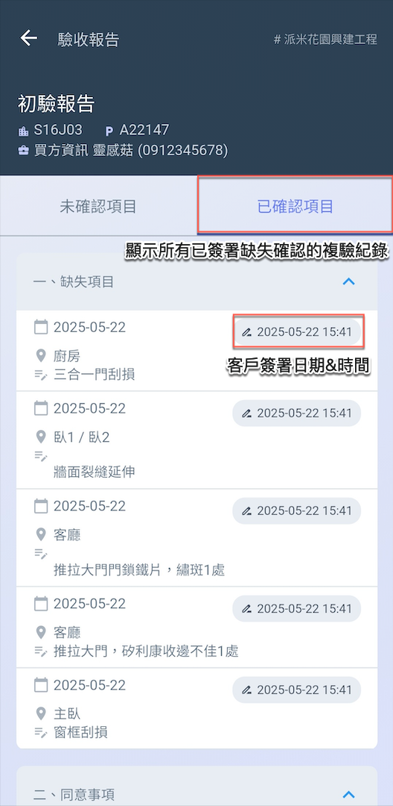
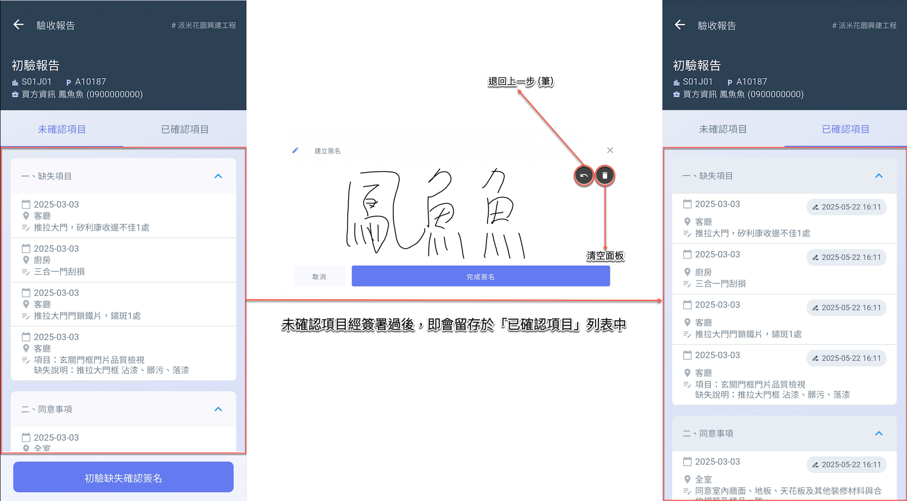
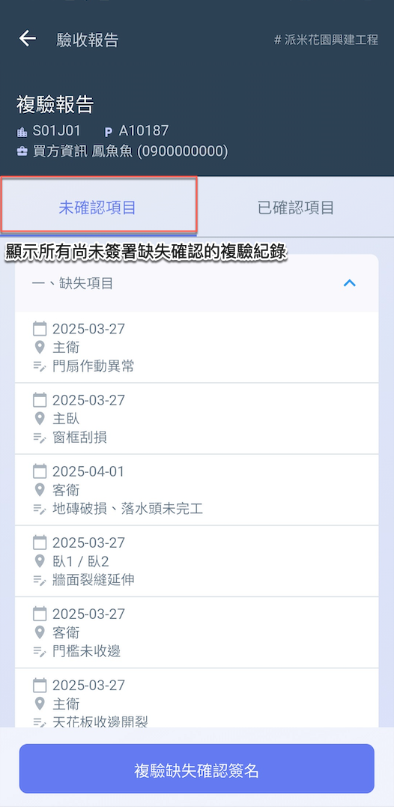
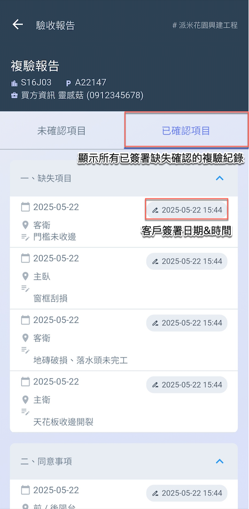
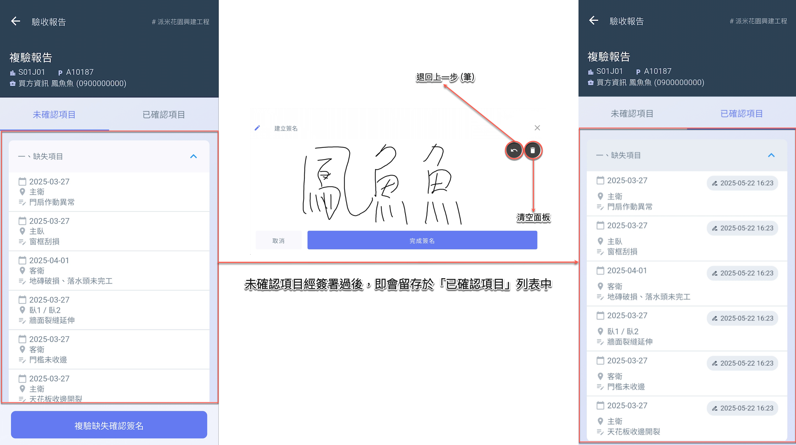

# 驗收報告

---
description: Acceptance Report
---

# 驗收報告

本系統的驗收審核流程**依序**包含以下三個階段：<kbd>**缺失確認簽名**</kbd>、<kbd>**缺失改善確認**</kbd>及<kbd>**驗收完成簽名**</kbd>。

<table><thead><tr><th width="121.07745361328125">簽名</th><th width="89.45037841796875">角色</th><th width="384.70849609375">說明與時機</th><th>操作說明</th></tr></thead><tbody><tr><td>缺失確認簽名</td><td>客戶</td><td>驗收人員完成缺失列表紀錄後，將該列表提供給客戶進行確認 (初驗/複驗)，並請客戶簽收。</td><td>本頁</td></tr><tr><td>缺失改善確認</td><td>
負責廠商

相關人員
</td><td>缺失項目經相關人員完成改善作業，並由負責人或檢查人確認已如實改善且無誤後，於缺失清單中將該缺失狀態設為<strong>「已改善」</strong>。</td><td><a data-mention href="../conduct-inspection/que-ren-que-shi-gui-shu">que-ren-que-shi-gui-shu</a></td></tr><tr><td>驗收完成簽名</td><td>客戶</td><td>該驗收缺失已由相關人員完成改善，並經負責人核可。於最終客戶驗收階段，客戶亦確認缺失確實改善無誤，執行完成簽收程序。</td><td><a data-mention href="xiang-mu-que-ren-yu-qian-yan">xiang-mu-que-ren-yu-qian-yan</a></td></tr></tbody></table>

***

## 01｜如何進入驗收報告？

進入專案驗收單頁面後，點選右上角&#x4E4B;**「****」** (圖一)，即可選擇欲執行的驗收階段 (圖二)。

  

***

## 02｜缺失確認簽名

以下將說明驗收報告資訊，以及如何簽署缺失確認：

!!! warning
    請注意，執行缺失確認簽名前，務必確認驗收人員已將相關驗收缺失填寫完畢。(於執行檢查中)



### 初驗缺失確認簽名

如圖一\~二，初驗驗收報告分為<kbd>**未確認項目**</kbd>與<kbd>**已確認項目**</kbd>兩個頁籤：



顯示所有**尚未**完成缺失確認簽署的初驗紀錄。(不論是否已確認責任歸屬/完成缺失改善確認)



顯示所有已完成缺失確認簽署的初驗紀錄。



 

如圖三，點選下方&#x4E4B;**「初驗缺失確認簽名」**&#x5F8C;，即會將當前未確認之項目全部簽核。

經客戶簽署完畢後，項目即會留存於<kbd>**已確認項目**</kbd>列表中，表示該驗收項目已完成缺失確認簽名。

!!! warning
    請注意：缺失確認一但簽署就不可再退回，且各驗收紀錄不可重複簽名。




### 複驗缺失確認簽名

如圖一\~二，複驗驗收報告分為<kbd>**未確認項目**</kbd>與<kbd>**已確認項目**</kbd>兩個頁籤：



顯示所有**尚未**完成缺失確認簽署的複驗紀錄。(不論是否已確認責任歸屬/完成缺失改善確認)



顯示所有已完成缺失確認簽署的複驗紀錄。



 

如圖三，點選下方&#x4E4B;**「複驗缺失確認簽名」**&#x5F8C;，即會將當前未確認之項目全部簽核。

經客戶簽署完畢後，項目即會留存於<kbd>**已確認項目**</kbd>列表中，表示該驗收項目已完成缺失確認簽名。

!!! warning
    請注意：缺失確認一但簽署就不可再退回，且各驗收紀錄不可重複簽名。



