# 交屋點交文件

---
description: Handover and Acceptance Documents
---

# 交屋點交文件

交屋階段往往涉及大量需簽署留存的關鍵文件，如**交屋清冊、保固說明書、切結書**及其他**與客戶之簽收文件與合約資料**。本系統提供專為驗收交屋量身打造的文件管理功能，協助使用者有效彙整與管控各類交付資料，確保點交過程有據可循、無遺漏風險。

&#x20;✔️ **彈性分類、自訂標題——提升文件管理精準度與可追溯性**\
支援使用者根據**文件性質、用途及來源**自訂分類結構，使資料架構更貼合實務需求。每份文件皆可獨立設定標題與備註說明，協助團隊快速定位所需資料，提升現場與後勤單位的作業效率。

✔️ **文件即建即用，支援驗收標的點交簽收**\
文件建立後，可直接**套用於特定驗收標的**，並進行簽收綁定。系統支援客戶透過**數位化點交簽署流程**完成簽收確認，確保每筆資料具備可驗證紀錄，有效降低合約糾紛風險並提升履約透明度。

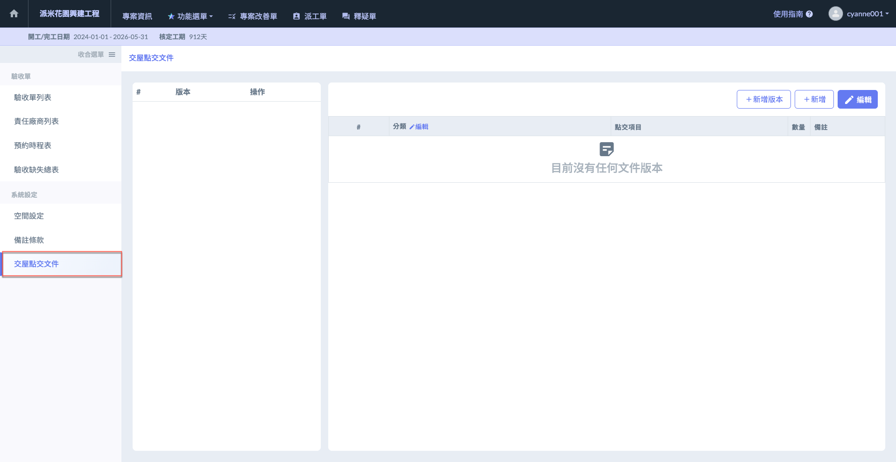

***

## 操作流程說明

!!! warning
    請注意，每一筆點交項目資料皆隸屬於特定的文件版本。填寫分類與點交項目前，請務必先確認所選版本是否正確。



### 新增版本

如圖一紅框圈選處，進入主頁面後，點選右上角&#x4E4B;**「+新增版本」**，即可建立新的文件版本(圖二)，妥善管理其下的交屋文件資料。

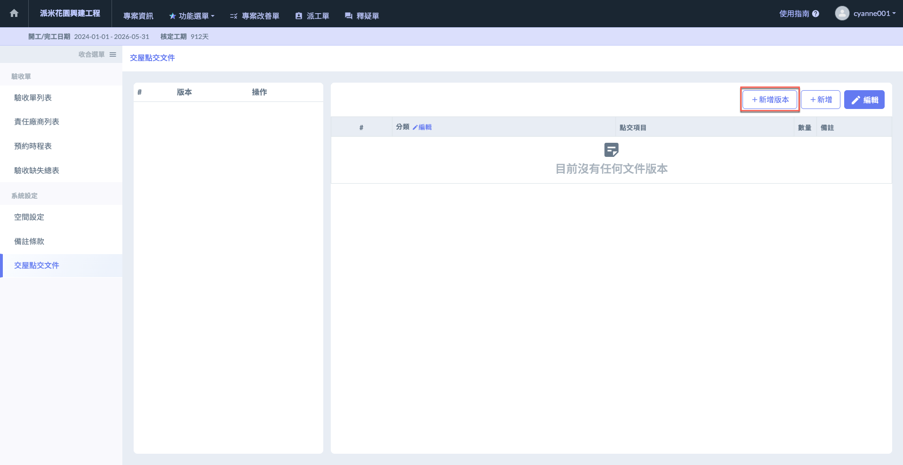 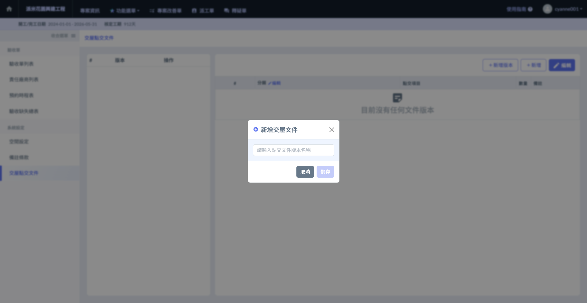

將版本名稱填寫完畢並確認無誤後，點&#x9078;**「儲存」**&#x5373;可保留此筆資料，完成畫面如(圖四)。

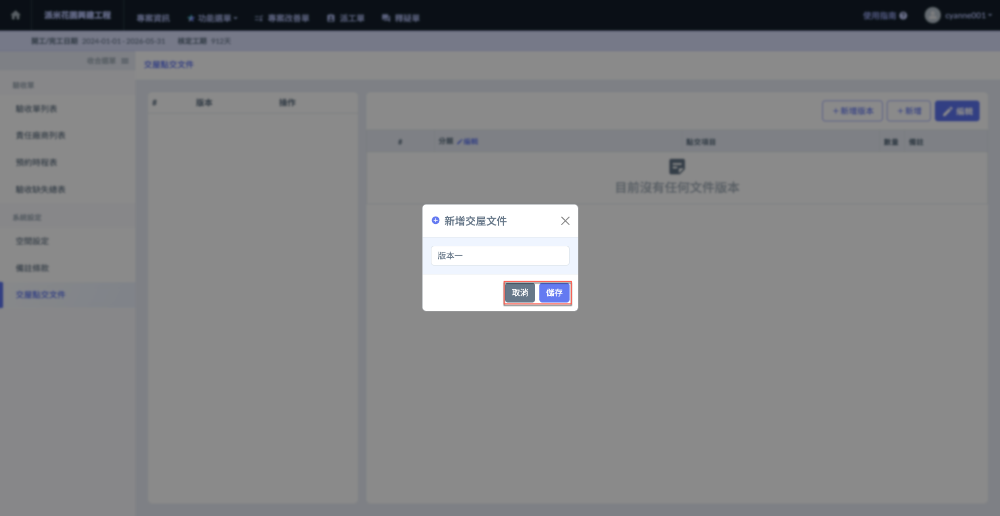 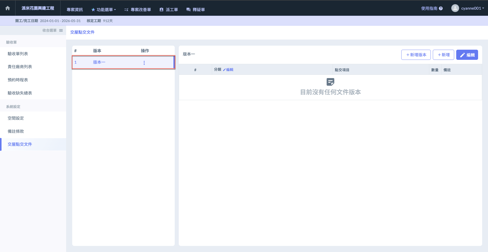




### 新增分類

進入**新增點交項目**頁面後，點選分類欄位旁&#x4E4B;**「編輯」**，即可開始建立文件分類。

如圖六所示，點&#x9078;**「+新增一筆」**，即可新增欄位並填寫分類名稱。

!!! warning
    請注意，您需要先妥善建立分類，方能於分類下上傳交屋移交文件。

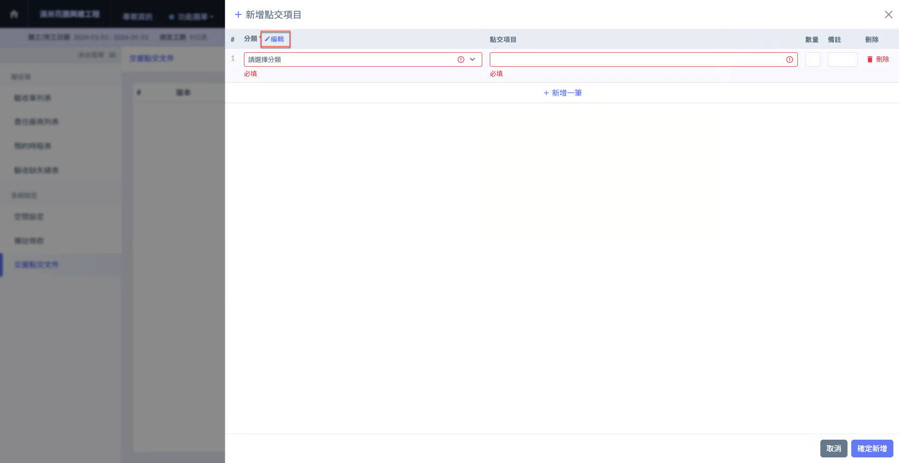 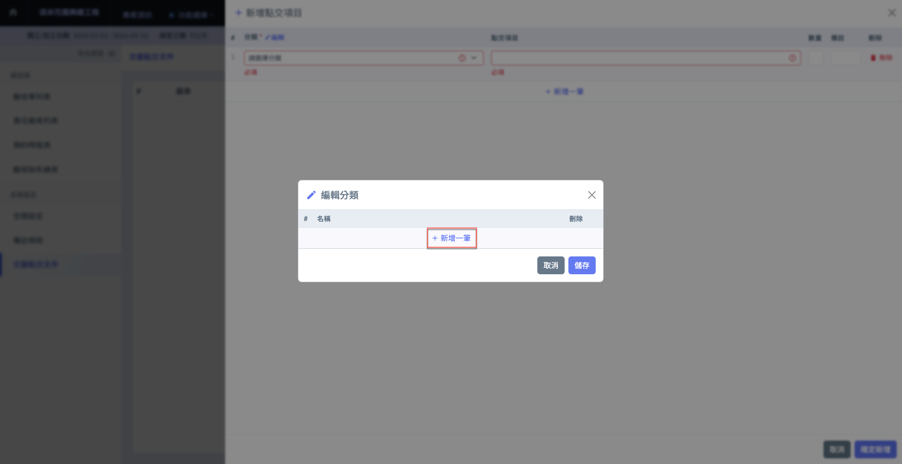

將分類名稱填寫完畢並確認無誤後，點&#x9078;**「儲存」**&#x5373;可保留此筆資料，完成畫面如(圖八)。

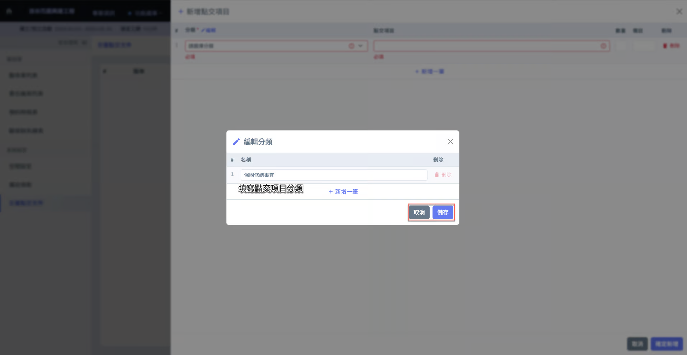 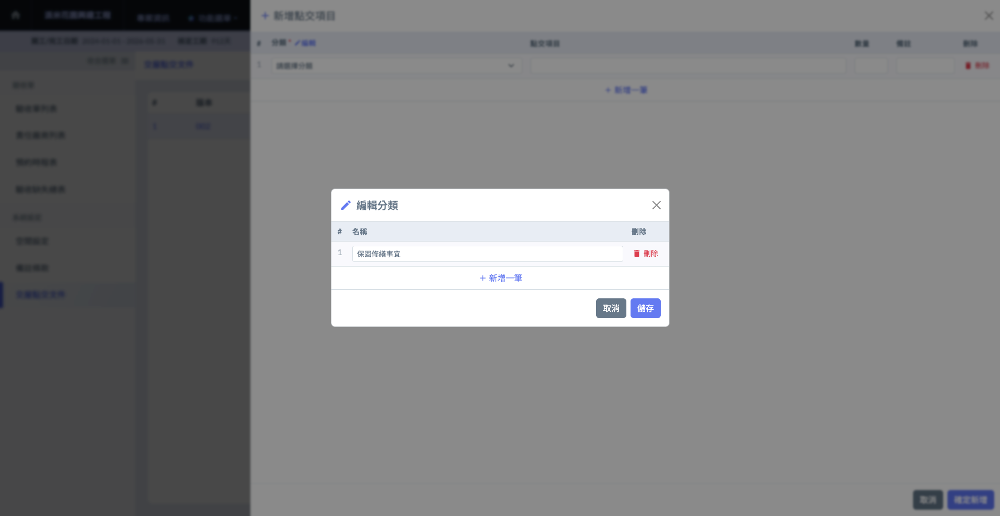




### 新增點交項目

進入主頁面後，點選右上角&#x4E4B;**「+新增」**，即可開始建立您的點交項目資料。

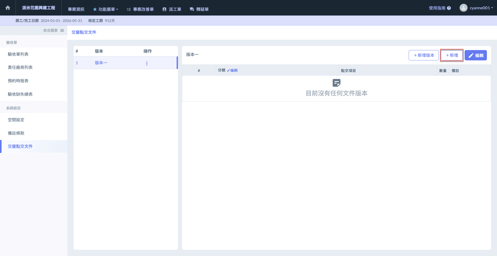 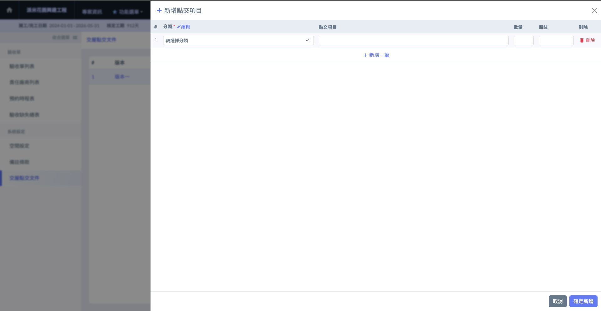

如圖十一，點&#x9078;**「分類」**&#x6B04;位後，即可開始選擇分類 (圖十二)，並在其下建立相關資料。

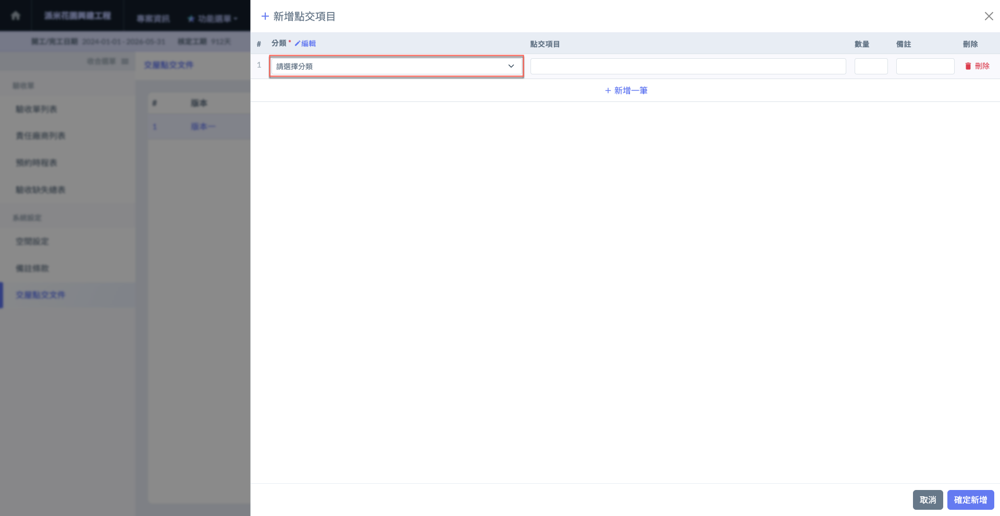 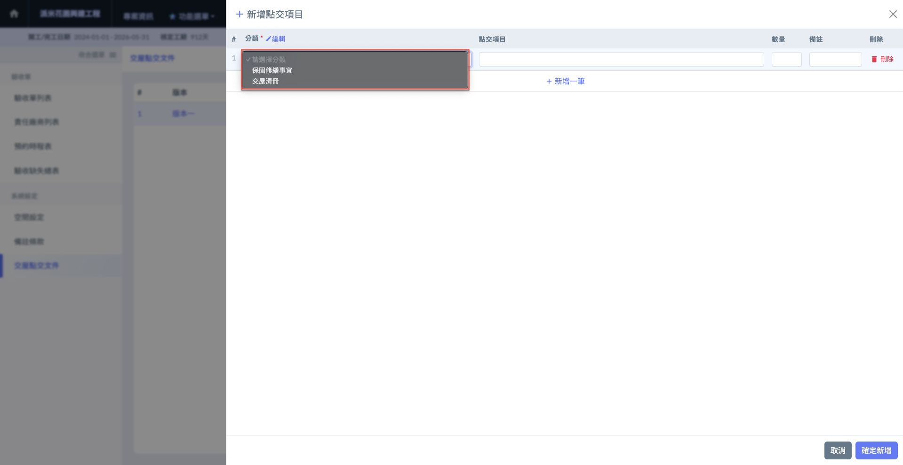

詳細填寫**點交項目**、**數量**及**備註**後，即可點&#x9078;**「確定新增」**，完成資料如 (圖十四)。

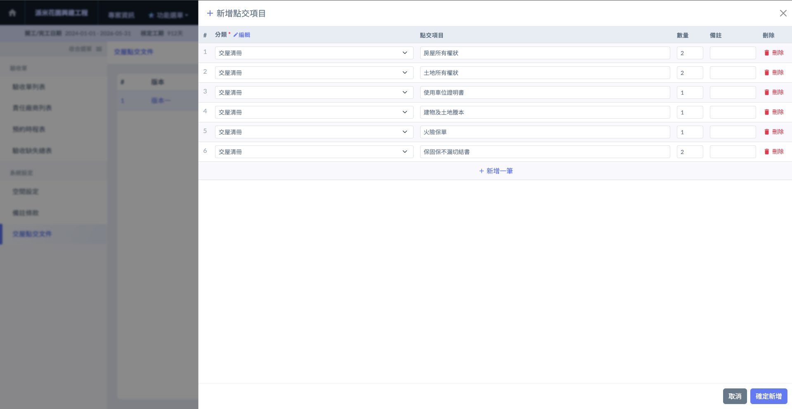 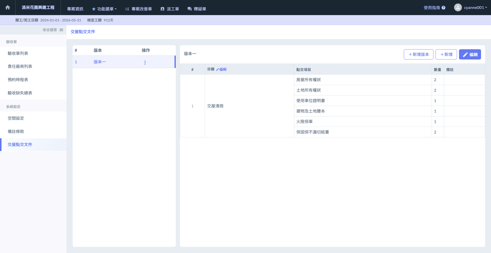




### 編輯點交項目

進入主頁面後，點選右上角之「」，即可修改/刪除各版本下之點交項目資料。

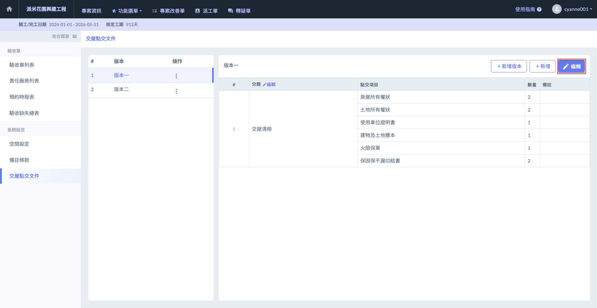 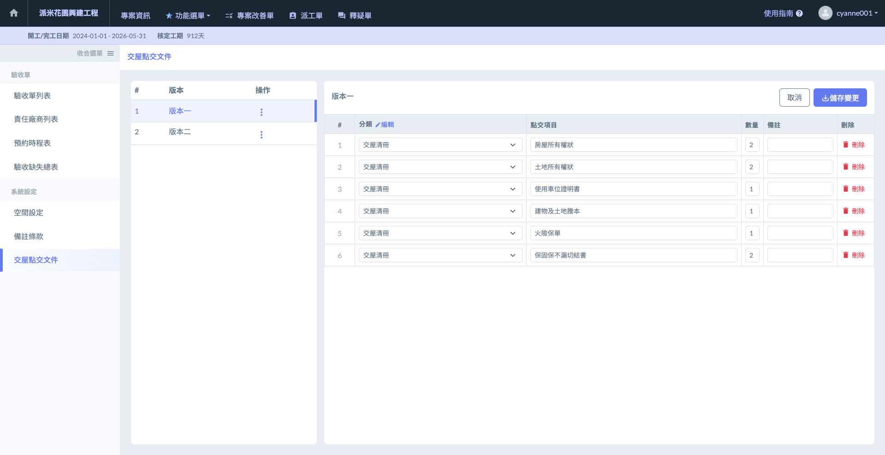



