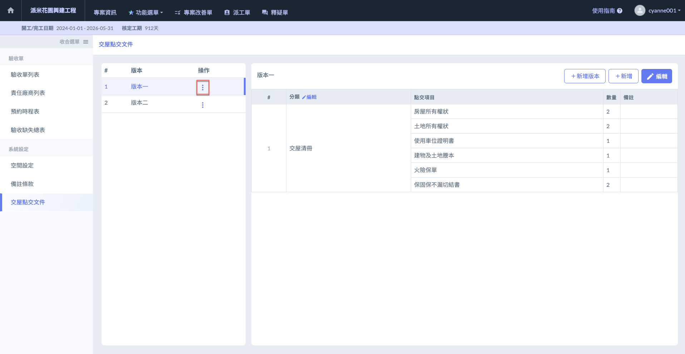
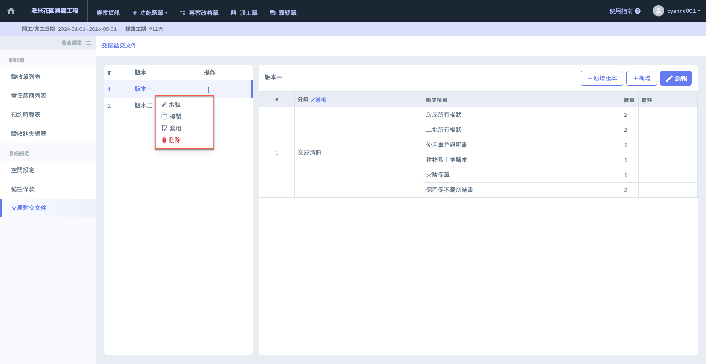
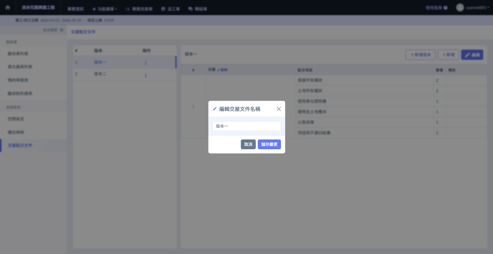
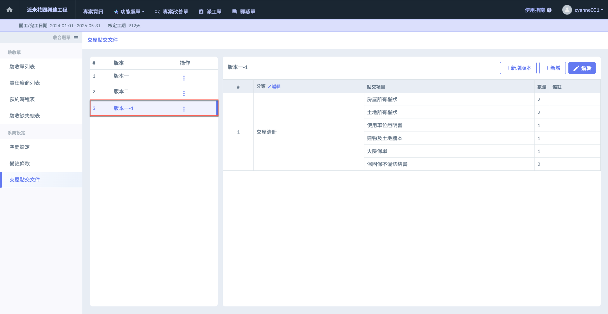
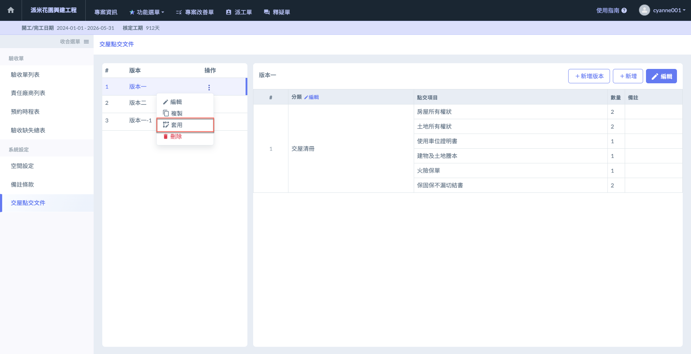
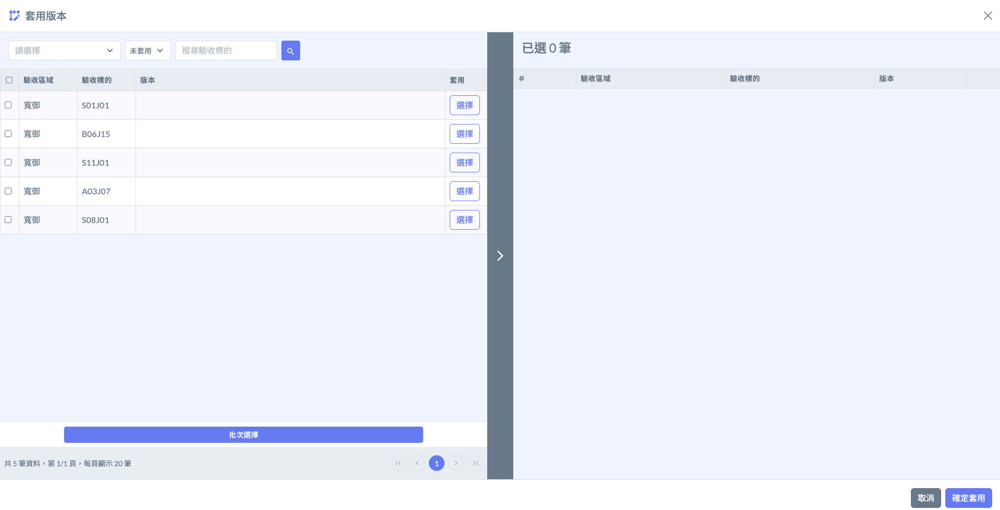
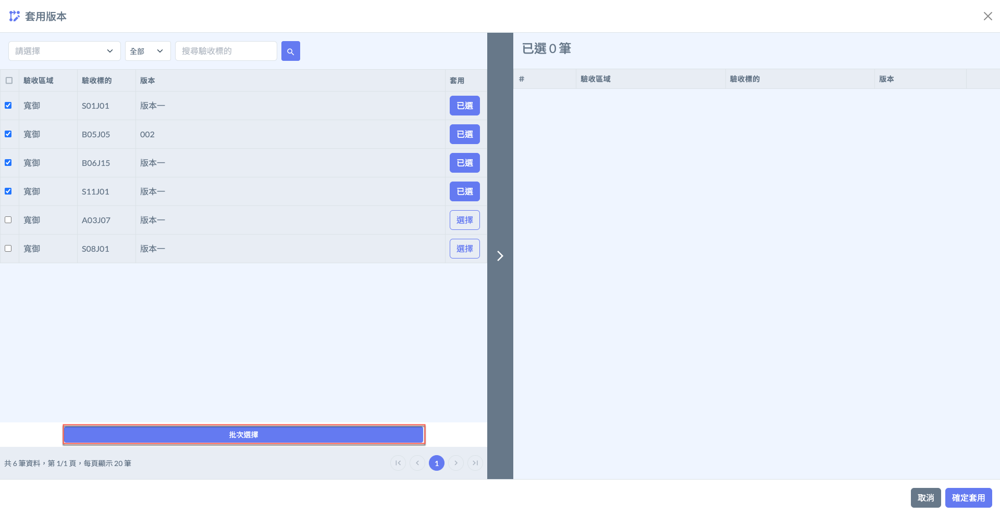
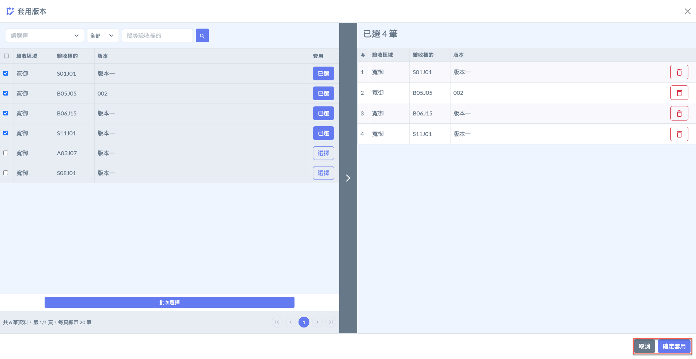

# 其他相關操作

---
description: Other Related Actions
---

# 其他相關操作

## 01｜版本相關

於已建立好之版本右側**操作**欄位，點&#x9078;**「⋮」**，即開啟其他操作列表，包含：<kbd>**編輯**</kbd>、<kbd>**複製**</kbd>、<kbd>**套用**</kbd>及<kbd>**刪除**</kbd>。

以下將詳細介紹各功能的使用目的與操作流程。

 

### 01 - 1｜版本編輯

點&#x9078;**「編輯」**，您即可修改所選之文件版本名稱 (圖四)。

 

***

### 01 - 2｜版本複製

此功能可讓您將所選之文件版本完整複製一份，包含其中之所有點交項目與分類資料。

點&#x9078;**「複製」**，您即可看到複製之資料於列表中 (見圖六)。

 

***

### 01 - 3｜版本套用

透過此功能，用戶可迅速將交屋清冊、保固書、切結書等標準文件，套用至每一戶驗收對象，並於App上進行**客戶簽收綁定**。提升簽收效率與履約完整性。

點&#x9078;**「套用」**，即可開啟驗收區域及標的列表，並選擇欲套用之標的 (圖八)。

!!! tip
    若標的已套用版本且有版本修改需求，您亦可再選擇另一版本將原套用版本覆蓋。

 

選取欲套用之標的後，點選下方&#x4E4B;**「批次確認」** (圖九)，即可於右方查看已選項目，並點&#x9078;**「確定套用」**&#x5C07;其套用版本 (圖十)。

 

