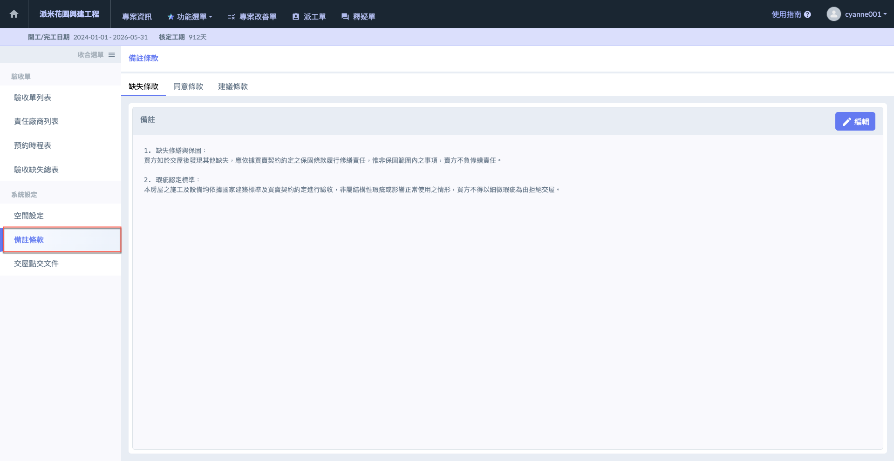
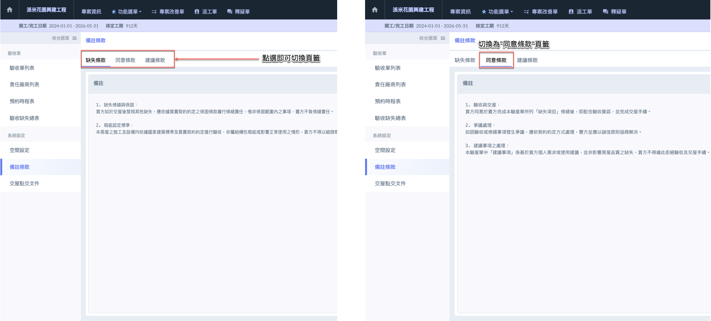
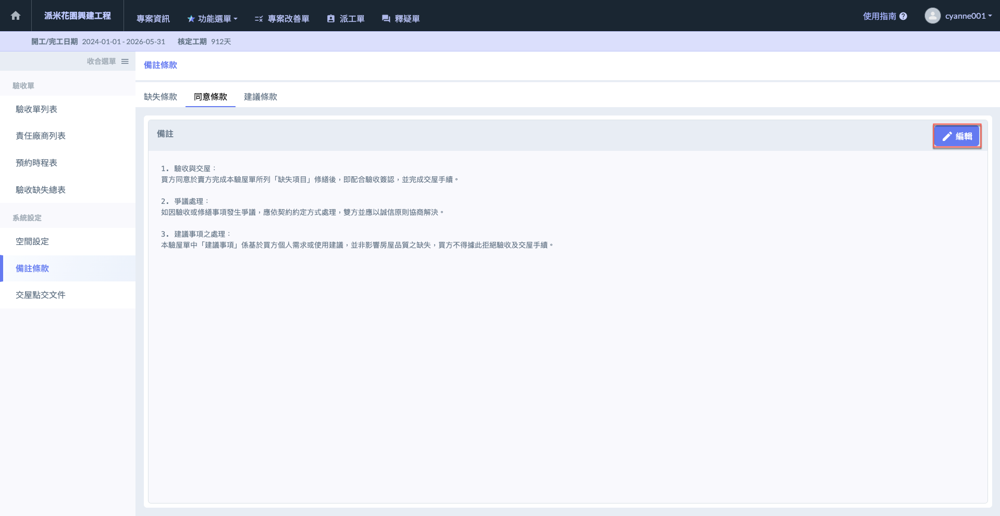
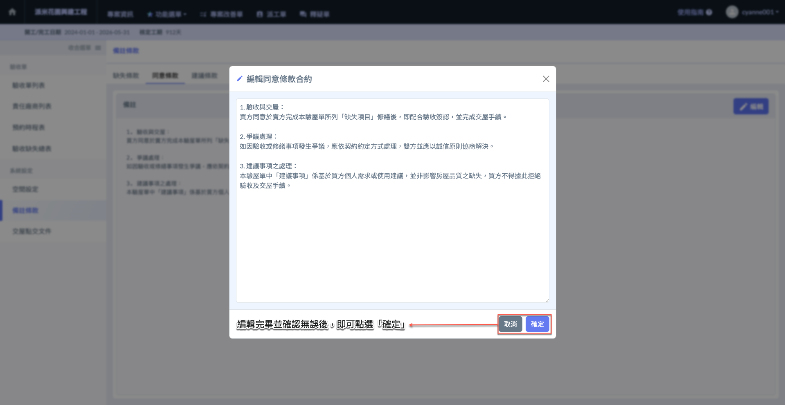

# 備註條款

---
description: Remarks and Terms
---

# 備註條款

備註條款功能協助人員在房屋點交驗收過程中有效記錄與管理各項備註條款，確保點交過程透明、完整且符合法規標準。系統提供**缺失條款**、**同意條款**及**建議條款**三種條款分類供使用者編列。

進&#x5165;**「備註條款」**&#x9801;面後，您可分別填寫<kbd>**缺失條款**</kbd>、<kbd>**同意條款**</kbd>及<kbd>**建議條款**</kbd>。

先選擇欲編輯之條款頁籤，再於欲編輯之條款右側點選「」，即可開始填寫/修改條款內容。

***

#### 切換頁籤 `(缺失條款 同意事項 建議事項)`

***

#### 編輯條款

!!! warning
    請注意，務必於正確的項目分類下 (缺失項目、同意事項或建議事項) 填寫對應之條款內容。

 

