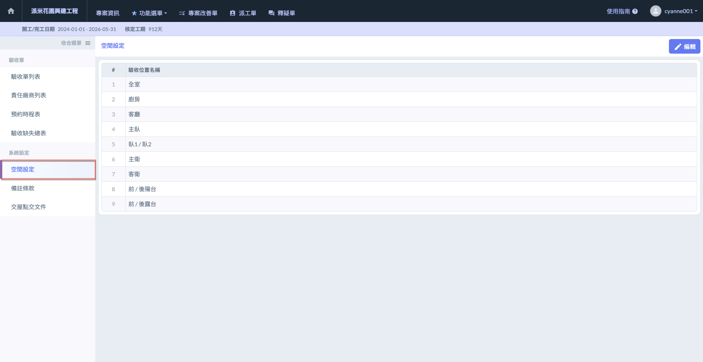
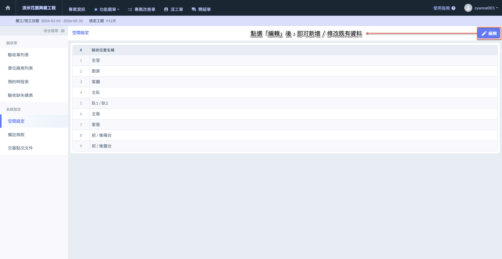
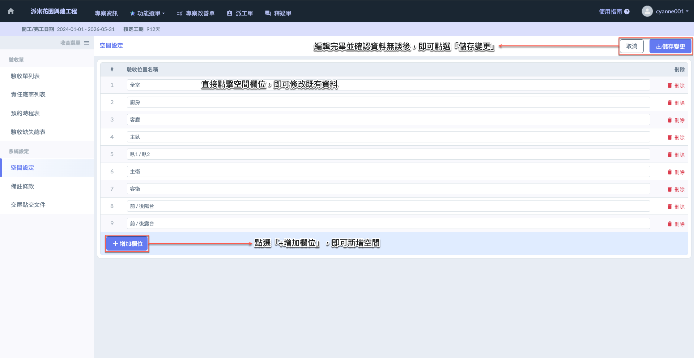

# 空間設定

---
description: Space Settings
---

# 空間設定

空間設定功能可編列驗收時所需的驗收/檢查位置（空間），並適用於填寫缺失項目紀錄、同意事項紀錄及建議事項紀錄。

此處設定之位置範例如下：如廚房、客廳、主臥、陽台及主衛等等。

進&#x5165;**「空間設定」**&#x9801;面後，如下紅框圈選處，點選右上角&#x4E4B;**「編輯」**，即可新增/修改空間資料。

如欲新增空間，點&#x9078;**「+增加欄位」**&#x5373;可新增空間資料。新增/編輯完畢後，點&#x9078;**「儲存變更」**&#x5373;保留此筆資料。

 

