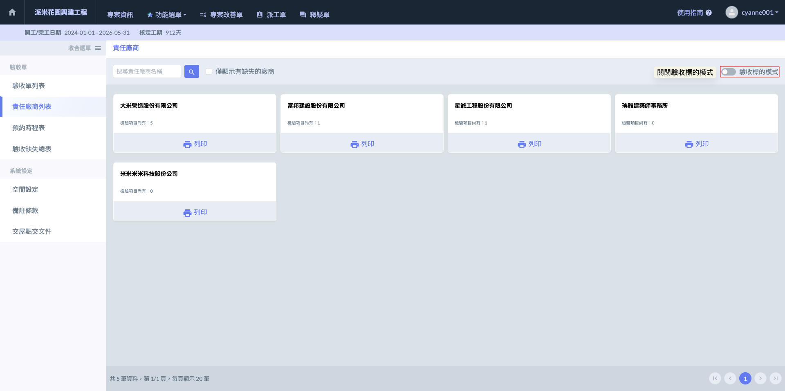
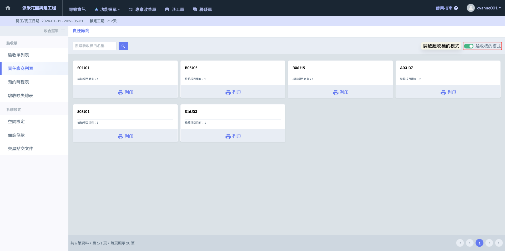

# 責任廠商列表

在驗收管理系統中，責任廠商列表提供以下兩種顯示模式，分別滿足不同的管理需求：

!!! info
    預設畫面將優先顯示『廠商列表』；如欲查看空間或戶別的缺失，請利用右上角的按鈕切換至『驗收標的』模式。
    
    * 當按鈕   圖示時，表示目前處於廠商列表模式。
    * 當按鈕為  圖示時，即可切換至驗收標的模式，按空間查看缺失項目。

**模式一：以『廠商』為核心**

此模式按廠商分類列出所有承攬單位，並直觀顯示各廠商的缺失總數。點選特定廠商後，即可查看該廠商負責的所有缺失項目細節。

***

**模式二：以『戶別/空間』為核心（驗收標的模式）**

此模式按戶號排列，並於每一戶內詳細羅列各個空間（如客廳、臥室、衛浴）所涉及的各廠商缺失。

