# 驗收單列表

**「驗收單列表」**&#x70BA;交屋前驗收管理的核心功能，主要用於建立並管理各區域之驗收標的資料，供現場人員執行自驗、初驗及複驗作業時進行紀錄與追蹤。

使用者可依案場實際配置，自行新增驗收區域（例如：A棟、B棟等），並於各區域下新增驗收標的（如各戶別、公共空間、設備間等）。每一驗收標的皆具備獨立紀錄功能，可針對不同驗收階段填寫相關檢驗結果，包含：

* 缺失項目：記錄需修繕或改善之處
* 同意事項：記錄雙方確認同意之項目
* 建議事項：提供補充說明或後續建議

!!! tip
    本功能可協助工程單位：
    
    ✔ 系統性管理交屋前的各項驗收標的
    
    ✔ 有效追蹤缺失與驗收進度
    
    ✔ 建立可追溯之驗收紀錄，提升作業透明度與專業性

透過標準化的驗收單管理流程，能降低交屋爭議、加速驗收週期，並提升整體交屋品質與客戶滿意度。

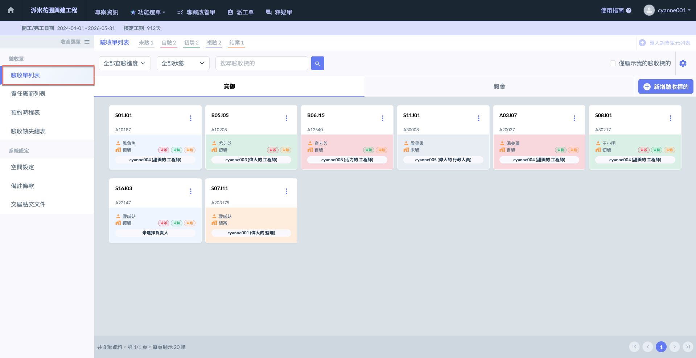

***

## 01｜手動建立區域&標的

執行驗收作業前，需先建立完整的**驗收標的**（即各戶別或驗收對象），確保後續驗收流程順利進行，並精確記錄驗收結果。驗收標的的完整性將直接影響驗收工作的準確性與執行效率，因此請依照以下步驟進行設定：

1. **新增區域**
   * 依據工程範圍，建立驗收區域（如：樓層、棟別、工區等），以便管理與查找。
   * 確保區域命名規則一致，避免重複或混淆，提升後續查詢與報告的準確性。
2. **建立驗收標的**
   * 於對應區域內，建立各驗收標的（如：A1 戶、B3-2 戶、設備間等）。
   * 每個驗收標的應包含清晰的標示，並可對應現場實際狀況，以便施工與驗收人員快速辨識。
3. **確認與儲存**
   * 建立後，請確認標的名稱、位置與數量是否正確，以確保驗收範圍完整無遺漏。
   * 儲存設定後，即可開始執行驗收作業，並進行相關紀錄與管理。

!!! tip
    透過完善的驗收標的建立，能有效提升驗收流程的標準化與可追溯性，確保工程品質符合規範，減少後續的重工與爭議。請確實依照步驟執行，以確保驗收工作的精準與高效。



### 驗收區域管理

進入驗收單列表頁面，如圖一紅框圈選處，點選右上角&#x4E4B;**「****」**，即可開啟區域管理視窗(圖二)。

您可於此處編輯/刪除先前已建立之區域資料，亦可新增驗收區域。

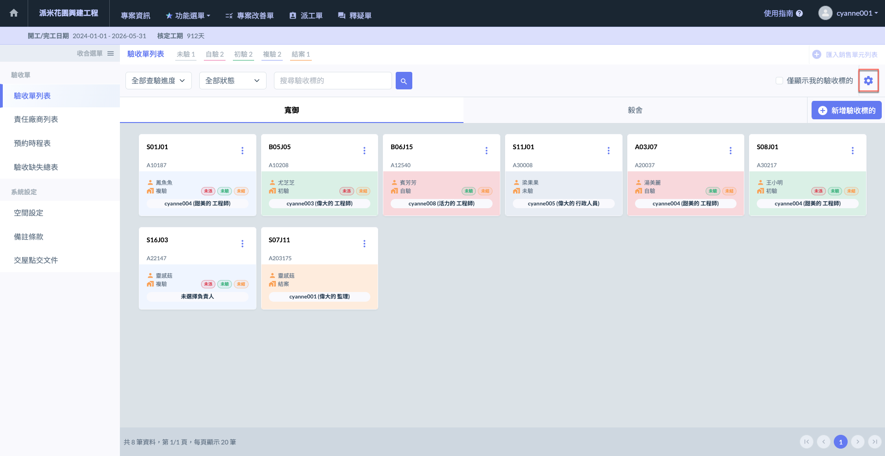 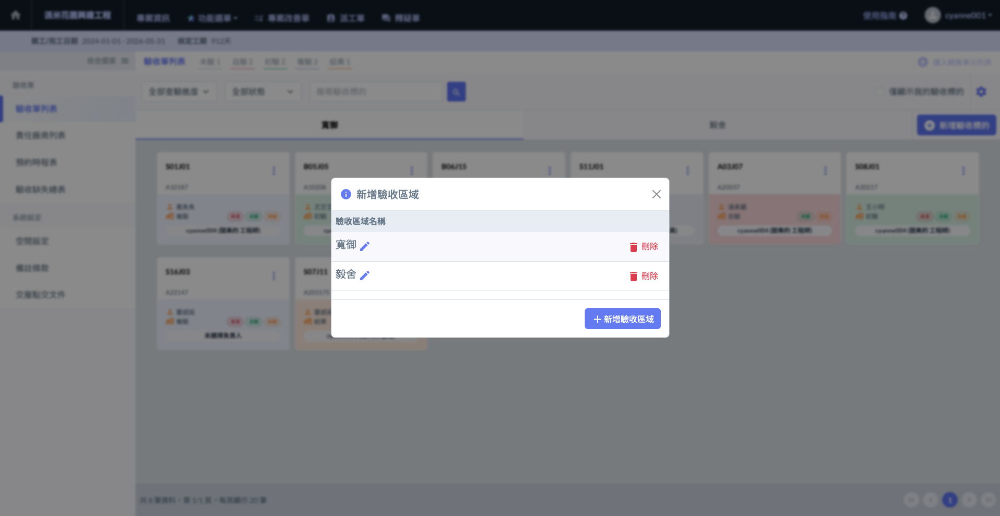

如需新增驗收區域，點&#x9078;**「+新增驗收區域」**&#x5373;可開啟(圖四)視窗，並填寫欲新增的驗收區域名稱。

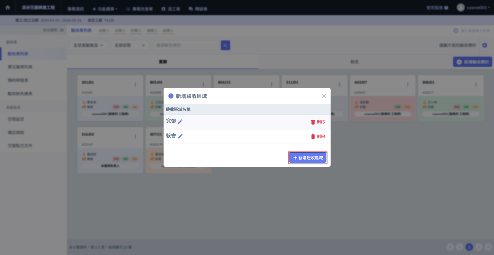 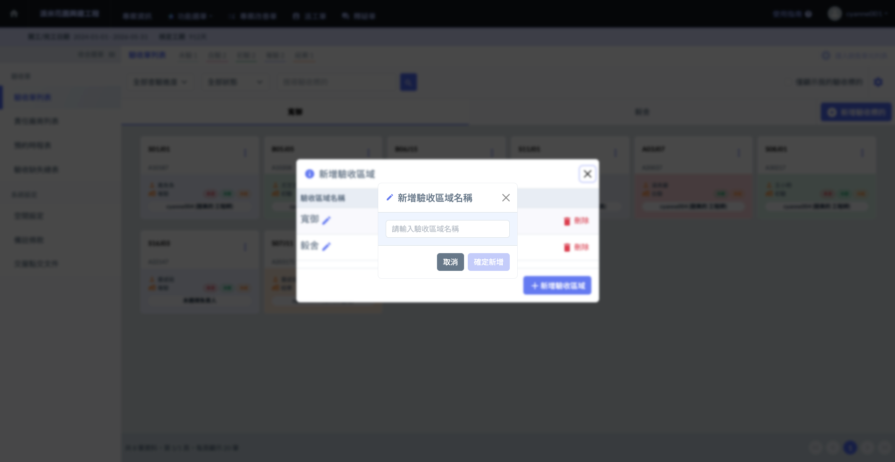




### 選擇驗收區域

如下圖範例，此處已建立兩個區域 (分別為寬御、毅舍）。使用者可透過點選頁籤來切換區域，並在所選區域內編輯驗收標的及執行相關操作。

如圖六所示，點選<kbd>**毅舍**</kbd>頁籤後，即可切換至該區域。

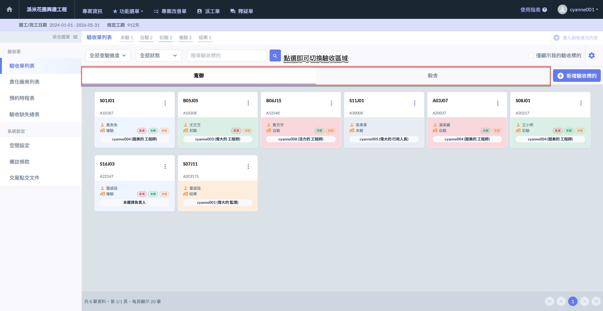 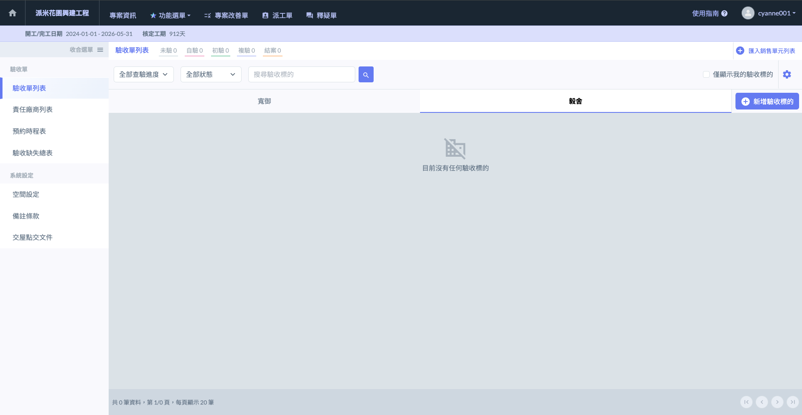




### 新增驗收標的

選擇區域後，點選右上方&#x4E4B;**「+新增驗收標的」**&#x5373;可開啟(圖八)視窗，填寫標的資料。

標的資料包括：**驗收標的(編號)**、**車位編號**、**買方資訊**及執行此戶別驗收工作之**負責人**。

!!! warning
    請注意，建立驗收標的 (戶別或驗收對象) 前，務必確認已在正確的驗收區域下。

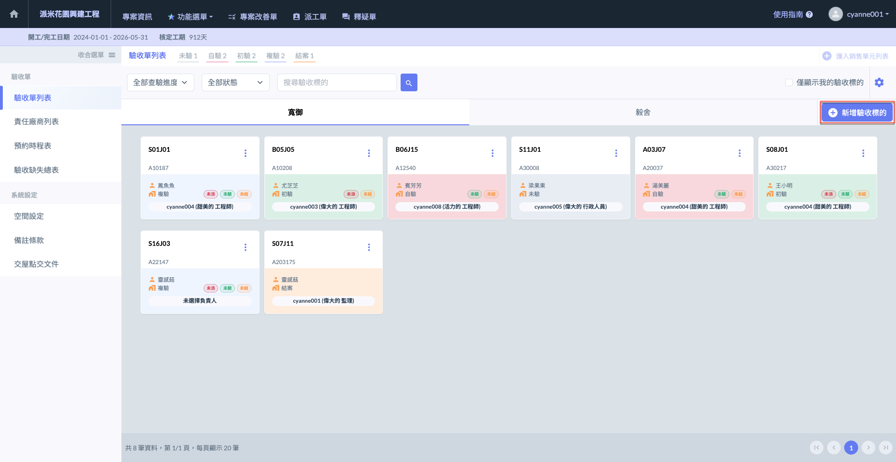 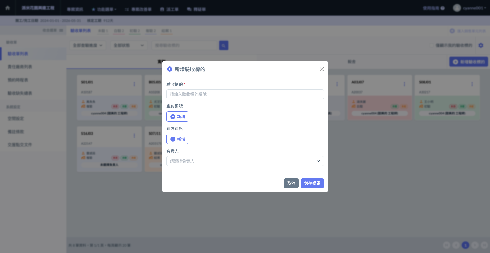




***

## 02｜Excel 建立區域&標的

本系統支援**Excel 匯入**功能，讓使用者能夠快速批次建立驗收區域與驗收標的，提升作業效率，減少人工輸入的時間與錯誤。匯入完成後，系統將自動建立對應的驗收區域與標的，確保資料完整性。

!!! tip
    此功能適用於**大規模專案初期資料建置**，可有效提升作業效率，確保驗收標的完整且準確。

**1. Excel 批次匯入**

可透過 Excel 檔案**一次性匯入**包含**區域、驗收標的**等資料，例如：



如：樓層、棟別等。



常為戶別，如：A101、B202。



如：P1-12、P2-08。



如：姓名、聯絡方式。



**2. 後續手動新增與編輯**

* 若欲**新增額外區域或驗收標的**，需透過系統介面手動新增。
* 使用者可於已建立的區域內，進行標的的增減與資訊調整，以符合實際工程需求。



### 下載 Excel 模板

如圖一，進入驗收單列表頁面後，點選右上方&#x4E4B;**「+匯入銷售單元列表」**。

開啟圖二視窗後，點&#x9078;**「****」**&#x5373;可下載。

!!! warning
    僅當驗收單列表內無任何資料時(區域、標的等)，才可使用 Excel 匯入功能。

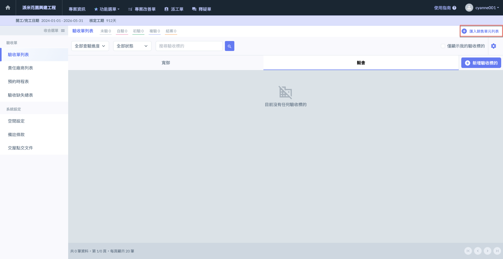 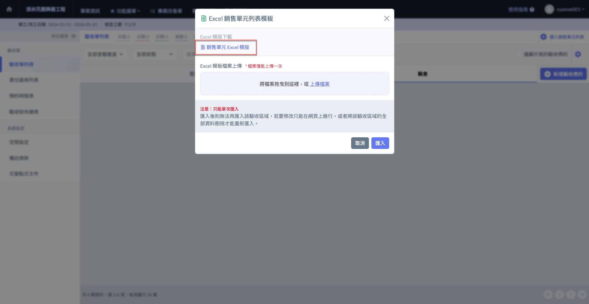




### 填寫 Excel 模板

如下圖所示，設置好驗收區域 (即Excel工作表) 後，即可填寫該區域對應之驗收標的資料。

!!! warning
    請注意：
    
    1. &#x20;一個工作表為一個區域，如欲新增驗收區域，請新增工作表並填上正確的區域名稱。
    2. 務必在對的區域下填寫對應的標的 (請參考圖四)。

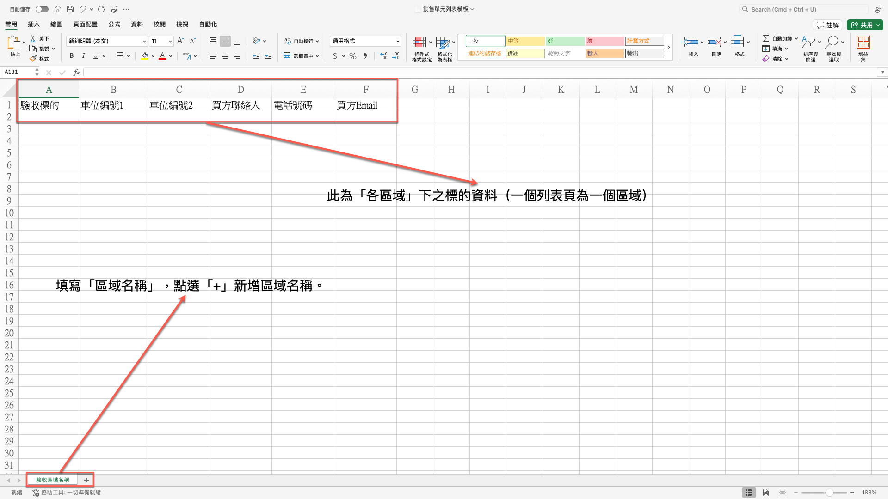 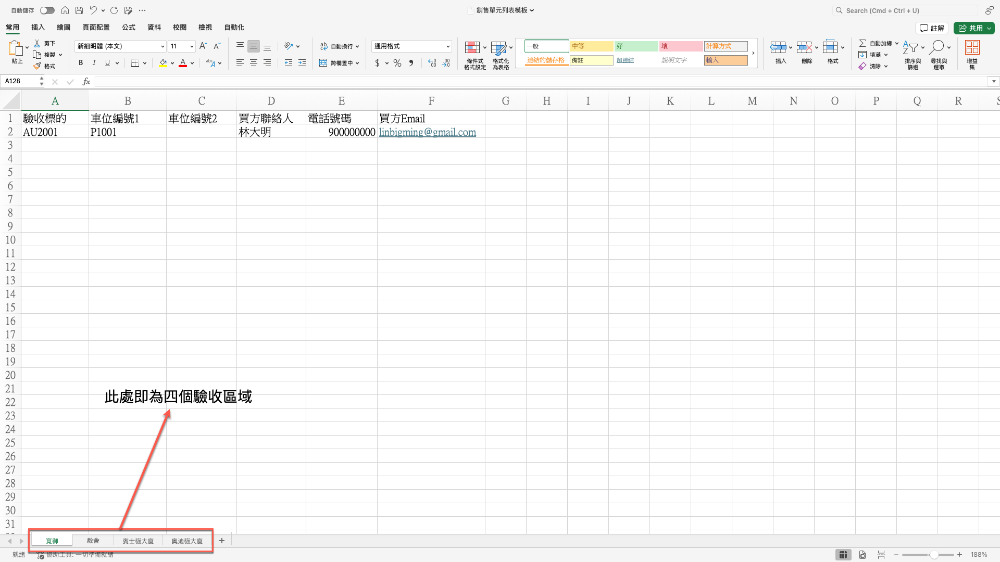

!!! warning
    請注意：
    
    1. 由於系統判讀資料之因素，**「務必使用」**&#x4E0A;述提供的模板填寫，並依照格式妥善填寫。
    2. 新增工作表時，請確認已有標題且不可缺少 (驗收編號、車位編號1......)，再進行資料填寫。

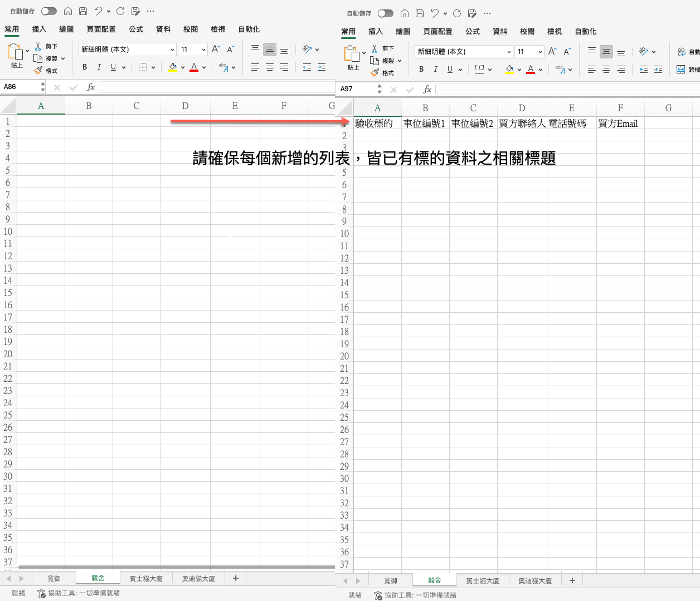



### 上傳 Excel 模板

將Excel資料填寫完畢並確認無誤後，點&#x9078;**「+銷售單元模板列表」**&#x5373;可開啟視窗上傳檔案。

!!! info
    Excel 匯入無法為該標的選擇負責人。如欲選擇負責人，請參考 ➙ [#id-03-bian-ji-yan-shou-biao-de](#id-03-bian-ji-yan-shou-biao-de "mention")

 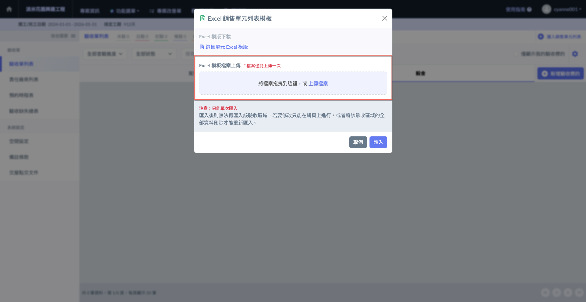

如下圖，(圖八)原檔案經上傳後，資料即會自動建立於系統上(圖九)。

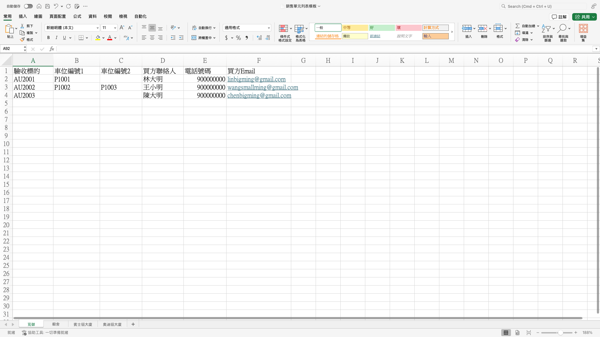 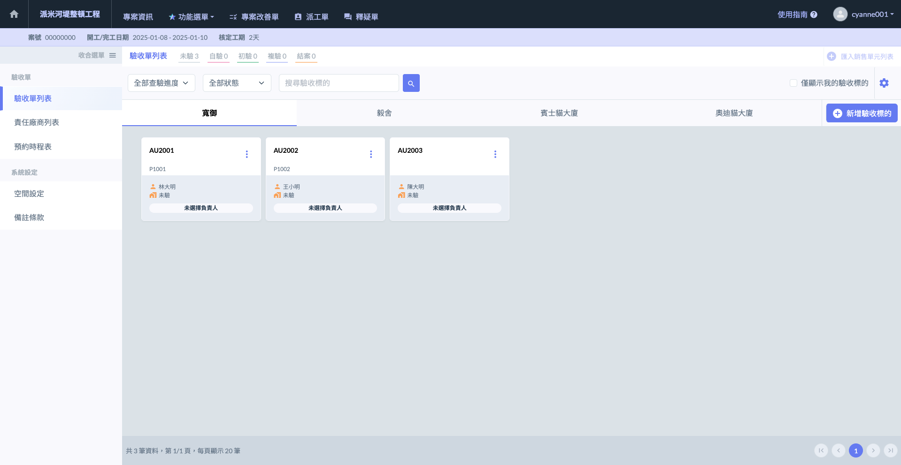




***

## 03｜編輯驗收標的

如欲編輯/刪除驗收標的，請於該標的右側點&#x9078;**「⋮」**。

展開選單後，點&#x9078;**「刪除」**&#x5373;可刪除該標的；點&#x9078;**「編輯驗收標的」**&#x5373;可修改相關資料 (標的編號、車位、買方及負責人)。

!!! warning
    請注意，僅尚未填寫過項目紀錄之標的可刪除。一旦填寫(包含缺失項目、同意事項及建議事項等)，則不可刪除。

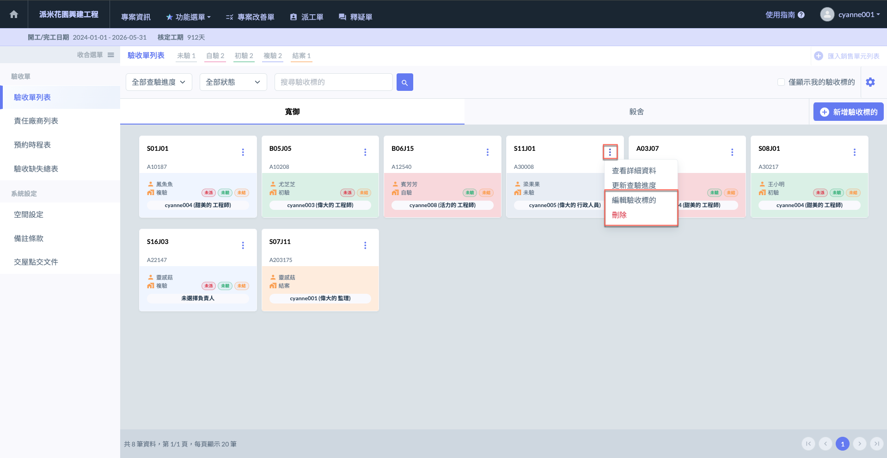 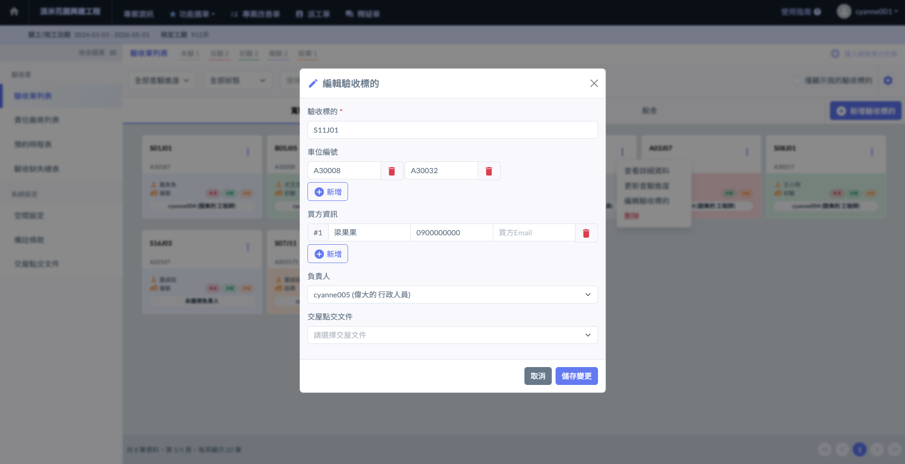

***

## 04｜驗收單狀態說明

系統於驗收單列表中，將額外提示使用者各驗收標的是否尚有待處理之事項，包含：<kbd><mark style="color:red;">**未派**<mark style="color:red;"></kbd>、<kbd><mark style="color:green;">**未驗**<mark style="color:green;"></kbd>、<kbd><mark style="color:orange;">**未結**<mark style="color:orange;"></kbd>



尚有部分缺失紀錄項目尚未確認責任歸屬（即尚未指定責任廠商）。



尚有部分缺失紀錄項目未完成改善作業。(即仍有驗收缺失**尚未**經責任廠商或相關人員完成改善)



尚有部分缺失項目 (不論未完成改善/已完成改善)，尚未經客戶進行最終驗收簽名確認。


