# 驗收紀錄項目

---
description: Acceptance Record Item
---

# 驗收紀錄項目

填寫紀錄前，請先確認您目前所處的**檢核狀態**是否正確（如：自驗、初驗或複驗）。

下圖為檢核狀態說明，請務必點選對應之狀態後再進行紀錄填寫，以確保資料正確歸屬於該驗收階段。

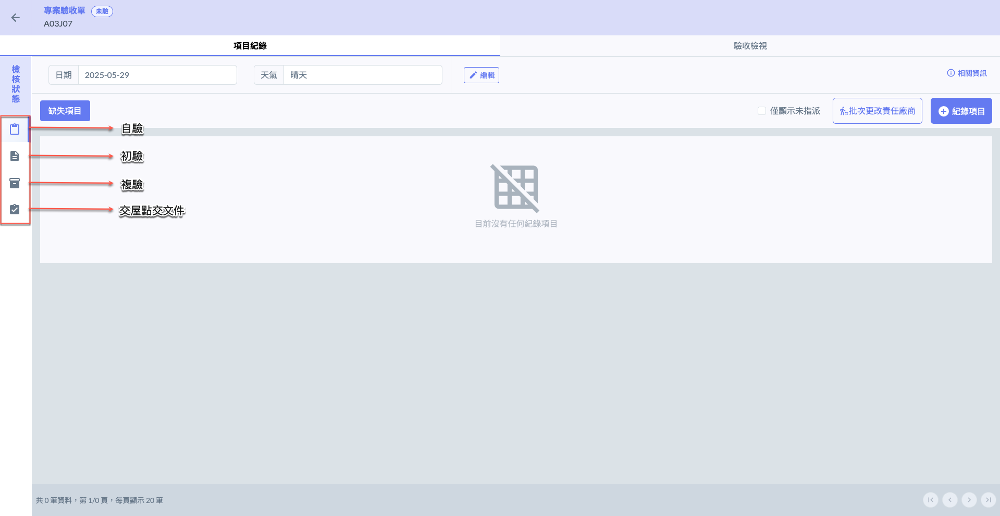

有關新增紀錄之前置作業 (如相關資訊、日期&天氣等)，請參閱  **➙**  

***

## 01｜驗收階段說明總表

<table><thead><tr><th width="79.14996337890625">驗收階段</th><th width="489.39404296875">驗收對象</th><th width="281.1055908203125">作業目的</th><th width="259.2568359375">紀錄內容</th><th width="116.162109375">日期設定方式</th><th width="144.729736328125">是否需要客戶簽名</th></tr></thead><tbody><tr><td>自驗</td><td>
第一級驗收：由承造人辦理自主檢查與修繕。

第二級驗收：由起造人會同監造人，辦理承造人施作之工程驗收。
</td><td>內部自主檢查，提前發現問題</td><td>僅填寫缺失項目</td><td>統一設定</td><td>否</td></tr><tr><td>初驗</td><td>第三級驗收：由起造人會同承造人，辦理承購客戶之交屋驗收。</td><td>第三級驗收首次執行，全面檢查</td><td>缺失項目、同意事項、建議事項</td><td>統一設定</td><td>是</td></tr><tr><td>複驗</td><td>同如第三級，但為針對<strong>初驗階段所列缺失進行改善後之再次查驗</strong>。</td><td>缺失改善後再次查驗，可能多次執行</td><td>缺失項目、同意事項、建議事項</td><td>可個別設定</td><td>是</td></tr></tbody></table>

***

## 02｜自驗

系統中&#x7684;**「自驗」**&#x72C0;態主要用於執行第一級與第二級內部驗收流程，故在此階段**無須填寫客戶簽名、同意事項及建議事項**等欄位。該階段重點在於內部查核與缺失確認，作為正式對外驗收前之準備依據。

驗收流程說明

第一級驗收：由承造人辦理自主檢查及修繕。

第二級驗收：由起造人會同監造人，辦理承造人施作之工程驗收。

### 02 - 1｜新增紀錄

選定檢核狀態後，於項目紀錄右上角點&#x9078;**「+新增紀錄」**，即可針對各空間填寫缺失，並上傳個相關圖檔。

!!! info
    填寫缺失項目時，需要選擇您已設定之驗收空間 (如：主臥、客廳、廚房等)，並針對該空間填寫缺失說明。
    
    空間設定相關說明，請參閱 **➙** [space-settings](../../../system-settings/space-settings "mention")

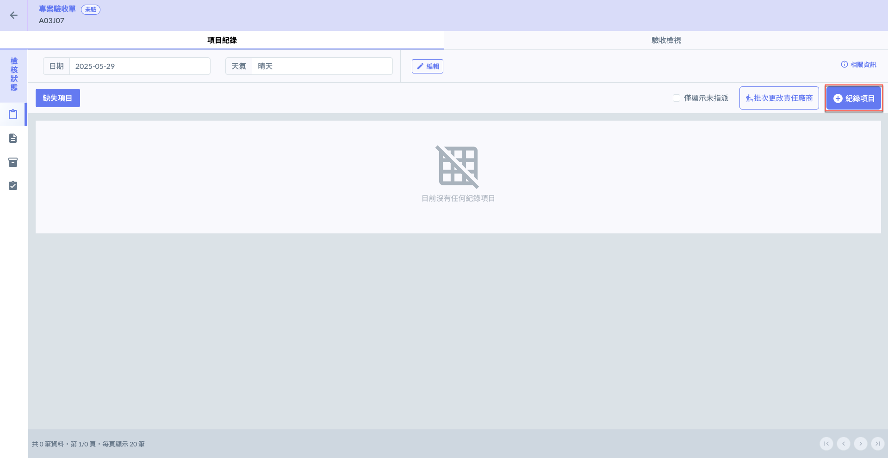 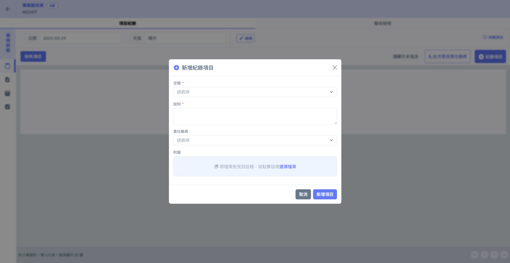

將驗收紀錄填寫完畢並確認無誤後，即可點選右下角&#x4E4B;**「新增項目」**&#x5132;存該筆資料。

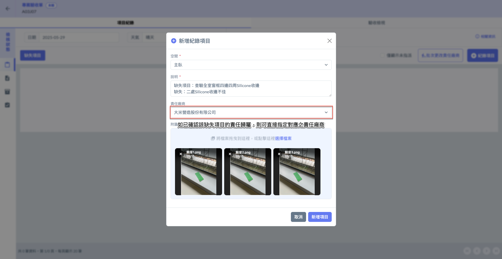 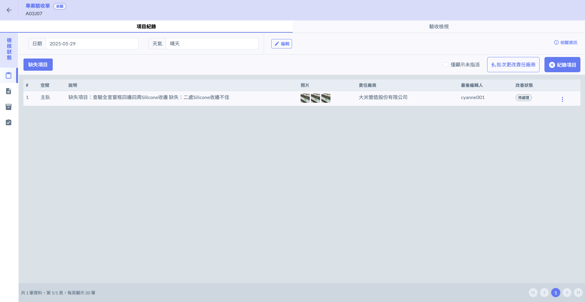

### 02 - 2｜編輯/刪除紀錄

於欲編輯或刪除之缺失項目右側，點&#x9078;**「⋮」**&#x6309;鈕以開啟操作選單，並選&#x64C7;**「編輯紀錄項目」**&#x6216;**「刪除」**。\
透&#x904E;**「編輯紀錄項目」**&#x529F;能，您可修改該筆紀錄的空間位置、說明內容、附圖及協力廠商等資訊。

!!! tip
    由於新增缺失紀錄時，實務上可能尚未確認該項缺失之實際責任廠商。
    
    因此您可於驗收紀錄新增後，透&#x904E;**「批次更改協力廠商」**&#x529F;能，統一指派多筆缺失項目之負責單位，提升作業效率並強化後續追蹤管理。
    
    有關指定責任廠商之相關操作，請參閱 **➙** [confirm-responsibility](record-item/confirm-responsibility "mention")

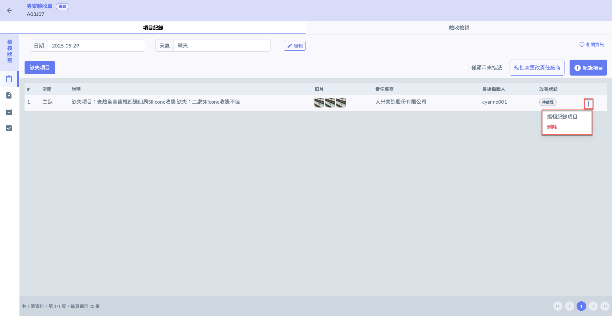 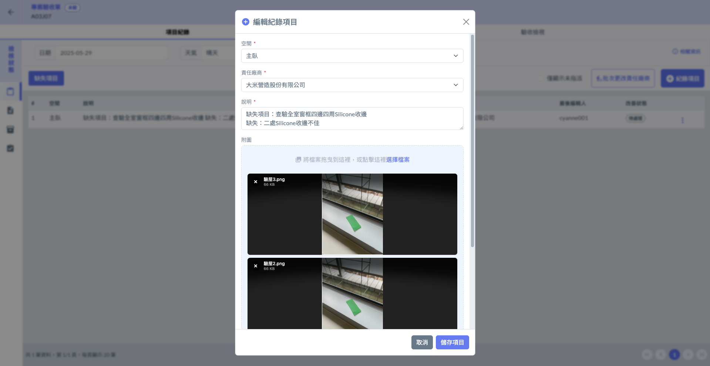

***

## 03｜初驗

系統中的「初驗」狀態對應於**第三級驗收作業**，即由承造人會同客戶進行之全面性驗收檢查。

因此，在此階段除需填寫**缺失項目**外，亦需完整記錄**同意事項**與**建議事項**，並於驗收作業完成後**由客戶進行簽收確認**，作為驗收結果之正式依據。

驗收流程說明

第三級驗收：由起造人會同承造人，辦理承購客戶之交屋驗收。

### 03 - 1｜新增紀錄

請先選擇欲填寫之紀錄類別，如<kbd>**缺失項目**</kbd>、<kbd>**同意事項**</kbd>或<kbd>**建議事項**</kbd>。點選對應的頁籤後，即可針對該類別進行紀錄填寫。

!!! warning
    其中，**日期與天氣為統一設定項目**，不會因頁籤切換而變動。該日期與天氣將作為當前檢核狀態 (如：初驗) 下的通用設定，請於填寫前務必確認無誤，以確保所有紀錄內容的一致性。

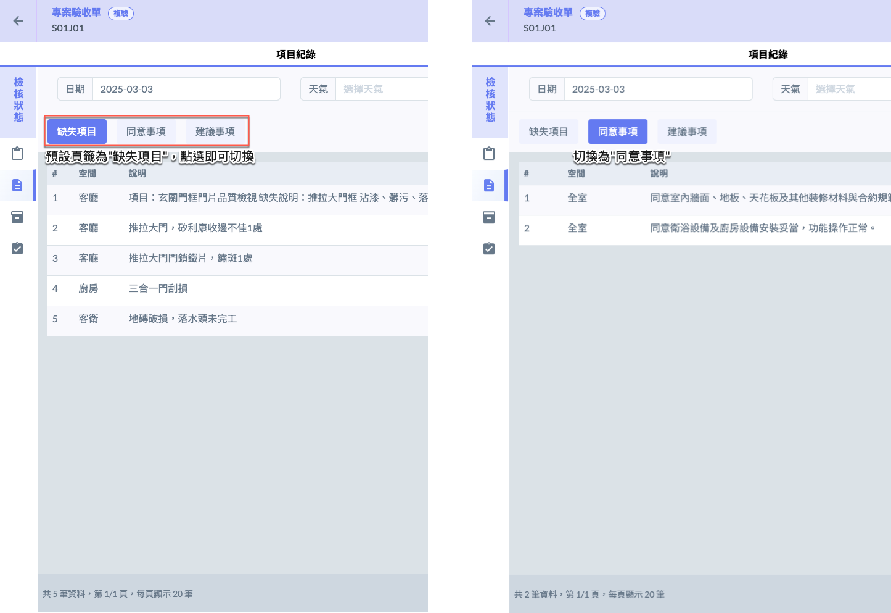

選取欲填寫之事項後，點選頁面右上角&#x7684;**「+新增紀錄」**，即可針對各驗收空間填寫缺失項目，並上傳多張相關圖檔。

!!! info
    於填寫缺失項目時，請先選擇已設定之驗收空間 (如：主臥、客廳等)，並於對應空間中填寫詳細的缺失說明。
    
    空間設定相關說明，請參閱 **➙** [space-settings](../../../system-settings/space-settings "mention")

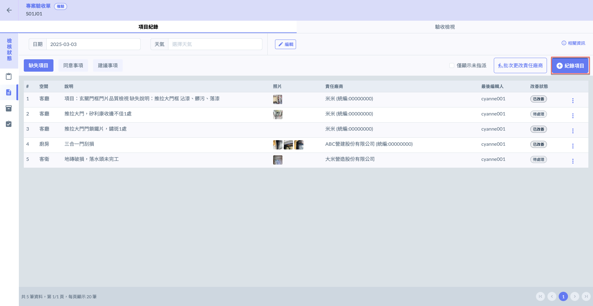 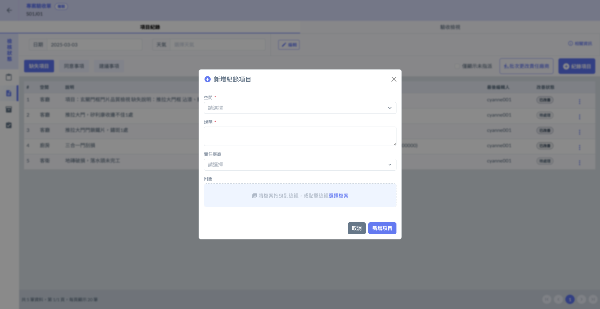

如圖四所示，完成資料填寫並確認無誤後，點&#x9078;**「新增項目」**&#x5373;可儲存該筆紀錄，完成後將自動顯示於初驗列表中。

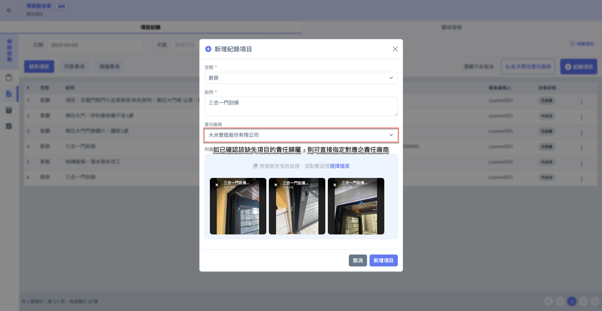 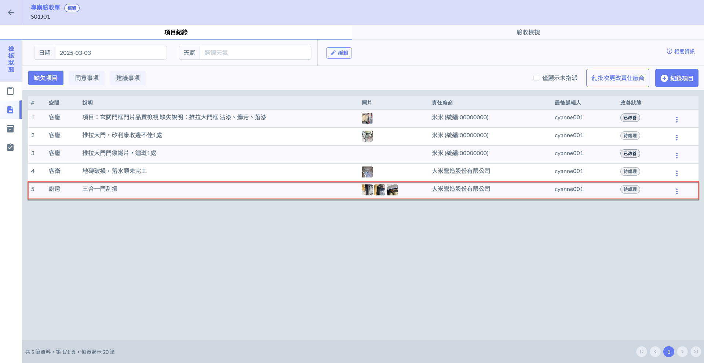

### 03 - 2｜編輯/刪除紀錄

於欲編輯或刪除之缺失項目右側，點&#x9078;**「⋮」**&#x6309;鈕以開啟操作選單，並選&#x64C7;**「編輯紀錄項目」**&#x6216;**「刪除」**。\
透&#x904E;**「編輯紀錄項目」**&#x529F;能，您可修改該筆紀錄的空間位置、說明內容、附圖及協力廠商等資訊。

!!! tip
    由於新增缺失紀錄時，實務上可能尚未確認該項缺失之實際責任廠商。
    
    因此您可於驗收紀錄新增後，透&#x904E;**「批次更改協力廠商」**&#x529F;能，統一指派多筆缺失項目之負責單位，提升作業效率並強化後續追蹤管理。
    
    有關指定責任廠商之相關操作，請參閱 **➙** [confirm-responsibility](record-item/confirm-responsibility "mention")&#x20;

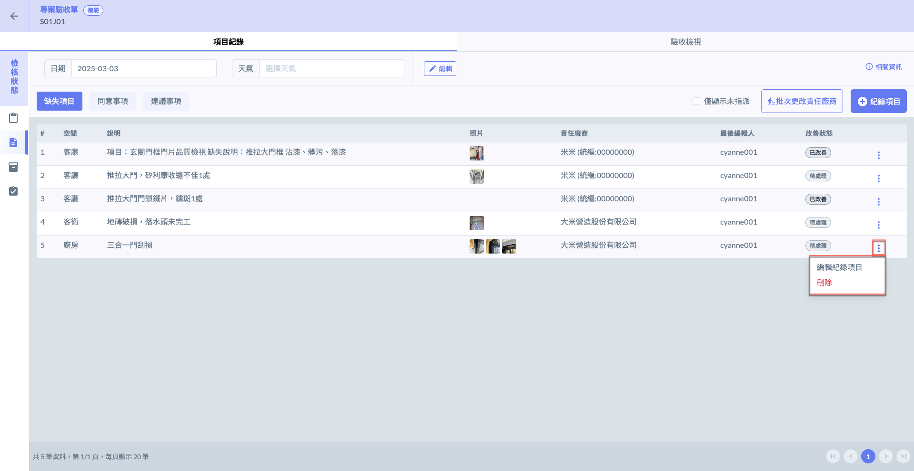 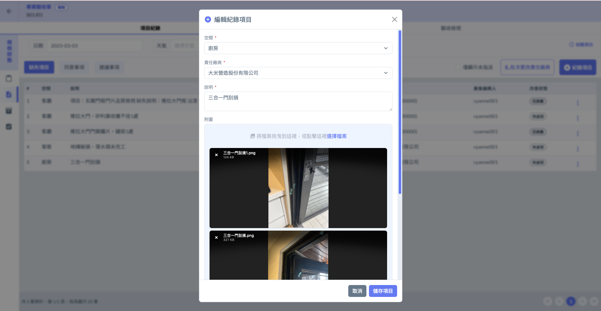

***

## 04｜複驗

系統中的「複驗」同屬於**第三級驗收作業**範疇，與初驗相同，皆為承造人會同客戶執行之全盤驗收流程。

差異在於，「初驗」為第三級驗收之第一次全面檢查，而「複驗」則為針對**初驗階段所列缺失進行改善後之再次查驗**。若改善未完全，可能須進行多次複驗，直至所有缺失確認完成為止。

因此，在「複驗」階段的作業上，有以下特殊性需特別留意：

* **每筆紀錄項目（包含缺失項目、同意事項、建議事項）皆可獨立指定日期**
* 相較於自驗與初驗之日期為統一設定，複驗需因應實際缺失修復進度，日期不盡相同

!!! tip
    此設計可確保複驗流程具備彈性與真實性，並提供明確的歷程紀錄，方便後續查閱與缺失追蹤。

 驗收流程說明

第三級驗收：由起造人會同承造人，辦理承購客戶之交屋驗收。

### 04 - 1｜新增紀錄

請先選擇欲填寫之紀錄事項，如<kbd>**缺失項目**</kbd>、<kbd>**同意事項**</kbd>及<kbd>**建議事項**</kbd>。點選欲操作之頁籤，即可針對該頁籤填寫紀錄。

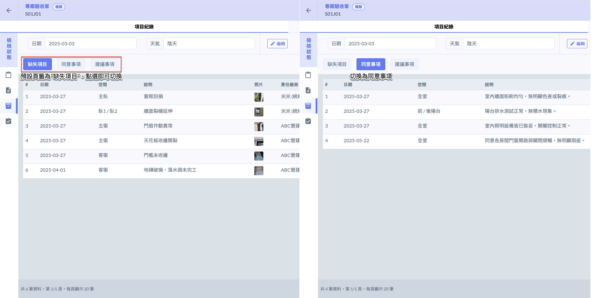

選定欲填寫之事項，於頁面右上角點&#x9078;**「+新增紀錄」**，即可為紀錄**選擇複驗日期**、**空間、填寫缺失說明**，並上傳多個圖檔。

!!! info
    於填寫缺失項目時，請先選擇已設定之驗收空間 (如：主臥、客廳等)，並於對應空間中填寫詳細的缺失說明。
    
    空間設定相關說明，請參閱 **➙** [space-settings](../../../system-settings/space-settings "mention")

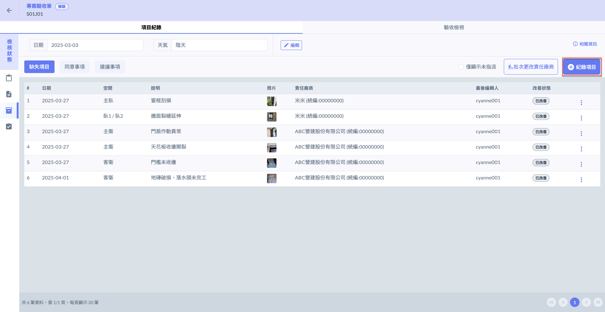 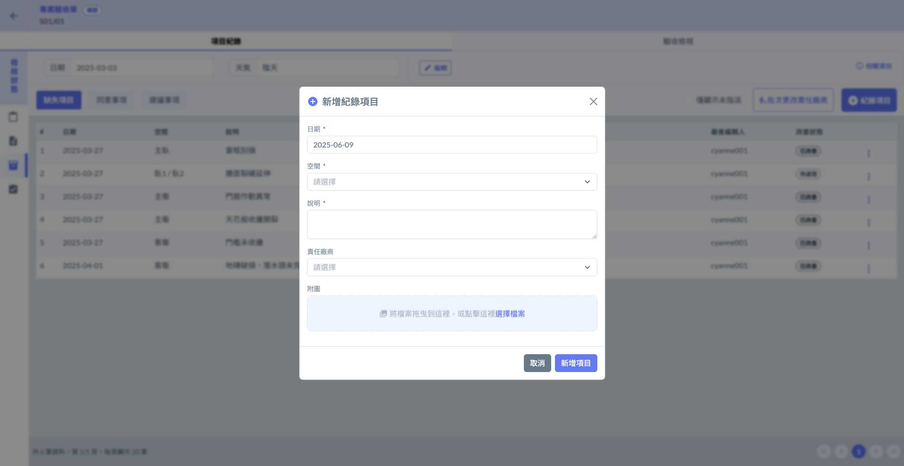

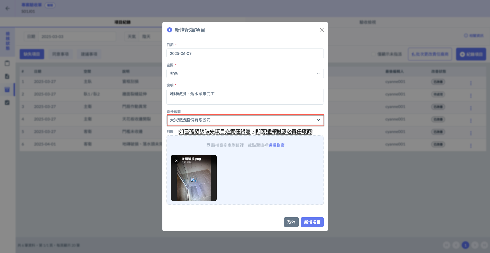 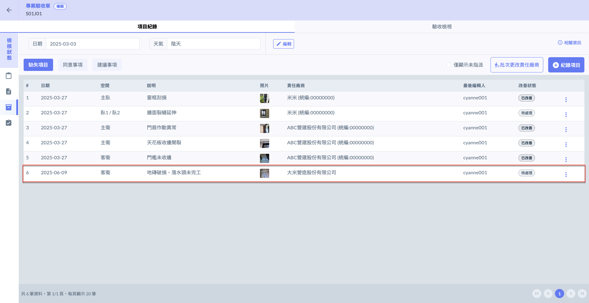

### 04 - 2｜編輯/刪除紀錄

於欲編輯/刪除之缺失項目右側，點&#x9078;**「⋮」**，即可選擇**編輯紀錄項目/刪除**。

您可&#x65BC;**「編輯紀錄項目」**&#x529F;能中，修改**日期**、**空間**、**說明**、**附圖** & **選擇協力廠商**。

!!! tip
    由於新增缺失紀錄時，實務上可能尚未確認該項缺失之實際責任廠商。
    
    因此您可於驗收紀錄新增後，透&#x904E;**「批次更改協力廠商」**&#x529F;能，統一指派多筆缺失項目之負責單位，提升作業效率並強化後續追蹤管理。
    
    有關指定責任廠商之相關操作，請參閱 **➙** [confirm-responsibility](record-item/confirm-responsibility "mention")&#x20;

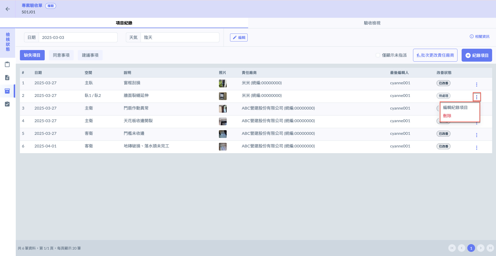 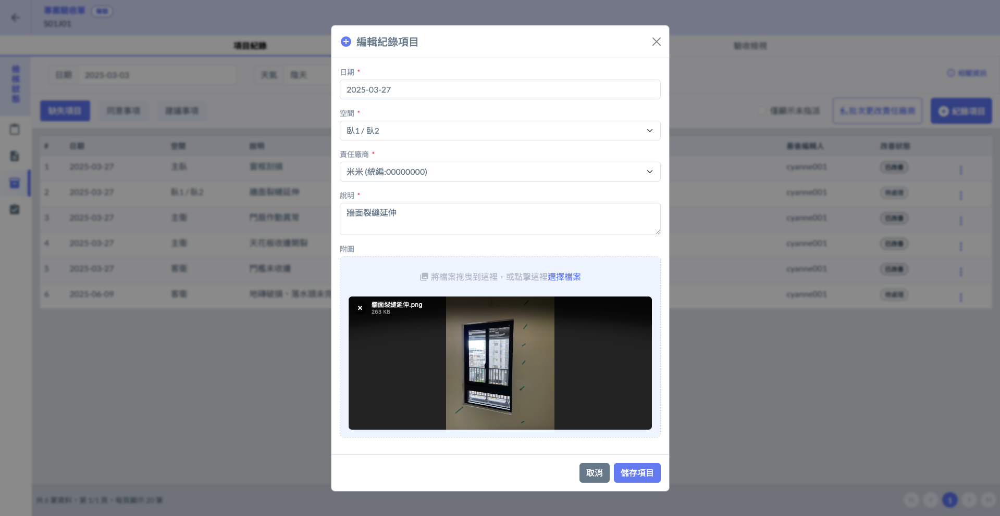

