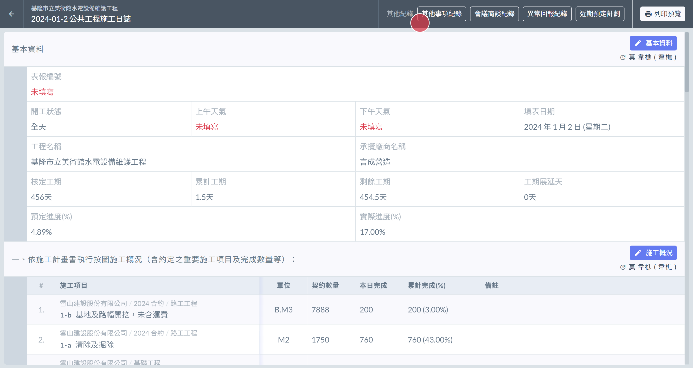
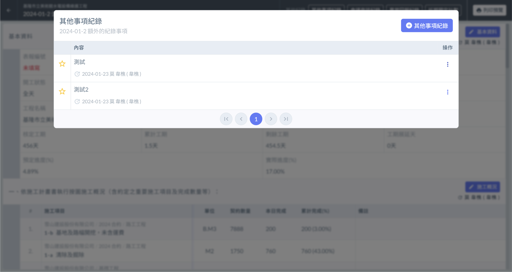
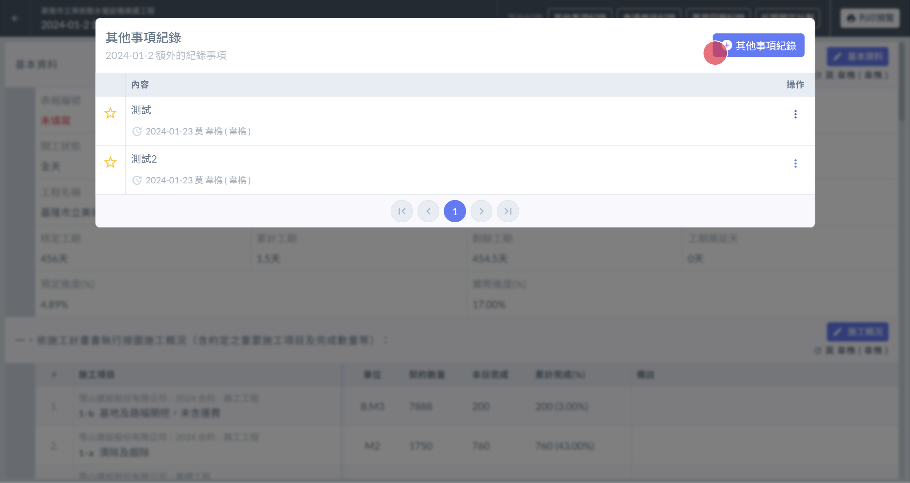
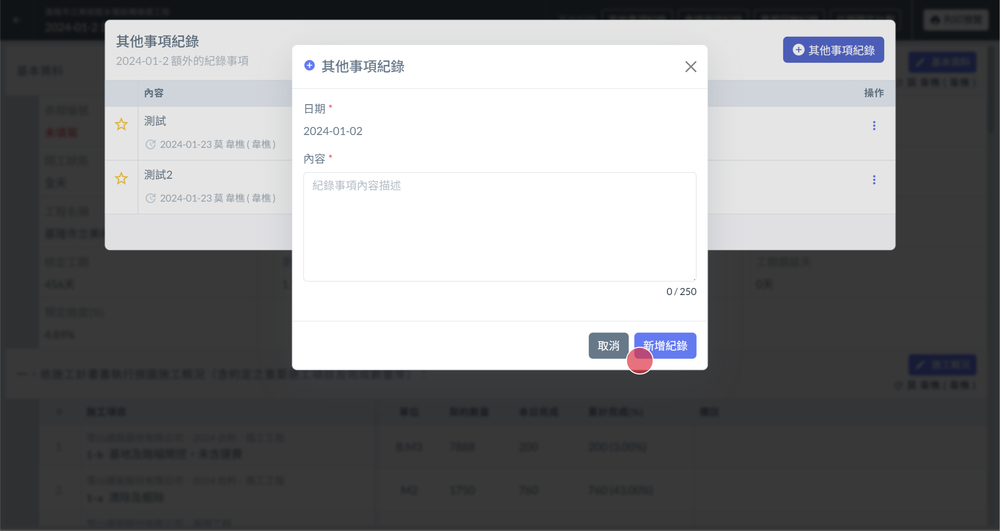
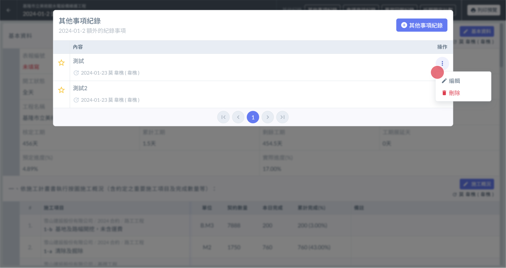

# 日誌 / 其他更多紀錄

## 📓01｜開啟介面

1. 頁面最上方 有個 **其他事項紀錄** 的按鈕  ( 左圖🔴)
2. 點選即可開啟檢視介面 ( 右圖 ) 。

!!! warning
    日誌中僅會顯示出當天的紀錄。
    
    如要跨日期檢視可從 [→ 其他紀錄總表](../qi-ta-shi-xiang-ji-lu-zong-biao) 進行檢視。

 

## 📓02｜新增紀錄

* 紀錄介面 右上方有個 **新增紀錄** 的按鈕  ( 左圖🔴)
* 點選即可開啟編輯頁面 ( 右圖 ) 。
* 填寫完畢後 點選右下角的 **新增紀錄** ( 右圖🔴) 即可新增紀錄。

!!! warning
    日誌中僅允許新增當天的紀錄。
    
    如欲新增其他日期可從其他日期的日誌進行新增，或是從 [→ 其他紀錄總表](../qi-ta-shi-xiang-ji-lu-zong-biao) 進行新增。

 

## 📓03｜編輯、刪除紀錄

找到您要操作的提示項目，於該項目的最右側，有個 **三個點圖案的按鈕**。點選後會出現 **編輯** 與 **刪除** 的按鈕。

* 刪除：請點選刪除按鈕。
* 編輯：請點選編輯按鈕。並於修改介面中修改完成後按下儲存按鈕。

