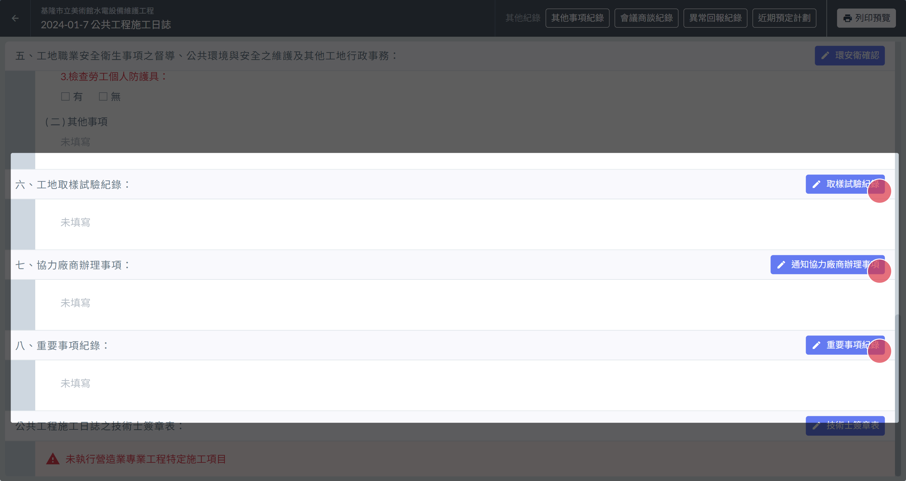
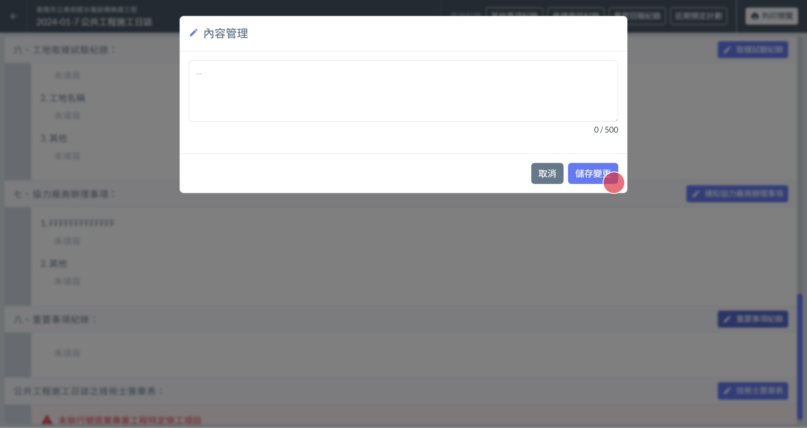
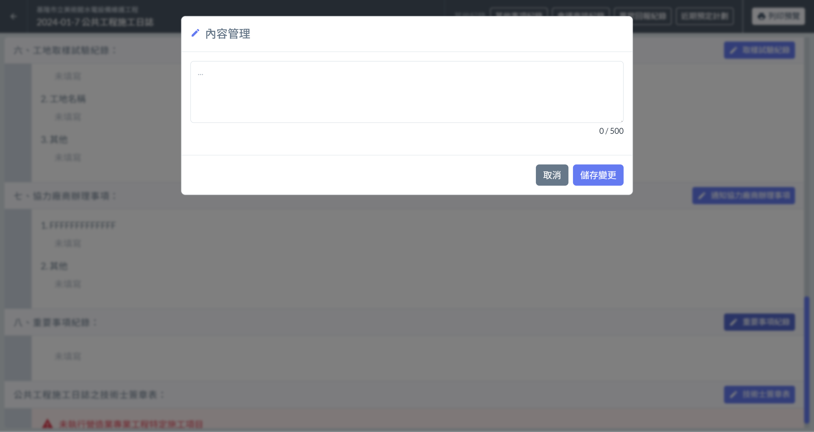
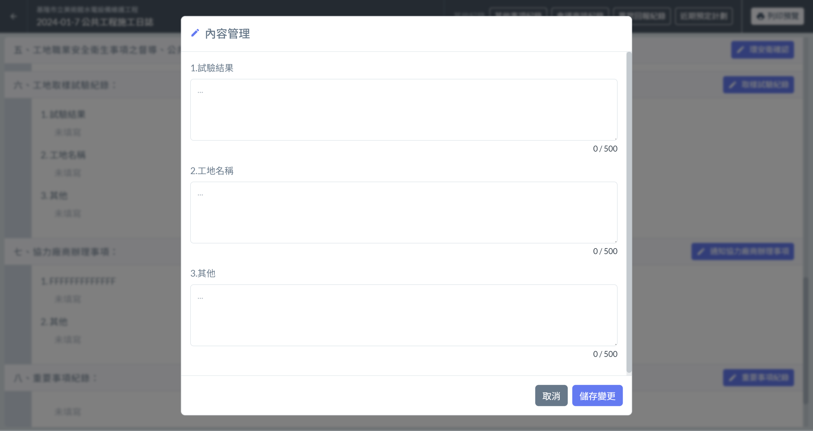

# 日誌 / 工地取樣試驗紀錄、協力廠商辦理事項、重要事項紀錄

---
description: 提供相關填寫欄位，並提供 欄位重點提示 的功能，用以提醒填寫人填寫指定內容。
---

# 日誌 / 工地取樣試驗紀錄、協力廠商辦理事項、重要事項紀錄

## 📓01｜如何編輯

* 區塊標題右側 皆有個 **編輯按鈕**  ( 左圖🔴)
* 點選即可開啟管理介面 ( 右圖 ) 。
* 填寫完成確認無誤後，點選右下角的 「 **儲存變更** 」 即可將編輯後的資訊儲存起來 ( 右圖🔴)

 

## 📓02｜進階應用 欄位重點提示

&#x20;針對工地取樣試驗紀錄、協力廠商辦理事項、重要事項紀錄這三項欄位，Jobdone額外提供了**欄位重點提示** 功能。

 

!!! info
    #### 如何設定**欄位重點提示?**
    
    請參閱 [→ 欄位重點提示設定](../ri-zhi-xi-tong-she-ding/lan-wei-zhong-dian-ti-shi-she-ding)

!!! danger
    #### 提示在 [→ 欄位重點提示設定](../ri-zhi-xi-tong-she-ding/lan-wei-zhong-dian-ti-shi-she-ding) 中被修改，是否會影響已經填寫好的日誌?
    
    為了確保資料填寫的正確性， 但凡該日誌的該欄位 ****曾經進行填寫操作**** ，該欄位的提示文字就將****不再隨設定中的異動而改變****。

