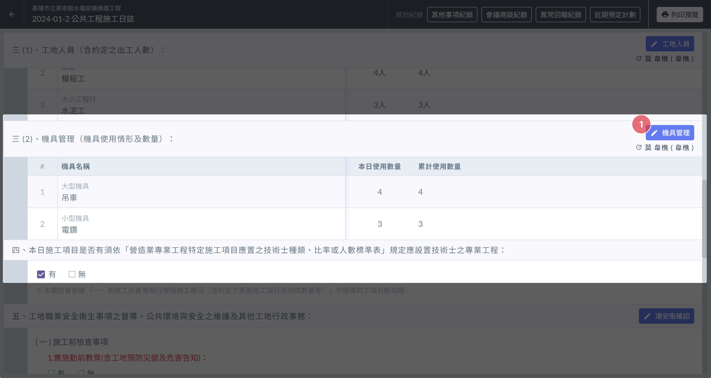
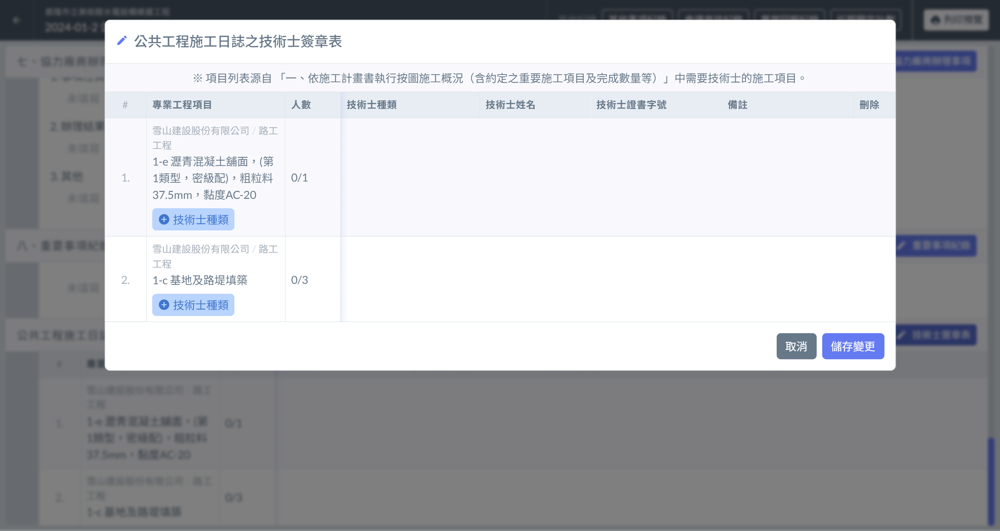
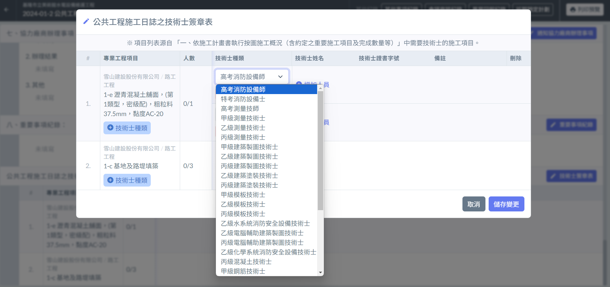
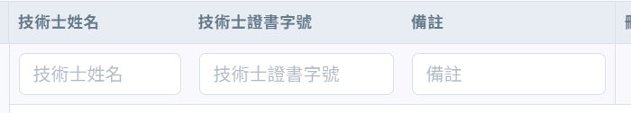
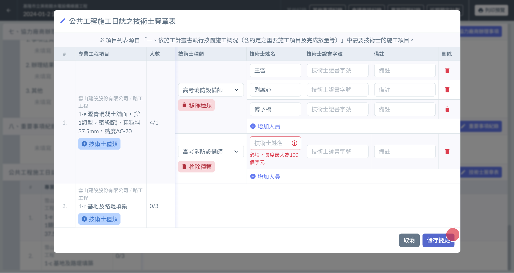

# 日誌 / 技術士簽章表

---
description: 管理日誌中的技術士簽章表
---

# 日誌 / 技術士簽章表

## 📓00｜如何新增專業工程項目?

技術士簽章表的專業工程項目，由系統自動添加，其判斷來自於 [→ 施工概況](ri-zhi-shi-gong-gai-kuang) 。

如 [→ 施工概況](ri-zhi-shi-gong-gai-kuang) 中有工項否需要專業技術士，便會顯示在技術士簽章表當中。

## 📓01｜開始編輯

* 區塊標題右側 皆有個 **編輯按鈕**  ( 左圖🔴)
* 點選即可開啟管理介面 ( 右圖 ) 。

!!! danger
    提醒您：填寫日誌其他內容之前，必須先 [→ 填寫基本資訊](ri-zhi-ji-ben-zi-xun)

 

***

## 📓03｜技術士種類

### └ 📄新增技術士種類

點選專業工程項目 下的 **+ 技術士種類** 按鈕，即可為該專業工程項目增加技術士總類。

### └ 📄選擇技術士種類

點選下單選單可以選擇技術士種類類型。

### └ 📄移除技術士種類

**技術士種類** 下方的 **移除總類** 按鈕，即可移除該技術士種類。

***

## 📓04｜技術士

### └ 📄新增技術士

**技術士種類**  右方的 **+ 增加人員** 按鈕，即可為該技術士總類增加人員欄位。

### └ 📄填寫技術士相關內容

技術士**姓名為必填欄位**之外，還提供了技術士編號與被註等等欄位。

### └ 📄移除技術士

人員清單右側的 **垃圾桶** 按鈕，即可移除人員欄位。

***

## 📓 05｜儲存變更

填寫完成確認無誤後，點選右下角的 「 **儲存變更** 」 即可將編輯後的資訊儲存起來。

!!! danger
    技術士**姓名為必填欄位**。

!!! danger
    如確定要保存資料，請務必按下儲存變更按鈕。
    
    如未進行儲存的動作，編輯的內容資料將在介面被關閉(如按下取消、按下ESC、關閉網頁、關閉瀏覽器等等行為)的同時**被還原成編輯前的狀態**。

