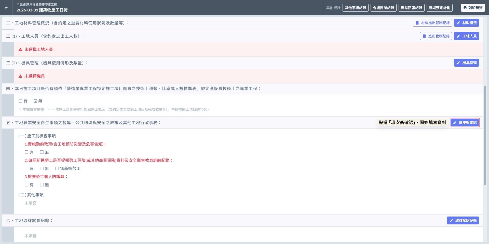
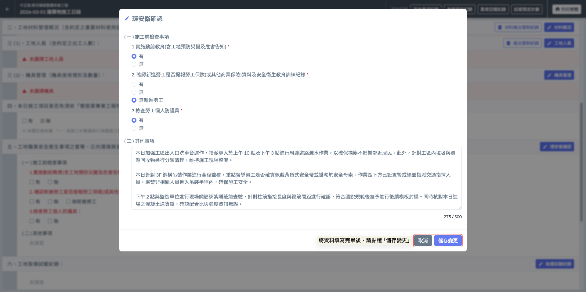
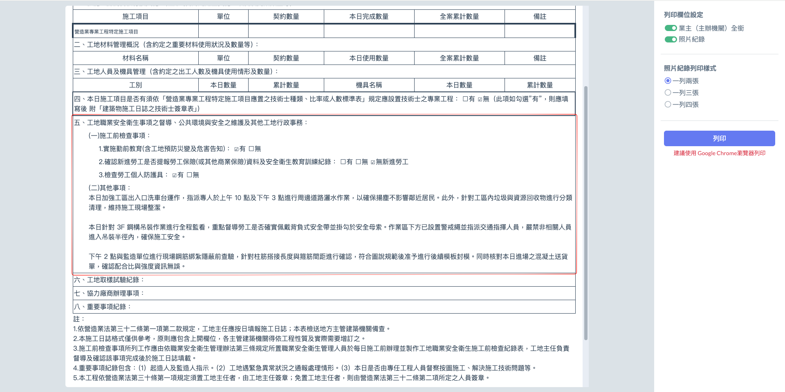

# 日誌 / 環安衛確認事項

#### **工地職業安全衛生事項、環境維護及行政事務**

本欄位依據行政院公共工程委員會法定格式設立，旨在詳實記錄每日工地現場的安全督導與環境維護狀況，其重點查驗項目如下：

**( 一 ) 施工前檢查事項**



* 紀錄： □ 有 / □ 無
* _補充：_ 每日開工前由現場主任或安衛人員召集工班，針對當日高風險作業（如高架、開挖、吊裝）進行危害因素告知及避難演練說明。



* 紀錄： □ 有 / □ 無 / □ 無新進勞工
* _補充：_ 確實核對新進人員之勞保投保明細及 6 小時職安訓練證明，確保所有作業人員均具備法定進場資格。



**( 二 ) 其他事項**

為自行填寫之項目，可再補充詳盡以符合規範要求，例如：

* 公共環境維護： 包含每日工區周邊道路灑水清掃（抑低揚塵）、出入口洗車台運作情形，以及廢棄物分類存放管理。
* 工地行政事務： 包含各類施工圖說現場核對、廠商進場連繫會議及主管機關不定期督導紀錄。

如圖二，環安衛填寫表單如下：請您詳實勾選『施工前檢查事項』以確保開工合規，並針對當日特殊的職安督導、環境維護或行政協調內容，於『其他事項』欄位進行適時補充。

列印樣式如下：

