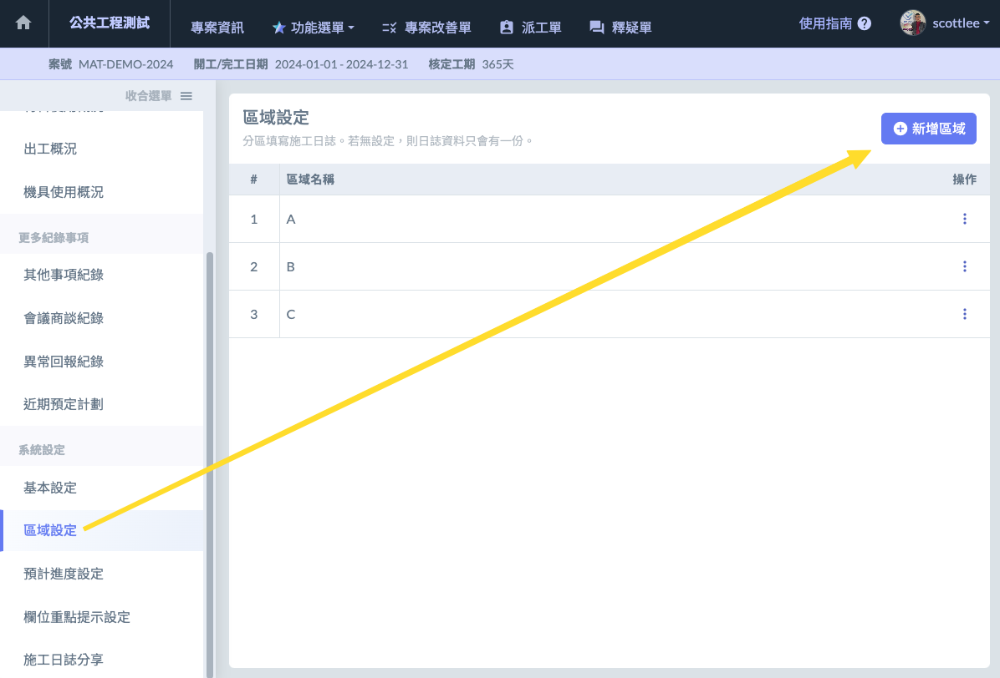
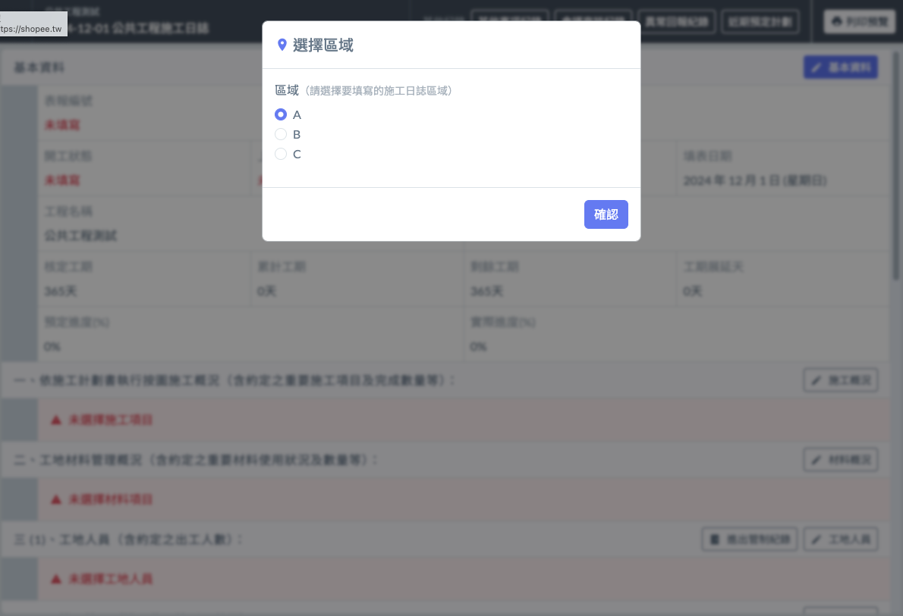

# 區域設定 (new)

!!! info
    #### 日誌新增 【區域】的概念，適用於大型案場，例如道路、隧道。或者建廠依照廠務性期分類。

## 區域

可任意自定，但只能在未開始填寫施工日誌的情況下，才能分區。

## 填寫

填寫日誌時，若有分區，會先彈出要求選擇區域，進入後畫面上方會顯示目前填寫的區域。

## 送審

各區填寫完，會需要按下【分區送審】，工地主任才能知道各區已經完成。工地主任確認過後，該區域的日誌就不能再更改。若有更改需求，需要工地主任去開放。
