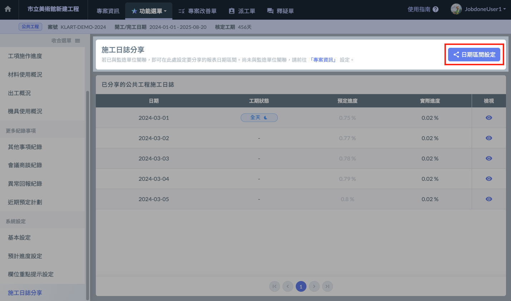
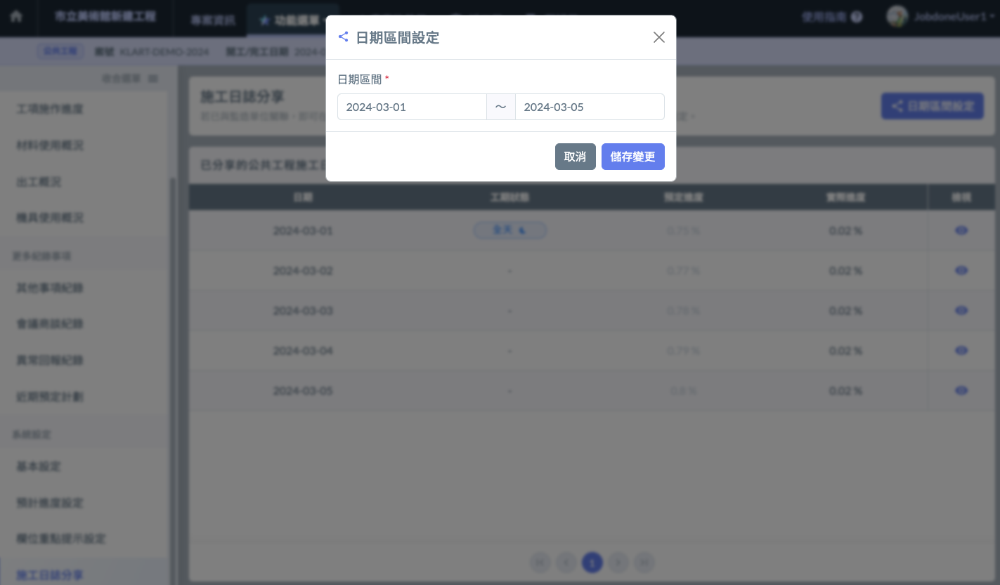
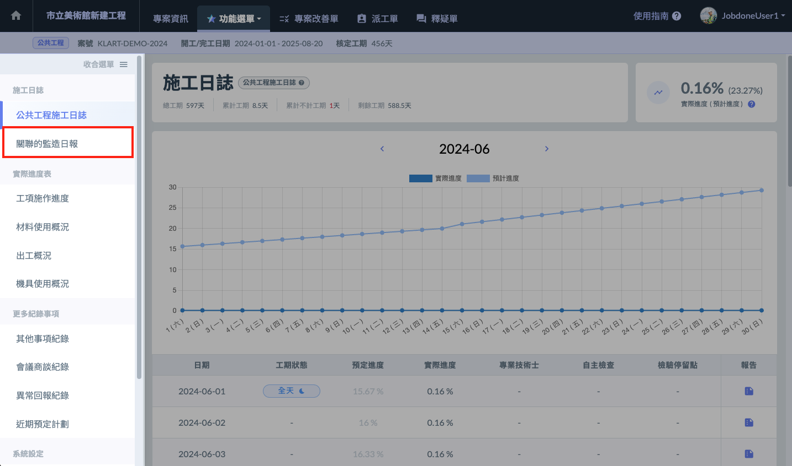
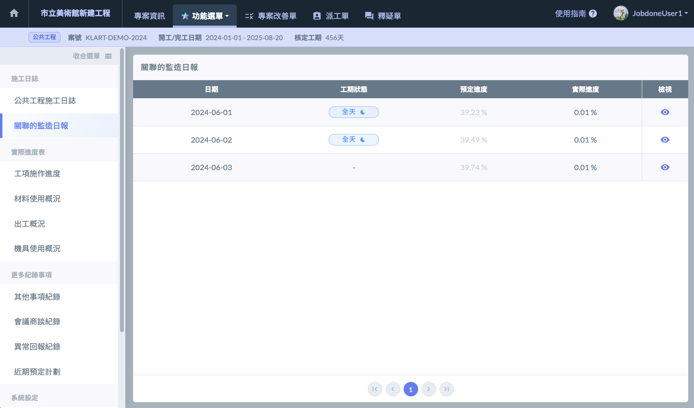
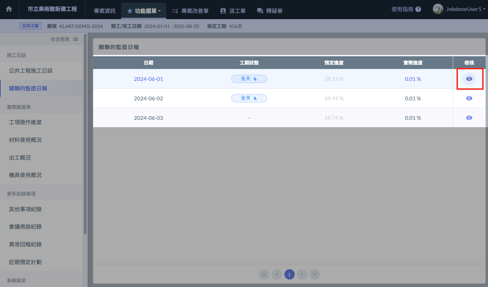
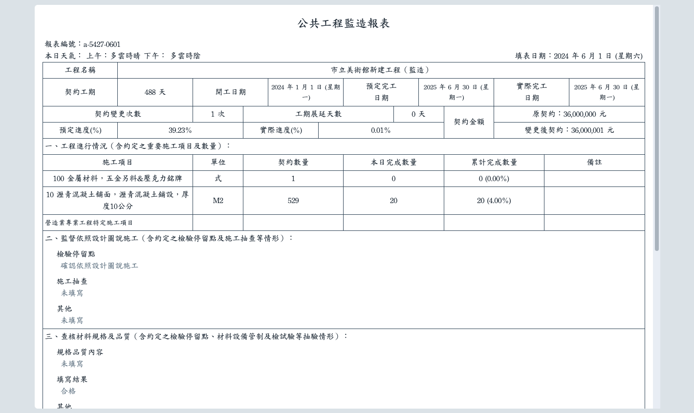

# 施工日誌分享

## 00｜前置作業

!!! warning
    設定前，請確保您已**與營造單位的專案進行關聯**。
    
    關聯的方法請參閱 → [專案關聯](../../../project_level/basic-information/zhuan-an-guan-lian)

## 01｜設定日期區間 

1. 點選畫面右上角的 **日期區間設定** 按鈕（如左圖紅框處），開啟設定管理介面（右圖）。
2. 設定欲分享的施工日誌日期起迄，按下 **儲存變更** 按鈕。
3. 分享成功！現在監造單位可在他們的 **施工日誌** 中看到您分享的施工日誌了。

 

## 如何查看監造單位分享的監造日報？

1. 若您已與監造單位關聯，左側的功能選單會出現一個 **關聯的監造日報** 按鈕（如左圖），點擊後進入關聯的監造日報頁面（右圖）。

 

2. 點擊列表最右方的 檢視按鈕（如下左圖紅框處），即可開啟監造日報的內容（如下右圖）。

 

