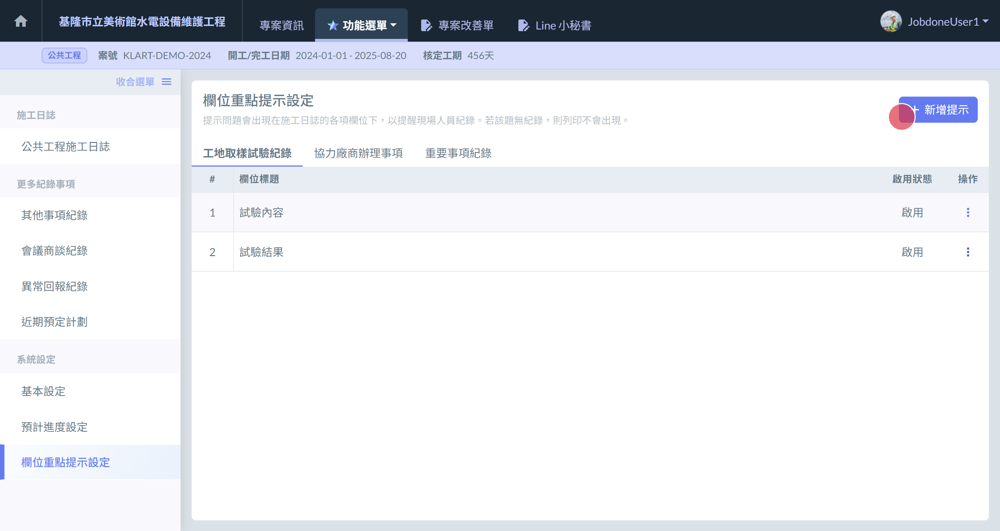
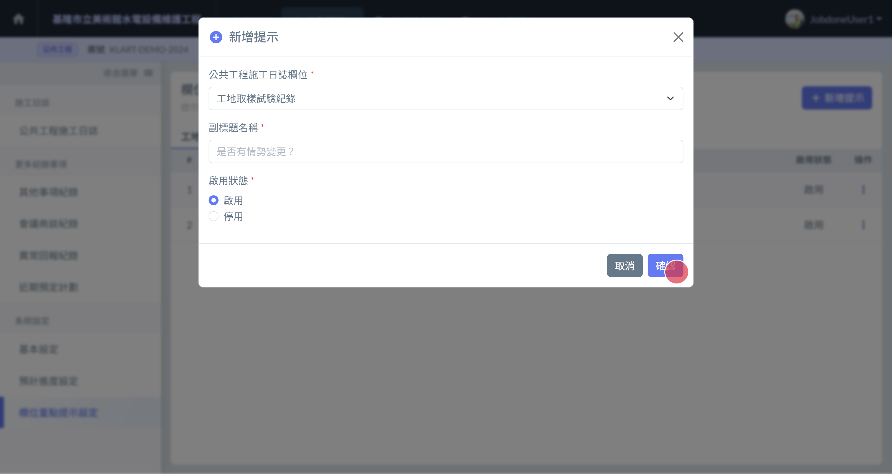
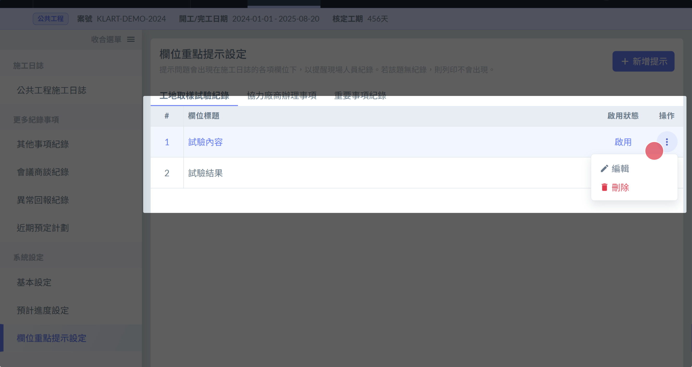

# 欄位重點提示設定

!!! danger
    #### 為什麼我修改了提示，有些日誌中沒有同步？
    
    為了確保資料填寫的正確性， 但凡該日誌的該欄位 **曾經進行******填寫操作**** ，該欄位的提示文字就將不再隨設定中的異動而改變。

## 01｜ 如何切換檢視中的提示列表

點選列表上方的 按鈕 可以切換列表。如下圖

## 01｜新增提示

1. 區塊標題右側 有個 **編輯按鈕**  ( 圖1的🔴 )，點選即可開啟新增介面 。
2. 填寫完成後，按下 **確定按鈕** ( 圖2的🔴 )
3. 新增成功！

!!! info
    #### 新增介面欄位包含：
    
    * 公共工程施工日誌欄位：這是哪個日誌欄位的提示
    * 副標題名稱：提示文字描述
    * 啟用狀態：是否在未進行填寫的日誌中顯示

!!! info
    #### 不需要額外添加"其他"欄位
    
    如果檢測到有新增提示，填寫日誌時不僅會顯示使用者建立的提示，還會為使用者自動新增一欄"其他"，用以確保使用彈性。

 

## 02｜修改、刪除、停用提示

找到您要操作的提示項目，於該項目的最右側，有個 **三個點圖案的按鈕**。點選後會出現 **編輯** 與 **刪除** 的按鈕。

* 刪除：請點選刪除按鈕。
* 修改/停用：請點選編輯按鈕。並於修改介面中修改完成後按下儲存按鈕。

