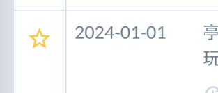
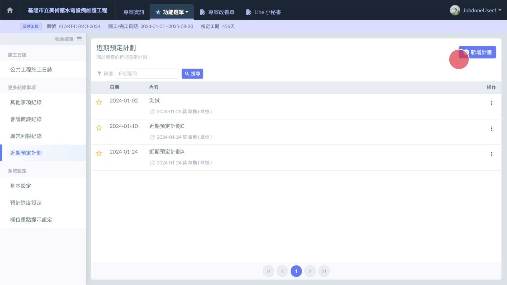
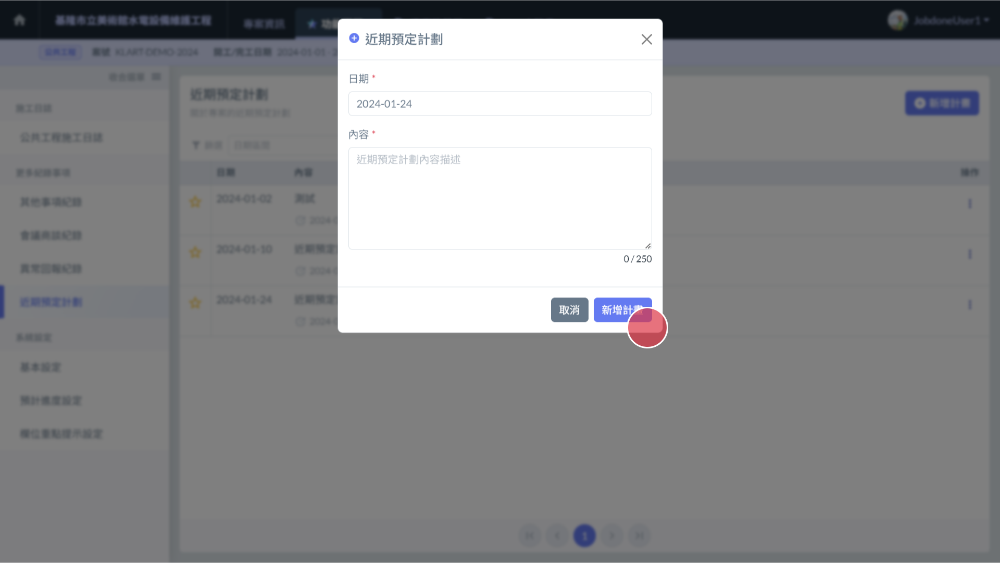
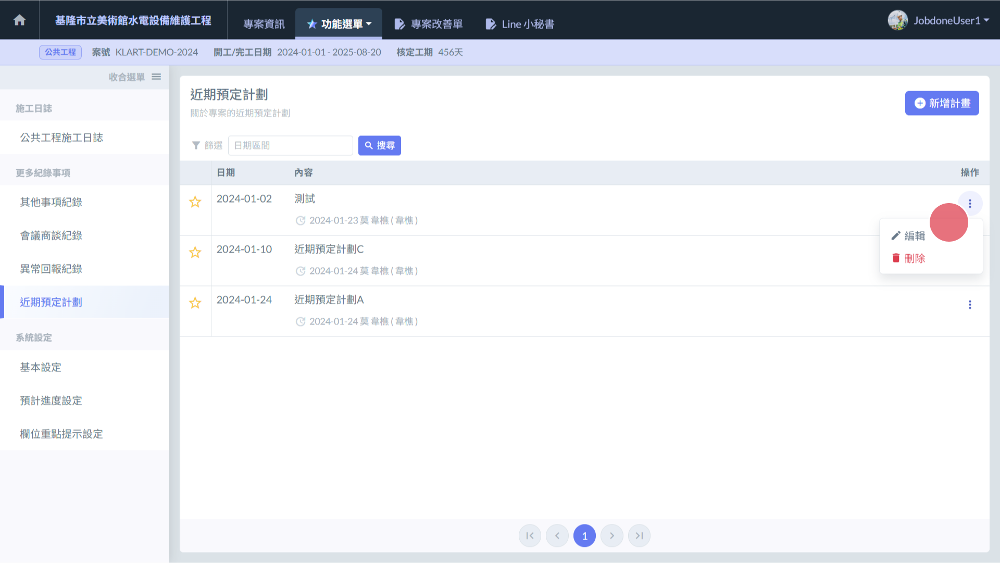

# 近期預定計劃總表

## 📓這些紀錄那裏來的?

紀錄可於 **本頁面進行新增**，或從 日[誌當中的 → 日誌 / 近期預定計劃](shi-gong-ri-zhi/ri-zhi-jin-qi-yu-ding-ji-hua) 新增。

## 📓列表篩選

Jobdone提供 **日期區間** 篩選功能。

## 📓釘選紀錄(將記錄置頂)

如有重要紀錄需要保留於列表的最上方，可 點選列表左側的**星星**進行釘選。再次點選擇取消釘選。

 

## 📓01｜本頁面如何新增紀錄?

* 介面右上方有個 **新增紀錄** 的按鈕  ( 左圖🔴)
* 點選即可開啟編輯頁面 ( 右圖 ) 。
* 填寫完畢後 點選右下角的 **新增紀錄** ( 右圖🔴) 即可新增紀錄。

 

## 📓03｜編輯、刪除紀錄

找到您要操作的提示項目，於該項目的最右側，有個 **三個點圖案的按鈕**。點選後會出現 **編輯** 與 **刪除** 的按鈕。

* 刪除：請點選刪除按鈕。
* 編輯：請點選編輯按鈕。並於修改介面中修改完成後按下儲存按鈕。

