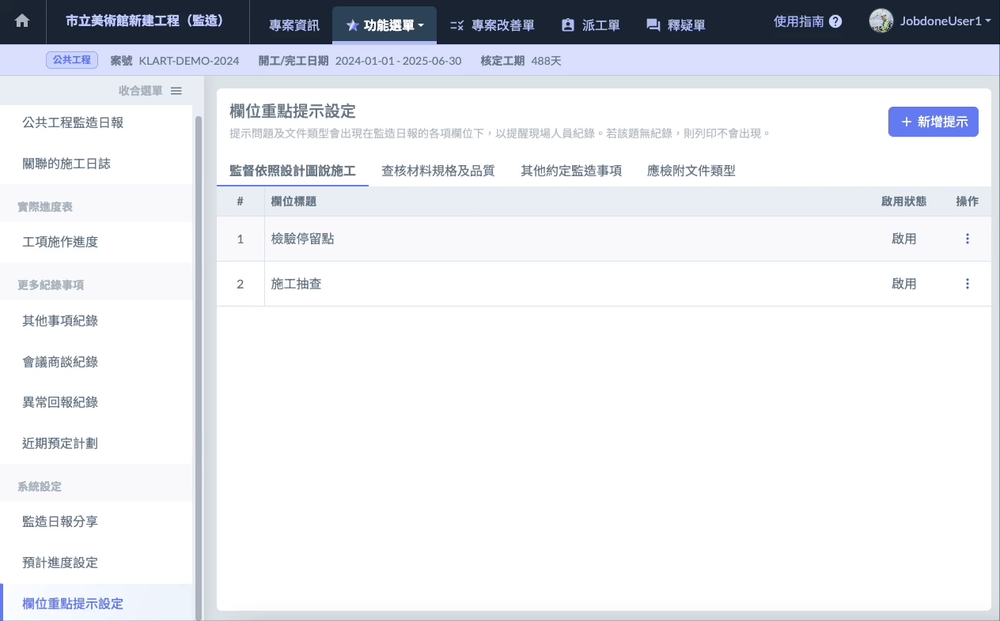
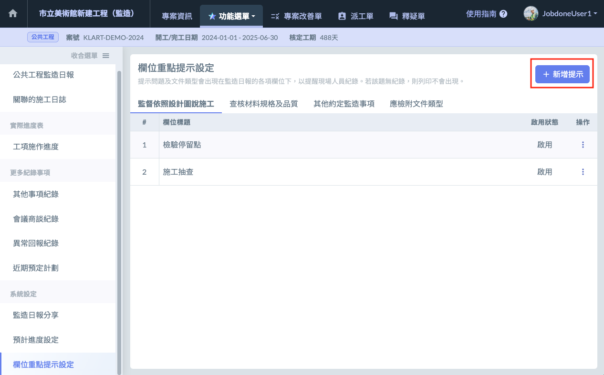
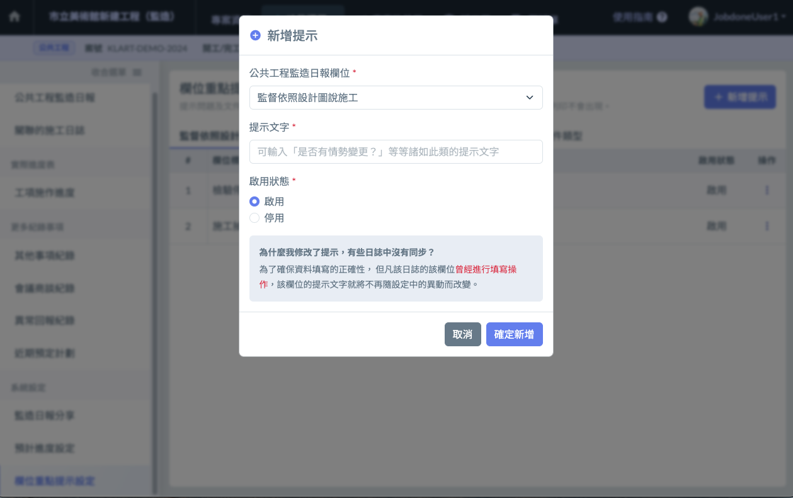
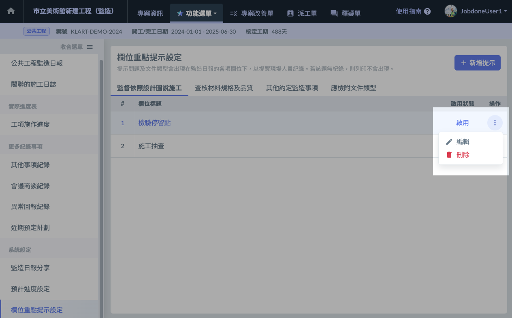

# 欄位重點提示設定

!!! info
    **為什麼我修改了提示，有些日報中沒有同步？**
    
    為了確保資料填寫的正確性， 但凡該日報的該欄位 曾經進行**填寫操作** ，該欄位的提示文字就將不再隨設定中的異動而改變。

## 00｜ 如何切換檢視中的提示列表

點選列表上方的 **選單切換按鈕** 可以切換列表。如下圖示範：

## 01｜新增提示

1. 區塊標題右側有個 **編輯按鈕**（左圖紅框處），點選即可開啟新增介面（右圖） 。
2. 填寫完成後，按下 **確定。**
3. 新增成功！

 

## 02｜修改、刪除、停用提示

找到您要操作的提示項目，於該項目的最右側，有個 **三個點圖案的按鈕**。點選後會出現 **編輯** 與 **刪除** 的按鈕。

* 刪除：請點選刪除按鈕。
* 修改/停用：請點選編輯按鈕。並於修改介面中修改完成後按下儲存按鈕。

