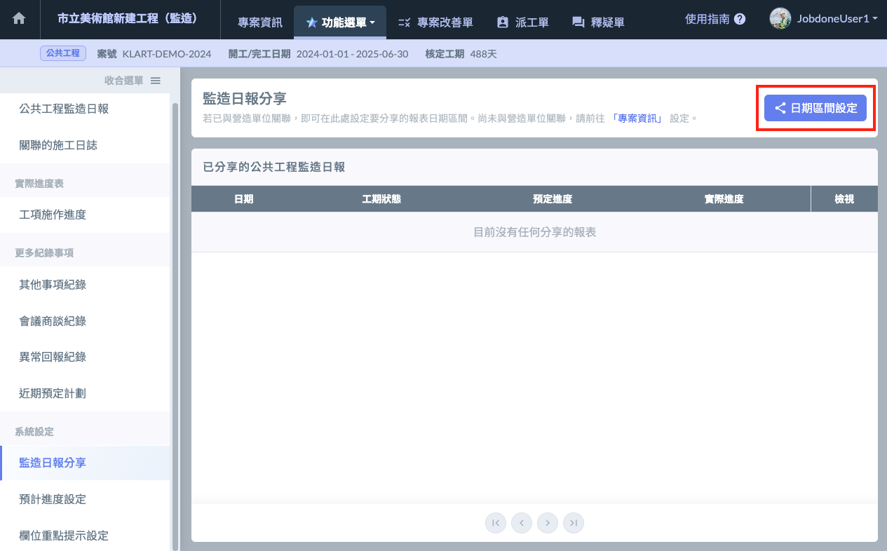
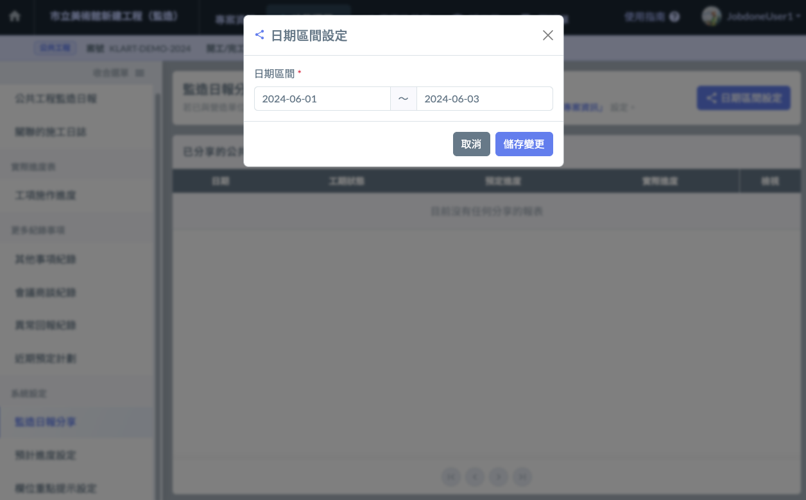
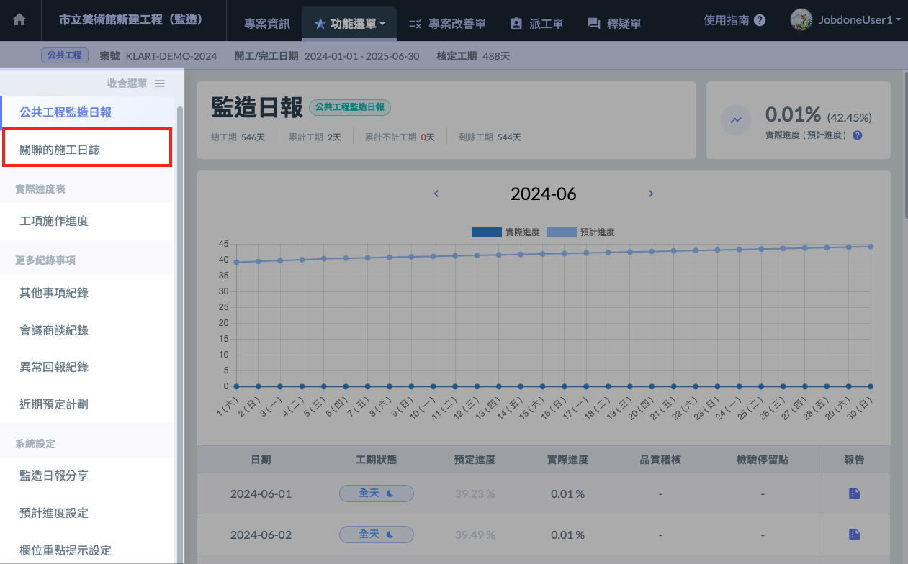
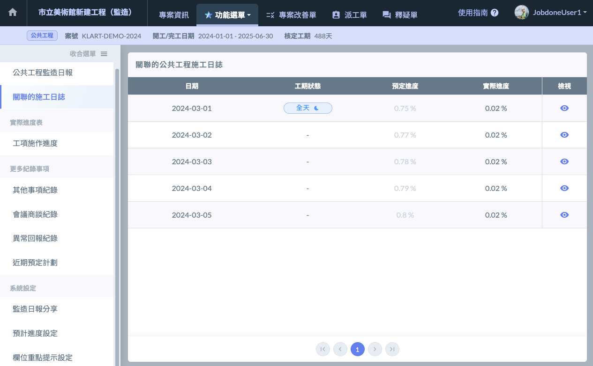
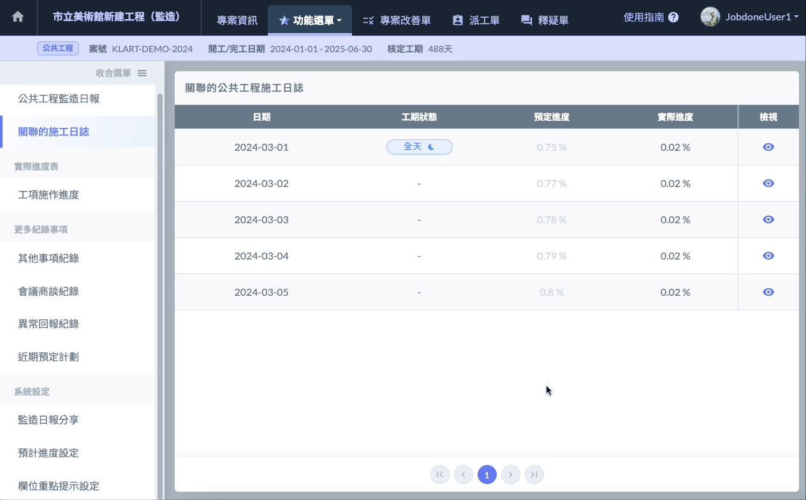

# 監造日報分享

---
description: 在此處設定「欲分享給營造單位」的監造日報。
---

# 監造日報分享

## 00｜前置作業

!!! warning
    設定前，請確保您已**與營造單位的專案進行關聯**。
    
    關聯的方法請參閱 **➙** 專案基本資料 - [專案關聯](../../../project_level/basic-information/zhuan-an-guan-lian)

## 01｜設定日期區間

1. 點選畫面右上角的 **日期區間設定** 按鈕（如左圖紅框處），開啟設定管理介面（右圖）。
2. 設定欲分享的監造日報日期起迄，按下 **儲存變更** 按鈕。
3. 分享成功！現在營造單位可在他們的 **施工日誌** 中看到您分享的監造日報了。

!!! info
    若要調整日期區間，您可以隨時回到此處更改設定。

 

## 如何查看營造單位分享的施工日誌？

若您已與營造單位關聯，左側的功能選單會出現一個 ****關聯的施工日誌**** 按鈕（如左圖），點擊後進入關聯的施工日誌頁面（右圖）。

 

點擊列表最右方的 檢視按鈕，即可開啟營造施工日誌的內容，如下圖示範：

