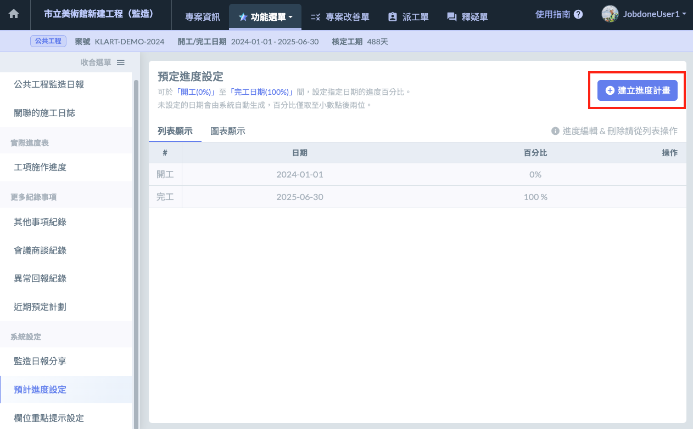
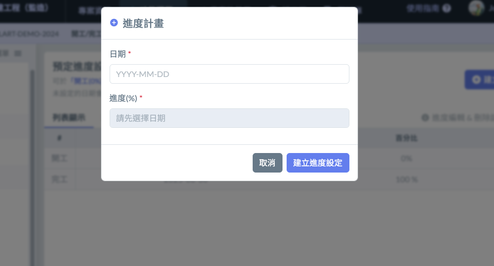
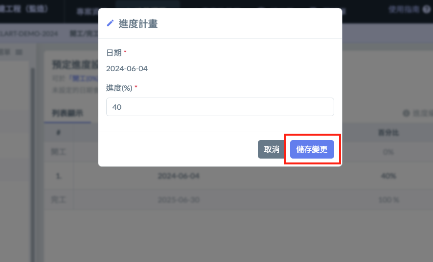
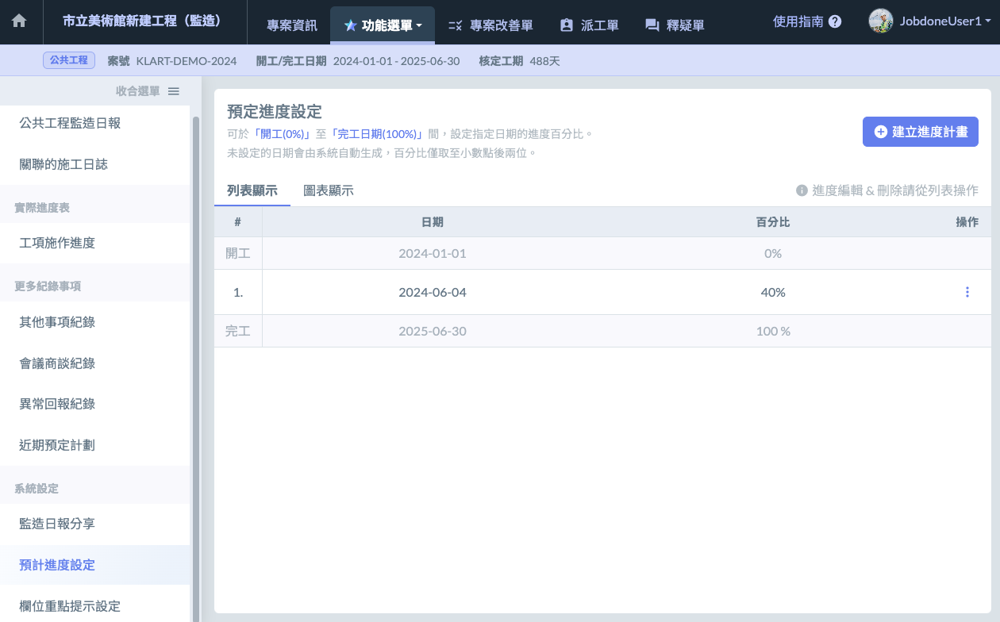

# 預計進度設定

---
description: 可於 「開工 (0%)」 至 「完工日期 (100%)」 間，設定指定日期的進度百分比。未設定的日期會由系統自動生成，百分比僅取至小數點後兩位。
---

# 預計進度設定

## 建立進度計畫

> 1.  點選畫面右側偏上方的 **建立進度計畫** 按鈕。 
>
>     
> 2.  輸入 **日期** 與該日期 **進度計畫**。 
>
>     
> 3.  按下 **建立進度設定** 按鈕。 
>
>     
> 4.  建立進度計畫成功！ 
>
>     
