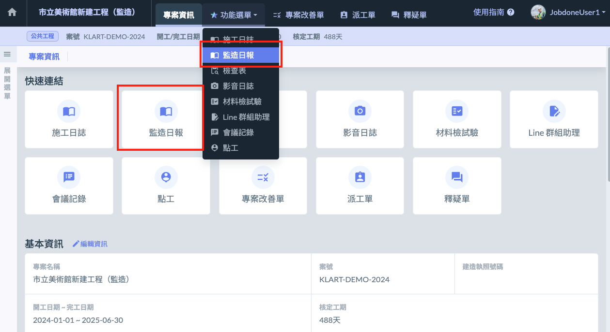

# 如何開始

## 📓 01｜事前準備：編寫日報需要的專案相關資訊

填寫監造日報時，可能會使用到的例如 **工項**、**材料**、**工種(工別)**、施**工項目總表** 等等內容。 會需要您先於 [專案資料設定](../../project_level/project_data) 中進行設定。

> [→ 如何設定 「 工項 」 ？](../../../project_level/project_data/construction_item#supervisor_init)
>
> [→ 如何設定 「 材料 」？](../../project_level/project_data/material_management)
>
> [→ 如何設定 「 工種(工別) 」？](../../project_level/project_data/trade-category)
>
> [→ 「 施工項目總表 」 是什麼？](../../project_level/project_data/general_list_of_construction_items)

!!! danger
    建議您在編寫監造日報前，先與營造單位的專案進行**關聯**，以更加有效率的方式填寫報表、直接複製營造單位設定的施工項目等。
    
    關聯方式請參閱 **➙** 專案基本資料 - [專案關聯](../../project_level/basic-information/zhuan-an-guan-lian)

## 📓 02｜啟用功能

建立專案時，監造日報功能預設會是啟用狀態。

如您在專案下找不到施工日誌功能，可請 **該專案** 的 **專案經理** 進行功能啟用。

!!! info
    施工日誌是依附於「專案」進行使用。
    
    如果您還未建立專案，可以參閱教學 「[如何建立專案](../../project_level/management/create)」。

!!! info
    **已經啟用了，為什麼手機 APP 依然看不到施工日誌**？
    
    監造日報目前「僅推出網頁版」，手機 APP 版本將在不久的未來推出，敬請期待！

## 📓 03｜開始使用

啟用後，就能在專案中看到 **監造日報的入口**（如下圖紅框圈起處），點選入口進入後，即可以開始使用監造日報。

