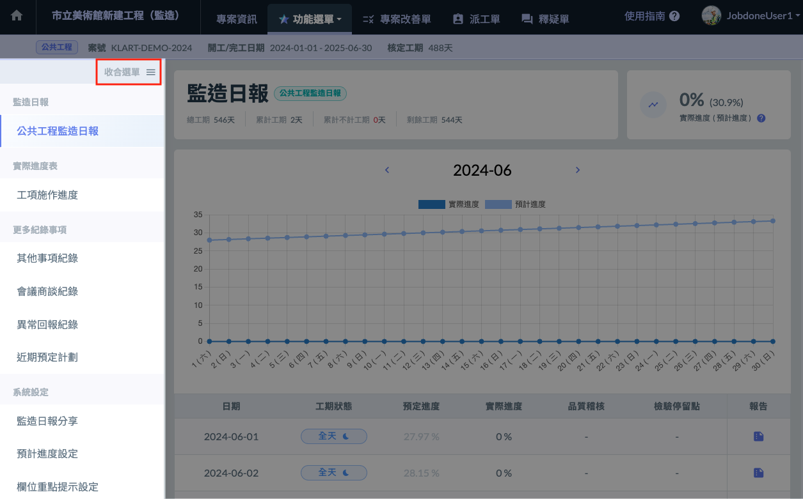
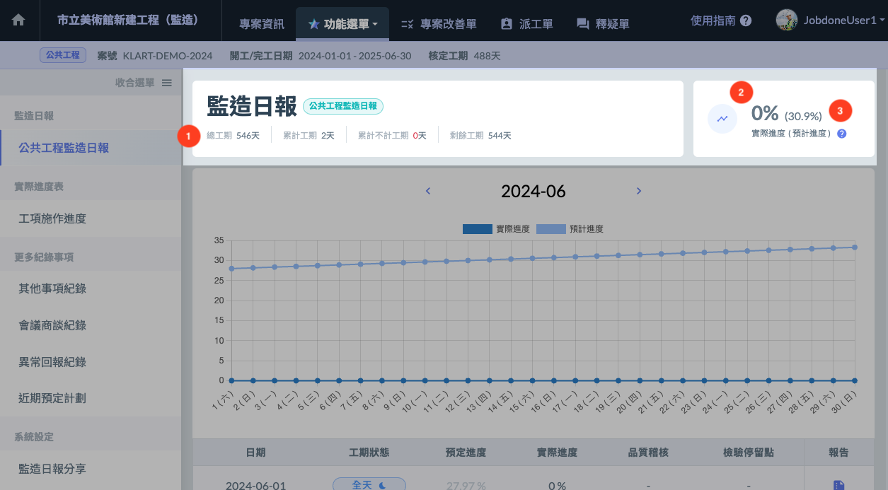
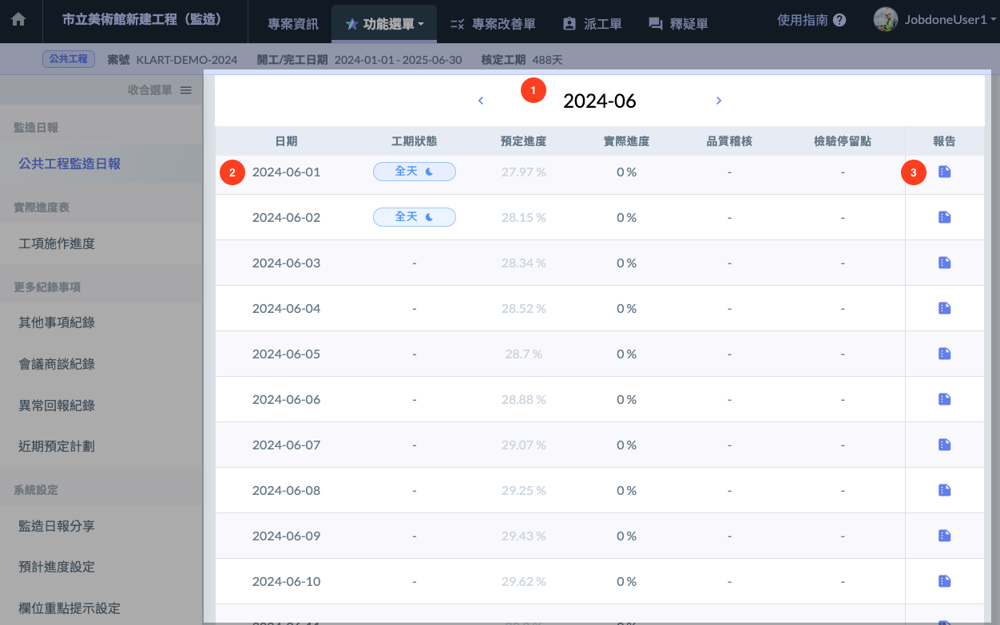

# 日報清單

---
description: 瀏覽每月的日報概況與整體專案的施工進度。
---

# 日報清單

## 📓 01｜功能選單

> 監造日報相關功能的選單。
>
> 點選 **收合選單**，可以將功能選單縮小，增加劉覽空間。

## 📓 02｜日報資訊一覽

監造日報基本資訊如下圖紅標處，將針對以下三點個別進行解釋：

### └ 📄 1. 專案工期資訊

> **總工期** 來自 [專案設定](../../project_level/basic-information) 。
>
> **累計工期**、**不計工期**、**剩餘工期** 由 **監造日報的填寫內容** 進行智慧計算。

### └ 📄 2. 實際進度

> * 依據日報中填寫的工項施工數量，為您計算您施工的總進度。
> * 計算方式為 → **完成的工項金額總加 / 總工項金額 = 實際進度**

### └ 📄 3. 預計進度

> * 預計今天應達到的進度。
> * 進度由系統智慧生成，百分比僅取至小數點後兩位。 如希望自訂進度計畫，可以前往 → [預計進度設定](system-settings/progress-setting) 進行設定。

## 📓 03｜監造日報月表

在這個區塊，您可以瀏覽已選定月份的所有監造日報。

> 1. 顯示當前瀏覽月份，**點選可以切換月份**。
> 2. 當前瀏覽月份每天日報填寫概況，每列點選皆可以前往當日日報詳細內容。
> 3. 快速查看 **監造日報報告**。
