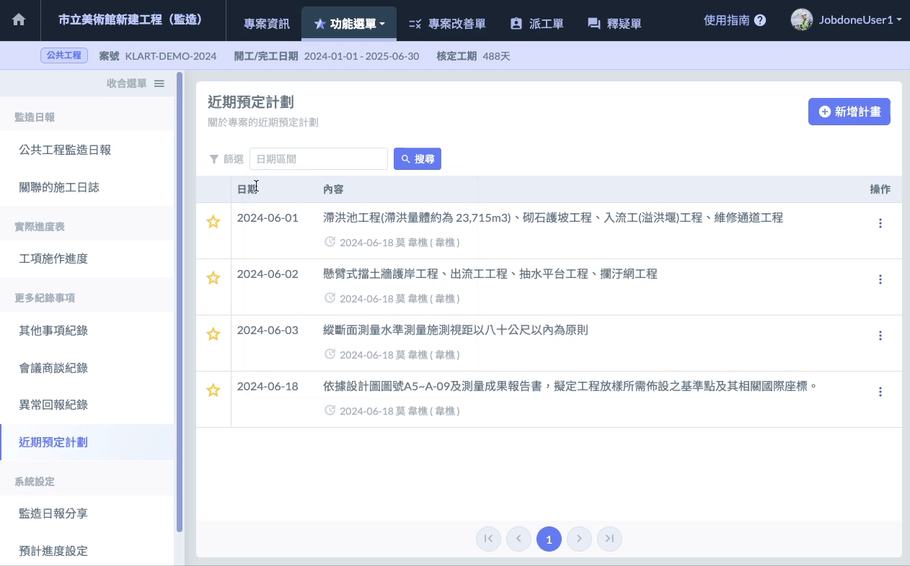
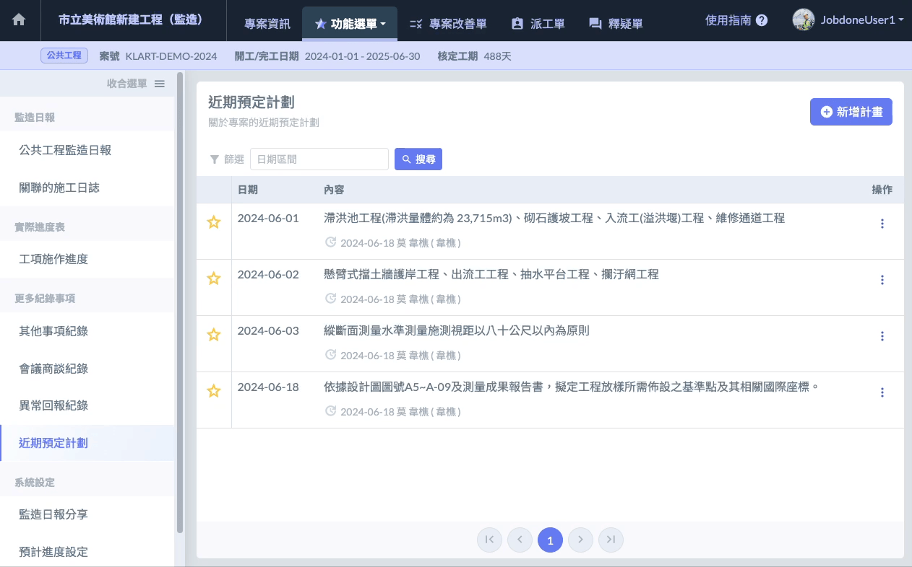
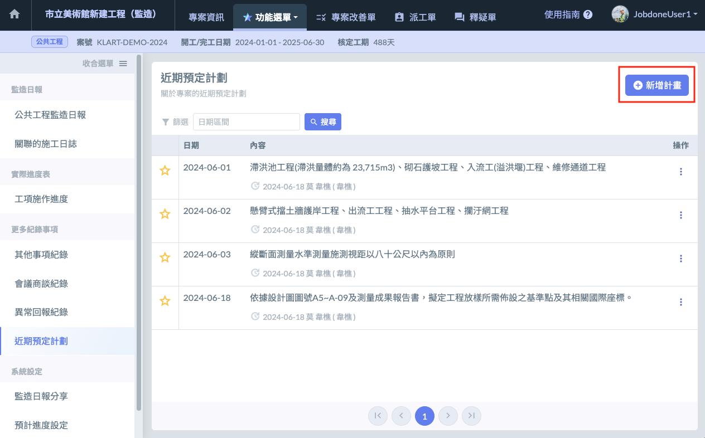
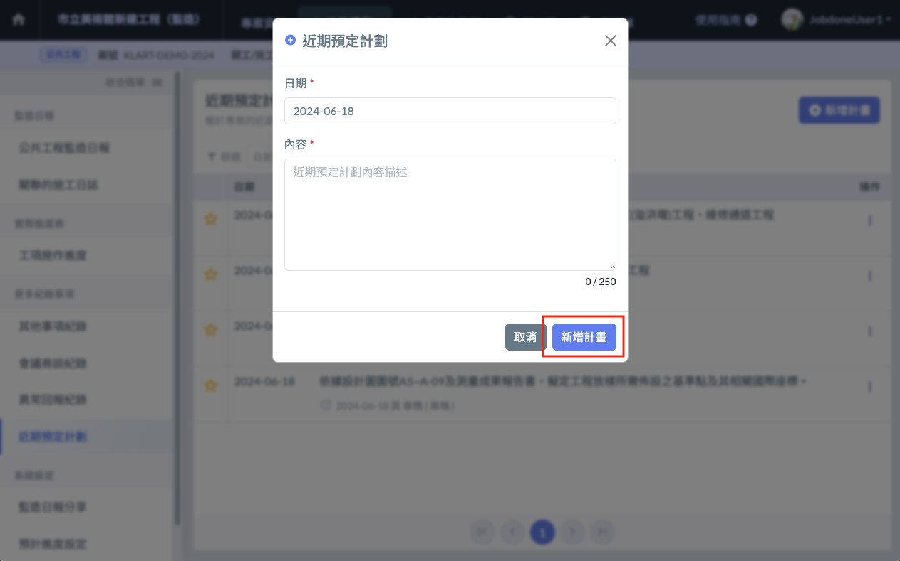
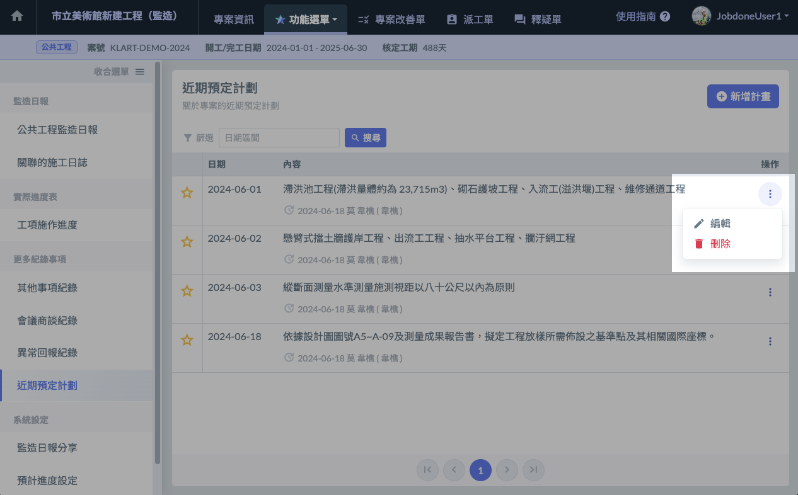

# 近期預定計劃總表

## 📓 這些紀錄那裏來的？ 

紀錄可於 **本頁面進行新增**，或從日報當中的 → [日報 / 近期預定計劃](report-detail/ri-bao-jin-qi-yu-ding-ji-hua) 新增。

## 📓 列表篩選 

Jobdone 提供 **日期區間** 篩選功能。

## 📓 釘選紀錄（將記錄置頂） 

如有重要紀錄需要保留於列表的最上方，可點選列表左側的**星星按鈕**進行釘選。再次點選擇則可取消釘選。

## 📓 01｜新增紀錄 

* 介面右上方有個 **新增紀錄** 的按鈕（左圖紅框處）
* 點選即可開啟編輯頁面（右圖）。
* 填寫完畢後，點選右下角的 **新增紀錄**（右圖紅框處）即可新增紀錄。

 

## 📓 02｜編輯、刪除紀錄 

找到您要操作的提示項目，於該項目的最右側，有個 **三個點圖案的按鈕**。點選後會出現 **編輯** 與 **刪除** 的按鈕。

* 刪除：請點選刪除按鈕。
* 編輯：請點選編輯按鈕。並於修改介面中修改完成後按下儲存按鈕。

