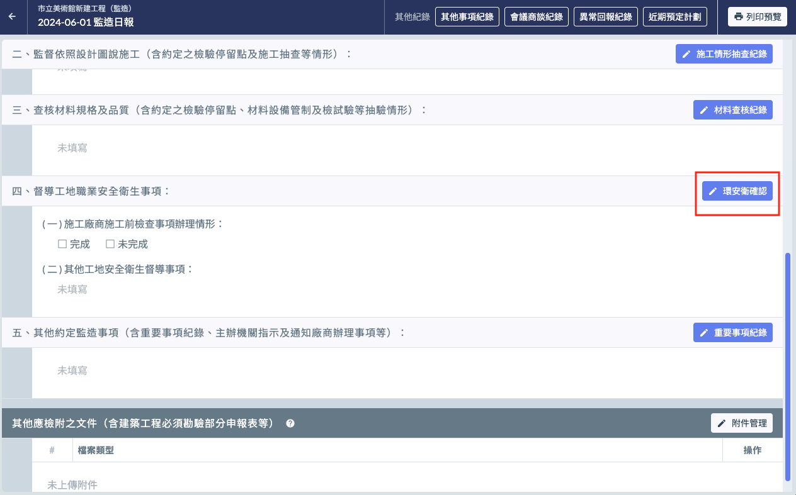
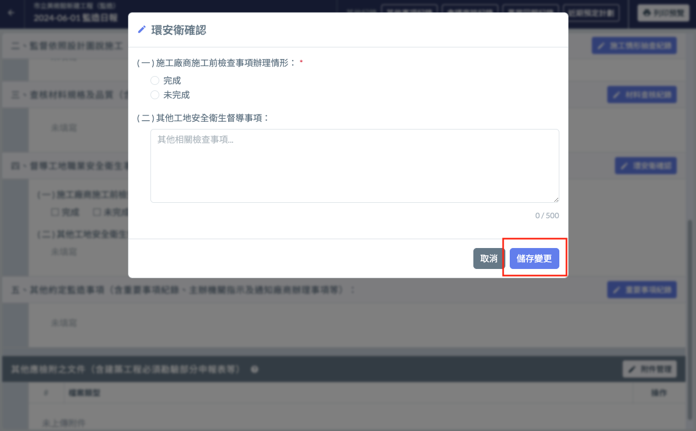
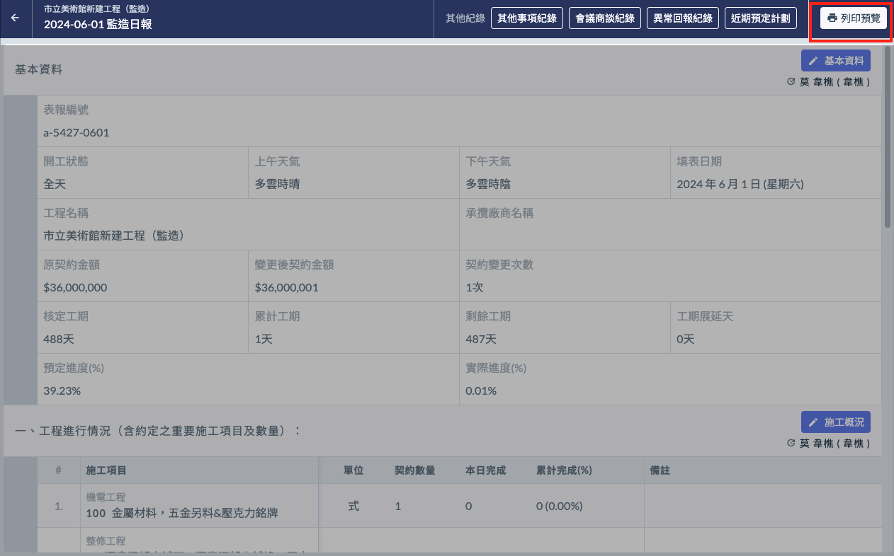
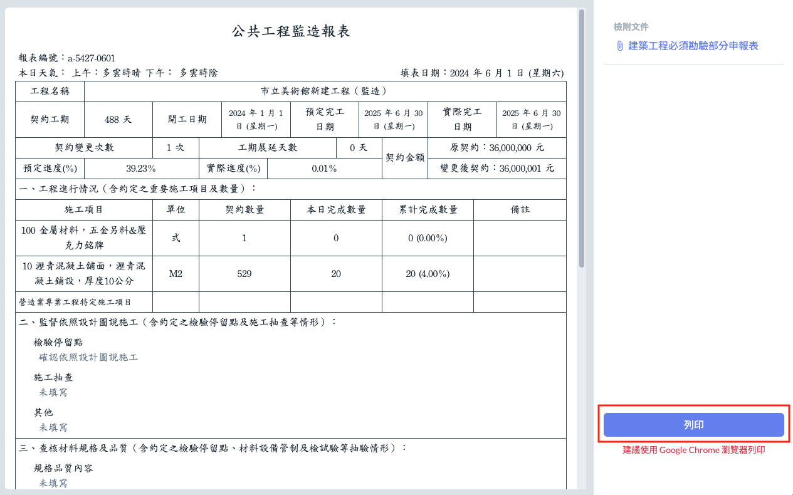

# 📓 監造日報

!!! warning
    **若想參考營造單位已編寫好的施工日誌，有辦法看到對方的內容嗎？**
    
    可以！Jobdone 提供有此功能，協助您更有效率地進行工地現場管理，只需要簡單兩個步驟即可完成：
    
    1️⃣ 確保您已與營造單位的專案進行關聯，關聯方法請參考 **➙** 專案基本資料 - [專案關聯](../../project_level/basic-information/zhuan-an-guan-lian)
    
    2️⃣ 請您的 **營造單位** 設定欲分享的施工日誌日期區間，設定方法請參閱 → 施工日誌 > 施工日誌分享。
    
    \*️⃣ 查看營造已分享的施工日誌，請參考 → [如何查看營造單位分享的施工日誌？](../system-settings/supervisor-sharing#ru-he-cha-kan-ying-zao-chan-wei-fen-xiang-de-shi-gong-ri-zhi)。

## 📓 01 | 日報內容

### └ 📄 基本資訊

基本資訊中使用者只需填寫 **開工狀態**、**表報編號**、**上下午天氣**。

其它資訊由系統智慧辨識帶入。

> 詳細操作請參閱 → [日報 / 基本資訊](report-detail/ri-bao-ji-ben-zi-xun)

### └ 📄 施工概況

紀錄當日 **施工項目**、**完成數量**、**備註** 等等的相關資訊。

> 詳細操作請參閱 → [日報 / 施工概況](report-detail/ri-bao-shi-gong-gai-kuang)

### └ 📄 監督依照設計圖說施工、查核材料規格及品質、其他約定監造事項

提供相關填寫欄位，並提供 **欄位重點提示** 的功能，用以提醒填寫人填寫指定內容。

> * 詳細操作請參閱 → [日報 / 監督依照設計圖說施工、查核材料規格及品質、其他約定監造事項](report-detail/ri-bao-jian-du-yi-zhao-she-ji-tu-shuo-shi-gong-cha-he-cai-liao-gui-ge-ji-pin-zhi-qi-ta-yue-ding-jian)
> * 關於**欄位重點提示**請參閱 → [欄位重點提示](system-settings/hint-setting)

### └ 📄 工地職業安全衛生事項

提供確認施工前檢查事項是否落實的確認與其他事項的填寫。

!!! info
    操作方式說明：
    
    1. 點選區塊標題右側「**✏ 環安衛確認**」編輯按鈕（如下左圖紅框圈起處）。
    2. 點選後，開啟管理介面（如下右圖）。
    3. 填寫完成確認無誤後，點選「儲存變更」即可將編輯後的資訊儲存起來（如下右圖紅框圈起處）。

 

### └ 📄 其他應檢附之文件

紀錄當日應隨監造日報檢附的文件，例如建築工程必須勘驗部分申報表等。

> * 詳細操作請參閱 -> [日報 / 其他應檢附之文件](report-detail/ri-bao-qi-ta-ying-jian-fu-zhi-wen-jian)
> * 設定**文件欄位重點提示**請參閱 -> [欄位重點提示](system-settings/hint-setting)

## 📓 02 | 其他更多紀錄

### └ 📄 **其他事項紀錄**

> 詳細操作請參閱 → [日報 / 其他事項紀錄](report-detail/ri-bao-qi-ta-shi-xiang-ji-lu)

### └ 📄 會議商談紀錄

> 詳細操作請參閱 → [日報 / 會議商談紀錄](report-detail/ri-bao-hui-yi-shang-tan-ji-lu)

### └ 📄 異常回報紀錄

> 詳細操作請參閱 → [日報 / 異常回報紀錄](report-detail/ri-bao-yi-chang-hui-bao-ji-lu)

### └ 📄近期預定計劃

> 詳細操作請參閱 → [日報 / 近期預定計劃](report-detail/ri-bao-jin-qi-yu-ding-ji-hua)

## 📓 03 | 報告列印

1. 點選日報頁面的右上角的 **列印預覽** 按鈕（如左圖紅框圈起處），打開報告頁。
2. 接著瀏覽內容確認無誤。
3. 點選報告頁面右下角的 **列印報告** 按鈕（右圖），即可進行列印。

!!! info
    為確保列印品質，建議使用 Google Chrome 瀏覽器列印。

 

