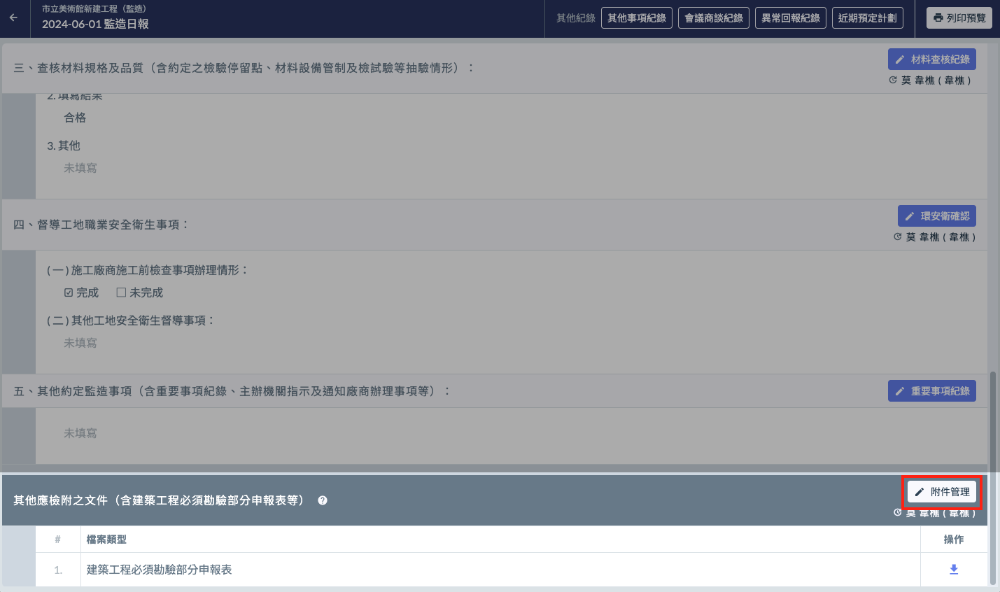
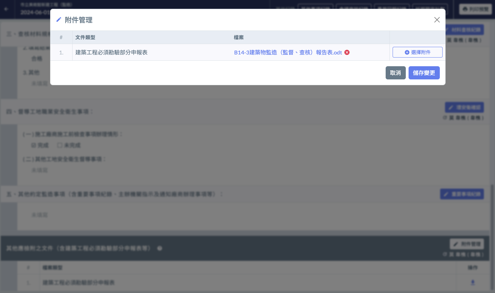

# 日報 / 其他應檢附之文件

---
description: 提供上傳監造日報相關文件，並提過「欄位重點提示」的功能，提醒填寫人上傳指定附件。
---

# 日報 / 其他應檢附之文件

!!! info
    Jobdone 僅提供可以上傳監造日報之應檢附文件，但在**列印監造日報**時，並不會將此處的附件資料一併帶出。若有列印需求，需額外自行處理。

## 📓 00｜前置作業

> 請先至 -> [欄位重點提示設定](../system-settings/hint-setting) 新增附件類別

## 📓 01｜如何上傳

* 區塊標題右側有個 **附件管理按鈕**（左圖紅框處）
* 點選即可開啟管理介面（右圖）。
* 上傳完成確認無誤後，點選右下角的「儲存變更」即可將編輯後的資訊儲存起來。

 

