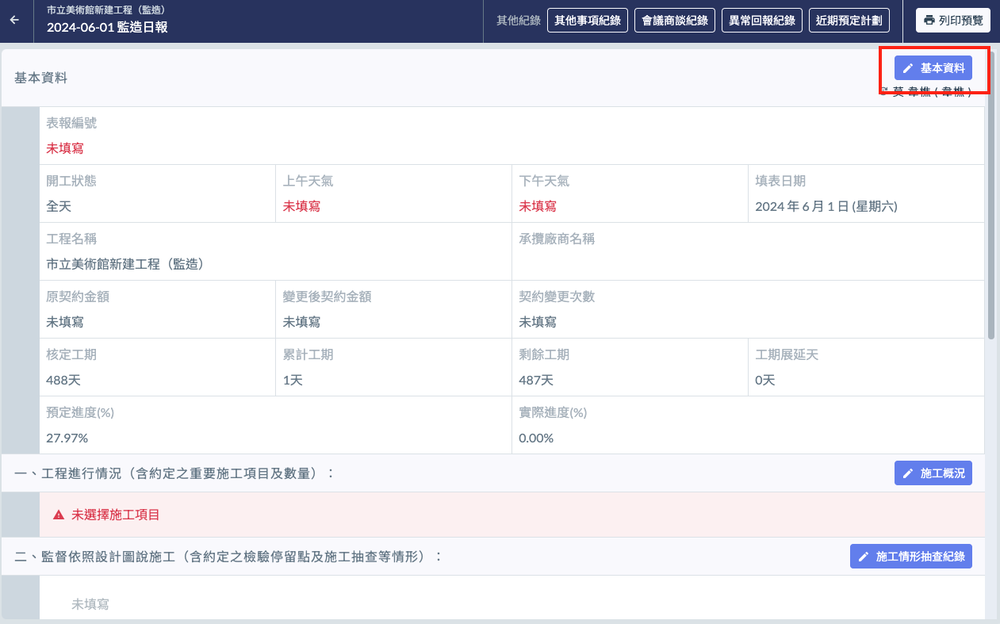
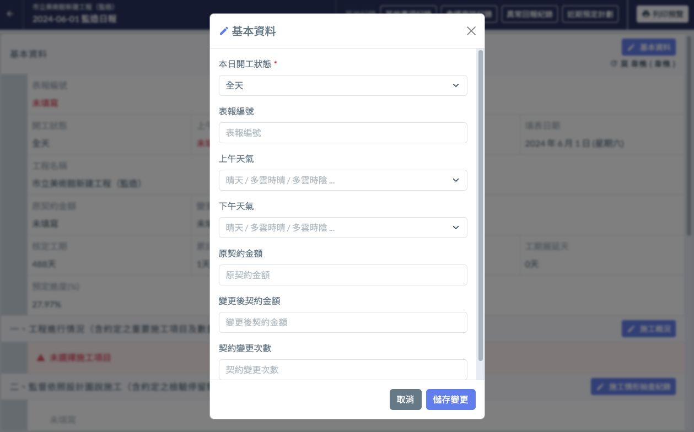

# 日報 / 基本資訊

基本資訊中使用者只需填寫 **開工狀態**、**表報編號**、**上下午天氣**。

其它資訊由系統智慧辨識帶入，填寫日報其他內容之前，必須先填寫專案基本資訊。

!!! info
    **資料來源說明**
    
    * 工程名稱、工程核定工期、工期展延天： → [專案 / 基本資訊設定](../../../project_level/basic-information)
    * 承攬廠商名稱： [→ 專案 / 角色資訊設定](../../../project_level/basic-information)
    * 填表日期： 自動帶入日報日期
    * 累計工期、剩餘工期、實際進度：系統依據所有日報填寫情形智慧計算
    * 預定計度：可自行前往 → [預計進度設定](../system-settings/progress-setting) 進行設定，如未設定則由系統自動分配

## 📓 填寫方式

1. 點選 基本資料右上角的 **編輯按鈕**（如下圖 1 紅框圈起處），開啟管理介面（圖 2）。
2. 進行內容填寫，「開工狀態」為必填欄位。表報編號及天氣則自由選擇是否填寫。
3. 填寫完成後，點選右下的「儲存變更」按鈕，即可完成基本資訊填寫！

<table><thead><tr><th width="198">欄位名稱</th><th width="179" data-type="checkbox">必填</th><th>說明</th></tr></thead><tbody><tr><td>開工狀態</td><td>true</td><td>當日的開工狀態，可選擇全天 / 半天 / 不計工期。</td></tr><tr><td>表報編號</td><td>false</td><td>可依照您習慣的編表規則編號，若未填寫，則由系統帶入預設的報表編號。</td></tr><tr><td>上 / 下午天氣</td><td>false</td><td>當日上午 / 下午天氣。</td></tr><tr><td>原契約金額</td><td>false</td><td>專案的原契約金額，一旦填寫過此欄，後續的天數都將由系統自動帶入。</td></tr><tr><td>變更後契約金額</td><td>false</td><td>專案變更後的契約金額，系統將自動抓取最近一次更新的資料自動帶入。</td></tr><tr><td>契約變更次數</td><td>false</td><td>專案變更後的契約金額，系統將自動抓取最近一次更新的資料自動帶入。</td></tr></tbody></table>

 

